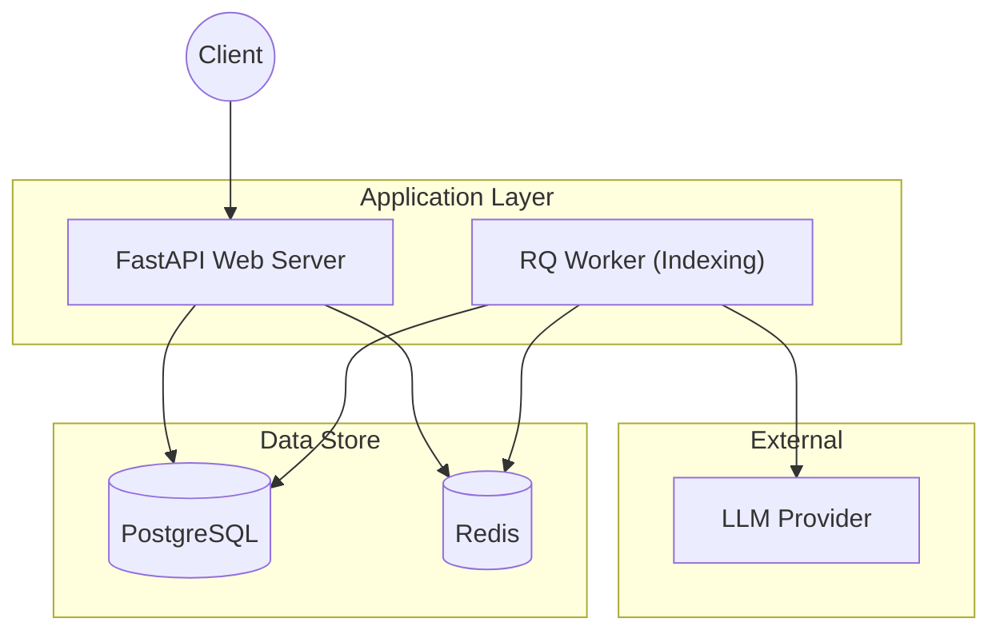

# GraphRAG with ToG Enhancement - Backend Documentation

This documentation provides a comprehensive overview of the backend architecture, API endpoints, and system workflows for the GraphRAG project.

## Architecture Overview

The backend is built with **FastAPI** and follows a layered architecture designed for scalability and asynchronous processing.

### System Components
- **FastAPI Web Server**: Serves the REST API and manages user interactions.
- **RQ (Redis Queue) Worker**: Handles long-running GraphRAG indexing tasks in the background.
- **PostgreSQL**: Primary database for operational data (collections, index runs) and the knowledge graph (entities, relationships, community reports).
- **Redis**: Message broker for the task queue.
- **LLM Provider**: (OpenAI/Azure) powers extraction, summarization, and deep reasoning.

### Architecture Diagram


## API Reference

### 1. Collections
Manage groups of related documents.
- `POST /api/collections`: Create a new collection.
- `GET /api/collections`: List all collections.
- `GET /api/collections/{id}`: Get collection details.
- `DELETE /api/collections/{id}`: Delete collection and all associated data.

### 2. Documents
Manage raw files within a collection.
- `POST /api/collections/{id}/documents`: Upload `.txt` or `.md` files (Max 25MB).
- `GET /api/collections/{id}/documents`: List uploaded documents.
- `DELETE /api/collections/{id}/documents/{name}`: Delete a specific document.

### 3. Indexing
Orchestrate the creation of the knowledge graph.
- `POST /api/collections/{id}/index`: Start the indexing process.
- `GET /api/collections/{id}/index`: Get current indexing status (`queued`, `running`, `completed`, `failed`).

### 4. Search
Query the knowledge graph using multiple strategies.
- `POST /api/collections/{id}/search/global`: Broad overview queries.
- `POST /api/collections/{id}/search/local`: Detailed, entity-centric queries.
- `POST /api/collections/{id}/search/tog`: Deep reasoning through graph exploration.
- `POST /api/collections/{id}/search/drift`: Multi-hop relationship discovery.

## Data Models

### Operational Models
- **Collection**: Name, description, and timestamps.
- **IndexRun**: Tracking status, start/finish times, and error logs for indexing jobs.

### GraphRAG Models
- **Document**: File metadata and processed text content.
- **Entity**: Extracted nodes (people, orgs, etc.) with descriptions and graph coordinates.
- **Relationship**: Semantic edges between entities with weights and descriptions.
- **Community**: Hierarchical clusters generated by the Leiden algorithm.
- **CommunityReport**: AI-generated summaries for each community.

## Workflows

### Indexing Workflow
1. Client uploads documents to a collection.
2. Client triggers indexing; API enqueues a job in Redis and returns a 202 status.
3. Background Worker picks up the job and executes the GraphRAG pipeline.
4. Worker processes entities, relationships, and communities using the LLM.
5. Worker ingests the final outputs into PostgreSQL.

### Search Workflow
1. Client sends a search query with a specific method (e.g., `tog`).
2. `QueryService` identifies the relevant collection and retrieves context from the knowledge graph in PostgreSQL.
3. The query engine uses the retrieved graph context and LLM to synthesize a reasoning-based answer.
4. API returns the structured search response with citations.

## Setup and Development

### Installation
```bash
cd backend
pip install -r requirements.txt
# Install graphrag package in editable mode
pip install -e ..
```

### Configuration
Managed via `.env` file and `settings.yaml`.
- `DATABASE_URL`: Connection string for PostgreSQL.
- `REDIS_URL`: Connection string for Redis.
- `OPENAI_API_KEY`: API key for LLM services.

### Running the Server
```bash
python -m uvicorn app.main:app --reload
```
