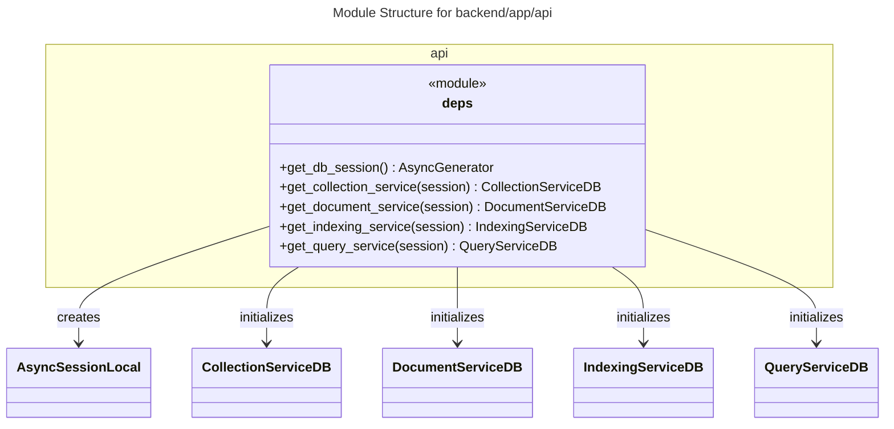
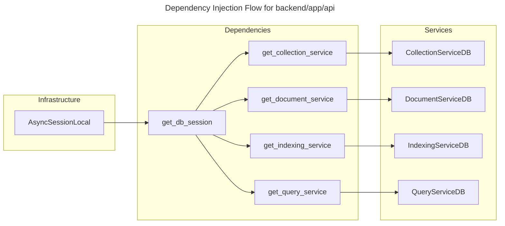

# C4 Code Level: backend/app/api

## Overview
- **Name**: API Dependencies
- **Description**: Provides FastAPI dependencies for dependency injection across the backend application.
- **Location**: `backend/app/api`
- **Language**: Python
- **Purpose**: Manages the lifecycle of database sessions and initializes services with required dependencies (like database sessions) for use in API endpoints.

## Code Elements

### Functions/Methods

- `get_db_session(): AsyncGenerator[AsyncSession, None]`
  - Description: Provides an asynchronous SQLAlchemy database session. Handles session commit on success and rollback on failure.
  - Location: `F:/KL/gtog/backend/app/api/deps.py:15`
  - Dependencies: `AsyncSessionLocal`, `AsyncSession`

- `get_collection_service(session: AsyncSession = Depends(get_db_session)): CollectionServiceDB`
  - Description: Provides an instance of `CollectionServiceDB` injected with a database session.
  - Location: `F:/KL/gtog/backend/app/api/deps.py:31`
  - Dependencies: `CollectionServiceDB`, `get_db_session`

- `get_document_service(session: AsyncSession = Depends(get_db_session)): DocumentServiceDB`
  - Description: Provides an instance of `DocumentServiceDB` injected with a database session.
  - Location: `F:/KL/gtog/backend/app/api/deps.py:46`
  - Dependencies: `DocumentServiceDB`, `get_db_session`

- `get_indexing_service(session: AsyncSession = Depends(get_db_session)): IndexingServiceDB`
  - Description: Provides an instance of `IndexingServiceDB` injected with a database session.
  - Location: `F:/KL/gtog/backend/app/api/deps.py:61`
  - Dependencies: `IndexingServiceDB`, `get_db_session`

- `get_query_service(session: AsyncSession = Depends(get_db_session)): QueryServiceDB`
  - Description: Provides an instance of `QueryServiceDB` injected with a database session.
  - Location: `F:/KL/gtog/backend/app/api/deps.py:76`
  - Dependencies: `QueryServiceDB`, `get_db_session`

## Dependencies

### Internal Dependencies
- `app.db.session.AsyncSessionLocal`: Used for creating database sessions.
- `app.services.collection_service_db.CollectionServiceDB`: Service for collection operations.
- `app.services.document_service_db.DocumentServiceDB`: Service for document operations.
- `app.services.indexing_service_db.IndexingServiceDB`: Service for indexing operations.
- `app.services.query_service_db.QueryServiceDB`: Service for query operations.

### External Dependencies
- `fastapi`: Provides `Depends` for dependency injection.
- `sqlalchemy.ext.asyncio`: Provides `AsyncSession` for asynchronous database operations.

## Relationships

This module acts as a bridge between the infrastructure (database session) and the service layer, providing them to the router layer.

### Module Structure

### Dependency Injection Flow

## Notes
- The `__init__.py` file exports `get_db_session` and `get_collection_service` for easier access.
- All dependencies follow the FastAPI dependency injection pattern, allowing for easy testing and swapping of implementations.
