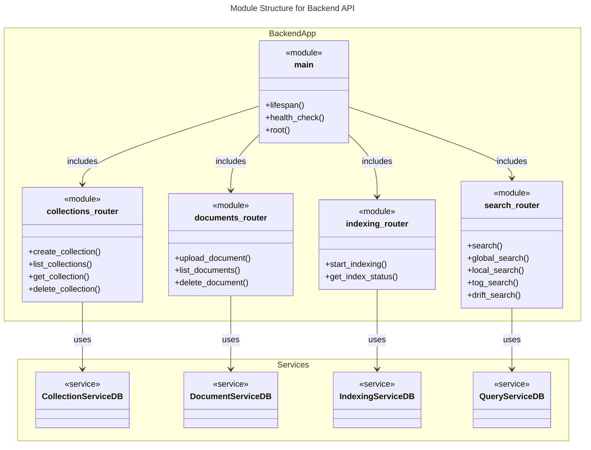

# C4 Code Level: Backend App Main and Routers

## Overview
- **Name**: Backend API Layer
- **Description**: Entry point and REST API routing for the GraphRAG backend application.
- **Location**: `backend/app/main.py` and `backend/app/routers/`
- **Language**: Python (FastAPI)
- **Purpose**: Exposes endpoints for collection management, document operations, indexing control, and GraphRAG search methods.

## Code Elements

### Main Entry Point (`main.py`)

- `lifespan(app: FastAPI)`
  - Description: Async context manager handling application startup and shutdown. Performs database migrations using Alembic and verifies database connectivity.
  - Location: `backend/app/main.py:33`
  - Dependencies: `alembic`, `sqlalchemy`, `app.db.session.get_session`

- `health_check()`
  - Description: GET `/health`. Returns the operational status of the API.
  - Location: `backend/app/main.py:75`
  - Dependencies: `app.models.HealthResponse`

- `root()`
  - Description: GET `/`. Returns API metadata and documentation links.
  - Location: `backend/app/main.py:82`

### Collections Router (`routers/collections.py`)

- `create_collection(collection: CollectionCreate, service: CollectionServiceDB)`
  - Description: POST `/api/collections`. Creates a new document collection.
  - Location: `backend/app/routers/collections.py:18`
  - Dependencies: `app.services.collection_service_db.CollectionServiceDB`

- `list_collections(service: CollectionServiceDB)`
  - Description: GET `/api/collections`. Retrieves all existing collections.
  - Location: `backend/app/routers/collections.py:46`
  - Dependencies: `CollectionServiceDB`

- `get_collection(collection_id: str, service: CollectionServiceDB)`
  - Description: GET `/api/collections/{collection_id}`. Retrieves details for a specific collection by UUID or name.
  - Location: `backend/app/routers/collections.py:62`
  - Dependencies: `CollectionServiceDB`

- `delete_collection(collection_id: str, service: CollectionServiceDB)`
  - Description: DELETE `/api/collections/{collection_id}`. Removes a collection and its associated data.
  - Location: `backend/app/routers/collections.py:92`
  - Dependencies: `CollectionServiceDB`

### Documents Router (`routers/documents.py`)

- `upload_document(collection_id: str, file: UploadFile, service: DocumentServiceDB)`
  - Description: POST `/api/collections/{collection_id}/documents`. Uploads a text or markdown file to a collection.
  - Location: `backend/app/routers/documents.py:33`
  - Dependencies: `app.services.document_service_db.DocumentServiceDB`

- `list_documents(collection_id: str, service: DocumentServiceDB)`
  - Description: GET `/api/collections/{collection_id}/documents`. Lists all documents within a collection.
  - Location: `backend/app/routers/documents.py:60`
  - Dependencies: `DocumentServiceDB`

- `delete_document(collection_id: str, document_name: str, service: DocumentServiceDB)`
  - Description: DELETE `/api/collections/{collection_id}/documents/{document_name}`. Deletes a specific document.
  - Location: `backend/app/routers/documents.py:77`
  - Dependencies: `DocumentServiceDB`

### Indexing Router (`routers/indexing.py`)

- `start_indexing(collection_id: str, service: IndexingServiceDB)`
  - Description: POST `/api/collections/{collection_id}/index`. Triggers the GraphRAG indexing pipeline for a collection.
  - Location: `backend/app/routers/indexing.py:18`
  - Dependencies: `app.services.indexing_service_db.IndexingServiceDB`

- `get_index_status(collection_id: str, service: IndexingServiceDB)`
  - Description: GET `/api/collections/{collection_id}/index`. Polls the status of an ongoing or completed indexing job.
  - Location: `backend/app/routers/indexing.py:36`
  - Dependencies: `IndexingServiceDB`

### Search Router (`routers/search.py`)

- `search(collection_id: str, query: str, method: str, service: QueryServiceDB)`
  - Description: GET `/api/collections/{collection_id}/search`. Generic search endpoint supporting multiple methods.
  - Location: `backend/app/routers/search.py:24`
  - Dependencies: `app.services.query_service_db.QueryServiceDB`

- `global_search(collection_id: str, request: GlobalSearchRequest, service: QueryServiceDB)`
  - Description: POST `/api/collections/{collection_id}/search/global`. Map-reduce style search over community reports.
  - Location: `backend/app/routers/search.py:57`

- `local_search(collection_id: str, request: LocalSearchRequest, service: QueryServiceDB)`
  - Description: POST `/api/collections/{collection_id}/search/local`. Entity-centric search for specific facts.
  - Location: `backend/app/routers/search.py:83`

- `tog_search(collection_id: str, request: ToGSearchRequest, service: QueryServiceDB)`
  - Description: POST `/api/collections/{collection_id}/search/tog`. Deep reasoning search using Think-on-Graph.
  - Location: `backend/app/routers/search.py:108`

- `drift_search(collection_id: str, request: DriftSearchRequest, service: QueryServiceDB)`
  - Description: POST `/api/collections/{collection_id}/search/drift`. Multi-hop reasoning search.
  - Location: `backend/app/routers/search.py:131`

## Dependencies

### Internal Dependencies
- `app.api.deps`: Dependency injection providers for services.
- `app.services`: Business logic implementations (Collection, Document, Indexing, Query services).
- `app.models`: Pydantic models for request/response schemas.
- `app.db.session`: Database session management.
- `app.config`: Application settings.

### External Dependencies
- `fastapi`: Web framework.
- `sqlalchemy`: Database ORM.
- `alembic`: Database migrations.
- `uvicorn`: ASGI server.

## Relationships

### Module Structure Diagram

## Notes
- The API uses a standardized prefix `/api/collections` for most routes, organizing functionality around document collections.
- Dependency injection is heavily used via FastAPI's `Depends` to decouple routers from service implementations.
- File uploads are restricted to `.txt` and `.md` with a 25MB size limit.
