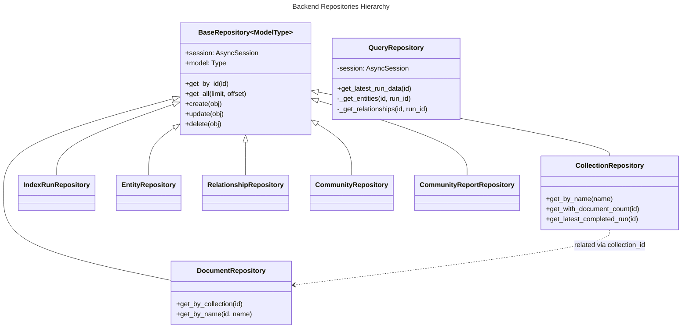

# C4 Code Level: backend/app/repositories

## Overview
- **Name**: Backend Repository Layer
- **Description**: Data access layer for the FastAPI backend, implementing the repository pattern for database operations using SQLAlchemy.
- **Location**: `F:\KL\gtog\backend\app\repositories`
- **Language**: Python
- **Purpose**: Provides a clean abstraction for database operations, separating business logic from data persistence details.

## Code Elements

### Base Repository
- `BaseRepository[ModelType]` (Generic Class)
  - Description: Generic base class providing standard CRUD operations for SQLAlchemy models.
  - Location: `backend/app/repositories/base.py:14`
  - Methods:
    - `get_by_id(id: UUID) -> Optional[ModelType]`: Retrieves a record by its primary key.
    - `get_all(limit: int = 100, offset: int = 0) -> List[ModelType]`: Retrieves paginated records.
    - `create(obj: ModelType) -> ModelType`: Adds a new record to the session and flushes.
    - `update(obj: ModelType) -> ModelType`: Refreshes and returns an updated record.
    - `delete(obj: ModelType) -> bool`: Removes a record from the session.

### Domain Repositories

- `CollectionRepository`
  - Description: Manages `Collection` entities and related metadata.
  - Location: `backend/app/repositories/collection.py:13`
  - Methods:
    - `get_by_name(name: str) -> Optional[Collection]`: Finds a collection by name.
    - `get_with_document_count(collection_id: UUID) -> Optional[tuple]`: Joins with Documents to get count.
    - `get_latest_completed_run(collection_id: UUID) -> Optional[IndexRun]`: Finds the most recent successful indexing.
    - `is_indexed(collection_id: UUID) -> bool`: Checks if any indexing has completed.

- `DocumentRepository`
  - Description: Manages `Document` entities within collections.
  - Location: `backend/app/repositories/document.py:13`
  - Methods:
    - `get_by_collection(collection_id: UUID) -> list[Document]`: Lists all documents in a collection.
    - `get_by_name(collection_id: UUID, name: str) -> Optional[Document]`: Finds document by filename.
    - `delete_by_name(collection_id: UUID, name: str) -> bool`: Deletes a specific document.

- `IndexRunRepository`
  - Description: Tracks indexing operations and their statuses.
  - Location: `backend/app/repositories/index_run.py:13`
  - Methods:
    - `get_latest_for_collection(collection_id: UUID) -> Optional[IndexRun]`: Most recent run (any status).
    - `create_run(collection_id: UUID) -> IndexRun`: Initializes a new QUEUED run.

- `QueryRepository`
  - Description: Specialized repository for read-only query-time data access across multiple GraphRAG entities.
  - Location: `backend/app/repositories/query.py:12`
  - Methods:
    - `get_latest_run_id(collection_id: UUID) -> UUID | None`: Gets ID of latest COMPLETED run.
    - `get_latest_run_data(collection_id: UUID) -> dict[str, Any] | None`: Aggregates all graph data for search.

### GraphRAG Persistence Repositories
The following repositories handle bulk insertion of indexed data. All inherit from `BaseRepository` and implement a `bulk_insert` method using `run_sync` for SQLAlchemy's mapping-based bulk operations.

| Class | Model | Location |
|-------|-------|----------|
| `EntityRepository` | `Entity` | `entities.py:14` |
| `RelationshipRepository` | `Relationship` | `relationships.py:12` |
| `CommunityRepository` | `Community` | `communities.py:12` |
| `CommunityReportRepository` | `CommunityReport` | `community_reports.py:12` |
| `CovariateRepository` | `Covariate` | `covariates.py:12` |
| `EmbeddingRepository` | `Embedding` | `embeddings.py:12` |
| `TextUnitRepository` | `TextUnit` | `text_units.py:12` |

## Dependencies

### Internal Dependencies
- `app.db.models`: Database model definitions (Base, Collection, Document, etc.)
- `app.db.models.embeddings`: Specialized embedding models.

### External Dependencies
- `sqlalchemy`: Core ORM and AsyncSession.
- `uuid`: For ID handling.
- `typing`: Generic type hints.

## Relationships

## Notes
- Most repositories use `bulk_insert_mappings` for performance during GraphRAG indexing.
- `QueryRepository` does not inherit from `BaseRepository` as it focuses on complex read operations and data aggregation rather than standard CRUD for a single model.
- All operations are asynchronous using SQLAlchemy's `AsyncSession`.
