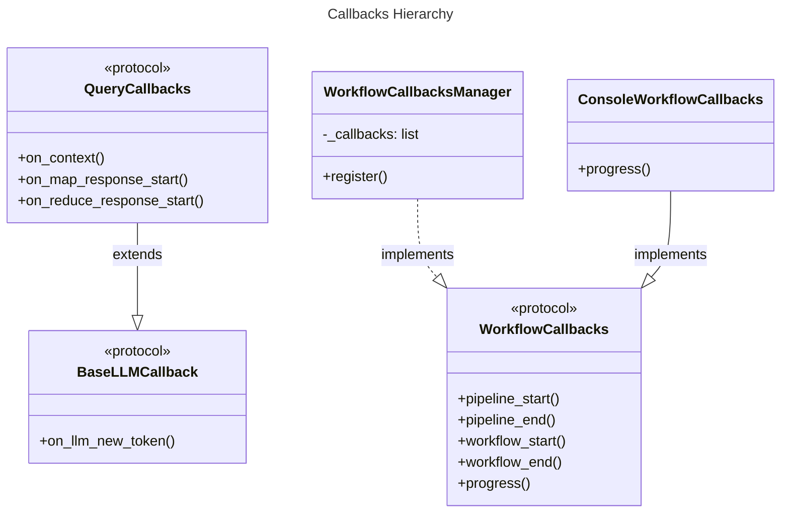
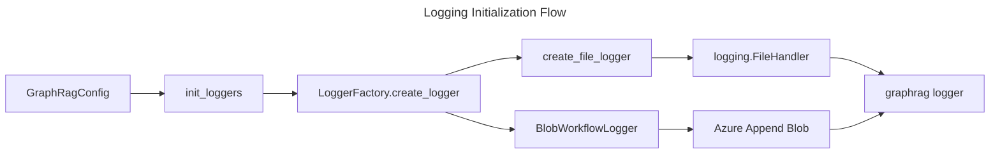

# C4 Code Level: Callbacks and Logging

## Overview
- **Name**: Callbacks and Logging
- **Description**: This directory contains the monitoring, logging, and event handling infrastructure for the GraphRAG indexing pipeline and query engine. It provides a flexible callback system for workflow execution, query processing, and LLM interactions, along with a standardized logging system that supports multiple backends (console, file, Azure Blob Storage).
- **Location**: `graphrag/callbacks`, `graphrag/logger`, `graphrag/language_model/events`
- **Language**: Python
- **Purpose**: To provide visibility into the system's operations, track progress of long-running tasks, handle asynchronous events, and capture logs for debugging and auditing.

## Code Elements

### Protocols & Interfaces

- `WorkflowCallbacks` (Protocol)
  - Description: Defines the interface for monitoring the indexing pipeline and individual workflows.
  - Location: `graphrag/callbacks/workflow_callbacks.py:12`
  - Methods:
    - `pipeline_start(names: list[str]) -> None`
    - `pipeline_end(results: list[PipelineRunResult]) -> None`
    - `workflow_start(name: str, instance: object) -> None`
    - `workflow_end(name: str, instance: object) -> None`
    - `progress(progress: Progress) -> None`

- `BaseLLMCallback` (Protocol)
  - Description: Defines the interface for LLM-level events.
  - Location: `graphrag/callbacks/llm_callbacks.py:9`
  - Methods:
    - `on_llm_new_token(token: str)`

- `QueryCallbacks` (BaseLLMCallback)
  - Description: Defines the interface for events during query execution, including map-reduce operations.
  - Location: `graphrag/callbacks/query_callbacks.py:12`
  - Methods:
    - `on_context(context: Any) -> None`
    - `on_map_response_start(map_response_contexts: list[str]) -> None`
    - `on_map_response_end(map_response_outputs: list[SearchResult]) -> None`
    - `on_reduce_response_start(reduce_response_context: str | dict[str, Any]) -> None`
    - `on_reduce_response_end(reduce_response_output: str) -> None`

- `ModelEventHandler` (Protocol)
  - Description: Defines the interface for handling model-related errors.
  - Location: `graphrag/language_model/events/base.py:9`
  - Methods:
    - `on_error(error: BaseException | None, traceback: str | None, arguments: dict[str, Any] | None) -> None`

### Implementation Classes

- `WorkflowCallbacksManager` (WorkflowCallbacks)
  - Description: A registry that aggregates multiple `WorkflowCallbacks` and dispatches events to all of them.
  - Location: `graphrag/callbacks/workflow_callbacks_manager.py:11`
  - Dependencies: `WorkflowCallbacks`, `Progress`, `PipelineRunResult`

- `ConsoleWorkflowCallbacks` (NoopWorkflowCallbacks)
  - Description: Implements `WorkflowCallbacks` to print progress and status updates to the console.
  - Location: `graphrag/callbacks/console_workflow_callbacks.py:13`
  - Dependencies: `NoopWorkflowCallbacks`, `Progress`, `PipelineRunResult`

- `NoopWorkflowCallbacks` (WorkflowCallbacks)
  - Description: A "do nothing" implementation of `WorkflowCallbacks` used as a base class or default.
  - Location: `graphrag/callbacks/noop_workflow_callbacks.py:11`

- `NoopQueryCallbacks` (QueryCallbacks)
  - Description: A "do nothing" implementation of `QueryCallbacks`.
  - Location: `graphrag/callbacks/noop_query_callbacks.py:12`

- `BlobWorkflowLogger` (logging.Handler)
  - Description: A custom Python logging handler that writes log records to Azure Blob Storage as JSON objects. It handles block limits by rotating blobs.
  - Location: `graphrag/logger/blob_workflow_logger.py:16`
  - Dependencies: `azure-storage-blob`, `azure-identity`

### Utilities & Factories

- `LoggerFactory`
  - Description: A factory for creating logging handlers based on configuration (file or blob).
  - Location: `graphrag/logger/factory.py:21`
  - Methods:
    - `register(reporting_type: str, creator: Callable) -> None`
    - `create_logger(reporting_type: str, kwargs: dict) -> logging.Handler`

- `Progress` (Dataclass)
  - Description: Represents the current state of a task (total vs completed items).
  - Location: `graphrag/logger/progress.py:15`

- `ProgressTicker`
  - Description: Helper to incrementally update and emit progress reports via a callback.
  - Location: `graphrag/logger/progress.py:33`

- `init_loggers(config: GraphRagConfig, verbose: bool, filename: str) -> None`
  - Description: Initializes the global `graphrag` logger with handlers defined in the configuration.
  - Location: `graphrag/logger/standard_logging.py:50`

## Dependencies

### Internal Dependencies
- `graphrag.index.typing.pipeline_run_result`: Used for pipeline completion events.
- `graphrag.config.enums.ReportingType`: Used by the factory to identify handler types.
- `graphrag.query.structured_search.base.SearchResult`: Used in query callbacks.

### External Dependencies
- `azure-storage-blob`: For Azure Blob Storage logging.
- `azure-identity`: For authenticating with Azure services.
- `logging`: Standard Python logging library.

## Relationships

### Callback System Hierarchy
The callback system allows for multi-level monitoring from high-level pipeline orchestration down to individual LLM token generation.

### Logging Configuration Flow
The logging system is initialized via a factory pattern, allowing for pluggable storage backends.

## Notes
- The `WorkflowCallbacksManager` is essential for multi-tenant or multi-interface reporting (e.g., logging to a file while simultaneously updating a UI progress bar).
- `BlobWorkflowLogger` is specifically designed for cloud environments where local file systems may be ephemeral, persisting logs as structured JSON for easy ingestion by log analytics tools.
- Progress reporting is decoupled from the actual logging via the `Progress` dataclass and `ProgressTicker`, allowing different visualization strategies (percentage bars, item counts, etc.).
