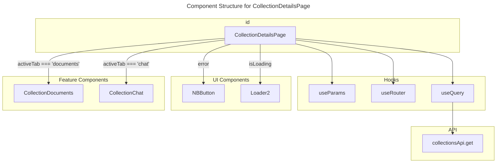

# C4 Code Level: frontend/app/collections/[id]

## Overview
- **Name**: Collection Details Page
- **Description**: A dynamic Next.js page that displays details for a specific document collection, including document management and a chat interface.
- **Location**: `frontend/app/collections/[id]/page.tsx`
- **Language**: TypeScript (React/Next.js)
- **Purpose**: Provides the user interface for interacting with a single GraphRAG collection, allowing users to view/manage documents and perform GraphRAG queries via a chat interface.

## Code Elements

### Functions/Methods
- `CollectionDetailsPage()`
  - Description: The main functional component for the collection details route. It handles fetching collection data, managing tab state (documents vs. chat), and rendering the appropriate sub-components.
  - Location: `frontend/app/collections/[id]/page.tsx:14`
  - Dependencies: `useParams`, `useRouter`, `useQuery`, `collectionsApi`, `CollectionDocuments`, `CollectionChat`

## Dependencies

### Internal Dependencies
- `@/lib/api`: `collectionsApi` used for fetching collection data.
- `@/components/ui/NBButton`: Neo-brutalist button component.
- `@/components/ui/NBCard`: Neo-brutalist card component.
- `@/components/collection-documents`: Component for document management and indexing status.
- `@/components/collection-chat`: Component for the GraphRAG chat interface.
- `@/lib/utils`: `cn` utility for conditional class joining.

### External Dependencies
- `react`: `React` and `useState`.
- `next/navigation`: `useParams` for accessing route ID and `useRouter` for navigation.
- `@tanstack/react-query`: `useQuery` for data fetching and state management.
- `lucide-react`: `ArrowLeft` and `Loader2` icons.

## Relationships

### Component Structure



### Data Flow

```mermaid
---
title: Data Flow for CollectionDetailsPage
---
flowchart LR
    URL[/[id] parameter] --> Params[useParams]
    Params --> ID[id]
    ID --> Query[useQuery]
    Query --> API[collectionsApi.get]
    API --> Data[collection object]
    Data --> CD[CollectionDocuments]
    Data --> CC[CollectionChat]
```

## Notes
- The page uses a neo-brutalist design style consistent with the rest of the application.
- It implements a simple tab system to switch between "Documents & Indexing" and "Conversation Chat".
- Error handling and loading states are built-in using React Query's state.
