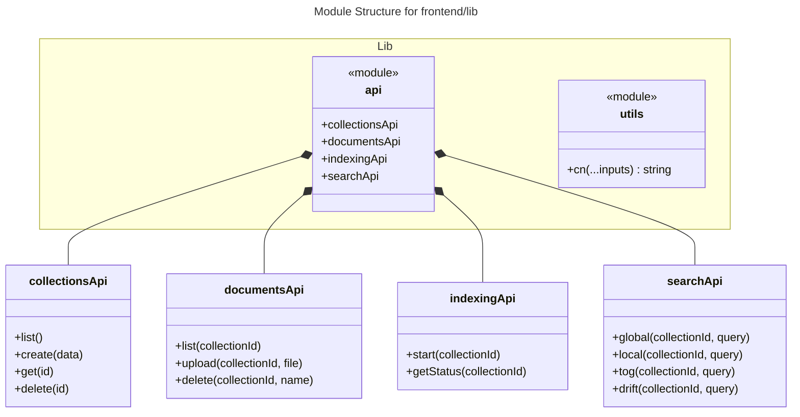
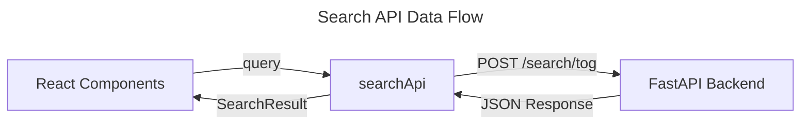

# C4 Code Level: frontend/lib and frontend/public

## Overview
- **Name**: Frontend Libraries and Public Assets
- **Description**: Utility functions, API client definitions, and public static assets for the GraphRAG-ToG frontend.
- **Location**: `F:\KL\gtog\frontend\lib`, `F:\KL\gtog\frontend\public`
- **Language**: TypeScript
- **Purpose**: Provides a structured interface for interacting with the backend API, UI utility functions, and static assets used across the web application.

## Code Elements

### frontend/lib/api.ts
This module defines the API client and methods for interacting with the GraphRAG backend.

#### Interfaces
- `Collection`: Represents a document collection metadata.
- `Document`: Represents an individual document within a collection.
- `IndexingStatus`: Represents the state of the indexing process for a collection.
- `SearchResult`: Represents the response from various search methods.

#### Objects / API Groups
- `api`: An Axios instance configured with `API_BASE_URL` (http://127.0.0.1:8000/api) and default headers.
- `collectionsApi`:
    - `list(): Promise<{ collections: Collection[]; total: number }>`: Fetches all collections.
    - `create(data: { name: string; description?: string }): Promise<Collection>`: Creates a new collection.
    - `get(id: string): Promise<Collection>`: Fetches details for a specific collection.
    - `delete(id: string): Promise<void>`: Deletes a collection.
- `documentsApi`:
    - `list(collectionId: string): Promise<{ documents: Document[]; total: number }>`: Lists documents in a collection.
    - `upload(collectionId: string, file: File): Promise<Document>`: Uploads a file to a collection.
    - `delete(collectionId: string, documentName: string): Promise<void>`: Deletes a document from a collection.
- `indexingApi`:
    - `start(collectionId: string): Promise<IndexingStatus>`: Initiates indexing for a collection.
    - `getStatus(collectionId: string): Promise<IndexingStatus>`: Polls the indexing status.
- `searchApi`:
    - `global(collectionId: string, query: string): Promise<SearchResult>`: Performs a Global Search.
    - `local(collectionId: string, query: string): Promise<SearchResult>`: Performs a Local Search.
    - `tog(collectionId: string, query: string): Promise<SearchResult>`: Performs a ToG (Think-on-Graph) Search.
    - `drift(collectionId: string, query: string): Promise<SearchResult>`: Performs a DRIFT Search.

### frontend/lib/utils.ts
- `cn(...inputs: ClassValue[]): string`
  - Description: A utility function that merges Tailwind CSS classes using `clsx` and `tailwind-merge`.
  - Location: `frontend/lib/utils.ts:4`
  - Dependencies: `clsx`, `tailwind-merge`

### frontend/public/
Contains static assets (SVG icons) used in the Next.js application:
- `file.svg`
- `globe.svg`
- `next.svg`
- `vercel.svg`
- `window.svg`

## Dependencies

### Internal Dependencies
- None (These are leaf modules).

### External Dependencies
- `axios`: For making HTTP requests to the backend.
- `clsx`: Utility for constructing `className` strings conditionally.
- `tailwind-merge`: For merging Tailwind CSS classes without conflicts.

## Relationships

### API Structure Diagram

### Data Flow (Search Example)

## Notes
- The `API_BASE_URL` is hardcoded to `http://127.0.0.1:8000/api`, which assumes the backend is running locally.
- The `utils.ts` file is a standard utility pattern in Shadcn/UI-based projects for handling Tailwind class merging.
