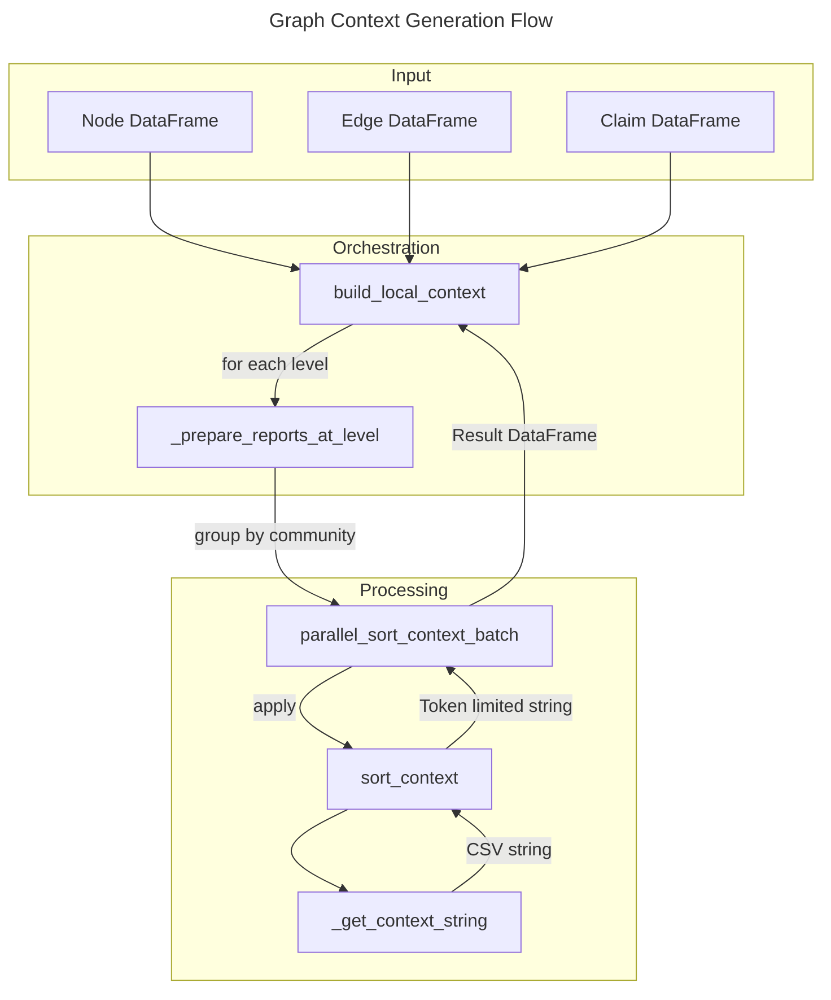
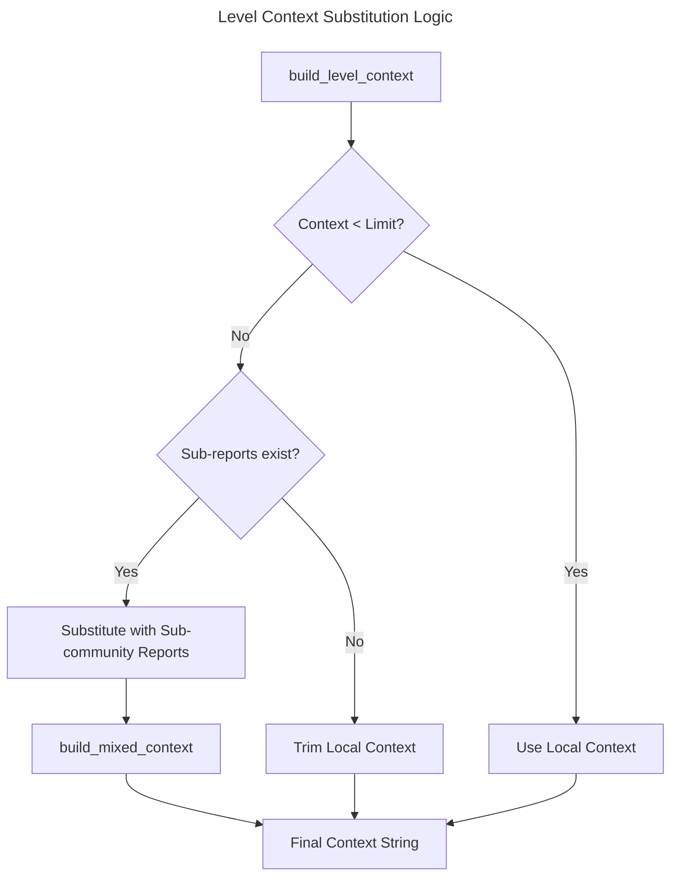

# C4 Code Level: graphrag/index/operations/summarize_communities/graph_context

## Overview
- **Name**: Graph Context Builders
- **Description**: This directory contains modules responsible for building the context used in community summarization within the GraphRAG indexing pipeline. It prepares structured data (nodes, edges, claims) into token-limited context strings for LLM report generation.
- **Location**: `F:\KL\gtog\graphrag\index\operations\summarize_communities\graph_context`
- **Language**: Python
- **Purpose**: To provide structured graph data (entities, relationships, and claims) as formatted, token-optimized context strings to be used for generating community reports.

## Code Elements

### Functions/Methods

#### `build_local_context(nodes, edges, claims, tokenizer, callbacks, max_context_tokens)`
- **Description**: Prepares communities for report generation by iterating through hierarchy levels and building context for each community.
- **Location**: `context_builder.py:38`
- **Dependencies**: `get_levels`, `_prepare_reports_at_level`, `WorkflowCallbacks`, `Tokenizer`, `pandas`

#### `_prepare_reports_at_level(node_df, edge_df, claim_df, tokenizer, level, max_context_tokens)`
- **Description**: Internal helper that filters nodes, edges, and claims for a specific hierarchy level and aggregates them into a per-community context.
- **Location**: `context_builder.py:63`
- **Dependencies**: `parallel_sort_context_batch`, `schemas`, `pandas`

#### `build_level_context(report_df, community_hierarchy_df, local_context_df, tokenizer, level, max_context_tokens)`
- **Description**: Prepares context for communities at a specific level, handling cases where local context exceeds token limits by substituting with sub-community reports.
- **Location**: `context_builder.py:191`
- **Dependencies**: `_sort_and_trim_context`, `_get_subcontext_df`, `_get_community_df`, `union`, `antijoin`, `schemas`

#### `sort_context(local_context, tokenizer, sub_community_reports, max_context_tokens, ...)`
- **Description**: Sorts graph elements (entities, claims, relationships) by degree in descending order and builds a token-limited context string.
- **Location**: `sort_context.py:11`
- **Dependencies**: `Tokenizer`, `pandas`, `schemas`

#### `parallel_sort_context_batch(community_df, tokenizer, max_context_tokens, parallel)`
- **Description**: Calculates context strings for a batch of communities, optionally using parallel execution with `ThreadPoolExecutor`.
- **Location**: `sort_context.py:129`
- **Dependencies**: `sort_context`, `ThreadPoolExecutor`, `Tokenizer`, `pandas`

#### `_get_context_string(entities, edges, claims, sub_community_reports)`
- **Description**: Internal helper in `sort_context.py` that formats lists of dictionaries into CSV-style context strings.
- **Location**: `sort_context.py:27`
- **Dependencies**: `pandas`

### Modules

#### `context_builder`
- **Description**: Main module for orchestrating context preparation across different hierarchy levels.
- **Location**: `graphrag/index/operations/summarize_communities/graph_context/context_builder.py`

#### `sort_context`
- **Description**: Specialized module for sorting graph elements and enforcing token limits on the generated context strings.
- **Location**: `graphrag/index/operations/summarize_communities/graph_context/sort_context.py`

## Dependencies

### Internal Dependencies
- `graphrag.data_model.schemas`: Field name definitions for DataFrames.
- `graphrag.tokenizer.tokenizer`: Token counting and processing.
- `graphrag.callbacks.workflow_callbacks`: Progress reporting.
- `graphrag.index.operations.summarize_communities.build_mixed_context`: Handling sub-community report substitution.
- `graphrag.index.utils.dataframes`: Utility functions for DataFrame operations (join, union, etc.).

### External Dependencies
- `pandas`: Primary data manipulation library.
- `logging`: System logging.
- `concurrent.futures.ThreadPoolExecutor`: Parallel processing of community contexts.

## Relationships

### Context Generation Flow

### Hierarchy Level Context Handling

## Notes
- The context generation is optimized for performance using pandas vectorization and optional thread-based parallelism.
- Graph elements are prioritized by degree (connectivity), ensuring the most significant entities and relationships are included within the token budget.
- The system supports a hierarchical approach where large community contexts are replaced by summaries (reports) of their children to maintain semantic density within token limits.
