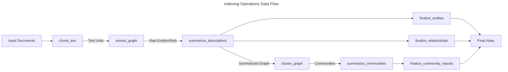
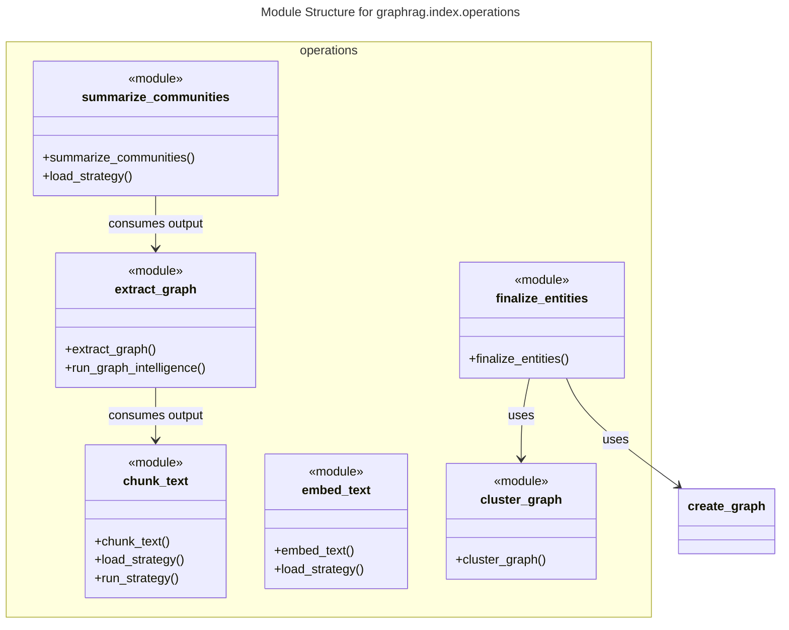

# C4 Code Level: graphrag/index/operations

## Overview
- **Name**: Indexing Operations
- **Description**: A collection of reusable data frame operations and strategies used in the GraphRAG indexing pipeline. These operations handle text chunking, graph extraction, community summarization, embedding, and graph layout.
- **Location**: `graphrag/index/operations`
- **Language**: Python
- **Purpose**: To provide the functional building blocks for transforming raw text into a structured, indexed knowledge graph.

## Code Elements

### Core Operations

#### chunk_text
- `chunk_text(input: pd.DataFrame, column: str, size: int, overlap: int, encoding_model: str, strategy: ChunkStrategyType, callbacks: WorkflowCallbacks) -> pd.Series`
  - Description: Chunks text from a DataFrame column into smaller pieces based on a specified strategy (tokens or sentence).
  - Location: `graphrag/index/operations/chunk_text/chunk_text.py:19`
  - Dependencies: `ChunkingConfig`, `ProgressTicker`, `WorkflowCallbacks`, `load_strategy`, `run_strategy`

#### extract_graph
- `async def extract_graph(text_units: pd.DataFrame, callbacks: WorkflowCallbacks, cache: PipelineCache, text_column: str, id_column: str, strategy: dict[str, Any] | None, async_mode: AsyncType = AsyncType.AsyncIO, entity_types=DEFAULT_ENTITY_TYPES, num_threads: int = 4) -> tuple[pd.DataFrame, pd.DataFrame]`
  - Description: Extracts entities and relationships from text units using LLM-based strategies.
  - Location: `graphrag/index/operations/extract_graph/extract_graph.py:27`
  - Dependencies: `PipelineCache`, `WorkflowCallbacks`, `derive_from_rows`, `_load_strategy`, `_merge_entities`, `_merge_relationships`

#### summarize_descriptions
- `async def summarize_descriptions(entities_df: pd.DataFrame, relationships_df: pd.DataFrame, callbacks: WorkflowCallbacks, cache: PipelineCache, strategy: dict[str, Any] | None = None, num_threads: int = 4) -> tuple[pd.DataFrame, pd.DataFrame]`
  - Description: Summarizes entity and relationship descriptions from a graph using a language model.
  - Location: `graphrag/index/operations/summarize_descriptions/summarize_descriptions.py:23`
  - Dependencies: `PipelineCache`, `WorkflowCallbacks`, `load_strategy`, `ProgressTicker`, `asyncio.Semaphore`

#### summarize_communities
- `async def summarize_communities(nodes: pd.DataFrame, communities: pd.DataFrame, local_contexts, level_context_builder: Callable, callbacks: WorkflowCallbacks, cache: PipelineCache, strategy: dict, tokenizer: Tokenizer, max_input_length: int, async_mode: AsyncType = AsyncType.AsyncIO, num_threads: int = 4)`
  - Description: Generates reports and summaries for detected communities in the graph across different hierarchy levels.
  - Location: `graphrag/index/operations/summarize_communities/summarize_communities.py:31`
  - Dependencies: `PipelineCache`, `WorkflowCallbacks`, `Tokenizer`, `derive_from_rows`, `load_strategy`, `get_levels`

#### embed_text
- `async def embed_text(input: pd.DataFrame, callbacks: WorkflowCallbacks, cache: PipelineCache, embed_column: str, strategy: dict, embedding_name: str, id_column: str = "id", title_column: str | None = None)`
  - Description: Embeds text into vector space, supporting both in-memory and vector-store backed operations.
  - Location: `graphrag/index/operations/embed_text/embed_text.py:39`
  - Dependencies: `PipelineCache`, `WorkflowCallbacks`, `BaseVectorStore`, `VectorStoreFactory`, `load_strategy`

### Graph Manipulation & Analysis

#### cluster_graph
- `cluster_graph(graph: nx.Graph, max_cluster_size: int, use_lcc: bool, seed: int | None = None) -> Communities`
  - Description: Applies hierarchical Leiden clustering to a graph to identify communities.
  - Location: `graphrag/index/operations/cluster_graph.py:19`
  - Dependencies: `networkx`, `graspologic.partition.hierarchical_leiden`, `stable_largest_connected_component`

#### create_graph
- `create_graph(edges: pd.DataFrame, edge_attr: list[str | int] | None = None, nodes: pd.DataFrame | None = None, node_id: str = "title") -> nx.Graph`
  - Description: Constructs a NetworkX graph from DataFrames containing nodes and edges.
  - Location: `graphrag/index/operations/create_graph.py:10`
  - Dependencies: `networkx`, `pandas`

#### compute_degree
- `compute_degree(graph: nx.Graph) -> pd.DataFrame`
  - Description: Computes the degree of each node in the graph and returns it as a DataFrame.
  - Location: `graphrag/index/operations/compute_degree.py:10`
  - Dependencies: `networkx`, `pandas`

### Finalization Operations

#### finalize_entities
- `finalize_entities(entities: pd.DataFrame, relationships: pd.DataFrame, embed_config: EmbedGraphConfig | None = None, layout_enabled: bool = False) -> pd.DataFrame`
  - Description: Prepares the final entity DataFrame by calculating degrees, layouts, and generating unique IDs.
  - Location: `graphrag/index/operations/finalize_entities.py:18`
  - Dependencies: `create_graph`, `embed_graph`, `layout_graph`, `compute_degree`

#### finalize_relationships
- `finalize_relationships(relationships: pd.DataFrame) -> pd.DataFrame`
  - Description: Prepares the final relationship DataFrame by calculating combined degrees and generating unique IDs.
  - Location: `graphrag/index/operations/finalize_relationships.py:18`
  - Dependencies: `create_graph`, `compute_degree`, `compute_edge_combined_degree`

#### finalize_community_reports
- `finalize_community_reports(reports: pd.DataFrame, communities: pd.DataFrame) -> pd.DataFrame`
  - Description: Joins community reports with community metadata and assigns unique IDs.
  - Location: `graphrag/index/operations/finalize_community_reports.py:13`
  - Dependencies: `pandas`, `uuid`

## Dependencies

### Internal Dependencies
- `graphrag.cache.pipeline_cache`: For caching LLM results.
- `graphrag.callbacks.workflow_callbacks`: For progress reporting and telemetry.
- `graphrag.config.models`: Various configuration schemas.
- `graphrag.data_model.schemas`: Standard column names and schemas.
- `graphrag.index.utils`: Utility functions like `derive_from_rows` and `stable_lcc`.
- `graphrag.tokenizer.tokenizer`: For token counting and context management.
- `graphrag.vector_stores`: For vector storage abstraction.

### External Dependencies
- `pandas`: Primary data structure for indexing pipelines.
- `networkx`: For graph representations and operations.
- `numpy`: For numerical operations (embeddings).
- `graspologic`: For hierarchical Leiden clustering.
- `asyncio`: For concurrent execution of LLM calls.

## Relationships

### Indexing Data Flow

The following diagram shows the logical flow of data through major operations in the indexing directory.

### Module Dependencies

## Notes
- These operations are typically invoked by "Verbs" in the indexing pipeline.
- Most heavy-lifting operations (extraction, summarization, embedding) support pluggable strategies, usually including a "graph_intelligence" strategy which uses LLMs.
- Parallelism is handled via `asyncio` and semaphores or `derive_from_rows` utility.
- DataFrames are the primary interface between operations, ensuring compatibility with the underlying pipeline engine.
- Type hints are extensively used to ensure data consistency across the complex pipeline.
