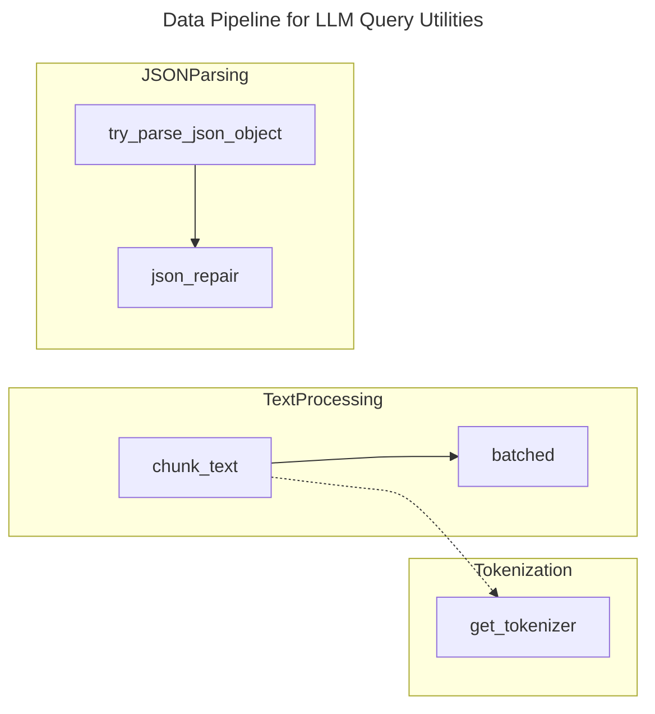
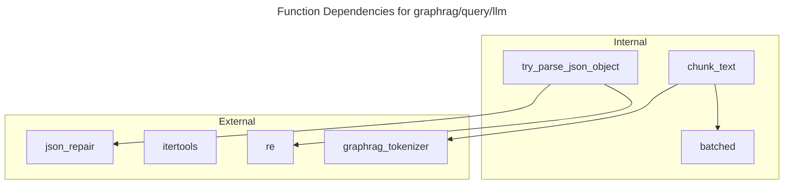

# C4 Code Level: graphrag/query/llm

## Overview
- **Name**: LLM Query Utilities
- **Description**: Lower-level utility functions and orchestration tools for LLM-based querying.
- **Location**: [graphrag/query/llm](F:/KL/gtog/graphrag/query/llm)
- **Language**: Python
- **Purpose**: Provides text processing, tokenization-aware chunking, and robust JSON parsing to support higher-level query engines.

## Code Elements

### Functions
- `batched(iterable: Iterator, n: int) -> Iterator[tuple]`
  - Description: Batches data into tuples of length `n`. The last batch may be shorter. Used primarily for processing lists of tokens.
  - Location: `text_utils.py:21`
  - Dependencies: `itertools.islice`

- `chunk_text(text: str, max_tokens: int, tokenizer: Tokenizer | None = None) -> Iterator[str]`
  - Description: Chunks a string into segments that do not exceed a specific token limit.
  - Location: `text_utils.py:36`
  - Dependencies: `batched`, `graphrag.tokenizer`, `graphrag.config.defaults`

- `try_parse_json_object(input: str, verbose: bool = True) -> tuple[str, dict]`
  - Description: Robustly attempts to extract and parse a JSON object from a string. Handles Markdown JSON blocks, malformed braces, and uses `json_repair` for advanced recovery. Returns the cleaned string and the parsed dictionary.
  - Location: `text_utils.py:45`
  - Dependencies: `json`, `re`, `json_repair.repair_json`

## Dependencies

### Internal Dependencies
- `graphrag.config.defaults`: For default encoding models.
- `graphrag.tokenizer.get_tokenizer`: For retrieving the appropriate tokenizer.
- `graphrag.tokenizer.tokenizer.Tokenizer`: Type definition for tokenizers.

### External Dependencies
- `json_repair`: Used to fix malformed JSON returned by LLMs.
- `itertools`: Used for efficient batching.
- `re`: Used for regex-based JSON extraction.

## Relationships

The utilities in this directory are procedural and functional, focusing on data transformation.

## Notes
- This directory currently contains core utilities used by various search methods (Global, Local, DRIFT, ToG).
- `try_parse_json_object` is a critical resilience component for handling non-deterministic LLM outputs.
- While architectural diagrams often place `tog` under this path, it is currently implemented or located elsewhere in the physical directory structure (refer to `graphrag/query/llm/tog` if it exists in other branches or as a component).
