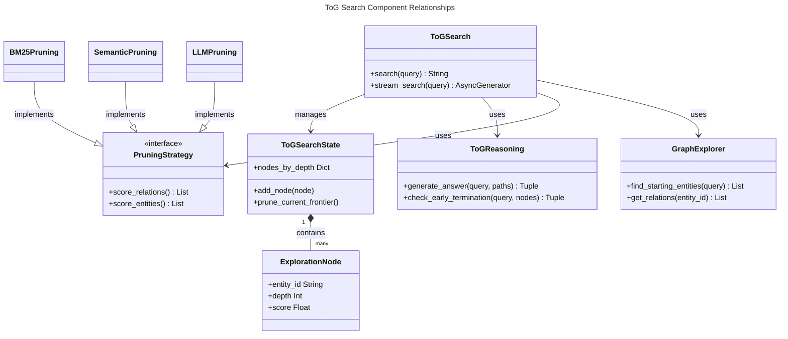
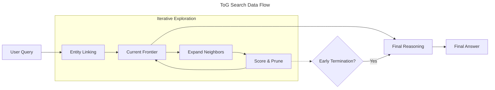

# C4 Code Level: ToG Search Implementation

## Overview
- **Name**: ToG Search Implementation
- **Description**: Implementation of Think-on-Graph (ToG) search strategy, combining iterative graph exploration with LLM-guided pruning and reasoning.
- **Location**: `graphrag/query/structured_search/tog_search`
- **Language**: Python
- **Purpose**: Provide deep reasoning capabilities using graph exploration and beam search over a knowledge graph.

## Code Elements

### Modules

#### `graphrag.query.structured_search.tog_search.search`
The main entry point for ToG search.

- `ToGSearch` (Class)
  - Description: Orchestrates the ToG search process, including entity linking, iterative exploration, pruning, and reasoning.
  - Location: `graphrag/query/structured_search/tog_search/search.py:14`
  - Methods:
    - `__init__(model, entities, relationships, tokenizer, pruning_strategy, reasoning_module, embedding_model, entity_text_embeddings, width, depth, num_retain_entity, callbacks, debug)`
    - `search(query: str) -> str`: Async method to perform search and return final answer.
    - `stream_search(query: str) -> AsyncGenerator[str, None]`: Async generator for streaming search results and exploration progress.
  - Dependencies: `GraphExplorer`, `ToGSearchState`, `ExplorationNode`, `PruningStrategy`, `ToGReasoning`.

#### `graphrag.query.structured_search.tog_search.exploration`
Handles graph traversal and entity linking.

- `GraphExplorer` (Class)
  - Description: Manages the knowledge graph structure (entities and relationships) and provides methods for finding starting entities and retrieving neighbors.
  - Location: `graphrag/query/structured_search/tog_search/exploration.py:19`
  - Methods:
    - `__init__(entities, relationships, embedding_model, entity_embedding_store)`
    - `_build_adjacency()`: Internal method to build adjacency lists for efficient traversal.
    - `get_relations(entity_id: str, bidirectional: bool = True) -> List[Tuple[str, str, str, float]]`: Returns relations for a given entity.
    - `get_entity_info(entity_id: str) -> Tuple[str, str] | None`: Returns title and description for an entity.
    - `_compute_entity_embeddings()`: Async method to compute or load entity embeddings.
    - `find_starting_entities_semantic(query: str, top_k: int = 3) -> List[str]`: Async method to find initial entities using embedding similarity.
    - `find_starting_entities_keyword(query: str, top_k: int = 3) -> List[str]`: Fallback method for keyword-based entity linking.
    - `find_starting_entities(query: str, top_k: int = 3) -> List[str]`: Sync wrapper for keyword matching.
  - Dependencies: `graphrag.data_model.entity.Entity`, `graphrag.data_model.relationship.Relationship`, `numpy`.

#### `graphrag.query.structured_search.tog_search.pruning`
Implements strategies to filter and score exploration paths.

- `PruningStrategy` (Interface/Base Class)
  - Description: Abstract base class for relation and entity scoring strategies.
  - Location: `graphrag/query/structured_search/tog_search/pruning.py:14`
  - Methods:
    - `score_relations(query, entity_name, relations)`
    - `score_entities(query, current_path, entities)`

- `LLMPruning` (Class, inherits `PruningStrategy`)
  - Description: Uses an LLM to score relations and entities based on natural language descriptions and the user query.
  - Location: `graphrag/query/structured_search/tog_search/pruning.py:43`
  - Methods:
    - `__init__(model, temperature, relation_scoring_prompt, entity_scoring_prompt)`
    - `score_relations(...) -> List[Tuple[str, str, str, float, float]]`
    - `score_entities(...) -> List[float]`
    - `_parse_scores(response: str, expected_count: int) -> List[float]`

- `SemanticPruning` (Class, inherits `PruningStrategy`)
  - Description: Uses embedding similarity (cosine) between the query and relation/entity descriptions for scoring.
  - Location: `graphrag/query/structured_search/tog_search/pruning.py:193`

- `BM25Pruning` (Class, inherits `PruningStrategy`)
  - Description: Uses the BM25 lexical matching algorithm for scoring.
  - Location: `graphrag/query/structured_search/tog_search/pruning.py:316`

#### `graphrag.query.structured_search.tog_search.reasoning`
Handles final synthesis of discovered information.

- `ToGReasoning` (Class)
  - Description: Synthesizes exploration paths into a final answer using an LLM.
  - Location: `graphrag/query/structured_search/tog_search/reasoning.py:7`
  - Methods:
    - `generate_answer(query: str, exploration_paths: List[ExplorationNode]) -> tuple[str, List[str]]`
    - `check_early_termination(query: str, current_nodes: List[ExplorationNode]) -> tuple[bool, str | None]`: Checks if the current exploration is sufficient to answer the query.
    - `_format_paths(nodes: List[ExplorationNode]) -> str`: Formats paths into a structured text for the LLM.
    - `_path_to_string(node: ExplorationNode) -> str`: Converts a single path into a string of triplets.

#### `graphrag.query.structured_search.tog_search.state`
Data models for search state.

- `ExplorationNode` (Dataclass)
  - Description: Represents a single step in a graph exploration path.
  - Location: `graphrag/query/structured_search/tog_search/state.py:6`
  - Attributes: `entity_id`, `entity_name`, `entity_description`, `depth`, `score`, `parent`, `relation_from_parent`.
  - Methods: `get_path()`

- `ToGSearchState` (Dataclass)
  - Description: Tracks the overall state of the search, including current depth and beam frontier.
  - Location: `graphrag/query/structured_search/tog_search/state.py:28`
  - Methods: `add_node()`, `get_current_frontier()`, `prune_current_frontier()`.

## Dependencies

### Internal Dependencies
- `graphrag.language_model.protocol.base`: `ChatModel`, `EmbeddingModel`
- `graphrag.data_model.entity`: `Entity`
- `graphrag.data_model.relationship`: `Relationship`
- `graphrag.vector_stores.base`: `BaseVectorStore`
- `graphrag.tokenizer.tokenizer`: `Tokenizer`
- `graphrag.callbacks.query_callbacks`: `QueryCallbacks`
- `graphrag.prompts.query`: Various ToG-specific prompts (`tog_relation_scoring_prompt`, `tog_entity_scoring_prompt`, `tog_reasoning_prompt`)

### External Dependencies
- `numpy`: Numerical operations (embeddings, scores).
- `dataclasses`: State management.
- `typing`: Type hinting.
- `logging`: System logging.

## Relationships

## Notes
- ToG (Think-on-Graph) is based on academic research (ICLR 2024) focusing on deep reasoning over knowledge graphs.
- The implementation supports multiple pruning strategies: LLM-based (most accurate but expensive), Semantic (embedding-based), and BM25 (lexical).
- Early termination allows the search to stop if the LLM determines it has enough information at a shallower depth than the configured maximum.
- Entity linking defaults to semantic similarity if an embedding model is provided, falling back to keyword matching.
