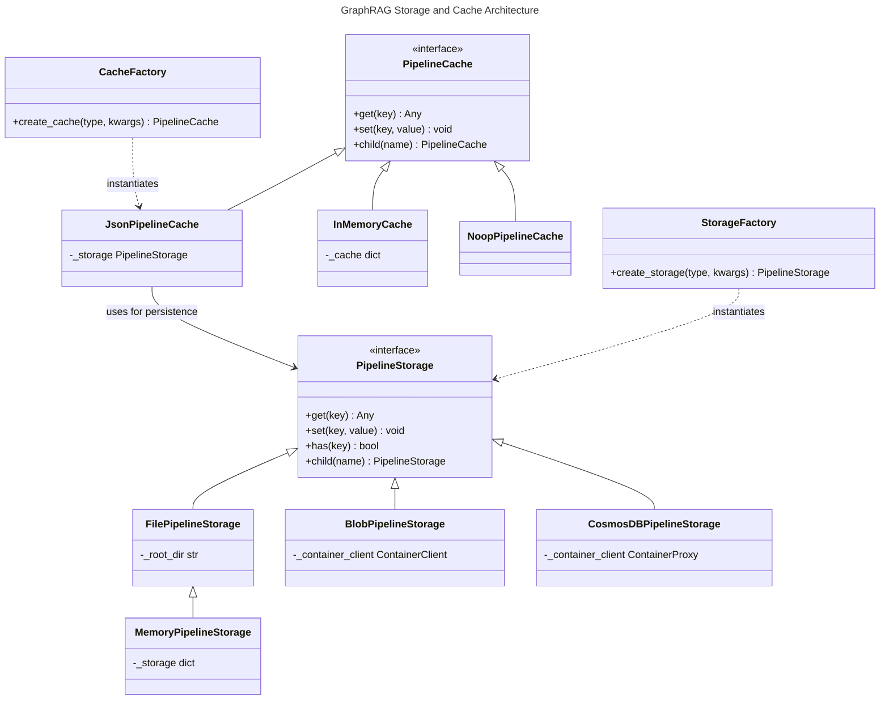
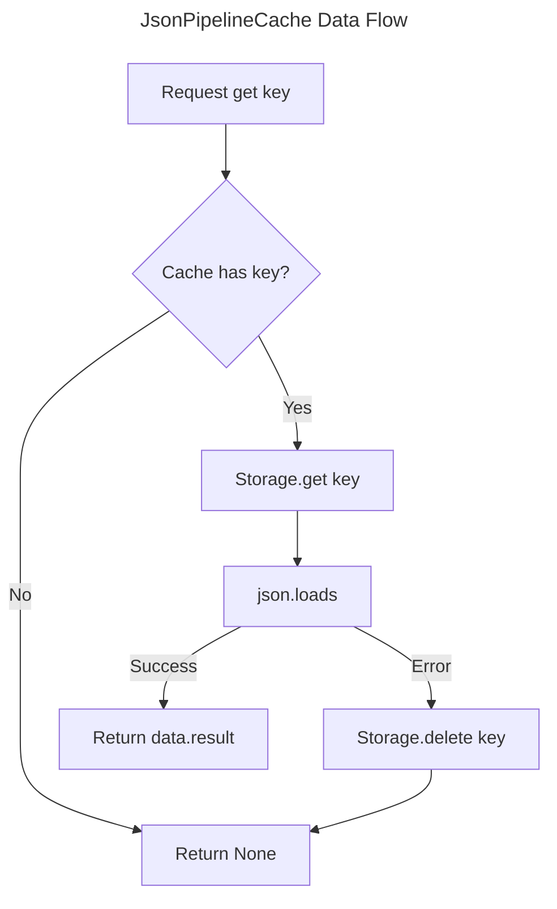

# C4 Code Level: graphrag/storage and graphrag/cache

## Overview
- **Name**: GraphRAG Storage and Cache Modules
- **Description**: Provides unified interfaces and implementations for persistent storage and caching of pipeline data.
- **Location**: `graphrag/storage`, `graphrag/cache`
- **Language**: Python
- **Purpose**: To abstract underlying storage (File, Azure Blob, CosmosDB, Memory) and caching mechanisms used throughout the GraphRAG indexing and query pipelines.

## Code Elements: Storage (graphrag/storage)

### Interfaces
- `PipelineStorage` (Abstract Base Class)
  - Description: Defines the standard interface for storage operations.
  - Location: `graphrag/storage/pipeline_storage.py:13`
  - Methods:
    - `find(file_pattern, base_dir, file_filter, max_count)`: Find files matching patterns.
    - `get(key, as_bytes, encoding)`: Retrieve data.
    - `set(key, value, encoding)`: Store data.
    - `has(key)`: Check existence.
    - `delete(key)`: Remove data.
    - `clear()`: Wipe storage.
    - `child(name)`: Create a namespaced child storage.
    - `keys()`: List all keys.
    - `get_creation_date(key)`: Get timestamp.

### Implementations
- `FilePipelineStorage`
  - Description: Disk-based storage implementation using asynchronous file I/O (`aiofiles`).
  - Location: `graphrag/storage/file_pipeline_storage.py:27`
  - Dependencies: `aiofiles`, `pathlib`, `shutil`
- `MemoryPipelineStorage`
  - Description: Volatile in-memory storage using a Python dictionary. Inherits from `FilePipelineStorage` but overrides core methods.
  - Location: `graphrag/storage/memory_pipeline_storage.py:14`
- `BlobPipelineStorage`
  - Description: Cloud storage implementation for Azure Blob Storage.
  - Location: `graphrag/storage/blob_pipeline_storage.py:23`
  - Dependencies: `azure-storage-blob`, `azure-identity`
- `CosmosDBPipelineStorage`
  - Description: Database storage implementation for Azure Cosmos DB. Optimized to store parquet rows as individual items.
  - Location: `graphrag/storage/cosmosdb_pipeline_storage.py:29`
  - Dependencies: `azure-cosmos`, `pandas`

### Factory
- `StorageFactory`
  - Description: Static registry for storage implementations. Allows registration and creation of storage instances based on `StorageType`.
  - Location: `graphrag/storage/factory.py:22`

## Code Elements: Cache (graphrag/cache)

### Interfaces
- `PipelineCache` (Abstract Base Class)
  - Description: Defines the standard interface for caching operations.
  - Location: `graphrag/cache/pipeline_cache.py:12`
  - Methods:
    - `get(key)`: Retrieve cached value.
    - `set(key, value, debug_data)`: Cache a value with optional metadata.
    - `has(key)`: Check if key is cached.
    - `delete(key)`: Remove cached entry.
    - `clear()`: Wipe cache.
    - `child(name)`: Create a namespaced child cache.

### Implementations
- `JsonPipelineCache`
  - Description: A cache implementation that wraps a `PipelineStorage` and serializes data as JSON. It stores results under a `"result"` key and preserves `debug_data`.
  - Location: `graphrag/cache/json_pipeline_cache.py:13`
  - Dependencies: `graphrag.storage.pipeline_storage.PipelineStorage`
- `InMemoryCache`
  - Description: Simple in-memory cache using a Python dictionary.
  - Location: `graphrag/cache/memory_pipeline_cache.py:11`
- `NoopPipelineCache`
  - Description: A "null" cache that performs no operations and always returns `None`. Useful for testing or bypassing cache.
  - Location: `graphrag/cache/noop_pipeline_cache.py:11`

### Factory
- `CacheFactory`
  - Description: Static registry for cache implementations. Handles creation of caches, including initializing required storage backends for `JsonPipelineCache`.
  - Location: `graphrag/cache/factory.py:24`

## Dependencies

### Internal Dependencies
- `graphrag.config.enums.StorageType`: Defines supported storage backends.
- `graphrag.config.enums.CacheType`: Defines supported cache backends.
- `graphrag.logger.progress`: Used in CosmosDB storage for tracking search progress.

### External Dependencies
- `aiofiles`: Asynchronous local file operations.
- `azure-storage-blob`: Azure Blob Storage SDK.
- `azure-cosmos`: Azure Cosmos DB SDK.
- `azure-identity`: Azure Authentication (DefaultAzureCredential).
- `pandas`: Used for Parquet/JSON processing in CosmosDB storage.

## Relationships

### Storage and Cache Architecture

The following diagram shows the relationship between the Cache and Storage layers, specifically how `JsonPipelineCache` leverages `PipelineStorage`.

### Data Flow: Cache Miss/Hit in JsonPipelineCache

## Notes
- `CosmosDBPipelineStorage` is unique as it destructures Parquet files into individual document items for better queryability in Cosmos DB, whereas other storage types treat files as atomic blobs.
- `JsonPipelineCache` handles `UnicodeDecodeError` and `JSONDecodeError` by deleting the corrupt entry from the underlying storage.
- All storage and cache implementations support a `child()` method to create namespaced sub-directories or sub-containers, allowing the pipeline to organize data hierarchically (e.g., `cache/entity_extraction`, `cache/summarize_communities`).
