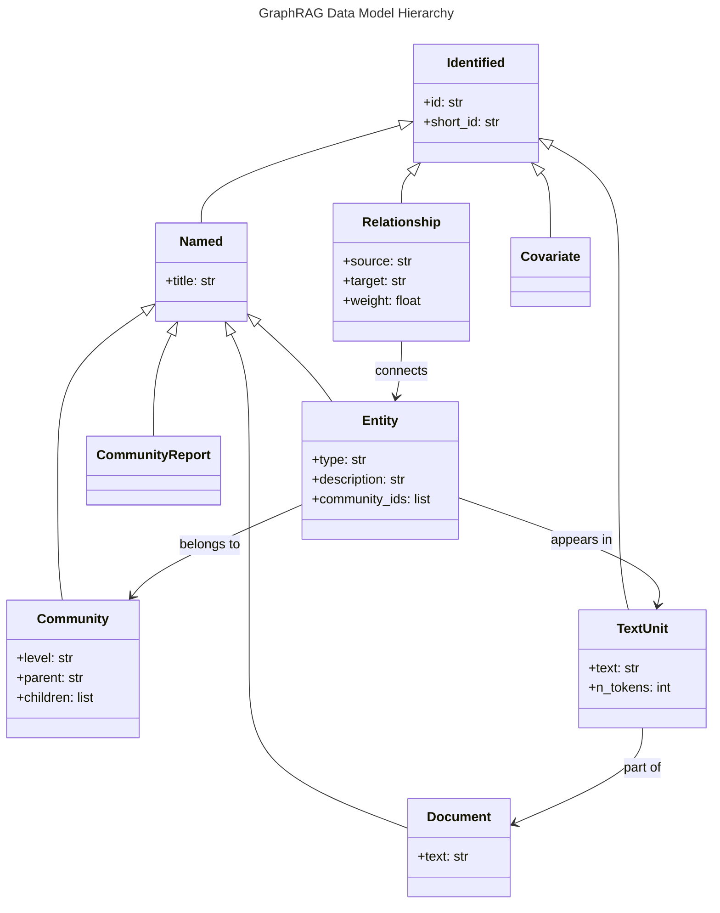
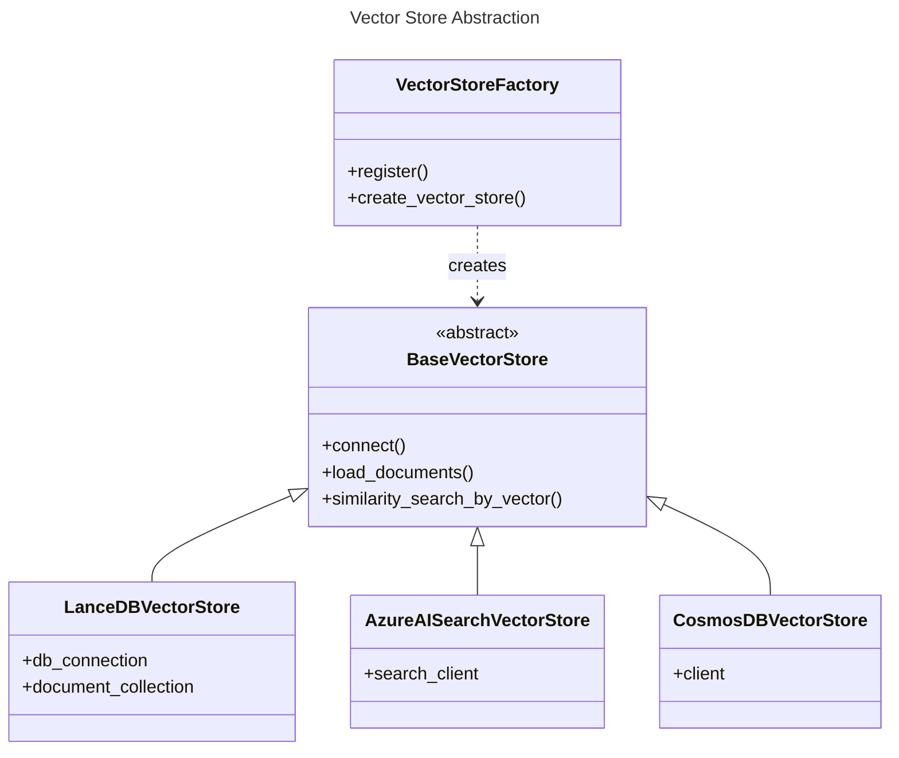

# C4 Code Level: graphrag/vector_stores and graphrag/data_model

## Overview
- **Name**: GraphRAG Core Data Models and Vector Storage
- **Description**: This directory contains the fundamental data structures for the knowledge graph and the abstraction layer for vector-based retrieval.
- **Location**: `graphrag/data_model/` and `graphrag/vector_stores/`
- **Language**: Python
- **Purpose**: Defines the "schema" for entities, relationships, and communities in the GraphRAG system, and provides a pluggable architecture for storing and searching vector embeddings.

## Code Elements: Data Model

### Classes

- `Identified`
  - Description: Base class for any item that has a unique identifier.
  - Location: `graphrag/data_model/identified.py:10`
  - Attributes: `id: str`, `short_id: str | None`

- `Named(Identified)`
  - Description: Base class for items that have both an ID and a title/name.
  - Location: `graphrag/data_model/named.py:12`
  - Attributes: `title: str`

- `Entity(Named)`
  - Description: Represents an extracted entity (e.g., person, place, org) in the knowledge graph.
  - Location: `graphrag/data_model/entity.py:13`
  - Attributes: `type`, `description`, `description_embedding`, `name_embedding`, `community_ids`, `text_unit_ids`, `rank`, `attributes`.
  - Methods: `from_dict(d: dict, ...)`

- `Relationship(Identified)`
  - Description: Represents a directed or undirected edge between two entities.
  - Location: `graphrag/data_model/relationship.py:13`
  - Attributes: `source`, `target`, `weight`, `description`, `description_embedding`, `text_unit_ids`, `rank`, `attributes`.

- `Community(Named)`
  - Description: Represents a cluster of entities detected in the graph.
  - Location: `graphrag/data_model/community.py:13`
  - Attributes: `level`, `parent`, `children`, `entity_ids`, `relationship_ids`, `text_unit_ids`, `covariate_ids`, `attributes`, `size`, `period`.

- `CommunityReport(Named)`
  - Description: An LLM-generated summary of a specific community.
  - Location: `graphrag/data_model/community_report.py:13`
  - Attributes: `community_id`, `summary`, `full_content`, `rank`, `full_content_embedding`, `attributes`, `size`, `period`.

- `Document(Named)`
  - Description: Represents a source document in the system.
  - Location: `graphrag/data_model/document.py:13`
  - Attributes: `type`, `text_unit_ids`, `text`, `attributes`.

- `TextUnit(Identified)`
  - Description: A granular chunk of text from a document, used for extraction and retrieval.
  - Location: `graphrag/data_model/text_unit.py:13`
  - Attributes: `text`, `entity_ids`, `relationship_ids`, `covariate_ids`, `n_tokens`, `document_ids`, `attributes`.

- `Covariate(Identified)`
  - Description: Metadata associated with a subject (typically entity claims).
  - Location: `graphrag/data_model/covariate.py:13`
  - Attributes: `subject_id`, `subject_type`, `covariate_type`, `text_unit_ids`, `attributes`.

## Code Elements: Vector Stores

### Classes

- `VectorStoreDocument`
  - Description: Data transfer object for items stored in vector databases.
  - Location: `graphrag/vector_stores/base.py:15`
  - Attributes: `id`, `text`, `vector`, `attributes`

- `BaseVectorStore(ABC)`
  - Description: Abstract base class defining the contract for all vector store implementations.
  - Location: `graphrag/vector_stores/base.py:39`
  - Methods: `connect()`, `load_documents()`, `similarity_search_by_vector()`, `similarity_search_by_text()`, `filter_by_id()`, `search_by_id()`

- `LanceDBVectorStore(BaseVectorStore)`
  - Description: Implementation of vector storage using LanceDB (local/file-based).
  - Location: `graphrag/vector_stores/lancedb.py:21`
  - Dependencies: `lancedb`, `pyarrow`, `numpy`

- `VectorStoreFactory`
  - Description: Factory class for registering and creating vector store instances.
  - Location: `graphrag/vector_stores/factory.py:24`
  - Methods: `register()`, `create_vector_store()`, `get_vector_store_types()`, `is_supported_type()`

## Relationships

### Data Model Hierarchy

### Vector Store Implementation

## Dependencies

### Internal Dependencies
- `graphrag.config.models.vector_store_schema_config`: For vector store schema configuration.
- `graphrag.config.enums`: For `VectorStoreType` enumeration.

### External Dependencies
- `lancedb`: Primary local vector database.
- `pyarrow`: For efficient data handling in LanceDB.
- `numpy`: For vector calculations.
- `typing`: For type hints and protocols.
- `dataclasses`: For data structure definitions.

## Notes
- The data models are designed as "protocols" (though implemented as dataclasses) to allow for flexible JSON/Dict serialization and deserialization.
- Vector stores use a `VectorStoreSchemaConfig` to map internal fields (like `id`, `text`, `vector`) to database-specific column names.
- The `factory.py` automatically registers built-in providers like LanceDB, Azure AI Search, and CosmosDB.
