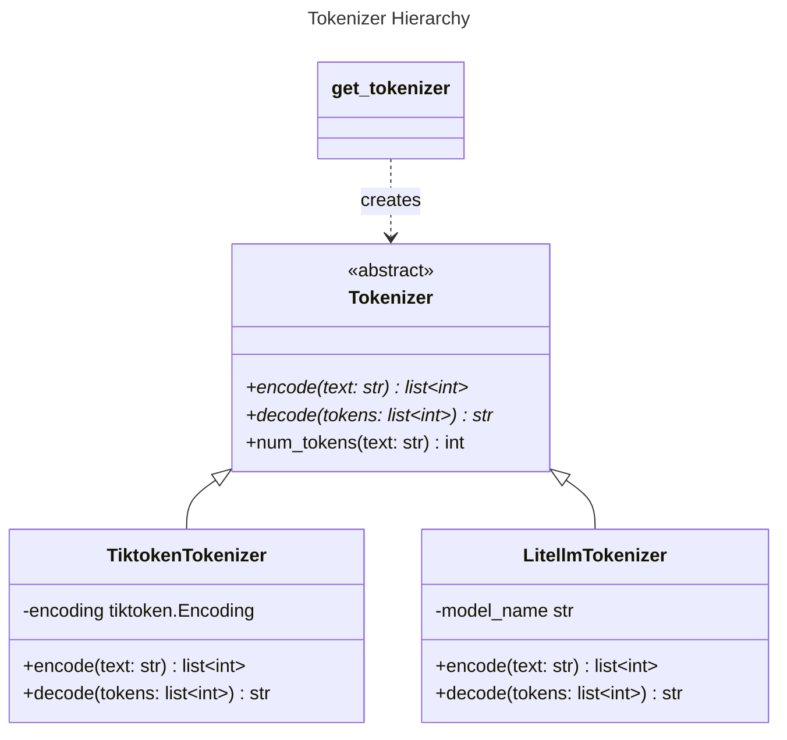
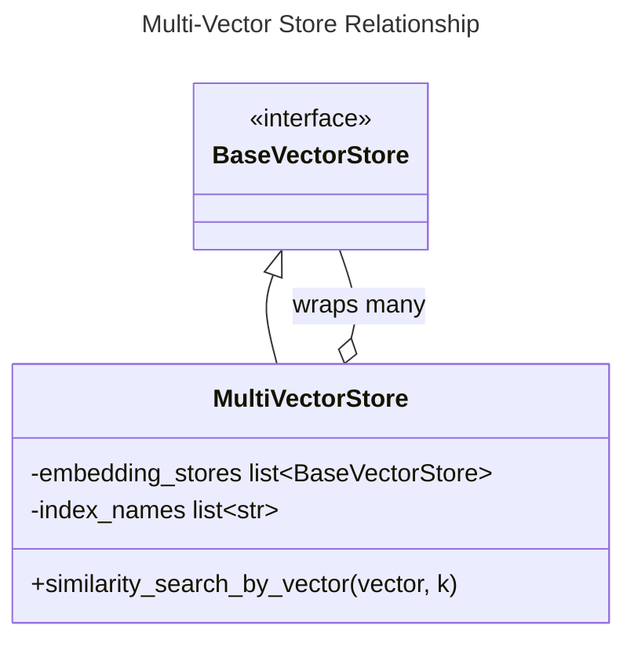

# C4 Code Level: Miscellaneous Utilities & Tokenization

## Overview
- **Name**: Miscellaneous Utilities & Tokenization
- **Description**: A collection of utility modules and tokenization components supporting GraphRAG and its backend.
- **Locations**:
  - `backend/storage/` (Storage root)
  - `graphrag/tokenizer/` (Tokenization logic)
  - `graphrag/utils/` (General GraphRAG utilities)
- **Languages**: Python
- **Purpose**: Provides cross-cutting concerns such as token counting, vector store wrapping, storage abstractions, and CLI helpers.

## Code Elements

### Tokenization (`graphrag/tokenizer/`)

#### `Tokenizer` (Abstract Base Class)
- **Description**: Base class for all tokenizers, defining the interface for encoding, decoding, and counting tokens.
- **Location**: `graphrag/tokenizer/tokenizer.py:9`
- **Methods**:
  - `encode(text: str) -> list[int]`: Abstract method to encode text.
  - `decode(tokens: list[int]) -> str`: Abstract method to decode tokens.
  - `num_tokens(text: str) -> int`: Returns the number of tokens in a string.

#### `TiktokenTokenizer`
- **Description**: Implementation of `Tokenizer` using the `tiktoken` library (OpenAI).
- **Location**: `graphrag/tokenizer/tiktoken_tokenizer.py:11`
- **Dependencies**: `tiktoken`

#### `LitellmTokenizer`
- **Description**: Implementation of `Tokenizer` using `litellm`, supporting a wider range of models.
- **Location**: `graphrag/tokenizer/litellm_tokenizer.py:11`
- **Dependencies**: `litellm`

#### `get_tokenizer` (Function)
- **Description**: Factory function to retrieve the appropriate tokenizer based on configuration.
- **Location**: `graphrag/tokenizer/get_tokenizer.py:13`
- **Signature**: `get_tokenizer(model_config: LanguageModelConfig | None = None, encoding_model: str = ENCODING_MODEL) -> Tokenizer`

### GraphRAG Utilities (`graphrag/utils/`)

#### `MultiVectorStore`
- **Description**: A wrapper that allows querying across multiple vector stores as if they were one.
- **Location**: `graphrag/utils/api.py:26`
- **Methods**:
  - `search_by_id(id: str) -> VectorStoreDocument`
  - `similarity_search_by_vector(query_embedding: list[float], k: int = 10) -> list[VectorStoreSearchResult]`
- **Dependencies**: `graphrag.vector_stores.base.BaseVectorStore`

#### `get_embedding_store` (Function)
- **Description**: Factory for creating one or more vector stores based on configuration.
- **Location**: `graphrag/utils/api.py:97`

#### Storage Helpers (`graphrag/utils/storage.py`)
- **Functions**:
  - `load_table_from_storage(name: str, storage: PipelineStorage) -> pd.DataFrame`: Loads Parquet files from storage.
  - `write_table_to_storage(table: pd.DataFrame, name: str, storage: PipelineStorage)`: Writes DataFrames to Parquet in storage.

#### CLI Helpers (`graphrag/utils/cli.py`)
- **Functions**:
  - `redact(config: dict) -> str`: Sanitizes sensitive information (API keys, etc.) from configuration dictionaries for logging/display.

### Backend Storage Service (`backend/app/services/storage_service.py`)
- **Description**: Manages the `backend/storage/collections` directory, handling file uploads, collection creation, and prompt generation.
- **Methods**:
  - `create_collection(collection_id: str, description: str)`: Initializes the directory structure and default prompts for a new project.
  - `upload_document(collection_id: str, file: UploadFile)`: Saves uploaded files to the collection's `input` directory.

## Dependencies

### Internal Dependencies
- `graphrag.config`: Used for resolving tokenizer and storage configurations.
- `graphrag.storage.pipeline_storage`: Interface for storage operations.
- `graphrag.vector_stores.factory`: Used by `get_embedding_store`.

### External Dependencies
- `tiktoken`: Tokenization for OpenAI models.
- `litellm`: Multi-model tokenization and LLM abstraction.
- `pandas`: Used for handling data tables in Parquet format.
- `aiofiles`: Asynchronous file I/O for document uploads.

## Relationships

### Tokenizer Class Diagram

### Vector Store Utility

## Notes
- `backend/storage` is the physical location on disk where GraphRAG projects (collections) are stored. The `StorageService` in the backend provides the high-level API for interacting with this folder.
- `graphrag/utils/api.py` contains logic specifically for bridging high-level query needs with low-level vector store implementations.
