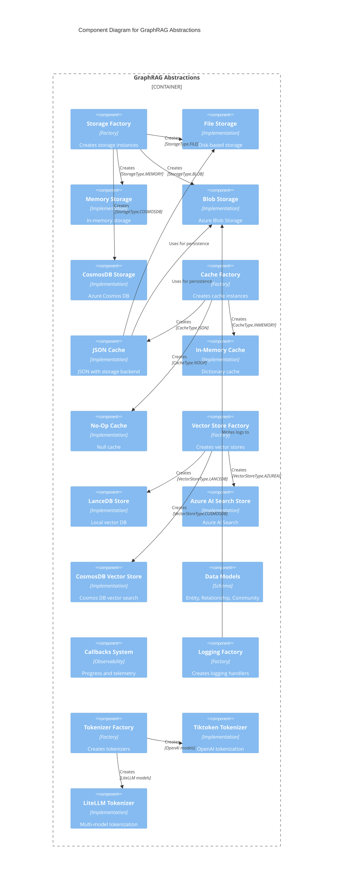
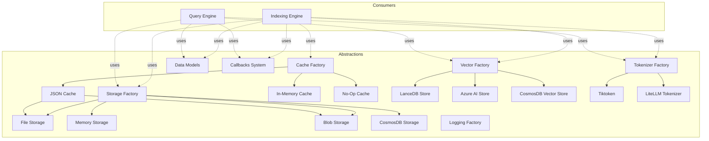

# C4 Component Level: GraphRAG Abstractions

## Overview
- **Name**: GraphRAG Abstractions
- **Description**: Cross-cutting infrastructure providing storage, caching, vector stores, data models, callbacks, logging, and tokenization.
- **Type**: Infrastructure/Utility Components
- **Technology**: Python (Abstract Base Classes/Factories)

## Purpose

The GraphRAG Abstractions component provides the foundational infrastructure that supports both the Indexing Engine and Query Engine. It abstracts away implementation details for persistent storage, caching, vector databases, data structures, and observability, allowing the core indexing and query logic to be independent of specific technology choices.

This component follows the **Strategy Pattern** and **Factory Pattern** extensively, enabling pluggable implementations for storage backends, cache types, vector stores, tokenizers, and logging handlers.

## Software Features

### Storage Abstraction
- **Multiple Backends**: File system, in-memory, Azure Blob Storage, Cosmos DB
- **Unified Interface**: `PipelineStorage` protocol with standard CRUD operations
- **Namespacing**: Support for hierarchical storage organization via `child()` method
- **Async Operations**: All storage operations are asynchronous for scalability

### Cache Abstraction
- **Multiple Backends**: JSON-based (with storage), in-memory, no-op
- **LLM Result Caching**: Caches expensive LLM calls during indexing
- **Storage Integration**: `JsonPipelineCache` uses `PipelineStorage` for persistence
- **Corruption Handling**: Automatically deletes corrupt cache entries

### Vector Store Abstraction
- **Multiple Providers**: LanceDB, Azure AI Search, Cosmos DB
- **Unified Interface**: `BaseVectorStore` protocol for vector operations
- **Schema Mapping**: Configurable field name mapping for database schemas
- **Similarity Search**: Support for vector-based and text-based similarity search
- **Multi-Store Support**: `MultiVectorStore` wrapper for querying across multiple stores

### Data Model Schemas
- **Knowledge Graph Elements**: Entity, Relationship, Community, CommunityReport
- **Document Elements**: Document, TextUnit, Covariate
- **Base Classes**: Identified (has ID), Named (has title) for shared functionality
- **Serialization**: Dict-based serialization/deserialization support
- **Type Safety**: Extensive use of dataclasses and type hints

### Callback System
- **Workflow Callbacks**: Monitor indexing pipeline progress (pipeline start/end, workflow start/end, progress)
- **Query Callbacks**: Monitor query execution (context, map-reduce stages)
- **LLM Callbacks**: Monitor token generation during LLM calls
- **Multi-Observer Support**: `WorkflowCallbacksManager` aggregates multiple callbacks

### Logging Infrastructure
- **Multiple Handlers**: File, Blob Storage, Console
- **Structured Logging**: JSON-formatted logs for analysis
- **Progress Tracking**: `Progress` dataclass and `ProgressTicker` for task progress
- **Factory Pattern**: `LoggerFactory` for pluggable handler creation

### Tokenization
- **Multiple Implementations**: Tiktoken (OpenAI), LiteLLM (multi-model)
- **Unified Interface**: `Tokenizer` protocol with encode/decode/count operations
- **Factory Function**: `get_tokenizer` for appropriate tokenizer selection
- **Model-Aware**: Automatically selects tokenizer based on model configuration

## Code Elements

This component contains the following code-level elements:

### Storage and Cache
- [c4-code-graphrag-storage-and-cache.md](./c4-code-graphrag-storage-and-cache.md)
  - `PipelineStorage`: Abstract base class for storage operations
  - `FilePipelineStorage`: Disk-based storage with async I/O
  - `MemoryPipelineStorage`: In-memory dictionary storage
  - `BlobPipelineStorage`: Azure Blob Storage implementation
  - `CosmosDBPipelineStorage`: Azure Cosmos DB implementation
  - `StorageFactory`: Factory for creating storage instances
  - `PipelineCache`: Abstract base class for cache operations
  - `JsonPipelineCache`: JSON serialization with storage backend
  - `InMemoryCache`: Simple dictionary cache
  - `NoopPipelineCache`: Null cache implementation
  - `CacheFactory`: Factory for creating cache instances

### Data Models and Vector Stores
- [c4-code-graphrag-vector_stores-and-data_model.md](./c4-code-graphrag-vector_stores-and-data_model.md)
  - `Identified`: Base class for items with unique IDs
  - `Named`: Base class for items with titles
  - `Entity`: Knowledge graph entity representation
  - `Relationship`: Knowledge graph relationship representation
  - `Community`: Graph community representation
  - `CommunityReport`: LLM-generated community summary
  - `Document`: Source document representation
  - `TextUnit`: Text chunk representation
  - `Covariate`: Metadata/claim representation
  - `BaseVectorStore`: Abstract base class for vector operations
  - `LanceDBVectorStore`: LanceDB implementation
  - `VectorStoreFactory`: Factory for creating vector stores

### Callbacks and Logging
- [c4-code-callbacks-and-logging.md](./c4-code-callbacks-and-logging.md)
  - `WorkflowCallbacks`: Protocol for indexing pipeline monitoring
  - `BaseLLMCallback`: Protocol for LLM event monitoring
  - `QueryCallbacks`: Protocol for query execution monitoring
  - `WorkflowCallbacksManager`: Aggregator for multiple callbacks
  - `ConsoleWorkflowCallbacks`: Console-based progress reporting
  - `NoopWorkflowCallbacks`: Null callback implementation
  - `NoopQueryCallbacks`: Null query callback implementation
  - `BlobWorkflowLogger`: Azure Blob Storage logging handler
  - `LoggerFactory`: Factory for creating logging handlers
  - `Progress`: Task progress dataclass
  - `ProgressTicker`: Helper for incremental progress updates

### Tokenization and Utilities
- [c4-code-misc-utils.md](./c4-code-misc-utils.md)
  - `Tokenizer`: Abstract base class for tokenization
  - `TiktokenTokenizer`: OpenAI tiktoken implementation
  - `LitellmTokenizer`: LiteLLM multi-model implementation
  - `get_tokenizer`: Factory function for tokenizer selection
  - `MultiVectorStore`: Wrapper for querying multiple vector stores
  - `get_embedding_store`: Factory for creating embedding stores
  - Storage helper functions for Parquet file operations
  - CLI helper functions for configuration redaction

## Interfaces

### Storage Interface

**Protocol**: `PipelineStorage`

**Methods**:
- `find(file_pattern, base_dir, file_filter, max_count) -> List[str]`
- `get(key, as_bytes, encoding) -> Any`
- `set(key, value, encoding) -> None`
- `has(key) -> bool`
- `delete(key) -> None`
- `clear() -> None`
- `child(name) -> PipelineStorage`
- `keys() -> List[str]`
- `get_creation_date(key) -> datetime`

### Cache Interface

**Protocol**: `PipelineCache`

**Methods**:
- `get(key) -> Any`
- `set(key, value, debug_data) -> None`
- `has(key) -> bool`
- `delete(key) -> None`
- `clear() -> None`
- `child(name) -> PipelineCache`

### Vector Store Interface

**Protocol**: `BaseVectorStore`

**Methods**:
- `connect() -> None`
- `load_documents(nodes: List[VectorStoreDocument]) -> None`
- `similarity_search_by_vector(query_embedding: List[float], k: int = 10) -> List[VectorStoreSearchResult]`
- `similarity_search_by_text(query_text: str, k: int = 10) -> List[VectorStoreSearchResult]`
- `filter_by_id(id: str) -> VectorStoreDocument | None`
- `search_by_id(id: str) -> VectorStoreDocument | None`

### Data Model Interfaces

**Base Classes**:
- `Identified`: Base with `id: str`, `short_id: str | None`
- `Named(Identified)`: Extends with `title: str`

**Derived Classes**:
- `Entity(Named)`: Extends with `type`, `description`, `community_ids`, `rank`, `attributes`
- `Relationship(Identified)`: Extends with `source`, `target`, `weight`, `description`, `rank`, `attributes`
- `Community(Named)`: Extends with `level`, `parent`, `children`, `entity_ids`, `size`
- `CommunityReport(Named)`: Extends with `community_id`, `summary`, `full_content`, `rank`, `size`
- `Document(Named)`: Extends with `type`, `text`, `text_unit_ids`
- `TextUnit(Identified)`: Extends with `text`, `n_tokens`, `entity_ids`, `relationship_ids`
- `Covariate(Identified)`: Extends with `subject_id`, `subject_type`, `covariate_type`, `attributes`

### Callback Interfaces

**Protocols**:
- `WorkflowCallbacks`:
  - `pipeline_start(names: List[str]) -> None`
  - `pipeline_end(results: List[PipelineRunResult]) -> None`
  - `workflow_start(name: str, instance: object) -> None`
  - `workflow_end(name: str, instance: object) -> None`
  - `progress(progress: Progress) -> None`

- `QueryCallbacks(BaseLLMCallback)`:
  - `on_context(context: Any) -> None`
  - `on_map_response_start(map_response_contexts: List[str]) -> None`
  - `on_map_response_end(map_response_outputs: List[SearchResult]) -> None`
  - `on_reduce_response_start(reduce_response_context: str | dict[str, Any]) -> None`
  - `on_reduce_response_end(reduce_response_output: str) -> None`

- `BaseLLMCallback`:
  - `on_llm_new_token(token: str) -> None`

### Tokenizer Interface

**Protocol**: `Tokenizer`

**Methods**:
- `encode(text: str) -> List[int]`
- `decode(tokens: List[int]) -> str`
- `num_tokens(text: str) -> int`

## Dependencies

### Internal Dependencies
- Uses `graphrag.config.enums` for storage, cache, and vector store type definitions
- Uses `graphrag.config.models` for configuration schemas

### External Dependencies
- `aiofiles`: Asynchronous file I/O
- `azure-storage-blob`: Azure Blob Storage SDK
- `azure-cosmos`: Azure Cosmos DB SDK
- `azure-identity`: Azure authentication (DefaultAzureCredential)
- `lancedb`: Local vector database
- `tiktoken`: OpenAI tokenization library
- `litellm`: Multi-model LLM library
- `pandas`: DataFrame manipulation
- `pyarrow`: Efficient data handling
- `dataclasses`: Data structure definitions
- `logging`: Python logging framework

## Component Diagram

## Component Relationships

## Sub-Component Details

### Storage Sub-Component

**Purpose**: Abstract persistent storage across multiple backends

**Implementations**:
- `FilePipelineStorage`: Uses `aiofiles` for async disk operations
- `MemoryPipelineStorage`: Uses Python dictionary (inherits from File for interface consistency)
- `BlobPipelineStorage`: Uses Azure Blob Storage SDK
- `CosmosDBPipelineStorage`: Uses Azure Cosmos DB SDK, destructures Parquet files into individual items

**Key Features**:
- All operations are asynchronous
- Support for hierarchical organization via `child()` method
- Unified interface for all backends

### Cache Sub-Component

**Purpose**: Cache LLM results and intermediate data

**Implementations**:
- `JsonPipelineCache`: Serializes as JSON, wraps a `PipelineStorage` for persistence
- `InMemoryCache`: Simple dictionary cache
- `NoopPipelineCache`: Null cache for testing/bypassing

**Key Features**:
- Stores LLM responses under `"result"` key
- Preserves `debug_data` metadata
- Handles corrupt cache entries by deleting them

### Vector Store Sub-Component

**Purpose**: Abstract vector database operations

**Implementations**:
- `LanceDBVectorStore`: Local, file-based vector database
- `AzureAISearchVectorStore`: Azure AI Search (managed vector DB)
- `CosmosDBVectorStore`: Azure Cosmos DB with vector search

**Key Features**:
- Configurable schema mapping for field names
- Support for similarity search by vector or text
- Multi-store querying via `MultiVectorStore` wrapper

### Data Model Sub-Component

**Purpose**: Define schemas for knowledge graph elements

**Models**:
- Knowledge graph: Entity, Relationship, Community, CommunityReport
- Document elements: Document, TextUnit, Covariate

**Key Features**:
- Base classes for shared functionality (Identified, Named)
- Extensive use of dataclasses for clean serialization
- Type hints for type safety

### Callbacks Sub-Component

**Purpose**: Provide observability and telemetry

**Protocols**:
- `WorkflowCallbacks`: Indexing pipeline monitoring
- `QueryCallbacks`: Query execution monitoring
- `BaseLLMCallback`: LLM token generation monitoring

**Implementations**:
- `WorkflowCallbacksManager`: Aggregates multiple callbacks
- `ConsoleWorkflowCallbacks`: Console-based progress
- `NoopWorkflowCallbacks`: Null implementation
- `NoopQueryCallbacks`: Null implementation

**Key Features**:
- Support for multiple simultaneous observers
- Decoupled from actual logging implementation

### Logging Sub-Component

**Purpose**: Structured logging infrastructure

**Handlers**:
- File handler: Logs to local files
- Blob handler: Logs to Azure Blob Storage as JSON
- Console handler: Logs to console

**Key Features**:
- `LoggerFactory` for pluggable handler creation
- `Progress` dataclass for task tracking
- `ProgressTicker` for incremental progress updates

### Tokenizer Sub-Component

**Purpose**: Token counting and text chunking

**Implementations**:
- `TiktokenTokenizer`: Uses OpenAI's tiktoken library
- `LitellmTokenizer`: Uses LiteLLM for multi-model support

**Key Features**:
- Factory function for automatic tokenizer selection
- Model-aware selection based on configuration

## Deployment Considerations

### Storage Selection
- **Development**: Use `MemoryPipelineStorage` for fast iteration
- **Production**: Use `BlobPipelineStorage` or `CosmosDBPipelineStorage` for cloud scalability
- **On-Premise**: Use `FilePipelineStorage` for local deployment

### Cache Configuration
- **Development**: Use `InMemoryCache` for simplicity
- **Production**: Use `JsonPipelineCache` with persistent storage for LLM result caching
- **Testing**: Use `NoopPipelineCache` to disable caching

### Vector Store Selection
- **Local Development**: Use `LanceDBVectorStore` (file-based, no external dependencies)
- **Production**: Use `AzureAISearchVectorStore` or `CosmosDBVectorStore` for managed services
- **Multi-Source**: Use `MultiVectorStore` to query across multiple vector stores

### Tokenizer Configuration
- **OpenAI Models**: Use `TiktokenTokenizer` for accuracy
- **Multi-Model**: Use `LitellmTokenizer` for broader model support
- **Factory Function**: Let `get_tokenizer` select appropriate tokenizer based on model config

### Callback Usage
- **UI Progress**: Use `WorkflowCallbacksManager` to aggregate callbacks for console and UI
- **Debugging**: Use `QueryCallbacks` to inspect intermediate LLM outputs
- **Telemetry**: Extend callbacks to send events to monitoring systems

### Logging Configuration
- **Local Development**: Use file handler for local log files
- **Cloud Production**: Use blob handler for centralized logging
- **Debugging**: Use verbose logging for troubleshooting
