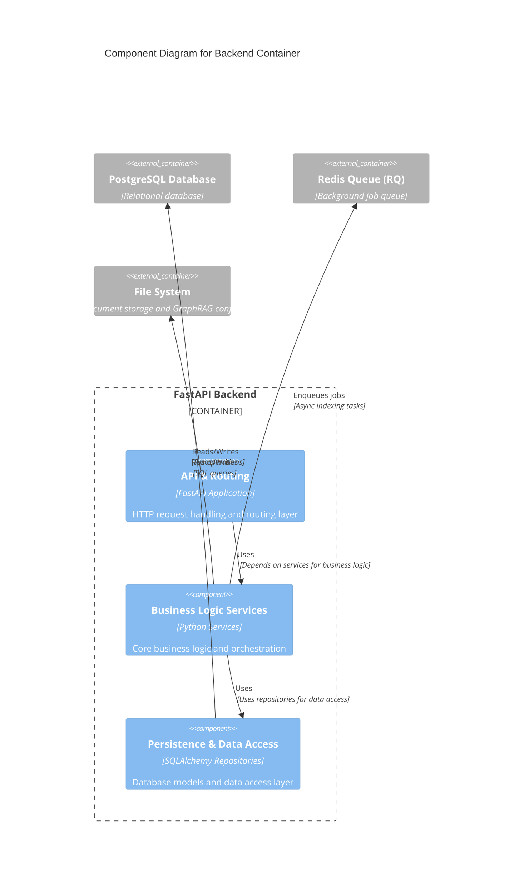
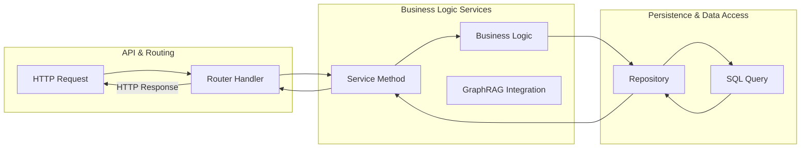

# C4 Component Level: Backend System

## Overview

The backend system is a FastAPI-based REST API that provides a web interface for GraphRAG with ToG (Think-on-Graph) capabilities. It manages document collections, handles file uploads, orchestrates the GraphRAG indexing pipeline, and provides multiple search methods for querying the knowledge graph.

## System Components

### Component 1: API & Routing Component

#### Overview
- **Name**: API & Routing Layer
- **Description**: FastAPI application entry point and HTTP request routing layer
- **Type**: Application Component (API Layer)
- **Technology**: Python, FastAPI, Uvicorn

#### Purpose
The API & Routing Component serves as the public interface to the backend system. It handles incoming HTTP requests, routes them to appropriate handlers, manages application lifecycle (startup/shutdown), and provides health monitoring. This component implements dependency injection to ensure clean separation between routing logic and business logic.

#### Software Features
- **Application Lifecycle Management**: Handles startup (database migrations) and shutdown (resource cleanup)
- **Health Monitoring**: Provides health check endpoint for monitoring and load balancer integration
- **Request Routing**: Routes HTTP requests to appropriate service methods based on URL patterns
- **Dependency Injection**: Manages database sessions and service instantiation using FastAPI's dependency system
- **Input Validation**: Validates incoming requests using Pydantic models
- **Error Handling**: Provides standardized error responses for common failure scenarios

#### Code Elements
This component contains the following code-level elements:
- [c4-code-backend-app-main-and-routers.md](./c4-code-backend-app-main-and-routers.md) - Main application entry point and router modules
  - `backend/app/main.py` - FastAPI application setup, lifespan management, health check endpoint
  - `backend/app/routers/collections.py` - Collection management endpoints
  - `backend/app/routers/documents.py` - Document upload and management endpoints
  - `backend/app/routers/indexing.py` - Indexing status and control endpoints
  - `backend/app/routers/search.py` - Search/query endpoints for all GraphRAG methods
- [c4-code-backend-app-api.md](./c4-code-backend-app-api.md) - Dependency injection providers
  - `backend/app/api/deps.py` - Database session and service dependency factories

#### Interfaces

##### REST API Endpoints
- **Protocol**: HTTP/1.1, JSON
- **Base Path**: `/api`

**Collections API**:
- `POST /api/collections` - Create a new document collection
- `GET /api/collections` - List all collections
- `GET /api/collections/{collection_id}` - Get collection details (by UUID or name)
- `DELETE /api/collections/{collection_id}` - Delete a collection

**Documents API**:
- `POST /api/collections/{collection_id}/documents` - Upload a document (text/markdown, max 25MB)
- `GET /api/collections/{collection_id}/documents` - List documents in collection
- `DELETE /api/collections/{collection_id}/documents/{document_name}` - Delete a document

**Indexing API**:
- `POST /api/collections/{collection_id}/index` - Start GraphRAG indexing pipeline
- `GET /api/collections/{collection_id}/index` - Get indexing status

**Search API**:
- `GET /api/collections/{collection_id}/search` - Generic search with method parameter
- `POST /api/collections/{collection_id}/search/global` - Global search (map-reduce over communities)
- `POST /api/collections/{collection_id}/search/local` - Local search (entity-centric)
- `POST /api/collections/{collection_id}/search/tog` - ToG search (deep reasoning)
- `POST /api/collections/{collection_id}/search/drift` - DRIFT search (multi-hop reasoning)

**Health API**:
- `GET /health` - Health check endpoint
- `GET /` - Root endpoint with API metadata

##### Dependency Injection Interface
- `get_db_session()` - Provides async SQLAlchemy database session
- `get_collection_service()` - Provides CollectionServiceDB instance
- `get_document_service()` - Provides DocumentServiceDB instance
- `get_indexing_service()` - Provides IndexingServiceDB instance
- `get_query_service()` - Provides QueryServiceDB instance

#### Dependencies

##### Components Used
- **Business Logic Services Component**: All routing endpoints delegate to services for business logic
- **Persistence & Data Access Component**: Uses database sessions for persistence operations

##### External Systems
- **PostgreSQL Database**: Persistent storage for collections, documents, and GraphRAG outputs
- **Redis Queue (RQ)**: Background task queue for async indexing jobs
- **File System**: Stores document files and GraphRAG prompt templates

---

### Component 2: Business Logic Services Component

#### Overview
- **Name**: Business Logic Services
- **Description**: Contains business logic for collections, documents, indexing, and query operations
- **Type**: Application Component (Service Layer)
- **Technology**: Python, AsyncIO

#### Purpose
The Business Logic Services Component implements the core business logic of the application. It coordinates operations between the API layer and data access layer, enforces business rules, handles complex workflows (like the GraphRAG indexing pipeline), and provides high-level abstractions for domain operations. This component is responsible for orchestrating the GraphRAG library operations and managing background tasks.

#### Software Features
- **Collection Management**: Create, retrieve, list, and delete collections with validation
- **Document Management**: Upload, list, and delete documents with content type validation
- **Indexing Orchestration**: Trigger and monitor GraphRAG indexing pipeline execution
- **Query Execution**: Execute various GraphRAG search methods (global, local, ToG, DRIFT)
- **Background Task Management**: Enqueue and track async indexing jobs
- **GraphRAG Integration**: Bridge between GraphRAG library and database storage
- **Collection ID Resolution**: Support both UUID and name-based collection identification
- **Data Aggregation**: Combine data from multiple repository sources for query operations

#### Code Elements
This component contains the following code-level elements:

**Service Implementations**:
- `backend/app/services/collection_service_db.py` - Collection management business logic
- `backend/app/services/document_service_db.py` - Document management business logic
- `backend/app/services/indexing_service_db.py` - Indexing orchestration logic
- `backend/app/services/query_service_db.py` - Query/search execution logic
- `backend/app/services/storage_service.py` - File system storage management
- `backend/app/services/graphrag_db_adapter.py` - GraphRAG output ingestion adapter

**Worker & Background Tasks**:
- `backend/app/worker/queue.py` - RQ job queue management
- `backend/app/worker/tasks.py` - Background indexing task implementation

#### Interfaces

##### CollectionServiceDB Interface
- `create_collection(name, description) -> CollectionResponse` - Create a new collection
- `get_collection(collection_id) -> Optional[CollectionResponse]` - Get collection by UUID
- `get_collection_by_name(name) -> Optional[CollectionResponse]` - Get collection by name
- `list_collections() -> List[CollectionResponse]` - List all collections
- `delete_collection(collection_id) -> None` - Delete a collection

##### DocumentServiceDB Interface
- `upload_document(collection_id, file) -> DocumentResponse` - Upload a document
- `list_documents(collection_id) -> List[DocumentResponse]` - List documents in collection
- `delete_document(collection_id, document_name) -> None` - Delete a document

##### IndexingServiceDB Interface
- `start_indexing(collection_id) -> IndexStatusResponse` - Trigger indexing pipeline
- `get_index_status(collection_id) -> Optional[IndexStatusResponse]` - Get indexing status

##### QueryServiceDB Interface
- `global_search(collection_id, query, **kwargs) -> SearchResponse` - Execute global search
- `local_search(collection_id, query, **kwargs) -> SearchResponse` - Execute local search
- `tog_search(collection_id, query, **kwargs) -> SearchResponse` - Execute ToG search
- `drift_search(collection_id, query, **kwargs) -> SearchResponse` - Execute DRIFT search

##### StorageService Interface
- `create_collection(collection_id, description) -> CollectionResponse` - Create collection directory structure
- `delete_collection(collection_id) -> bool` - Delete collection directory
- `list_collections() -> List[CollectionResponse]` - List all collections from filesystem
- `upload_document(collection_id, file) -> DocumentResponse` - Save uploaded file
- `get_collection_path(collection_id) -> Dict[str, Path]` - Get collection directory paths

#### Dependencies

##### Components Used
- **Persistence & Data Access Component**: Uses repositories for all data operations

##### External Systems
- **GraphRAG Library**: Core indexing and query algorithms
- **RQ (Redis Queue)**: Background job execution
- **File System**: Stores documents and GraphRAG configuration files

---

### Component 3: Persistence & Data Access Component

#### Overview
- **Name**: Persistence & Data Access
- **Description**: Database models, repositories, and data access layer for the backend
- **Type**: Application Component (Data Layer)
- **Technology**: Python, SQLAlchemy (Async), PostgreSQL

#### Purpose
The Persistence & Data Access Component handles all data persistence operations for the backend system. It provides a clean abstraction over the PostgreSQL database using the repository pattern, manages database connections and sessions, defines the database schema, and handles bulk data insertion for GraphRAG outputs. This component isolates database-specific details from the rest of the application.

#### Software Features
- **ORM Model Definitions**: SQLAlchemy models for all database tables
- **Repository Pattern**: Generic and domain-specific repositories for data access
- **Asynchronous Operations**: All database operations are async for better performance
- **Bulk Data Insertion**: Optimized batch insertion for GraphRAG indexed data
- **Data Aggregation**: Complex queries that join multiple tables for query-time operations
- **Database Migrations**: Support for Alembic-based schema migrations
- **Session Management**: Proper lifecycle management of database sessions
- **Foreign Key Relationships**: Cascade deletes and proper referential integrity

#### Code Elements
This component contains the following code-level elements:
- [c4-code-backend-app-repositories.md](./c4-code-backend-app-repositories.md) - Repository layer implementations

**Database Models**:
- `backend/app/db/models/base.py` - Base model with common fields (id, collection_id, index_run_id)
- `backend/app/db/models/operational.py` - Operational models (Collection, IndexRun)
- `backend/app/db/models/graphrag.py` - GraphRAG output models (Entity, Relationship, Community, etc.)
- `backend/app/db/models/embeddings.py` - Embedding vector models
- `backend/app/db/models/associations.py` - Association tables for many-to-many relationships
- `backend/app/models/schemas.py` - Pydantic request/response models
- `backend/app/models/enums.py` - Enum definitions (IndexStatus, SearchMethod)

**Repositories**:
- `backend/app/repositories/base.py` - Generic base repository with CRUD operations
- `backend/app/repositories/collection.py` - Collection-specific queries
- `backend/app/repositories/document.py` - Document-specific queries
- `backend/app/repositories/index_run.py` - Index run tracking queries
- `backend/app/repositories/query.py` - Complex aggregation queries for search
- `backend/app/repositories/entities.py` - Entity bulk operations
- `backend/app/repositories/relationships.py` - Relationship bulk operations
- `backend/app/repositories/communities.py` - Community bulk operations
- `backend/app/repositories/community_reports.py` - Community report bulk operations
- `backend/app/repositories/text_units.py` - Text unit bulk operations
- `backend/app/repositories/covariates.py` - Covariate bulk operations
- `backend/app/repositories/embeddings.py` - Embedding bulk operations

**Database Configuration**:
- `backend/app/db/engine.py` - Database engine configuration
- `backend/app/db/session.py` - Async session factory and context manager

#### Interfaces

##### BaseRepository Interface
- `get_by_id(id) -> Optional[ModelType]` - Retrieve record by primary key
- `get_all(limit, offset) -> List[ModelType]` - Retrieve paginated records
- `create(obj) -> ModelType` - Create new record
- `update(obj) -> ModelType` - Update existing record
- `delete(obj) -> bool` - Delete record
- `bulk_insert(list_of_dicts)` - Bulk insert records (used by GraphRAG repositories)

##### Domain Repository Interfaces

**CollectionRepository**:
- `get_by_name(name) -> Optional[Collection]` - Find collection by name
- `get_with_document_count(collection_id) -> Optional[tuple]` - Get collection with document count
- `get_latest_completed_run(collection_id) -> Optional[IndexRun]` - Get most recent completed index run
- `is_indexed(collection_id) -> bool` - Check if collection has any completed indexing

**DocumentRepository**:
- `get_by_collection(collection_id) -> list[Document]` - List all documents in collection
- `get_by_name(collection_id, name) -> Optional[Document]` - Find document by filename
- `delete_by_name(collection_id, name) -> bool` - Delete document by filename

**IndexRunRepository**:
- `get_latest_for_collection(collection_id) -> Optional[IndexRun]` - Get most recent run
- `create_run(collection_id) -> IndexRun` - Create new QUEUED index run

**QueryRepository** (specialized read-only repository):
- `get_latest_run_id(collection_id) -> UUID | None` - Get latest completed run ID
- `get_latest_run_data(collection_id) -> dict[str, Any] | None` - Aggregate all graph data for search

#### Database Schema

**Operational Tables**:
- `collections` - Document collections metadata
- `index_runs` - Indexing job tracking (status, timestamps, errors)

**GraphRAG Tables** (per-index-run):
- `documents` - Imported document content and metadata
- `entities` - Extracted entities with graph properties
- `relationships` - Entity-to-entity relationships
- `communities` - Leiden algorithm community clusters
- `community_reports` - Summarized community reports
- `text_units` - Text chunks from input documents
- `covariates` - Extracted claims/events (optional)
- `embeddings` - Vector embeddings for semantic search

#### Dependencies

##### Components Used
- None (this is the lowest-level component in the backend)

##### External Systems
- **PostgreSQL Database**: Primary data store
- **Alembic**: Database migration tool

---

## Component Relationships

### Component Diagram

### Interaction Patterns

1. **Request Flow (API -> Services -> Persistence)**:
   - HTTP request arrives at API router
   - Router calls service method via dependency injection
   - Service method performs business logic and validation
   - Service calls repository for data persistence
   - Repository executes SQL queries via SQLAlchemy
   - Response flows back through the layers

2. **Asynchronous Indexing Flow**:
   - API endpoint triggers `start_indexing()` in IndexingService
   - Service creates IndexRun record and enqueues background job
   - RQ worker picks up job and executes `run_indexing_task()`
   - Worker calls GraphRAG library to build knowledge graph
   - Worker calls `GraphRAGDbAdapter.ingest_outputs()` to bulk insert data
   - Worker updates IndexRun status to COMPLETED or FAILED

3. **Query Flow**:
   - API endpoint receives search request with method parameter
   - Router calls appropriate service method (global_search, local_search, etc.)
   - Service calls QueryRepository to aggregate graph data from latest run
   - Repository joins multiple tables to build query context
   - Service returns SearchResponse with results

### Data Flow Between Components

## Technology Stack

| Component | Primary Technologies | Key Libraries |
|-----------|---------------------|---------------|
| API & Routing | Python, FastAPI | fastapi, uvicorn, pydantic |
| Business Logic Services | Python, AsyncIO | graphrag, rq, aiofiles |
| Persistence & Data Access | Python, SQLAlchemy | sqlalchemy-async, alembic |

## Deployment Considerations

### Component Deployment
All three components are deployed together within a single backend container/process. They are not independently deployable - they form a cohesive backend application.

### Configuration
- Database connection string configured via environment variables
- RQ connection configured via Redis URL
- File system paths configured via application settings

### Scalability
- API & Routing: Scale horizontally behind load balancer (stateless)
- Services: No shared state required
- Persistence: Single PostgreSQL instance (can be scaled with read replicas for query-heavy workloads)

### Monitoring
- Health check endpoint for API component health
- Index run status tracking for indexing pipeline monitoring
- Database query performance monitoring for persistence layer
