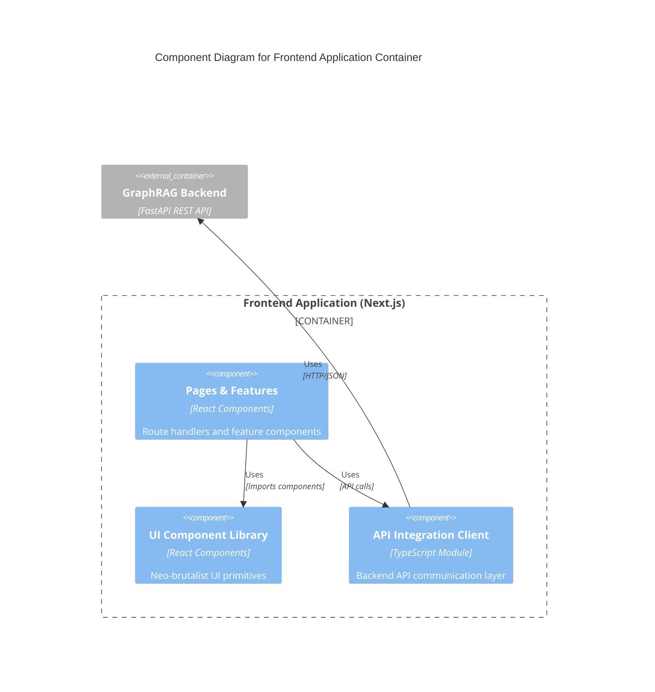
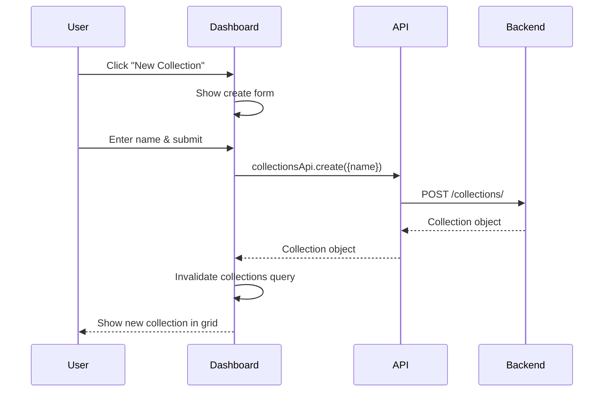
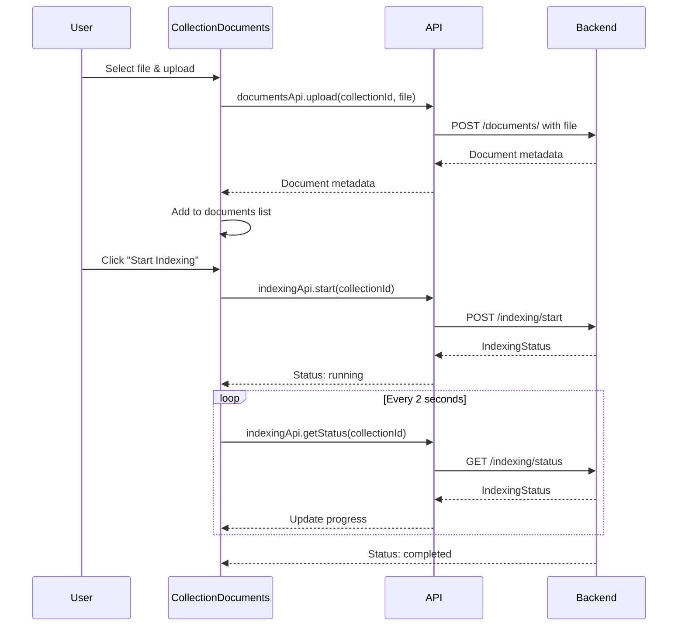
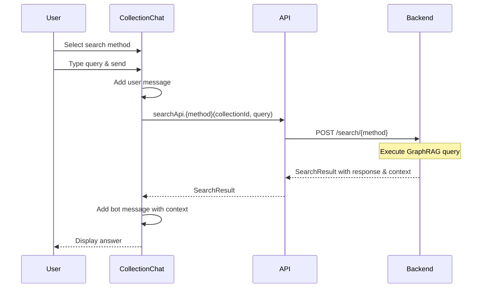
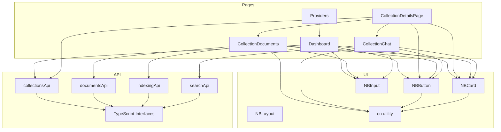

# C4 Component Level: Frontend Application

## Overview
- **Name**: Frontend Application Container
- **Description**: A Next.js-based web application providing a neo-brutalist user interface for managing GraphRAG document collections and performing knowledge graph queries with multiple search strategies.
- **Type**: Application Container
- **Technology**: Next.js 14 (App Router), React 18, TypeScript, TanStack Query, Tailwind CSS

## Purpose
The Frontend Application provides a user-friendly interface for:
1. Managing document collections (create, view, delete)
2. Uploading and organizing documents within collections
3. Monitoring indexing status for knowledge graph construction
4. Performing queries using five different GraphRAG search methods (Global, Local, DRIFT, Basic, ToG)
5. Visualizing search results with context and chat-style interaction

## Software Features

### Collection Management
- **Dashboard View**: Grid-based display of all collections with metadata
- **Create Collection**: Form to create new document collections
- **Delete Collection**: Confirmation-based deletion with validation
- **Collection Metadata**: Display of document count, indexing status, descriptions

### Document Management
- **File Upload**: Drag-and-drop or click-to-upload for documents
- **Document List**: Display of uploaded documents with size and upload date
- **Delete Document**: Individual document removal from collections
- **File Type Support**: Text and document file handling

### Indexing Operations
- **Start Indexing**: Trigger knowledge graph construction
- **Status Monitoring**: Real-time polling of indexing progress
- **Progress Visualization**: Progress bar and status indicators
- **Status States**: Pending, Running, Completed, Failed

### Query Interface
- **Chat-style Interface**: Conversation view with user/bot message bubbles
- **Method Selection**: Four search strategies (Global, Local, ToG, DRIFT)
- **Method Descriptions**: Contextual tips for each search method
- **Real-time Feedback**: Loading indicators and error handling
- **Context Display**: Shows which search method was used for responses

## Component Diagram

## Component Details

### Pages & Features Component

**Purpose**: Implements route handlers and feature-level components for the application.

**Contains**:
- [c4-code-frontend-app-collections-id.md](./c4-code-frontend-app-collections-id.md) - Collection Details Page

**Sub-components**:
- `Dashboard` (`app/page.tsx`): Main landing page with collection grid
- `CollectionDetailsPage` (`app/collections/[id]/page.tsx`): Dynamic route for collection details
- `CollectionDocuments` (`components/collection-documents.tsx`): Document management and indexing status
- `CollectionChat` (`components/collection-chat.tsx`): Chat interface for GraphRAG queries
- `Providers` (`components/providers.tsx`): React Query provider setup

**State Management**:
- React Query (TanStack Query) for server state caching and synchronization
- React useState for local component state (forms, tabs, messages)
- Query invalidation for keeping data fresh after mutations

### UI Component Library

**Purpose**: Provides reusable neo-brutalist UI primitives with consistent styling.

**Design System**:
- Neo-brutalist aesthetic with thick borders (border-3, border-2)
- Hard shadows (shadow-hard, shadow-hard-sm)
- Press animation on buttons (active state translation)
- Color scheme: main (primary), secondary, destructive colors

**Components**:
- `NBButton`: Button with variants (primary, secondary, destructive, outline, ghost) and sizes (sm, md, lg)
- `NBCard`: Container component with optional shadow support
- `NBInput`: Text input with neo-brutalist styling
- `NBLayout`: Layout wrapper for consistent page structure

**Utilities**:
- `cn(...inputs)`: Utility for merging Tailwind CSS classes using clsx and tailwind-merge

**Code References**:
- `frontend/components/ui/NBButton.tsx`
- `frontend/components/ui/NBCard.tsx`
- `frontend/components/ui/NBInput.tsx`
- `frontend/components/ui/NBLayout.tsx`
- `frontend/lib/utils.ts`

### API Integration Client

**Purpose**: Provides a structured, typed interface for communicating with the GraphRAG backend.

**Base Configuration**:
- Axios instance with base URL: `http://127.0.0.1:8000/api`
- Default headers for JSON content type
- Error handling integration with React Query

**API Groups**:

**collectionsApi**:
- `list()`: Fetch all collections
- `create(data)`: Create new collection
- `get(id)`: Fetch specific collection details
- `delete(id)`: Delete a collection

**documentsApi**:
- `list(collectionId)`: List documents in collection
- `upload(collectionId, file)`: Upload file to collection
- `delete(collectionId, documentName)`: Delete document

**indexingApi**:
- `start(collectionId)`: Start indexing process
- `getStatus(collectionId)`: Poll indexing status

**searchApi**:
- `global(collectionId, query)`: Global search (map-reduce over communities)
- `local(collectionId, query)`: Local search (entity-centric)
- `tog(collectionId, query)`: Think-on-Graph search (deep reasoning)
- `drift(collectionId, query)`: DRIFT search (multi-hop reasoning)

**TypeScript Interfaces**:
- `Collection`: Collection metadata
- `Document`: Document metadata
- `IndexingStatus`: Indexing process status
- `SearchResult`: Search response with context

**Code References**:
- [c4-code-frontend-lib.md](./c4-code-frontend-lib.md)
- `frontend/lib/api.ts`

## Interfaces

### Pages to API Client Interface
- **Protocol**: TypeScript module imports
- **Operations**:
  - `collectionsApi.list()`: Fetch collections for dashboard
  - `collectionsApi.get(id)`: Fetch collection for details page
  - `documentsApi.list(collectionId)`: Fetch documents list
  - `documentsApi.upload(collectionId, file)`: Upload document
  - `documentsApi.delete(collectionId, name)`: Delete document
  - `indexingApi.start(collectionId)`: Trigger indexing
  - `indexingApi.getStatus(collectionId)`: Poll status
  - `searchApi.{method}(collectionId, query)`: Perform search

### API Client to Backend Interface
- **Protocol**: REST over HTTP/HTTPS
- **Format**: JSON request/response
- **Base URL**: `http://127.0.0.1:8000/api`
- **Endpoints**:
  - `GET /collections/` - List collections
  - `POST /collections/` - Create collection
  - `GET /collections/{id}/` - Get collection
  - `DELETE /collections/{id}/` - Delete collection
  - `GET /collections/{id}/documents/` - List documents
  - `POST /collections/{id}/documents/` - Upload document
  - `DELETE /collections/{id}/documents/{name}` - Delete document
  - `POST /collections/{id}/indexing/start` - Start indexing
  - `GET /collections/{id}/indexing/status` - Get indexing status
  - `POST /search/{method}` - Execute search query

### Pages to UI Library Interface
- **Protocol**: React component props
- **Components**:
  - `NBButton`: Button interactions with variants and sizes
  - `NBCard`: Container with optional shadow
  - `NBInput`: Form input handling
- **Styling**: Tailwind CSS class composition via `cn()` utility

## Dependencies

### Internal Components
- **Pages & Features** depends on:
  - UI Component Library (for UI primitives)
  - API Integration Client (for backend communication)

### External Dependencies
- **Next.js 14**: App Router, routing, server components
- **React 18**: Component framework
- **TanStack Query (React Query)**: Server state management, caching, mutations
- **Axios**: HTTP client for API requests
- **Tailwind CSS**: Utility-first CSS framework
- **Lucide React**: Icon library
- **clsx**: Conditional class name utility
- **tailwind-merge**: Tailwind class deduplication

### External Systems
- **GraphRAG Backend**: FastAPI REST API providing:
  - Collection management
  - Document storage
  - Indexing orchestration
  - Query execution (Global, Local, ToG, DRIFT, Basic)

## Data Flow Diagrams

### Collection Creation Flow

### Document Upload & Indexing Flow

### Query Execution Flow

## Component Relationships

## Deployment Notes

### Development
- Runs on Next.js dev server (`npm run dev`)
- Default port: 3000
- Hot Module Replacement enabled
- API calls to `http://127.0.0.1:8000/api` (assumes local backend)

### Production
- Built to static assets with `npm run build`
- Served with `npm start` (Next.js production server)
- Environment variable support needed for API_BASE_URL configuration
- Static assets served from `public/` directory

### Environment Variables (Recommended)
- `NEXT_PUBLIC_API_BASE_URL`: Backend API endpoint URL
- Default fallback: `http://127.0.0.1:8000/api`

## Notes

### Design Philosophy
- Neo-brutalist UI with thick borders and hard shadows
- High contrast for accessibility
- Large touch targets for mobile friendliness
- Clear visual hierarchy

### State Management
- React Query for all server state with automatic caching
- Optimistic UI updates where appropriate
- Automatic refetching on window focus and reconnection
- Query invalidation after mutations for data consistency

### Search Method Context
- **Global**: Best for broad questions about the entire collection
- **Local**: Best for specific questions about entities and relationships
- **ToG (Think-on-Graph)**: Good for complex multi-hop reasoning with transparent chains
- **DRIFT**: Dynamic reasoning for hypothetical scenarios

### Performance Considerations
- Indexing status polling every 2 seconds during active indexing
- Lazy loading of component code via Next.js App Router
- Image optimization through Next.js Image component (when implemented)
- Efficient query caching to reduce backend calls

### Error Handling
- React Query error boundaries for failed requests
- User-friendly error messages displayed in UI
- Automatic retry for failed requests (configured defaults)
- Form validation before submission
