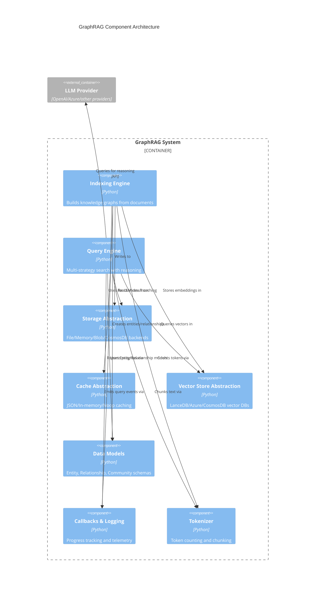

# C4 Component Level: GraphRAG System Overview

## System Components

This document provides an overview of the logical components that make up the GraphRAG system. Each component represents a cohesive set of functionality with clear responsibilities and interfaces.

### Component Index

| Component | Description | Documentation |
|-----------|-------------|---------------|
| **Indexing Engine** | Transforms raw documents into a structured knowledge graph through chunking, entity extraction, relationship building, community detection, and embedding generation. | [c4-component-indexing-engine.md](./c4-component-indexing-engine.md) |
| **Query Engine** | Multi-strategy search system supporting Global, Local, DRIFT, and ToG search methods with LLM-based reasoning. | [c4-component-query-engine.md](./c4-component-query-engine.md) |
| **GraphRAG Abstractions** | Cross-cutting infrastructure providing storage, caching, vector stores, data models, callbacks, logging, and tokenization. | [c4-component-abstractions.md](./c4-component-abstractions.md) |

## Component Relationships



## Component Details

### Indexing Engine

**Purpose**: The Indexing Engine transforms raw, unstructured text documents into a structured knowledge graph that can be efficiently queried. It orchestrates a multi-stage pipeline that processes documents, extracts entities and relationships, detects communities, generates summaries, and creates vector embeddings for semantic search.

**Key Responsibilities**:
- Document chunking and text unit creation
- Entity and relationship extraction using LLMs
- Community detection using hierarchical Leiden clustering
- Community report generation with graph context building
- Vector embedding generation for entities, relationships, and text units
- Finalization of graph data (degrees, layouts, unique IDs)

**Contained Code Elements**:
- [c4-code-graphrag-index-operations.md](./c4-code-graphrag-index-operations.md) - Core indexing operations
- [c4-code-graphrag-index-operations-summarize_communities-graph_context.md](./c4-code-graphrag-index-operations-summarize_communities-graph_context.md) - Graph context builders

**Interfaces**:
- **Input**: Raw documents (text/markdown files)
- **Output**: Parquet files containing entities, relationships, communities, community reports, text units, covariates, and embeddings
- **Configuration**: GraphRAG settings (chunking strategy, LLM models, embedding models, clustering parameters)

### Query Engine

**Purpose**: The Query Engine provides multiple search strategies for retrieving information from the knowledge graph, ranging from simple vector similarity to sophisticated graph traversal with chain-of-thought reasoning. It supports Global Search (map-reduce over community reports), Local Search (entity-centric with direct evidence), DRIFT Search (multi-hop reasoning), and ToG Search (deep graph exploration with beam search).

**Key Responsibilities**:
- Entity linking (semantic or keyword-based)
- Graph traversal and neighbor expansion
- Pruning strategies (LLM-guided, semantic similarity, BM25)
- Context building and token management
- Chain-of-thought reasoning over graph paths
- Answer generation with supporting evidence

**Contained Code Elements**:
- [c4-code-graphrag-query-structured_search-tog_search.md](./c4-code-graphrag-query-structured_search-tog_search.md) - ToG search implementation
- [c4-code-graphrag-query-llm.md](./c4-code-graphrag-query-llm.md) - LLM query utilities

**Interfaces**:
- **Query Methods**: `search(query: str) -> str`, `stream_search(query: str) -> AsyncGenerator[str]`
- **Strategies**: Global, Local, DRIFT, ToG
- **Configuration**: Search parameters (depth, beam width, pruning strategy, temperature)

### GraphRAG Abstractions

**Purpose**: The Abstractions component provides the cross-cutting infrastructure that supports both the Indexing and Query engines. It includes storage abstraction layers, caching mechanisms, vector store interfaces, data model definitions, callback systems for observability, logging infrastructure, and tokenization utilities.

**Key Responsibilities**:
- Persistent storage abstraction (file, memory, blob, CosmosDB)
- Caching of LLM results and intermediate data
- Vector database abstraction (LanceDB, Azure AI Search, CosmosDB)
- Data model schemas for knowledge graph elements
- Progress reporting and telemetry callbacks
- Token counting and text chunking

**Contained Code Elements**:
- [c4-code-graphrag-storage-and-cache.md](./c4-code-graphrag-storage-and-cache.md) - Storage and cache modules
- [c4-code-graphrag-vector_stores-and-data_model.md](./c4-code-graphrag-vector_stores-and-data_model.md) - Data models and vector stores
- [c4-code-callbacks-and-logging.md](./c4-code-callbacks-and-logging.md) - Callbacks and logging
- [c4-code-misc-utils.md](./c4-code-misc-utils.md) - Tokenization and utilities

**Interfaces**:
- **Storage**: `PipelineStorage` interface with `get`, `set`, `has`, `delete`, `child` methods
- **Cache**: `PipelineCache` interface with `get`, `set`, `has`, `delete`, `child` methods
- **Vector Store**: `BaseVectorStore` interface with `connect`, `load_documents`, `similarity_search` methods
- **Data Models**: `Entity`, `Relationship`, `Community`, `CommunityReport`, `Document`, `TextUnit` dataclasses
- **Callbacks**: `WorkflowCallbacks`, `QueryCallbacks`, `BaseLLMCallback` protocols
- **Tokenizer**: `Tokenizer` base class with `encode`, `decode`, `num_tokens` methods

## Component Interaction Patterns

### Indexing Flow

```
Input Documents
    ↓
Text Chunking (Indexing Engine)
    ↓
Entity/Relationship Extraction (Indexing Engine)
    ↓
Graph Clustering (Indexing Engine)
    ↓
Community Context Building (Indexing Engine)
    ↓
Community Report Generation (Indexing Engine)
    ↓
Embedding Generation (Indexing Engine)
    ↓
Finalization (Indexing Engine)
    ↓
Knowledge Graph (Storage)
```

### Query Flow

```
User Query
    ↓
Entity Linking (Query Engine)
    ↓
Graph Traversal (Query Engine)
    ↓
Pruning (Query Engine)
    ↓
Context Building (Query Engine)
    ↓
LLM Reasoning (Query Engine)
    ↓
Answer Generation (Query Engine)
    ↓
Response
```

### Cross-Cutting Concerns

- **Storage**: All components use the `PipelineStorage` abstraction for reading/writing data
- **Caching**: Indexing engine uses `PipelineCache` to avoid redundant LLM calls
- **Vector Stores**: Both engines use `BaseVectorStore` for embedding storage and retrieval
- **Data Models**: Both engines operate on shared data model schemas
- **Callbacks**: Progress and telemetry reported through `WorkflowCallbacks` and `QueryCallbacks`
- **Tokenization**: Text chunking and token counting managed by `Tokenizer` implementations
