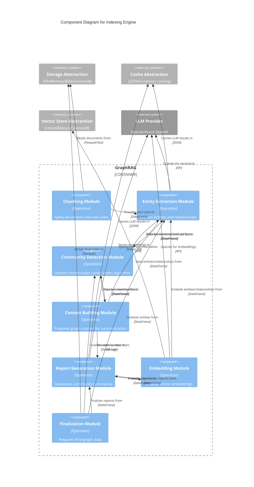
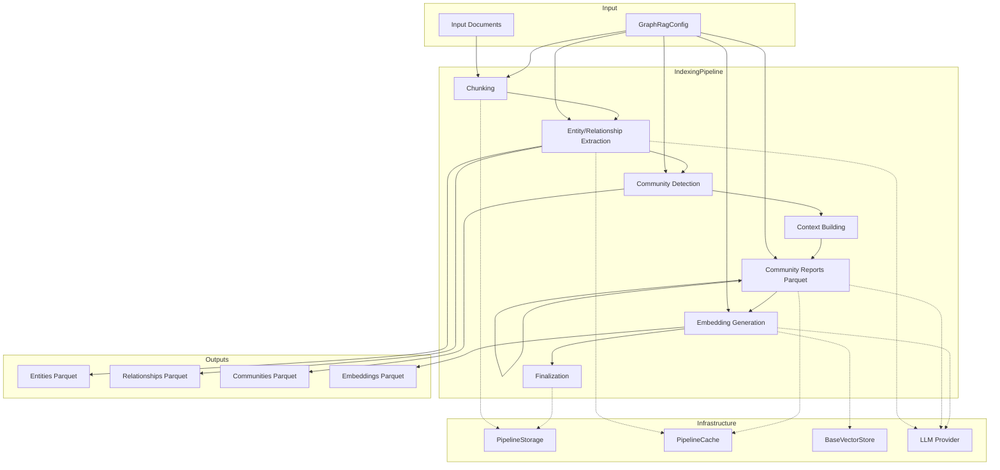

# C4 Component Level: Indexing Engine

## Overview
- **Name**: Indexing Engine
- **Description**: Transforms raw documents into a structured knowledge graph through a multi-stage pipeline.
- **Type**: Processing Pipeline
- **Technology**: Python (Async/Pandas/NetworkX)

## Purpose

The Indexing Engine is responsible for converting unstructured text documents into a rich, queryable knowledge graph. It processes documents through a series of orchestrated operations that extract entities and relationships, detect communities, generate summaries, and create vector embeddings. The resulting knowledge graph enables sophisticated query methods ranging from simple vector similarity to complex graph traversal reasoning.

The indexing process is designed to be:
- **Incremental**: Supports updating existing indexes with new documents
- **Resumable**: Uses caching to avoid redundant LLM calls
- **Configurable**: Pluggable strategies for extraction, chunking, and embedding
- **Observable**: Emits progress events through callback system

## Software Features

### Document Processing
- **Text Chunking**: Splits documents into manageable text units with configurable size and overlap
- **Strategy Selection**: Supports token-based and sentence-based chunking strategies
- **File Type Support**: Handles text and markdown file formats

### Knowledge Graph Construction
- **Entity Extraction**: Identifies organizations, people, locations, events, and other entities using LLMs
- **Relationship Building**: Creates semantic relationships between extracted entities
- **Description Summarization**: Generates concise descriptions for entities and relationships
- **Covariate Extraction**: Captures additional metadata (claims) associated with entities

### Community Detection
- **Hierarchical Clustering**: Uses Leiden algorithm to detect communities at multiple hierarchy levels
- **Graph Analysis**: Computes node degrees and edge weights for community characterization
- **Largest Connected Component**: Optionally filters to the largest connected component

### Context Generation
- **Graph Context Building**: Prepares structured graph data (nodes, edges, claims) for community summarization
- **Token Optimization**: Sorts graph elements by degree and enforces token limits
- **Hierarchical Substitution**: Uses sub-community reports when parent context exceeds token budget

### Report Generation
- **Community Summarization**: Generates LLM-based summaries for each detected community
- **Multi-level Reports**: Creates reports at different hierarchy levels for granular retrieval

### Embedding Generation
- **Vector Embeddings**: Creates embeddings for entities, relationships, community reports, and text units
- **Multiple Backends**: Supports in-memory and vector-store backed operations
- **Batch Processing**: Efficiently processes large datasets

### Finalization
- **Degree Computation**: Calculates node degrees and combined edge degrees
- **Layout Generation**: Optionally computes graph layouts for visualization
- **Unique ID Assignment**: Generates consistent IDs for entities, relationships, and communities
- **Schema Normalization**: Ensures all output DataFrames conform to standard schemas

## Code Elements

This component contains the following code-level elements:

### Core Operations
- [c4-code-graphrag-index-operations.md](./c4-code-graphrag-index-operations.md)
  - `chunk_text`: Splits documents into text units
  - `extract_graph`: Extracts entities and relationships from text units
  - `summarize_descriptions`: Generates entity/relationship descriptions
  - `summarize_communities`: Creates community reports
  - `embed_text`: Generates vector embeddings
  - `cluster_graph`: Applies Leiden clustering
  - `create_graph`: Constructs NetworkX graph
  - `compute_degree`: Calculates node degrees
  - `finalize_entities`: Prepares final entity DataFrame
  - `finalize_relationships`: Prepares final relationship DataFrame
  - `finalize_community_reports`: Joins reports with metadata

### Context Building
- [c4-code-graphrag-index-operations-summarize_communities-graph_context.md](./c4-code-graphrag-index-operations-summarize_communities-graph_context.md)
  - `build_local_context`: Prepares communities for report generation
  - `_prepare_reports_at_level`: Filters and aggregates context per community
  - `build_level_context`: Handles context for specific hierarchy levels
  - `sort_context`: Sorts graph elements and enforces token limits
  - `parallel_sort_context_batch`: Batch processing of community contexts

## Interfaces

### Pipeline Operations Interface

**Protocol**: Function-based operations with DataFrame input/output

**Operations**:
- `chunk_text(input: pd.DataFrame, column: str, size: int, overlap: int, encoding_model: str, strategy: ChunkStrategyType, callbacks: WorkflowCallbacks) -> pd.Series`
- `extract_graph(text_units: pd.DataFrame, callbacks: WorkflowCallbacks, cache: PipelineCache, text_column: str, id_column: str, strategy: dict[str, Any] | None, async_mode: AsyncType = AsyncType.AsyncIO, entity_types=DEFAULT_ENTITY_TYPES, num_threads: int = 4) -> tuple[pd.DataFrame, pd.DataFrame]`
- `summarize_descriptions(entities_df: pd.DataFrame, relationships_df: pd.DataFrame, callbacks: WorkflowCallbacks, cache: PipelineCache, strategy: dict[str, Any] | None = None, num_threads: int = 4) -> tuple[pd.DataFrame, pd.DataFrame]`
- `summarize_communities(nodes: pd.DataFrame, communities: pd.DataFrame, local_contexts, level_context_builder: Callable, callbacks: WorkflowCallbacks, cache: PipelineCache, strategy: dict, tokenizer: Tokenizer, max_input_length: int, async_mode: AsyncType = AsyncType.AsyncIO, num_threads: int = 4)`
- `embed_text(input: pd.DataFrame, callbacks: WorkflowCallbacks, cache: PipelineCache, embed_column: str, strategy: dict, embedding_name: str, id_column: str = "id", title_column: str | None = None)`

### Configuration Interface

**Protocol**: YAML-based configuration (GraphRagConfig)

**Key Settings**:
- `chunks.size`: Text chunk size in tokens
- `chunks.overlap`: Overlap between chunks
- `chunks.encoding_model`: Tokenizer model
- `entity_extraction`: Extraction strategy configuration
- `community_report`: Report generation strategy
- `embeddings`: Embedding model configuration
- `llm`: Language model configuration

## Dependencies

### Components Used
- **Storage Abstraction**: Used for reading input documents and writing index outputs
- **Cache Abstraction**: Used to cache LLM results and intermediate data
- **Vector Store Abstraction**: Used to store and retrieve embeddings
- **Data Models**: Uses Entity, Relationship, Community schemas
- **Callbacks & Logging**: Reports progress via WorkflowCallbacks
- **Tokenizer**: Counts tokens for chunking and context building

### External Systems
- **LLM Providers**: OpenAI, Azure OpenAI, or other providers for entity extraction, summarization, and embedding generation
- **NetworkX**: Graph representation and analysis
- **graspologic**: Hierarchical Leiden clustering implementation
- **Pandas**: DataFrame manipulation and processing

## Component Diagram

## Component Relationships

## Deployment Considerations

### Performance Characteristics
- **Computationally Expensive**: Entity extraction and community summarization make extensive LLM calls
- **Memory Intensive**: Large graphs require substantial RAM during clustering and context building
- **I/O Bound**: Storage operations dominate for document reading and Parquet writing

### Scalability Strategies
- **Async Execution**: LLM calls are parallelized using asyncio and semaphores
- **Chunking**: Large documents are split into smaller text units for parallel processing
- **Caching**: LLM results are cached to avoid redundant computation during re-runs
- **Batch Processing**: Embedding generation uses batch operations for efficiency

### Resource Requirements
- **LLM API Credits**: Sufficient credits for entity extraction, summarization, and embedding generation
- **Disk Space**: Parquet files can be large for extensive document collections
- **Processing Time**: Indexing can take hours for large datasets (depends on document count and complexity)

### Configuration Guidelines
- Start with small datasets to validate pipeline configuration
- Use `graphrag init --force` between minor version updates
- Prompt tuning is strongly recommended for best results with your data
- Adjust chunk size based on document length and token limits
