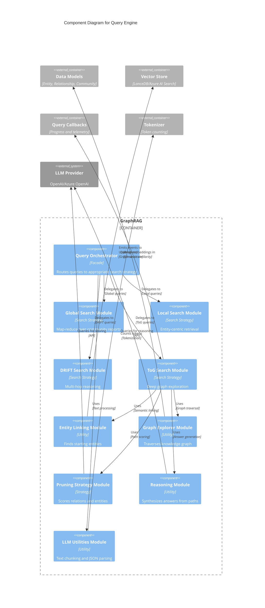
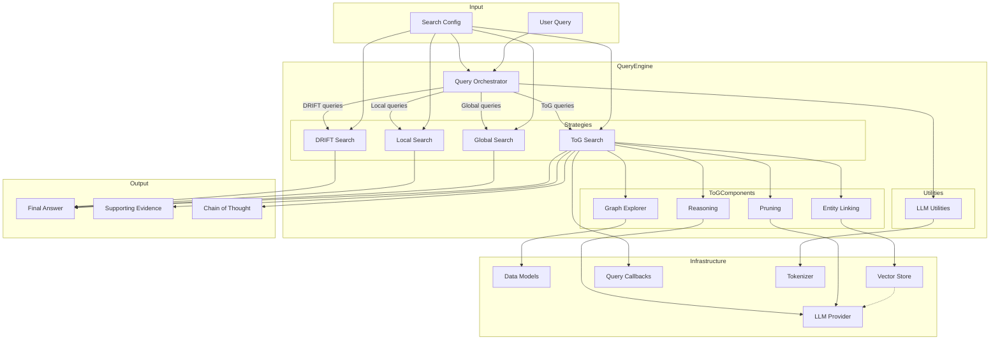

# C4 Component Level: Query Engine

## Overview
- **Name**: Query Engine
- **Description**: Multi-strategy search system supporting Global, Local, DRIFT, and ToG search methods with LLM-based reasoning.
- **Type**: Query/Retrieval System
- **Technology**: Python (Async/LLM)

## Purpose

The Query Engine provides flexible, sophisticated search capabilities over knowledge graphs. It supports multiple search strategies, each optimized for different types of queries:

- **Global Search**: Broad, high-level queries using map-reduce over community reports
- **Local Search**: Specific, entity-centric queries with direct evidence retrieval
- **DRIFT Search**: Multi-hop reasoning queries with dynamic context expansion
- **ToG Search**: Deep reasoning queries using iterative graph exploration with beam search

The Query Engine orchestrates entity linking, graph traversal, context building, pruning, and LLM-based reasoning to generate comprehensive, evidence-backed answers.

## Software Features

### Multiple Search Strategies

#### Global Search
- Map-reduce pattern over community reports
- Generates intermediate responses for each community
- Reduces responses into a coherent final answer
- Suitable for broad, exploratory queries

#### Local Search
- Entity-centric retrieval starting from query-matched entities
- Expands to neighbors and retrieves direct evidence
- Lightweight alternative to global search
- Suitable for specific fact retrieval

#### DRIFT Search
- Multi-hop reasoning with dynamic context expansion
- Iteratively explores graph while maintaining conversation context
- Balances breadth and depth of exploration
- Suitable for complex, multi-step queries

#### ToG Search (Think-on-Graph)
- Iterative graph exploration using beam search
- LLM-guided relation and entity scoring
- Multiple pruning strategies (LLM, semantic, BM25)
- Chain-of-thought reasoning over explored paths
- Early termination when sufficient information found
- Most transparent reasoning but uses more LLM calls
- Suitable for deep reasoning queries requiring explanation

### Entity Linking
- **Semantic Matching**: Uses embedding similarity to find starting entities
- **Keyword Matching**: Fallback method for entity linking
- **Bidirectional Relations**: Supports bidirectional graph traversal

### Graph Exploration
- **Neighbor Expansion**: Retrieves all connected entities and relationships
- **Depth-Limited Search**: Configurable maximum exploration depth
- **Beam Search**: Maintains best paths at each depth level
- **State Tracking**: Tracks exploration state and frontier

### Pruning Strategies

#### LLM Pruning
- Uses LLM to score relations and entities based on natural language descriptions
- Most accurate but computationally expensive
- Provides semantic understanding of relevance

#### Semantic Pruning
- Uses cosine similarity between query embeddings and relation/entity descriptions
- Fast and efficient
- Good for general relevance filtering

#### BM25 Pruning
- Uses lexical matching algorithm
- Fast and keyword-based
- Good for exact term matching

### Reasoning and Answer Generation
- **Chain-of-Thought**: Generates reasoning steps along exploration paths
- **Evidence Integration**: Combines information from multiple graph paths
- **Context Formatting**: Structures graph data for LLM consumption
- **Early Termination**: Stops exploration when sufficient information gathered

### Streaming Support
- **Real-time Progress**: Streams exploration progress and intermediate results
- **Token-by-Token Output**: Generates answer as tokens are produced
- **User Feedback**: Allows users to see reasoning steps as they occur

## Code Elements

This component contains the following code-level elements:

### ToG Search Implementation
- [c4-code-graphrag-query-structured_search-tog_search.md](./c4-code-graphrag-query-structured_search-tog_search.md)
  - `ToGSearch`: Main orchestrator for ToG search process
  - `GraphExplorer`: Manages knowledge graph structure and traversal
  - `PruningStrategy`: Abstract base for relation/entity scoring
  - `LLMPruning`: LLM-based pruning implementation
  - `SemanticPruning`: Embedding-based pruning implementation
  - `BM25Pruning`: BM25-based pruning implementation
  - `ToGReasoning`: Synthesizes exploration paths into answers
  - `ExplorationNode`: Represents a step in exploration path
  - `ToGSearchState`: Tracks overall search state

### LLM Query Utilities
- [c4-code-graphrag-query-llm.md](./c4-code-graphrag-query-llm.md)
  - `batched`: Batches data into tuples
  - `chunk_text`: Chunks text into token-limited segments
  - `try_parse_json_object`: Robust JSON parsing with error recovery

## Interfaces

### Search Interface

**Protocol**: Async methods with streaming support

**Operations**:
- `search(query: str) -> str`: Performs search and returns final answer
- `stream_search(query: str) -> AsyncGenerator[str, None]`: Streams search results and progress

### Configuration Interface

**Protocol**: Search strategy configuration

**Parameters**:
- **Global Search**: `community_level`, `dynamic_community_selection`, `max_token_count`
- **Local Search**: `num_results`, `max_depth`, `include_relatedness_score`
- **DRIFT Search**: `max_depth`, `dynamic_depth`, `max_tokens`
- **ToG Search**: `width` (beam width), `depth` (max exploration depth), `num_retain_entity`, `pruning_strategy` (LLM/semantic/BM25), `temperature`

### Pruning Strategy Interface

**Protocol**: Abstract base class with scoring methods

**Methods**:
- `score_relations(query: str, entity_name: str, relations: List[Tuple[str, str, str, float]]) -> List[Tuple[str, str, str, float, float]]`
- `score_entities(query: str, current_path: List[ExplorationNode], entities: List[Tuple[str, str, str]]) -> List[float]`

## Dependencies

### Components Used
- **Data Models**: Uses Entity, Relationship, Community schemas for graph structure
- **Vector Store Abstraction**: Queries entity embeddings for semantic linking
- **Callbacks & Logging**: Emits query events via QueryCallbacks
- **Tokenizer**: Chunks text for token management
- **LLM Abstraction**: Queries for entity scoring, reasoning, and answer generation

### External Systems
- **LLM Providers**: OpenAI, Azure OpenAI, or other providers for entity scoring, pruning, and reasoning
- **Vector Databases**: LanceDB, Azure AI Search, or other vector stores for semantic search

## Component Diagram

## Component Relationships

## Search Strategy Comparison

| Strategy | Use Case | Complexity | LLM Calls | Transparency | Best For |
|----------|-----------|------------|------------|--------------|----------|
| **Global** | Broad questions | Low | Medium | Low | "What are the main themes?" |
| **Local** | Specific facts | Low | Low | Low | "Who is John Doe?" |
| **DRIFT** | Multi-step queries | Medium | High | Medium | "How did X affect Y?" |
| **ToG** | Deep reasoning | High | Very High | High | "Why did X happen?" |

## Deployment Considerations

### Performance Characteristics
- **ToG Search**: Computationally expensive due to iterative exploration and LLM scoring
- **Global Search**: Requires reading all community reports (can be large)
- **Local Search**: Lightweight, suitable for interactive queries
- **DRIFT Search**: Balances performance and reasoning quality

### Scalability Strategies
- **Caching**: Cache entity embeddings for semantic linking
- **Batch Processing**: Process multiple entities in parallel during scoring
- **Early Termination**: ToG search can stop early if sufficient information found
- **Result Limiting**: Limit beam width and depth for faster exploration

### Resource Requirements
- **LLM API Credits**: ToG search uses many LLM calls for scoring and reasoning
- **Memory**: Graph must fit in memory for efficient traversal
- **Response Time**: ToG search can take 30+ seconds for complex queries

### Configuration Guidelines
- Use **Global Search** for exploratory questions about broad topics
- Use **Local Search** for quick, specific fact retrieval
- Use **DRIFT Search** for multi-step reasoning with moderate complexity
- Use **ToG Search** when detailed reasoning and explanation are required
- **LLM Pruning** provides best quality but is expensive
- **Semantic Pruning** offers good balance of speed and quality
- **BM25 Pruning** is fastest but less semantically aware
- Increase **beam width** for more comprehensive exploration
- Increase **depth** for deeper reasoning but higher cost
