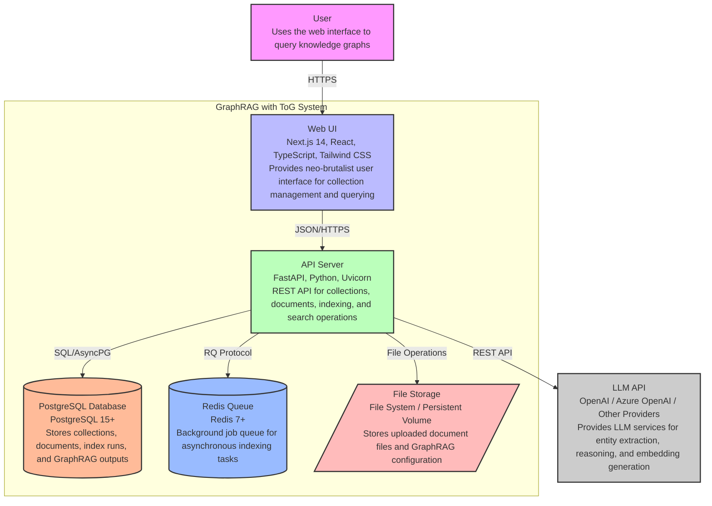
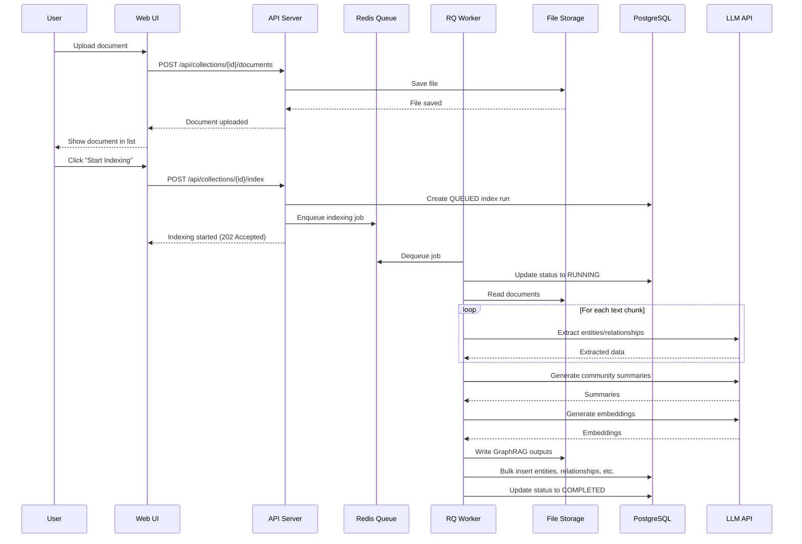
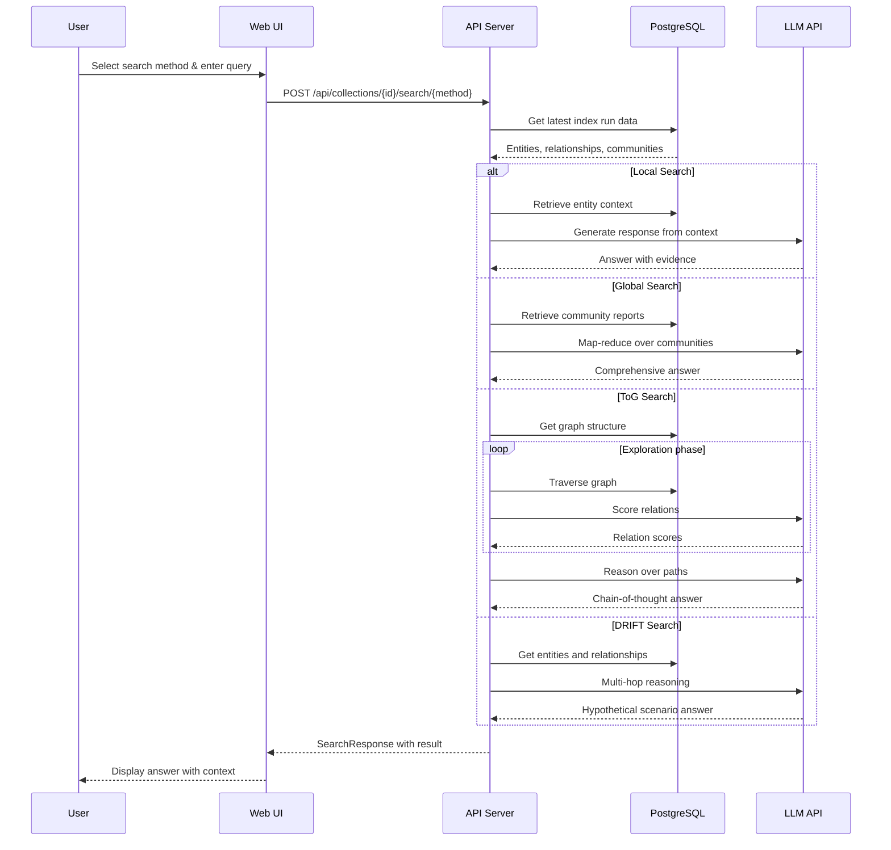

# C4 Container Level: System Deployment

## Overview

The GraphRAG with ToG (Think-on-Graph) system is deployed as a collection of containers that work together to provide knowledge graph-based retrieval-augmented generation with deep reasoning capabilities. The containers follow a microservices-oriented architecture with clear separation of concerns.

## Container Diagram

## Containers

### Web UI

**Name**: Web UI
**Type**: Web Application
**Technology**: Next.js 14, React 18, TypeScript, TanStack Query, Tailwind CSS
**Deployment**: Docker container (Node.js 20+), exposed on port 3000

#### Purpose
The Web UI provides a user-friendly, neo-brutalist interface for managing GraphRAG document collections and performing knowledge graph queries. It enables users to upload documents, trigger indexing, and execute queries using multiple search strategies including the enhanced ToG (Think-on-Graph) deep reasoning method.

#### Components
This container deploys the following components:
- **Pages & Features Component**: Route handlers and feature-level components (Dashboard, CollectionDetailsPage, CollectionDocuments, CollectionChat)
  - Documentation: [c4-component-frontend.md](./c4-component-frontend.md)
- **UI Component Library**: Reusable neo-brutalist UI primitives (NBButton, NBCard, NBInput, NBLayout)
- **API Integration Client**: TypeScript client for backend API communication

#### Interfaces

##### API Client Interface
- **Protocol**: REST over HTTP/HTTPS
- **Base URL**: Configurable via `NEXT_PUBLIC_API_BASE_URL` (default: `http://127.0.0.1:8000/api`)
- **Specification**: [apis/backend-api.yaml](./apis/backend-api.yaml)
- **Authentication**: None (public API, authentication can be added as needed)

#### Dependencies

##### Containers Used
- **API Server**: All API operations (collections, documents, indexing, search)

##### External Systems
- **Browser**: User's web browser for rendering the UI

#### Infrastructure
- **Deployment Config**: `frontend/Dockerfile` (if containerized)
- **Scaling**: Horizontally scalable (stateless)
- **Resources**:
  - CPU: 0.5 - 1 vCPU (can scale based on traffic)
  - Memory: 256MB - 512MB
  - Storage: Static assets only (no persistent data storage)

---

### API Server

**Name**: API Server
**Type**: API Application
**Technology**: FastAPI, Python 3.11+, Uvicorn, SQLAlchemy-async, RQ
**Deployment**: Docker container (Python 3.11+), exposed on port 8000

#### Purpose
The API Server provides a RESTful API that orchestrates the GraphRAG indexing pipeline and query engine. It manages document collections, handles file uploads, coordinates asynchronous indexing jobs via Redis Queue, and provides multiple search methods including Global, Local, DRIFT, and ToG search. The API server integrates with the GraphRAG Python library to build knowledge graphs and execute sophisticated queries.

#### Components
This container deploys the following components:
- **API & Routing Component**: FastAPI application entry point and HTTP request routing layer
  - Documentation: [c4-component-backend.md](./c4-component-backend.md)
- **Business Logic Services Component**: Business logic for collections, documents, indexing, and query operations
- **Persistence & Data Access Component**: Database models, repositories, and data access layer

#### Interfaces

##### REST API Endpoints
- **Protocol**: HTTP/HTTPS, JSON
- **Base Path**: `/api`
- **Specification**: [apis/backend-api.yaml](./apis/backend-api.yaml)

**Collections API**:
- `POST /api/collections` - Create a new document collection
- `GET /api/collections` - List all collections
- `GET /api/collections/{collection_id}` - Get collection details (by UUID or name)
- `DELETE /api/collections/{collection_id}` - Delete a collection

**Documents API**:
- `POST /api/collections/{collection_id}/documents` - Upload a document (text/markdown, max 25MB)
- `GET /api/collections/{collection_id}/documents` - List documents in collection
- `DELETE /api/collections/{collection_id}/documents/{document_name}` - Delete a document

**Indexing API**:
- `POST /api/collections/{collection_id}/index` - Start GraphRAG indexing pipeline
- `GET /api/collections/{collection_id}/index` - Get indexing status

**Search API**:
- `GET /api/collections/{collection_id}/search` - Generic search with method parameter
- `POST /api/collections/{collection_id}/search/global` - Global search (map-reduce over communities)
- `POST /api/collections/{collection_id}/search/local` - Local search (entity-centric)
- `POST /api/collections/{collection_id}/search/tog` - ToG search (deep reasoning)
- `POST /api/collections/{collection_id}/search/drift` - DRIFT search (multi-hop reasoning)

**Health API**:
- `GET /health` - Health check endpoint
- `GET /` - Root endpoint with API metadata

#### Dependencies

##### Containers Used
- **PostgreSQL Database**: Persistent storage for collections, documents, and GraphRAG outputs
- **Redis Queue**: Background task queue for async indexing jobs
- **File Storage**: Stores document files and GraphRAG prompt templates

##### External Systems
- **LLM API (OpenAI/Azure)**: Provides LLM services for entity extraction, reasoning, and embedding generation
- **GraphRAG Library**: Core Python library for indexing and query algorithms (embedded in container)

#### Infrastructure
- **Deployment Config**: `backend/Dockerfile` (if containerized)
- **Scaling**: Horizontally scalable (stateless, shared database and queue)
- **Resources**:
  - CPU: 1 - 4 vCPU (depends on concurrent indexing and query load)
  - Memory: 2GB - 8GB (depends on LLM context window and batch sizes)
  - Storage: Minimal (uses shared storage containers)

---

### PostgreSQL Database

**Name**: PostgreSQL Database
**Type**: Database
**Technology**: PostgreSQL 15+
**Deployment**: Docker container or managed database service

#### Purpose
The PostgreSQL Database is the primary data store for the GraphRAG system. It stores operational data (collections, documents, index runs) and the complete knowledge graph output from GraphRAG indexing (entities, relationships, communities, community reports, text units, covariates, and vector embeddings). The database schema supports complex queries for local search and global search operations.

#### Components
This container does not contain logical components from the GraphRAG system; it is an external infrastructure component. The GraphRAG data is persisted via the Persistence & Data Access Component in the API Server.

#### Interfaces

##### Database Interface
- **Protocol**: PostgreSQL Wire Protocol
- **Connection**: AsyncPG (async PostgreSQL driver for Python)
- **Port**: 5432
- **Schema**: See database models in `backend/app/db/models/`

#### Data Schema

**Operational Tables**:
- `collections` - Document collections metadata
- `index_runs` - Indexing job tracking (status, timestamps, errors)

**GraphRAG Tables** (per-index-run):
- `documents` - Imported document content and metadata
- `entities` - Extracted entities with graph properties
- `relationships` - Entity-to-entity relationships
- `communities` - Leiden algorithm community clusters
- `community_reports` - Summarized community reports
- `text_units` - Text chunks from input documents
- `covariates` - Extracted claims/events (optional)
- `embeddings` - Vector embeddings for semantic search

#### Dependencies

##### Containers Used
- **API Server**: Reads and writes all data via SQLAlchemy-async

##### External Systems
- None

#### Infrastructure
- **Deployment Config**: PostgreSQL Docker image (e.g., `postgres:15-alpine`)
- **Scaling**: Vertical scaling (larger instance) or read replicas for query-heavy workloads
- **Resources**:
  - CPU: 1 - 4 vCPU
  - Memory: 2GB - 16GB (depends on knowledge graph size and embedding dimensions)
  - Storage: 10GB - 1TB+ (depends on number of documents and embeddings)
- **Backup**: Regular backups required for production
- **Persistence**: Persistent volume or managed database storage

---

### Redis Queue

**Name**: Redis Queue
**Type**: Message Queue
**Technology**: Redis 7+
**Deployment**: Docker container or managed Redis service

#### Purpose
The Redis Queue provides a background job execution system for asynchronous GraphRAG indexing tasks. When a user triggers indexing, the API Server enqueues a job in Redis, and a separate RQ worker process picks up the job and executes the GraphRAG indexing pipeline. This allows long-running indexing operations to complete without blocking API responses.

#### Components
This container does not contain logical components from the GraphRAG system; it is an external infrastructure component used by the Business Logic Services Component.

#### Interfaces

##### Queue Interface
- **Protocol**: RESP (Redis Serialization Protocol)
- **Port**: 6379
- **Library**: RQ (Redis Queue) for Python

#### Dependencies

##### Containers Used
- **API Server**: Enqueues indexing jobs
- **RQ Worker**: Separate container or process that executes background tasks

##### External Systems
- None

#### Infrastructure
- **Deployment Config**: Redis Docker image (e.g., `redis:7-alpine`)
- **Scaling**: Horizontal scaling with Redis Cluster (for high-volume job queues)
- **Resources**:
  - CPU: 0.5 - 2 vCPU
  - Memory: 512MB - 4GB (depends on queue depth and job complexity)
  - Storage: Minimal (in-memory, optional persistence for job durability)
- **Persistence**: Configure Redis persistence (RDB/AOF) for job durability

---

### File Storage

**Name**: File Storage
**Type**: File System
**Technology**: File System / Persistent Volume
**Deployment**: Docker volume or cloud storage (S3, Azure Blob, etc.)

#### Purpose
The File Storage stores uploaded document files and GraphRAG configuration files for each collection. Each collection has its own directory structure containing the input documents and the output Parquet files from GraphRAG indexing (entities, relationships, communities, embeddings, etc.).

#### Components
This container does not contain logical components from the GraphRAG system; it is an external infrastructure component used by the Storage Service.

#### Interfaces

##### File Interface
- **Protocol**: File System (POSIX) or Cloud Storage API (S3, Azure Blob)
- **Directory Structure**:
  - `/collections/{collection_id}/input/` - Uploaded documents
  - `/collections/{collection_id}/output/` - GraphRAG output Parquet files
  - `/collections/{collection_id}/prompts/` - Prompt templates

#### Dependencies

##### Containers Used
- **API Server**: Reads and writes files

##### External Systems
- None

#### Infrastructure
- **Deployment Config**: Docker volume or cloud storage service
- **Scaling**: File system scaling depends on storage backend
- **Resources**:
  - Storage: 10GB - 1TB+ (depends on number and size of documents)
- **Backup**: Regular backups required for production (especially for uploaded documents)

---

### LLM API (External)

**Name**: LLM API
**Type**: External Service
**Technology**: OpenAI API, Azure OpenAI, or other LLM providers
**Deployment**: External service (SaaS)

#### Purpose
The LLM API provides language model services used throughout the GraphRAG pipeline. It is used for entity extraction, relationship extraction, community summarization, query reasoning, and embedding generation. The system supports multiple LLM providers through the GraphRAG configuration system.

#### Components
This is an external system and does not contain components from the GraphRAG system.

#### Interfaces

##### API Interface
- **Protocol**: REST API / OpenAI-compatible API
- **Endpoints**: Varies by provider (e.g., `https://api.openai.com/v1`)
- **Authentication**: API key (configured via environment variables)

#### LLM Functions Used

**Indexing Pipeline**:
- Entity extraction from text chunks
- Relationship extraction between entities
- Community summarization
- Embedding generation for entities, relationships, and text units

**Query Pipeline**:
- Local search reasoning over retrieved context
- Global search map-reduce over community reports
- ToG deep reasoning with chain-of-thought
- DRIFT search multi-hop reasoning
- Context building and answer generation

#### Dependencies

##### Containers Used
- **API Server**: Makes all LLM API calls during indexing and querying

##### External Systems
- LLM Provider infrastructure (OpenAI, Azure, etc.)

#### Infrastructure
- **Deployment**: External SaaS service
- **Scaling**: Handled by LLM provider
- **Cost**: Usage-based pricing (tokens, API calls)
- **Rate Limits**: Configured via GraphRAG settings (`concurrent_requests`)

---

## Container Communication Flows

### Document Upload and Indexing Flow

### Query Execution Flow

---

## Technology Stack Summary

| Container | Primary Technologies | Key Libraries/Frameworks |
|-----------|---------------------|------------------------|
| Web UI | Next.js 14, React 18, TypeScript | TanStack Query, Tailwind CSS, Axios |
| API Server | Python 3.11+, FastAPI | Uvicorn, SQLAlchemy-async, RQ, GraphRAG |
| PostgreSQL Database | PostgreSQL 15+ | AsyncPG driver |
| Redis Queue | Redis 7+ | RQ (Redis Queue) |
| File Storage | File System / Cloud Storage | aiofiles |
| LLM API | External (OpenAI, Azure) | Provider-specific SDKs |

---

## Deployment Configuration

### Environment Variables

**Web UI**:
- `NEXT_PUBLIC_API_BASE_URL`: Backend API base URL (default: `http://127.0.0.1:8000/api`)

**API Server**:
- `DATABASE_URL`: PostgreSQL connection string (async format)
- `REDIS_URL`: Redis connection string for RQ
- `GRAPHRAG_API_KEY`: LLM API key (OpenAI, Azure, etc.)
- `STORAGE_BASE_PATH`: Base path for file storage
- `HOST`: API server host (default: `0.0.0.0`)
- `PORT`: API server port (default: `8000`)

**PostgreSQL**:
- `POSTGRES_USER`: Database user
- `POSTGRES_PASSWORD`: Database password
- `POSTGRES_DB`: Database name

**Redis**:
- `REDIS_PASSWORD`: Optional password for Redis

### Port Mappings

| Container | Internal Port | External Port |
|-----------|---------------|---------------|
| Web UI | 3000 | 3000 |
| API Server | 8000 | 8000 |
| PostgreSQL | 5432 | 5432 |
| Redis | 6379 | 6379 |

---

## Scaling Considerations

### Web UI
- **Scaling**: Horizontally scalable (stateless)
- **Load Balancer**: Nginx, Traefik, or cloud load balancer
- **Session Storage**: Client-side (no server-side sessions)

### API Server
- **Scaling**: Horizontally scalable (stateless, shared database and queue)
- **Load Balancer**: Nginx, Traefik, or cloud load balancer
- **Connection Pooling**: SQLAlchemy connection pooling to database
- **Rate Limiting**: Consider adding rate limiting for API endpoints

### PostgreSQL
- **Scaling**: Vertical scaling (larger instance) or read replicas
- **Read Replicas**: For query-heavy workloads, use read replicas for search operations
- **Connection Pooling**: PgBouncer for high-connection scenarios

### Redis Queue
- **Scaling**: Horizontal scaling with Redis Cluster
- **Worker Scaling**: Multiple RQ worker containers for parallel indexing
- **Job Prioritization**: Configure RQ job priorities for different tasks

### File Storage
- **Scaling**: Use cloud storage (S3, Azure Blob) for unlimited scale
- **CDN**: Serve static files from CDN for better performance

---

## Monitoring and Observability

### Health Checks
- **Web UI**: Check if application responds on port 3000
- **API Server**: `GET /health` endpoint
- **PostgreSQL**: Database connection check
- **Redis**: PING command

### Logging
- **Web UI**: Browser console, server logs (Next.js)
- **API Server**: Structured logging to stdout/stderr (JSON format recommended)
- **PostgreSQL**: Database query logs (slow query log)
- **Redis**: Slow query log

### Metrics
- **API Server**: Request rate, response time, error rate, LLM API usage
- **PostgreSQL**: Connection count, query performance, storage usage
- **Redis**: Queue depth, job processing time, memory usage
- **LLM API**: Token usage, API call count, response time

---

## Security Considerations

### API Server
- **CORS**: Configure CORS properly for production (not `allow_origins=["*"]`)
- **Rate Limiting**: Add rate limiting to prevent abuse
- **Authentication**: Consider adding API key or JWT authentication
- **Input Validation**: All inputs validated via Pydantic models
- **SQL Injection**: Protected via SQLAlchemy ORM (parameterized queries)

### Database
- **Network Isolation**: Database should not be directly accessible from internet
- **SSL/TLS**: Require SSL for database connections
- **Backups**: Regular backups and point-in-time recovery

### File Storage
- **File Size Limits**: Enforce file size limits (currently 25MB)
- **File Type Validation**: Validate file extensions (only .txt and .md)
- **Virus Scanning**: Consider adding virus scanning for uploaded files

### LLM API
- **API Key Security**: Store API keys securely (secrets manager, environment variables)
- **Cost Controls**: Monitor LLM API usage and implement budget alerts
- **Content Filtering**: Configure content filters if available

---

## Related Documentation

- **Component Documentation**:
  - [Backend Components](./c4-component-backend.md)
  - [Frontend Components](./c4-component-frontend.md)
  - [GraphRAG Components](./c4-component-graphrag.md)
- **API Specification**: [Backend API OpenAPI Specification](./apis/backend-api.yaml)
- **Code Documentation**: See individual c4-code-*.md files for detailed code-level documentation
