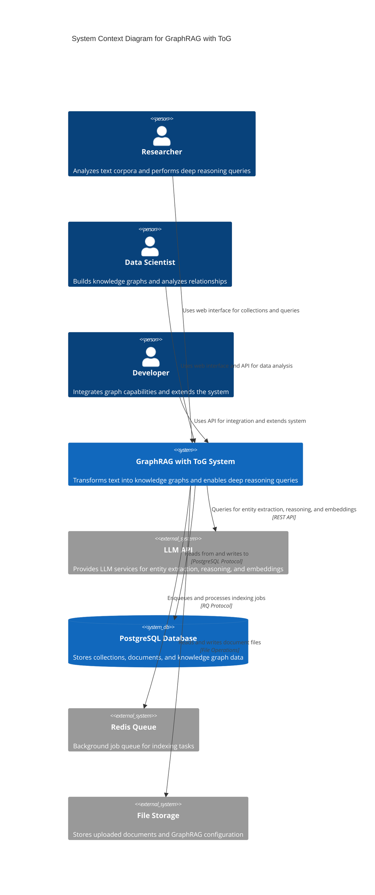

# C4 Context Level: System Context

## System Overview

### Short Description
GraphRAG with ToG (Think-on-Graph) is a knowledge graph-based system that transforms unstructured text into structured graphs and enables sophisticated deep reasoning queries over that information.

### Long Description
The GraphRAG with ToG system is a Microsoft Research project that combines knowledge graph-based retrieval-augmented generation with Think-on-Graph deep reasoning capabilities. The system enables users to upload collections of text documents, automatically extract entities and relationships, build community-based knowledge graphs, and perform sophisticated queries using multiple search strategies including deep reasoning through graph traversal.

The system consists of a web interface for managing document collections and querying knowledge graphs, a backend API that orchestrates the GraphRAG pipeline, and support for multiple LLM providers for entity extraction and reasoning. The ToG (Think-on-Graph) enhancement implements academic research for deep graph exploration with beam search, providing transparent reasoning chains and multi-hop inference capabilities.

This system is designed for researchers, data scientists, and developers who need to analyze large text corpora, discover relationships between entities, and perform complex reasoning over knowledge graphs.

## Personas

### Researcher
- **Type**: Human User
- **Description**: Academic researchers or domain experts who analyze large text corpora such as research papers, news articles, or historical documents. They need to discover relationships between entities, understand community structures, and perform deep reasoning queries to answer complex research questions.
- **Goals**:
  - Organize research documents into searchable collections
  - Extract entities and relationships from unstructured text
  - Discover community structures and patterns
  - Perform complex multi-hop reasoning queries
  - Understand the reasoning process behind answers
- **Key Features Used**:
  - Document collection management
  - Document upload and organization
  - Knowledge graph indexing
  - Global search for broad overviews
  - Local search for entity-centric questions
  - ToG search for deep reasoning with transparent chains

### Data Scientist
- **Type**: Human User
- **Description**: Data professionals who work with text data and need to extract insights, build knowledge graphs, and analyze relationships between entities. They may be building data products, performing exploratory data analysis, or integrating knowledge graph capabilities into data pipelines.
- **Goals**:
  - Build knowledge graphs from domain-specific text
  - Analyze entity relationship patterns
  - Query knowledge graphs programmatically
  - Integrate with existing data workflows
  - Monitor and manage indexing processes
- **Key Features Used**:
  - REST API for programmatic access
  - Document ingestion pipelines
  - Bulk indexing operations
  - All search methods (Global, Local, DRIFT, ToG)
  - Status monitoring and error tracking

### Developer
- **Type**: Human User
- **Description**: Software developers who need to integrate knowledge graph capabilities into applications, extend the system with custom functionality, or deploy and maintain the system. They may be building applications on top of GraphRAG or customizing the system for specific use cases.
- **Goals**:
  - Integrate knowledge graph querying into applications
  - Extend the system with custom search methods
  - Deploy and scale the system for production
  - Configure LLM providers and models
  - Troubleshoot and maintain the system
- **Key Features Used**:
  - REST API for all operations
  - Backend and frontend development
  - Configuration and deployment
  - Custom indexing and query pipelines
  - System monitoring and health checks

## System Features

### Document Collection Management
- **Description**: Users can create, view, and delete document collections. Each collection represents a group of related documents that will be indexed together into a single knowledge graph. Collections have names, descriptions, and metadata about document counts and indexing status.
- **Users**: All personas
- **User Journey**: [Setting up a new research collection](#setting-up-a-new-research-collection---researcher-journey)

### Document Upload and Organization
- **Description**: Users can upload text and markdown documents to collections. The system supports drag-and-drop file upload, displays document metadata (size, upload date), and allows individual document deletion. Documents are validated for file type and size.
- **Users**: All personas
- **User Journey**: [Indexing a corpus of documents](#indexing-a-corpus-of-documents---all-personas-journey)

### Knowledge Graph Indexing
- **Description**: The GraphRAG indexing pipeline automatically transforms uploaded documents into structured knowledge graphs. This includes text chunking, entity extraction, relationship building, community detection using the Leiden algorithm, community report generation, and embedding creation for semantic search. Indexing runs asynchronously with real-time status monitoring.
- **Users**: All personas
- **User Journey**: [Indexing a corpus of documents](#indexing-a-corpus-of-documents---all-personas-journey)

### Global Search
- **Description**: Global search provides broad overviews by performing map-reduce operations over community reports. It is ideal for questions that span multiple topics or require understanding the overall structure of the knowledge graph.
- **Users**: Researchers, Data Scientists
- **User Journey**: [Performing deep reasoning search (ToG)](#performing-deep-reasoning-search-tog---researcher-journey)

### Local Search
- **Description**: Local search focuses on entity-centric queries with direct evidence. It retrieves relevant entities and their immediate context from the knowledge graph, making it ideal for specific questions about particular entities and their relationships.
- **Users**: Researchers, Data Scientists
- **User Journey**: [Performing deep reasoning search (ToG)](#performing-deep-reasoning-search-tog---researcher-journey)

### DRIFT Search
- **Description**: DRIFT (Dynamic Reasoning for Inference with Flow Traversal) search enables multi-hop reasoning with dynamic context. It is useful for discovering hypothetical scenarios and exploring indirect relationships between entities.
- **Users**: Researchers, Data Scientists, Developers
- **User Journey**: [Performing deep reasoning search (ToG)](#performing-deep-reasoning-search-tog---researcher-journey)

### ToG Search (Think-on-Graph)
- **Description**: ToG search implements deep reasoning through iterative graph exploration using beam search. It explores multiple paths through the knowledge graph, scores relations using LLM guidance, applies pruning strategies, and generates answers with transparent chain-of-thought reasoning and supporting evidence.
- **Users**: Researchers, Data Scientists, Developers
- **User Journey**: [Performing deep reasoning search (ToG)](#performing-deep-reasoning-search-tog---researcher-journey)

### Real-time Indexing Status
- **Description**: Users can monitor the progress of indexing operations in real-time. The system provides status updates (queued, running, completed, failed), progress indicators, and error messages if indexing fails.
- **Users**: All personas
- **User Journey**: [Indexing a corpus of documents](#indexing-a-corpus-of-documents---all-personas-journey)

## User Journeys

### Setting Up a New Research Collection - Researcher Journey

1. **User accesses the web interface** at the application URL and sees the dashboard displaying existing collections (if any).
2. **User clicks "New Collection"** to create a new document collection for organizing research documents.
3. **User enters collection details**: name (e.g., "Climate Research Papers"), description, and submits the form.
4. **System creates the collection** and displays it on the dashboard with metadata showing 0 documents and "Not indexed" status.
5. **User navigates to the collection** to upload documents and begin organizing the research corpus.
6. **User uploads documents** by dragging and dropping files or clicking to select files from their computer. The system displays each uploaded document with metadata.
7. **User starts indexing** by clicking the "Start Indexing" button to begin building the knowledge graph from the uploaded documents.
8. **System queues the indexing job** and shows "Indexing in progress" status with a progress bar.
9. **User monitors indexing progress** as the status updates through queued, running, and completed states.
10. **User receives confirmation** that indexing is complete and can now query the knowledge graph.

### Indexing a Corpus of Documents - All Personas Journey

1. **User selects or creates a collection** where documents will be indexed.
2. **User uploads documents** to the collection using the web interface (for Researchers and Data Scientists) or via the REST API `POST /api/collections/{id}/documents` endpoint (for Data Scientists and Developers).
3. **User verifies document list** to ensure all intended documents are present in the collection.
4. **User triggers indexing** by clicking "Start Indexing" in the web interface or sending a request to `POST /api/collections/{id}/index` via the API.
5. **System creates an indexing run record** with status "queued" and enqueues a background job.
6. **Background worker processes the job**:
   - Documents are read and chunked into text units
   - LLM is called to extract entities and relationships
   - Entities are clustered into communities using the Leiden algorithm
   - Community reports are generated with graph context
   - Embeddings are created for entities, relationships, and text units
   - All outputs are written to the database
7. **User monitors indexing status** by polling the web interface or the `GET /api/collections/{id}/index` endpoint.
8. **System updates status** to "running" and shows progress as the pipeline executes.
9. **Upon completion**, the system updates status to "completed" and stores the final results.
10. **User receives notification** that indexing is complete and the collection is ready for querying.

### Performing Deep Reasoning Search (ToG) - Researcher Journey

1. **User navigates to a collection** that has completed indexing.
2. **User opens the query interface** (chat-style interface in the web UI).
3. **User selects ToG search method** from the available options (Global, Local, DRIFT, ToG).
4. **User reviews method description** to understand that ToG provides deep reasoning with transparent chains.
5. **User enters a complex query** that requires multi-hop reasoning, for example: "How do climate policies affect renewable energy adoption in developing countries, and what are the key barriers to implementation?"
6. **System initiates ToG search**:
   - Links query terms to entities in the knowledge graph
   - Explores the graph iteratively using beam search
   - At each step, queries the LLM to score relations based on relevance
   - Applies pruning strategies to focus on promising paths
   - Explores multiple paths in parallel based on beam width
   - Reaches the configured exploration depth
7. **System generates reasoning chains** for each explored path using the LLM.
8. **System synthesizes the final answer** by combining reasoning from all explored paths, with supporting evidence and citations.
9. **User receives the answer** with:
   - Comprehensive response to the query
   - Chain-of-thought explanation of the reasoning process
   - Citations to source documents and entities
   - Context about which search method was used
10. **User can follow up** with additional questions or try different search methods to compare results.

### External Systems Integration Journey

1. **System starts up** and initializes connections to external services.
2. **Backend connects to PostgreSQL Database** for persistent storage of collections, documents, and knowledge graph data.
3. **Backend connects to Redis Queue** for managing background indexing jobs.
4. **Backend connects to File Storage** for storing uploaded documents and GraphRAG configuration files.
5. **User uploads documents** which are stored in File Storage.
6. **User triggers indexing**, which queries the LLM API for:
   - Entity extraction from text chunks
   - Relationship extraction between entities
   - Community summarization
   - Embedding generation for semantic search
7. **LLM API returns responses** which are processed and stored in PostgreSQL.
8. **User performs a query**, which may query the LLM API again for:
   - Scoring relations during ToG graph exploration
   - Chain-of-thought reasoning over explored paths
   - Answer generation with supporting evidence
9. **System integrates LLM responses** with knowledge graph data to provide comprehensive answers.
10. **Background worker monitors Redis Queue** and processes indexing jobs asynchronously without blocking API responses.

## External Systems and Dependencies

### LLM API (OpenAI / Azure OpenAI)
- **Type**: External Service / API
- **Description**: Provides language model services for entity extraction, relationship extraction, community summarization, query reasoning, and embedding generation. The system supports multiple LLM providers through the GraphRAG configuration system.
- **Integration Type**: REST API / OpenAI-compatible API
- **Purpose**:
  - Extract entities and relationships from text chunks during indexing
  - Generate community summaries for graph clusters
  - Create vector embeddings for semantic search
  - Score relations during ToG graph exploration
  - Perform chain-of-thought reasoning over explored paths
  - Generate final answers with supporting evidence

### PostgreSQL Database
- **Type**: Database
- **Description**: The primary data store for the GraphRAG system. It stores operational data (collections, documents, index runs) and the complete knowledge graph output from GraphRAG indexing (entities, relationships, communities, community reports, text units, covariates, and vector embeddings).
- **Integration Type**: Direct database connection via PostgreSQL protocol
- **Purpose**:
  - Store collection metadata and configurations
  - Store uploaded document content and metadata
  - Store indexing job tracking (status, timestamps, errors)
  - Persist extracted entities with graph properties
  - Persist entity-to-entity relationships
  - Store community clusters from Leiden algorithm
  - Store community reports with summaries
  - Store text units (chunks from input documents)
  - Store vector embeddings for semantic search
  - Support complex queries for local and global search operations

### Redis Queue
- **Type**: Message Queue
- **Description**: Provides a background job execution system for asynchronous GraphRAG indexing tasks. When a user triggers indexing, the API Server enqueues a job in Redis, and a separate RQ worker process picks up the job and executes the GraphRAG indexing pipeline.
- **Integration Type**: RESP (Redis Serialization Protocol)
- **Purpose**:
  - Queue indexing jobs for asynchronous processing
  - Enable long-running indexing operations without blocking API responses
  - Support multiple worker processes for parallel indexing
  - Provide job status tracking and monitoring
  - Handle job priorities and scheduling

### File Storage
- **Type**: File System / Cloud Storage
- **Description**: Stores uploaded document files and GraphRAG configuration files for each collection. Each collection has its own directory structure containing the input documents and the output files from GraphRAG indexing.
- **Integration Type**: File System API or Cloud Storage API (S3, Azure Blob)
- **Purpose**:
  - Store uploaded document files (text, markdown)
  - Store GraphRAG configuration and prompt templates
  - Provide persistent storage for input data
  - Enable file backup and recovery
  - Support large file uploads (up to 25MB)

## System Context Diagram

## Key System Capabilities

### Knowledge Graph Construction
The system automatically transforms unstructured text into structured knowledge graphs through a multi-stage pipeline:
- Text chunking for manageable processing units
- Entity extraction using LLMs
- Relationship extraction between entities
- Community detection using hierarchical Leiden clustering
- Community report generation with graph context
- Vector embedding generation for semantic search

### Multi-Strategy Search
The system supports five different search strategies to accommodate different query types:
- Global Search: Map-reduce over community reports for broad overviews
- Local Search: Entity-centric retrieval with direct evidence
- DRIFT Search: Multi-hop reasoning with dynamic context
- Basic Search: Simple vector similarity search
- ToG Search: Iterative graph exploration with beam search and deep reasoning

### Deep Reasoning with ToG
The Think-on-Graph enhancement provides transparent, multi-hop reasoning capabilities:
- Beam search for exploring multiple graph paths in parallel
- LLM-guided relation scoring at each exploration step
- Configurable exploration depth and beam width
- Pruning strategies (LLM-based, semantic similarity, BM25)
- Chain-of-thought reasoning over explored paths
- Evidence-based answer generation with citations

### Scalable Architecture
The system is designed for scalability with:
- Asynchronous indexing via Redis Queue
- Background worker processes for parallel indexing
- REST API for programmatic access
- Separation of web UI, API, and storage
- Support for multiple LLM providers
- Configurable concurrent requests to LLM APIs

## Related Documentation

- [Container Documentation](./c4-container.md) - Deployment architecture and container details
- [Component Documentation](./c4-component-graphrag.md) - GraphRAG system components
  - [Backend Components](./c4-component-backend.md) - Backend system architecture
  - [Frontend Components](./c4-component-frontend.md) - Frontend application details
  - [Indexing Engine](./c4-component-indexing-engine.md) - Knowledge graph construction pipeline
  - [Query Engine](./c4-component-query-engine.md) - Multi-strategy search implementation
- [Backend API Reference](../BACKEND_DOCS.md) - Complete API documentation
- [Running Guide](../RUNNING.md) - Setup and running instructions
- [Project Guide](../CLAUDE.md) - Project overview and development guide
- [README](../README.md) - Project introduction and quick start
