# 3.2. Thiết kế kiến trúc tổng thể

Hệ thống được thiết kế theo kiến trúc 3 tầng (three-tier architecture), đảm bảo sự tách biệt và chuyên môn hóa vai trò của từng thành phần.

## Sơ đồ kiến trúc tổng thể

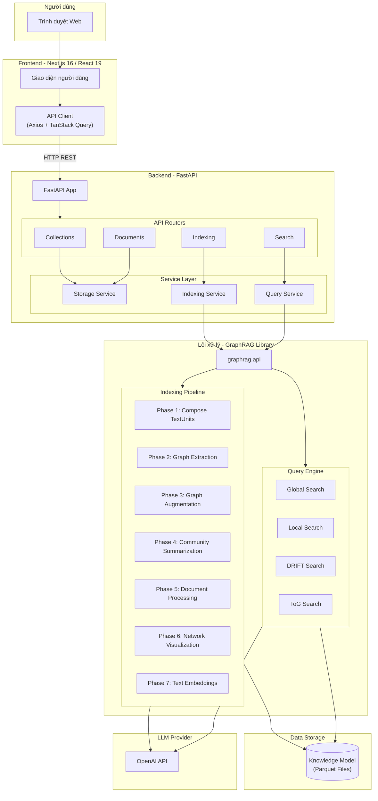

**Hình 3.1. Sơ đồ kiến trúc tổng thể của hệ thống GraphRAG với ToG Enhancement**

## Các thành phần chính

| Thành phần | Công nghệ | Mô tả |
|------------|-----------|-------|
| **Frontend** | Next.js 16, React 19, TanStack Query, Axios | Giao diện người dùng |
| **Backend** | FastAPI, Python | REST API wrapper |
| **Lõi GraphRAG** | graphrag library | Engine xây dựng đồ thị tri thức và truy vấn |
| **Storage** | Parquet Files | Lưu trữ Knowledge Model |
| **LLM Provider** | OpenAI API | GPT-4 và text-embedding-3-small |

---

## GraphRAG Knowledge Model

Knowledge Model là đặc tả dữ liệu đầu ra, bao gồm các loại thực thể sau:

| Thực thể | Mô tả |
|----------|-------|
| **Document** | Tài liệu đầu vào (file .txt hoặc row trong CSV) |
| **TextUnit** | Đoạn văn bản để phân tích (chunks) |
| **Entity** | Thực thể được trích xuất (người, địa điểm, sự kiện, tổ chức) |
| **Relationship** | Mối quan hệ giữa hai thực thể |
| **Covariate** | Thông tin claim với time-bound |
| **Community** | Cụm phân cấp từ hierarchical community detection |
| **Community Report** | Báo cáo tóm tắt nội dung mỗi community |

---

## Indexing Pipeline - 7 Phases

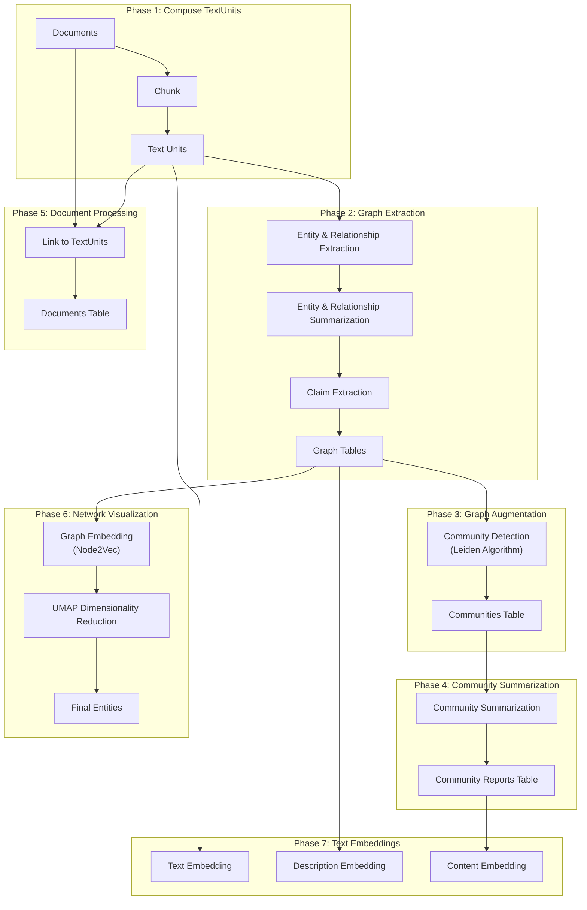

### Chi tiết từng Phase

#### Phase 1: Compose TextUnits
- **Input**: Documents (file .txt hoặc CSV)
- **Process**: Chia tài liệu thành các TextUnits (chunks)
- **Output**: TextUnits table
- **Config**: Chunk size mặc định 300 tokens, có thể cấu hình lên 1200 tokens

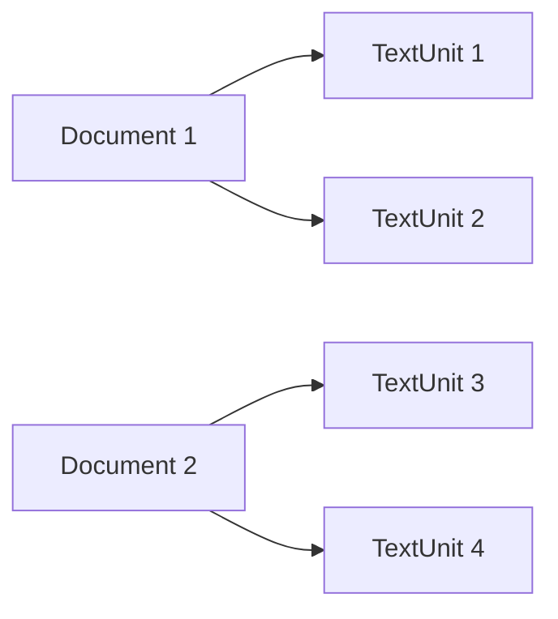

#### Phase 2: Graph Extraction
- **Entity & Relationship Extraction**: Trích xuất thực thể với title, type, description và quan hệ với source, target, description
- **Summarization**: Tóm tắt các description trùng lặp thành một description duy nhất
- **Claim Extraction** (optional): Trích xuất claims với time-bounds

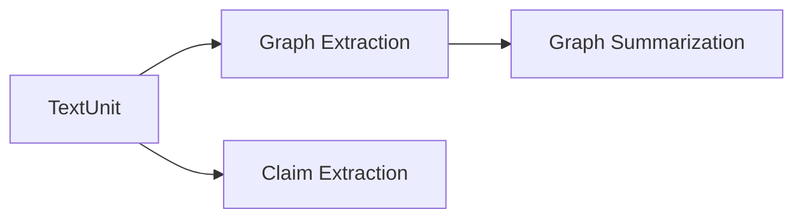

#### Phase 3: Graph Augmentation
- **Community Detection**: Sử dụng thuật toán **Hierarchical Leiden** để phân cụm thực thể
- **Output**: Communities table với cấu trúc phân cấp

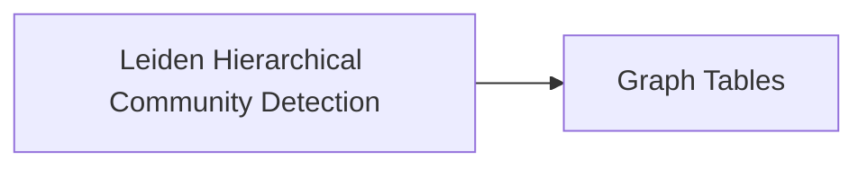

#### Phase 4: Community Summarization
- **Generate Community Reports**: Tạo báo cáo tóm tắt cho mỗi community bằng LLM
- **Summarize**: Tóm tắt ngắn gọn để sử dụng downstream

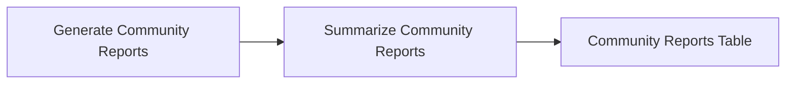

#### Phase 5: Document Processing
- Liên kết Documents với TextUnits
- Export Documents table

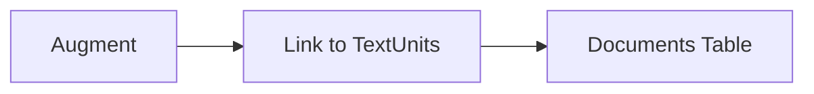

#### Phase 6: Network Visualization (Optional)
- **Graph Embedding**: Tạo vector representation bằng **Node2Vec**
- **UMAP**: Giảm chiều xuống 2D để visualization

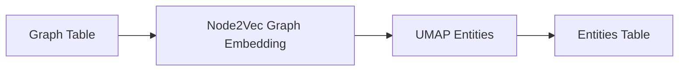

#### Phase 7: Text Embeddings
- Tạo embeddings cho: TextUnits, Entity descriptions, Community reports
- Ghi vào vector store

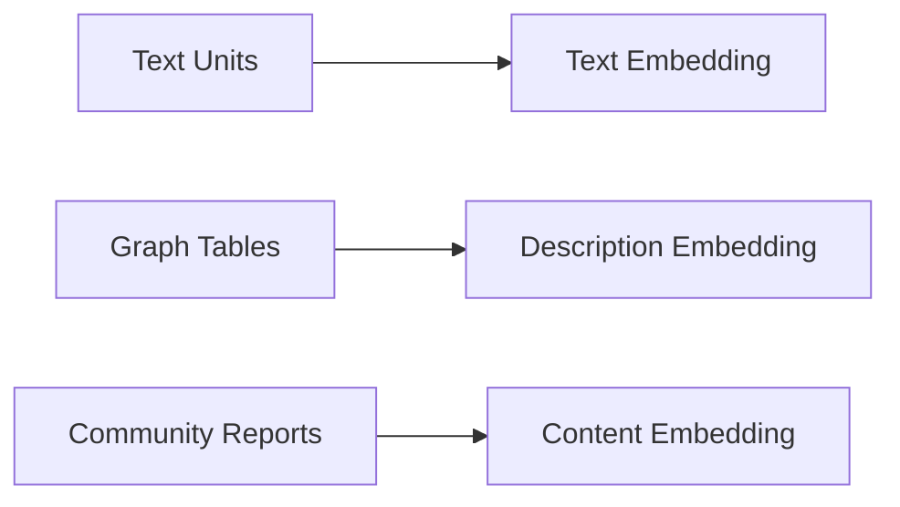

---

## Query Engine - 4 Phương thức Search

### So sánh các phương thức

| Phương thức | Approach | Depth | Transparency | Best For |
|-------------|----------|-------|--------------|----------|
| **Global Search** | Community-level aggregation (Map-Reduce) | Shallow | Low | Dataset overview, holistic questions |
| **Local Search** | Entity neighborhood | Shallow | Medium | Specific entity details |
| **DRIFT Search** | Adaptive local + global + community | Medium | Medium | Dynamic exploration |
| **ToG Search** | Iterative graph traversal (Beam Search) | Deep | High | Complex reasoning, multi-hop |

### 1. Global Search

Tìm kiếm toàn cục bằng cách tổng hợp thông tin từ tất cả community reports theo kiểu **map-reduce**.

**Use case**: Câu hỏi cần hiểu tổng quan về toàn bộ dataset
- "What are the most significant values of the herbs mentioned?"
- "Summarize the main themes in this document collection"

### 2. Local Search

Kết hợp dữ liệu từ knowledge graph với text chunks để trả lời câu hỏi về thực thể cụ thể.

**Use case**: Câu hỏi về thực thể cụ thể
- "What are the healing properties of chamomile?"
- "Who is John Smith and what is his role?"

### 3. DRIFT Search

Mở rộng Local Search bằng cách kết hợp thông tin community, tăng độ đa dạng của facts trong câu trả lời.

**Use case**: Exploration động, câu hỏi cần context rộng hơn
- Complex queries requiring both specific and contextual information

### 4. ToG (Think-on-Graph) Search

Thuật toán suy luận sâu thông qua **iterative graph traversal** với **beam search**.

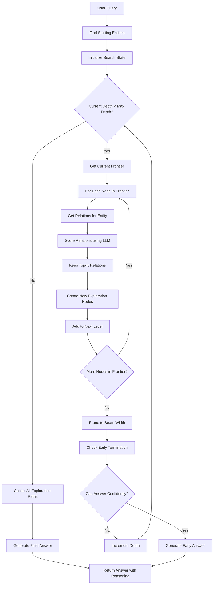

**Các phase của ToG:**

1. **Initialization**: Tìm entities liên quan đến query, tạo root nodes
2. **Exploration**: Duyệt relations, LLM scoring, giữ top-K
3. **Pruning**: Beam search giới hạn số paths song song
4. **Reasoning**: Tổng hợp paths, sinh câu trả lời có evidence

**Configuration Parameters:**

| Parameter | Default | Description |
|-----------|---------|-------------|
| `width` | 3 | Beam width - số paths song song |
| `depth` | 3 | Độ sâu exploration tối đa |
| `prune_strategy` | "llm" | Phương thức scoring (llm/semantic) |
| `num_retain_entity` | 5 | Số relations giữ lại mỗi entity |

**Ưu điểm ToG:**
- **Deep Reasoning**: Khám phá nhiều hops trong knowledge graph
- **Evidence-Based**: Câu trả lời có exploration paths minh bạch
- **Transparent**: User thấy được quá trình suy luận
- **Controlled**: Beam search ngăn exponential growth

---

## Luồng dữ liệu chi tiết

### Luồng 1: Indexing

```mermaid
sequenceDiagram
    actor User as Người dùng
    participant FE as Frontend
    participant BE as Backend
    participant GR as GraphRAG
    participant LLM as OpenAI API
    participant DB as Storage

    User->>FE: 1. Upload tài liệu
    FE->>BE: 2. POST /api/collections/{id}/documents
    BE->>DB: 3. Lưu file vào collection
    BE-->>FE: 4. Xác nhận upload
    
    User->>FE: 5. Bấm "Start Indexing"
    FE->>BE: 6. POST /api/collections/{id}/index
    BE->>GR: 7. Gọi graphrag.api.build_index()
    
    rect rgb(40, 40, 40)
        Note over GR,LLM: Phase 1-7: Indexing Pipeline
        GR->>GR: Phase 1: Compose TextUnits
        GR->>LLM: Phase 2: Entity & Relationship Extraction
        LLM-->>GR: Entities, Relationships
        GR->>GR: Phase 3: Community Detection (Leiden)
        GR->>LLM: Phase 4: Community Summarization
        LLM-->>GR: Community Reports
        GR->>GR: Phase 5: Document Processing
        GR->>GR: Phase 6: Network Visualization
        GR->>LLM: Phase 7: Text Embeddings
        LLM-->>GR: Vector embeddings
    end
    
    GR->>DB: 8. Lưu Parquet files (Knowledge Model)
    GR-->>BE: 9. Indexing completed
    BE-->>FE: 10. Status: completed
    FE-->>User: 11. Hiển thị "Indexed"
```

### Luồng 2: Query

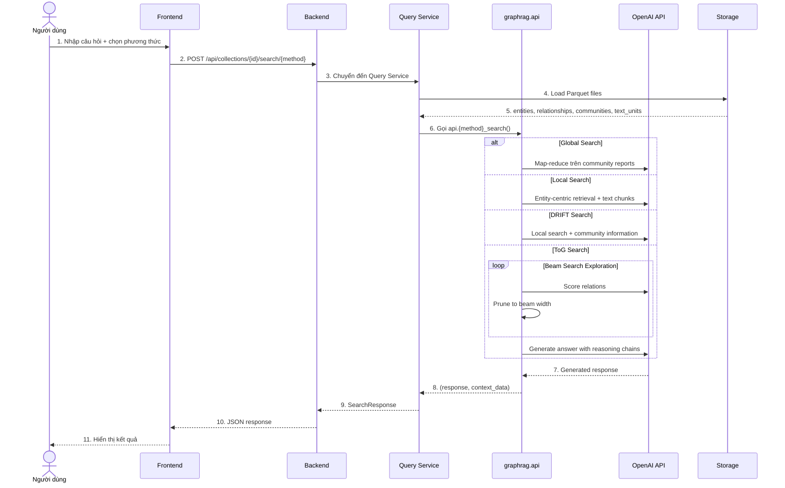

---

## API Endpoints

### Collections API
```
GET    /api/collections              # Liệt kê collections
POST   /api/collections              # Tạo collection mới
GET    /api/collections/{id}         # Lấy thông tin collection
DELETE /api/collections/{id}         # Xóa collection
```

### Documents API
```
GET    /api/collections/{id}/documents           # Liệt kê tài liệu
POST   /api/collections/{id}/documents           # Upload tài liệu
DELETE /api/collections/{id}/documents/{name}    # Xóa tài liệu
```

### Indexing API
```
POST   /api/collections/{id}/index    # Bắt đầu indexing
GET    /api/collections/{id}/index    # Lấy trạng thái indexing
```

### Search API
```
POST   /api/collections/{id}/search/global   # Global search
POST   /api/collections/{id}/search/local    # Local search
POST   /api/collections/{id}/search/tog      # ToG search
POST   /api/collections/{id}/search/drift    # DRIFT search
```

---

## Công nghệ sử dụng

### Frontend
| Thư viện | Phiên bản | Mục đích |
|----------|-----------|----------|
| Next.js | 16.0.7 | React framework |
| React | 19.2.0 | UI library |
| TanStack Query | 5.90.11 | Server state management |
| Axios | 1.13.2 | HTTP client |
| Tailwind CSS | 4 | Styling |

### Backend
| Thư viện | Mục đích |
|----------|----------|
| FastAPI | Web framework |
| Uvicorn | ASGI server |
| Pandas | Data manipulation |

### GraphRAG Core
| Thành phần | Mục đích |
|------------|----------|
| OpenAI GPT-4 | LLM cho extraction và reasoning |
| text-embedding-3-small | Vector embeddings |
| Leiden Algorithm | Hierarchical community detection |
| Node2Vec | Graph embedding |
| UMAP | Dimensionality reduction |
| Parquet | Data storage format |
