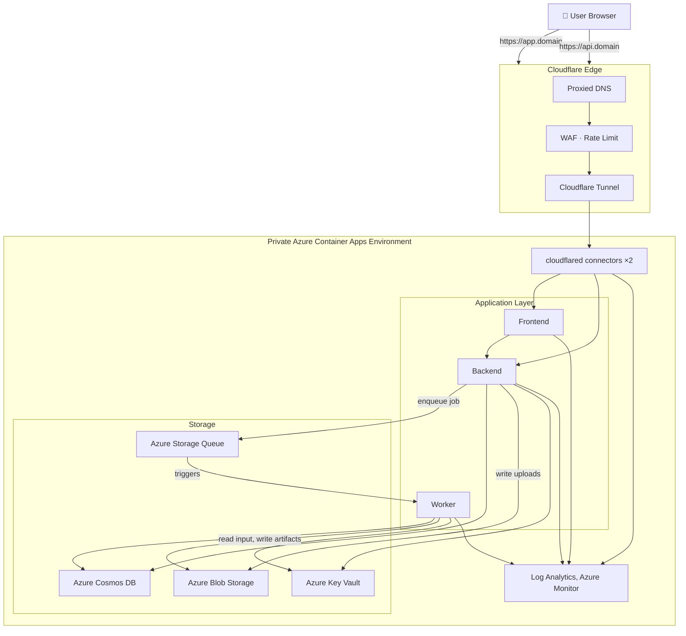

# Architecture Overview

```mermaid
flowchart TB
    U["👤 User Browser"]

    subgraph EDGE["Cloudflare Edge"]
        DNS["Proxied DNS"]
        WAF["WAF · Rate Limit"]
        TUNNEL["Cloudflare Tunnel"]
        DNS --> WAF --> TUNNEL
    end

    U -->|"https://app.domain"| EDGE
    U -->|"https://api.domain"| EDGE

    subgraph ACA["Private Azure Container Apps Environment"]
        CONN["cloudflared connectors ×2"]

        subgraph APPS["Application Layer"]
            FE["Frontend"]
            API["Backend"]
            WORKER["Worker"]
        end

        subgraph STORAGE["Storage"]
            QUEUE["Azure Storage Queue"]
            COSMOS["Azure Cosmos DB"]
            BLOB["Azure Blob Storage"]
            KV["Azure Key Vault"]
        end

        OBS["Log Analytics, Azure Monitor"]

        TUNNEL --> CONN
        CONN --> FE
        CONN --> API
        FE --> API

        API -->|"enqueue job"| QUEUE
        API --> COSMOS
        API -->|"write uploads"| BLOB
        API --> KV

        QUEUE -->|"triggers"| WORKER
        WORKER --> COSMOS
        WORKER -->|"read input, write artifacts"| BLOB
        WORKER --> KV

        FE --> OBS
        API --> OBS
        WORKER --> OBS
        CONN --> OBS
    end
```
