# 🏗️ Community Building trong GraphRAG - Phân Tích Chi Tiết

## 📋 Tổng Quan

Community Building là **trọng tâm** của GraphRAG pipeline, chịu trách nhiệm phân cụm entities thành các nhóm có ý nghĩa dựa trên relationships, tạo ra kiến trúc **hierarchical** cho knowledge graph.

**Mục tiêu chính:**
- Phát hiện các nhóm entities có liên quan chặt chẽ
- Tạo cấu trúc đa tầng (multi-level) cho các query khác nhau  
- Chuẩn bị dữ liệu cho Global Search và Community Reports

---

## 🔄 Pipeline Context

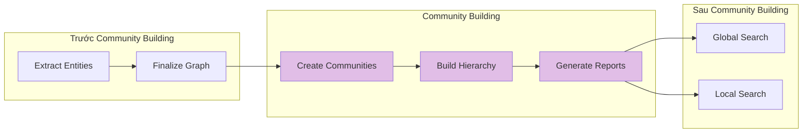

---

## 🎯 Thuật Toán Leiden Hierarchical Clustering

### 📊 Khái Niệm Cốt Lõi

#### 1️⃣ Modularity Metric
```python
# Đo lường chất lượng của một community partition
Q = (1/2m) * Σ_ij [A_ij - (k_i * k_j / 2m)] * δ(c_i, c_j)

# Trong đó:
# A_ij: Weight của edge giữa node i và j
# k_i, k_j: Degree của node i và j  
# m: Tổng weight của tất cả edges
# c_i, c_j: Community assignment
# δ(c_i, c_j): =1 nếu cùng community, =0 nếu khác
```

#### 2️⃣ Resolution Parameter
```python
# Điều chỉnh granularity của communities
γ = 1.0  # Standard
γ > 1.0  # Fewer, larger communities  
γ < 1.0  # More, smaller communities
```

---

## 🔧 Quy Trình 3 Phase

### Phase 1: Local Moving - Di Chuyển Tối Ưu

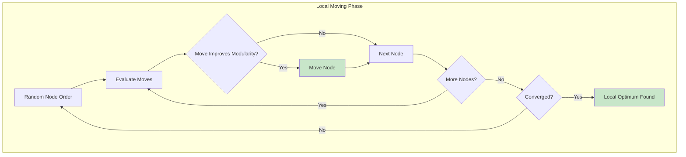

**Code Implementation:**
```python
def local_moving_phase(graph, communities):
    """Di chuyển nodes để cải thiện modularity"""
    improved = True
    
    while improved:
        improved = False
        
        for node in graph.nodes():
            current_comm = communities[node]
            best_comm = current_comm
            best_gain = 0
            
            # Tìm neighbors' communities
            neighbor_comms = set()
            for neighbor in graph.neighbors(node):
                neighbor_comm = communities[neighbor]
                if neighbor_comm != current_comm:
                    neighbor_comms.add(neighbor_comm)
            
            # Tính modularity gain cho mỗi potential move
            for target_comm in neighbor_comms:
                gain = calculate_modularity_gain(
                    node, current_comm, target_comm, graph, communities
                )
                
                if gain > best_gain:
                    best_gain = gain
                    best_comm = target_comm
            
            # Di chuyển nếu có improvement
            if best_gain > 0:
                communities[node] = best_comm
                improved = True
    
    return communities

def calculate_modularity_gain(node, current_comm, target_comm, graph, communities):
    """Tính toán improvement khi move node"""
    # Internal edges to target community
    edges_in = sum(
        graph[node][neighbor].get('weight', 1)
        for neighbor in graph.neighbors(node)
        if communities[neighbor] == target_comm
    )
    
    # External edges from target community  
    edges_out = sum(
        graph[node][neighbor].get('weight', 1)
        for neighbor in graph.neighbors(node)
        if communities[neighbor] != target_comm
    )
    
    # Node degree
    k_i = sum(graph[node][neighbor].get('weight', 1)
             for neighbor in graph.neighbors(node))
    
    # Target community total degree
    k_e = sum(
        sum(graph[neighbor][nbr].get('weight', 1)
            for nbr in graph.neighbors(neighbor))
        for neighbor in graph.nodes()
        if communities[neighbor] == target_comm
    )
    
    # Total edge weight in graph
    m = sum(graph[u][v].get('weight', 1) for u, v in graph.edges())
    
    # Modularity gain formula
    gain = (edges_in - edges_out) / (2 * m) - k_i * k_e / (2 * m * m)
    
    return gain
```

### Phase 2: Refinement - Tinh Chế Connectivity

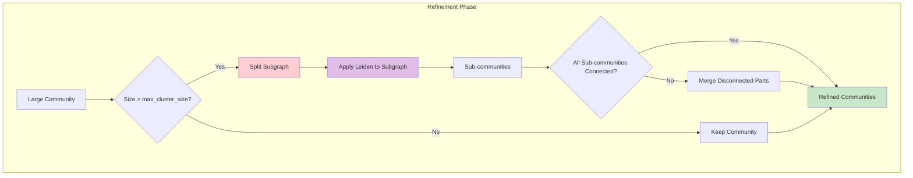

**Code Implementation:**
```python
def refinement_phase(graph, communities, max_cluster_size):
    """Tinh chế communities để đảm bảo connectivity và size constraints"""
    refined_communities = {}
    
    for comm_id in set(communities.values()):
        # Lấy tất cả nodes trong community
        community_nodes = [
            node for node, comm in communities.items() 
            if comm == comm_id
        ]
        
        # Check size constraint
        if len(community_nodes) <= max_cluster_size:
            # Community đủ nhỏ, giữ nguyên
            for node in community_nodes:
                refined_communities[node] = comm_id
        else:
            # Community quá lớn, cần split
            sub_communities = split_large_community(
                community_nodes, graph, max_cluster_size // 2
            )
            
            for sub_comm_id, sub_nodes in sub_communities.items():
                for node in sub_nodes:
                    refined_communities[node] = sub_comm_id
    
    return refined_communities

def split_large_community(nodes, graph, new_max_size):
    """Split large community thành smaller connected ones"""
    subgraph = graph.subgraph(nodes)
    
    # Áp dụng Leiden lên subgraph với max size nhỏ hơn
    sub_partitions = hierarchical_leiden(
        subgraph, 
        max_cluster_size=new_max_size
    )
    
    # Process results
    sub_communities = {}
    for partition in sub_partitions:
        sub_communities[partition.cluster] = sub_communities.get(
            partition.cluster, []
        )
        sub_communities[partition.cluster].append(partition.node)
    
    # Merge disconnected parts if needed
    return ensure_connectivity(sub_communities, graph)

def ensure_connectivity(communities, graph):
    """Đảm bảo mỗi community connected"""
    connected_communities = {}
    
    for comm_id, nodes in communities.items():
        subgraph = graph.subgraph(nodes)
        components = list(nx.connected_components(subgraph))
        
        if len(components) == 1:
            # Already connected
            connected_communities[comm_id] = nodes
        else:
            # Split connected components thành separate communities
            for i, component in enumerate(components):
                new_comm_id = f"{comm_id}_{i}"
                connected_communities[new_comm_id] = list(component)
    
    return connected_communities
```

### Phase 3: Aggregation - Gộp Cấp Lớn Hơn

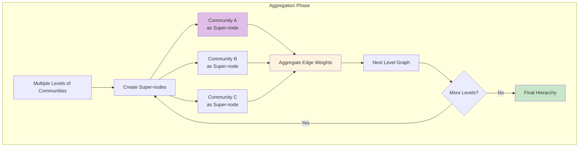

**Code Implementation:**
```python
def aggregation_phase(graph, communities):
    """Aggregate communities thành super-nodes cho level cao hơn"""
    super_nodes = {}
    super_edges = {}
    
    # Create super-nodes
    for comm_id in set(communities.values()):
        community_nodes = [
            node for node, comm in communities.items() 
            if comm == comm_id
        ]
        super_nodes[comm_id] = community_nodes
    
    # Create super-edges với aggregated weights
    for u, v, data in graph.edges(data=True):
        comm_u = communities[u]
        comm_v = communities[v]
        
        if comm_u != comm_v:
            # Tạo key cho edge giữa communities
            edge_key = (min(comm_u, comm_v), max(comm_u, comm_v))
            
            # Aggregate weight
            if edge_key not in super_edges:
                super_edges[edge_key] = 0
            super_edges[edge_key] += data.get('weight', 1)
    
    # Build aggregated graph
    aggregated_graph = nx.Graph()
    aggregated_graph.add_nodes_from(super_nodes.keys())
    
    for (comm_u, comm_v), weight in super_edges.items():
        aggregated_graph.add_edge(comm_u, comm_v, weight=weight)
    
    return aggregated_graph, super_nodes

def build_hierarchy(graph, max_cluster_size, use_lcc, seed):
    """Build complete community hierarchy"""
    hierarchy_levels = []
    current_graph = graph
    
    if use_lcc:
        current_graph = extract_largest_connected_component(current_graph)
    
    level = 0
    
    while len(current_graph.nodes()) > 1:
        # Apply 3-phase Leiden
        communities = leiden_three_phase(
            current_graph, max_cluster_size, seed
        )
        
        # Store this level
        hierarchy_levels.append({
            'level': level,
            'communities': communities,
            'graph': current_graph.copy()
        })
        
        # Prepare for next level
        if len(set(communities.values())) <= 1:
            break  # Single community left
            
        current_graph, node_mapping = aggregation_phase(
            current_graph, communities
        )
        
        # Update max cluster size for next level
        max_cluster_size = min(max_cluster_size * 2, 100)
        level += 1
        
        if level > 10:  # Prevent infinite loops
            break
    
    return hierarchy_levels
```

---

## 🎨 Visualization & Examples

### Example 1: Tech Company Dataset

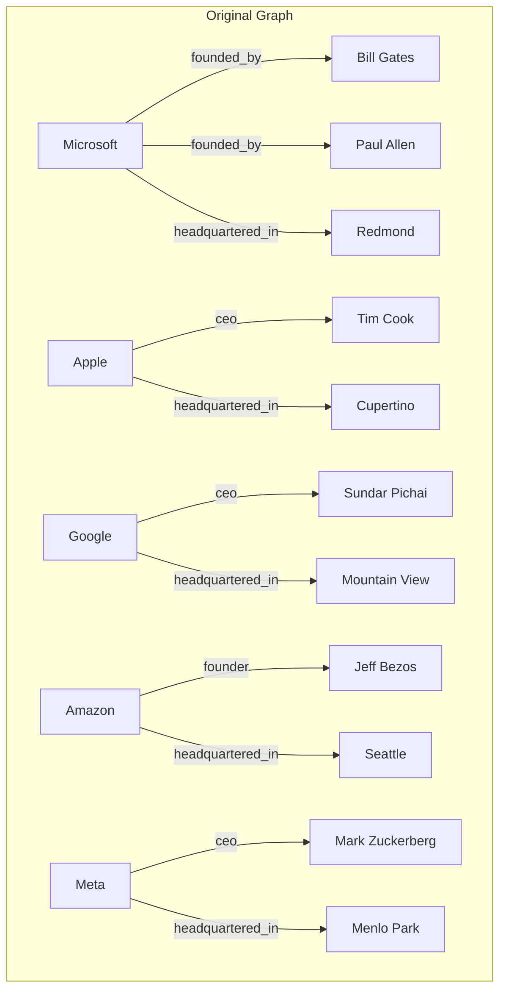

### Level 0: Fine-grained Communities

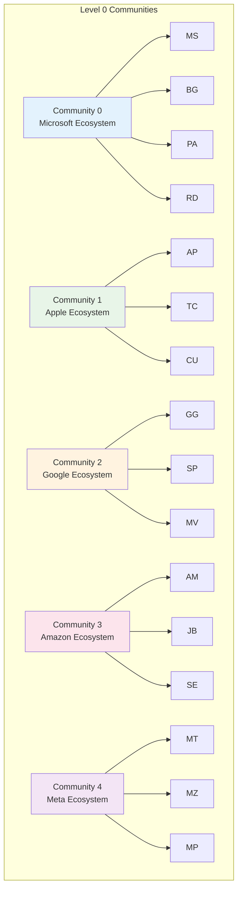

### Level 1: Medium-grained Communities

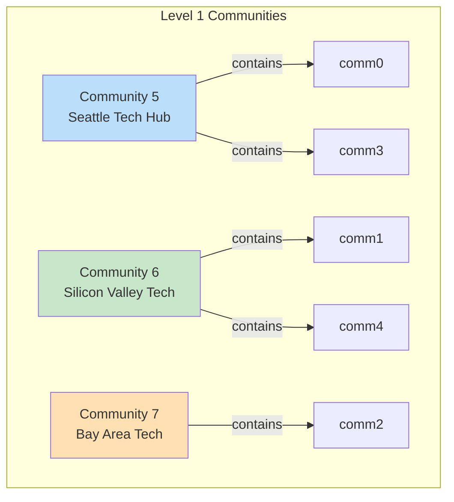

### Level 2: Coarse-grained Communities

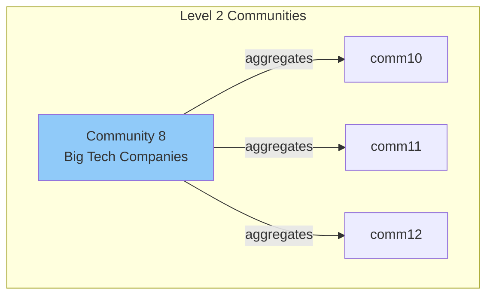

---

## 📊 Data Structure Examples

### Input Data Format

```python
# entities.parquet
entities = pd.DataFrame([
    {
        "id": "ent_001",
        "title": "MICROSOFT", 
        "type": "organization",
        "description": "Technology company founded in 1975",
        "text_unit_ids": ["tu_001", "tu_002"],
        "frequency": 5,
        "degree": 8
    },
    {
        "id": "ent_002",
        "title": "BILL_GATES",
        "type": "person", 
        "description": "Co-founder of Microsoft",
        "text_unit_ids": ["tu_001"],
        "frequency": 3,
        "degree": 4
    }
])

# relationships.parquet
relationships = pd.DataFrame([
    {
        "id": "rel_001",
        "source": "MICROSOFT",
        "target": "BILL_GATES", 
        "description": "founded by",
        "weight": 2.0,
        "combined_degree": 12,
        "text_unit_ids": ["tu_001", "tu_003"]
    }
])
```

### Output Community Data

```python
# communities.parquet - Level 0
communities_level0 = pd.DataFrame([
    {
        "id": "comm_uuid_001",
        "human_readable_id": 0,
        "community": 0,
        "parent": -1,
        "children": [5],
        "level": 0,
        "title": "Community 0",
        "entity_ids": ["ent_001", "ent_002", "ent_003", "ent_004"],
        "relationship_ids": ["rel_001", "rel_002", "rel_003"],
        "text_unit_ids": ["tu_001", "tu_002", "tu_003"],
        "period": "2024-01-15",
        "size": 4
    }
])

# communities.parquet - Level 1  
communities_level1 = pd.DataFrame([
    {
        "id": "comm_uuid_005",
        "human_readable_id": 5,
        "community": 5,
        "parent": -1,
        "children": [],
        "level": 1,
        "title": "Community 5", 
        "entity_ids": ["ent_001", "ent_002", "ent_003", "ent_004", "ent_010", "ent_011"],
        "relationship_ids": ["rel_001", "rel_002", "rel_003", "rel_008", "rel_009"],
        "text_unit_ids": ["tu_001", "tu_002", "tu_003", "tu_008", "tu_009"],
        "period": "2024-01-15",
        "size": 6
    }
])
```

---

## 🛠️ Configuration & Parameters

### YAML Configuration
```yaml
# settings.yaml
cluster_graph:
  max_cluster_size: 10      # Max entities per community
  use_lcc: true            # Use Largest Connected Component
  seed: 0xDEADBEEF         # Random seed for reproducibility

# Related configurations
community_reports:
  model_id: gpt-4-turbo-preview
  max_input_length: 16000  # Tokens per community report
  concurrent_requests: 4   # Parallel LLM calls
```

### Parameter Impact Analysis

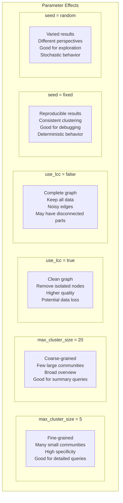

---

## 🚀 Performance & Optimization

### Complexity Analysis
```python
# Time Complexity per Level
O(n * d)  # n = nodes, d = average degree

# Overall Complexity  
O(h * n * d)  # h = number of hierarchy levels

# Memory Usage
O(n + m)  # Graph storage
O(n * h)  # Community assignments

# Real-world Performance
Nodes: 10,000 entities
Edges: 50,000 relationships  
Levels: 3-5 typical
Runtime: 30 seconds - 5 minutes
Memory: 1-4 GB
```

### Optimization Strategies

```python
def optimize_community_detection(graph, config):
    """Optimize based on graph characteristics"""
    
    num_nodes = len(graph.nodes())
    num_edges = len(graph.edges())
    
    # Strategy 1: Edge weight filtering
    if num_edges > 100000:
        # Keep top 80% edges by weight
        weight_threshold = np.percentile(
            [data.get('weight', 1) for _, _, data in graph.edges(data=True)],
            20
        )
        
        filtered_edges = [
            (u, v, data) for u, v, data in graph.edges(data=True)
            if data.get('weight', 1) >= weight_threshold
        ]
        
        graph = nx.Graph()
        graph.add_nodes_from(graph.nodes())
        graph.add_edges_from(filtered_edges)
        
        logger.info(f"Filtered edges: {num_edges} → {len(filtered_edges)}")
    
    # Strategy 2: Adaptive cluster size
    if num_nodes > 50000:
        config.max_cluster_size = min(config.max_cluster_size * 2, 100)
    elif num_nodes < 1000:
        config.max_cluster_size = max(config.max_cluster_size // 2, 5)
    
    return graph, config
```

---

## 🔍 Quality Metrics & Validation

### Modularity Scores
```python
def analyze_community_quality(graph, communities_by_level):
    """Analyze quality across all hierarchy levels"""
    
    quality_report = {}
    
    for level, communities in communities_by_level.items():
        # Calculate modularity
        modularity = calculate_modularity(graph, communities)
        
        # Count communities
        num_communities = len(set(communities.values()))
        
        # Average community size
        sizes = {}
        for node, comm in communities.items():
            sizes[comm] = sizes.get(comm, 0) + 1
        
        avg_size = sum(sizes.values()) / len(sizes)
        max_size = max(sizes.values())
        min_size = min(sizes.values())
        
        # Connectivity check
        connectivity_scores = check_connectivity(graph, communities)
        connected_communities = sum(
            1 for score in connectivity_scores.values() 
            if score['connected']
        )
        
        quality_report[level] = {
            'modularity': modularity,
            'num_communities': num_communities,
            'avg_community_size': avg_size,
            'max_community_size': max_size,
            'min_community_size': min_size,
            'connected_communities': connected_communities,
            'connectivity_ratio': connected_communities / num_communities
        }
    
    return quality_report
```

### Example Quality Report
```python
quality_report = {
    0: {  # Level 0
        'modularity': 0.72,
        'num_communities': 15,
        'avg_community_size': 8.5,
        'max_community_size': 12,
        'min_community_size': 3,
        'connected_communities': 15,
        'connectivity_ratio': 1.0
    },
    1: {  # Level 1  
        'modularity': 0.68,
        'num_communities': 6,
        'avg_community_size': 21.2,
        'max_community_size': 35,
        'min_community_size': 12,
        'connected_communities': 6,
        'connectivity_ratio': 1.0
    },
    2: {  # Level 2
        'modularity': 0.61,
        'num_communities': 2,
        'avg_community_size': 63.5,
        'max_community_size': 78,
        'min_community_size': 49,
        'connected_communities': 2,
        'connectivity_ratio': 1.0
    }
}
```

---

## 🔄 Integration with Query Methods

### Global Search Usage
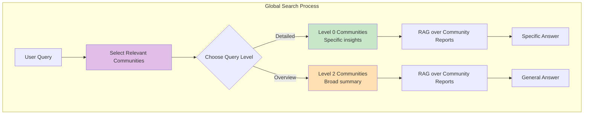

### Community Hierarchy Navigation
```python
def navigate_community_hierarchy(query, communities, reports):
    """Navigate hierarchy based on query complexity"""
    
    # Analyze query complexity
    query_tokens = len(query.split())
    
    if query_tokens <= 5:
        # Simple query → use highest level
        target_level = max(communities['level'])
    elif query_tokens <= 15:
        # Medium complexity → middle level  
        target_level = communities['level'].median()
    else:
        # Complex query → detailed level
        target_level = 0
    
    # Get communities at target level
    level_communities = communities[communities['level'] == target_level]
    level_reports = reports[reports['level'] == target_level]
    
    return level_communities, level_reports
```

---

## 🛠️ Debugging & Troubleshooting

### Common Issues & Solutions

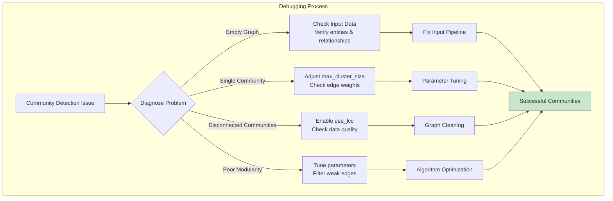

### Debug Tools
```python
def debug_community_detection(entities, relationships, config):
    """Debug community detection process"""
    
    # 1. Check basic statistics
    logger.info(f"Entities: {len(entities)}")
    logger.info(f"Relationships: {len(relationships)}")
    
    # 2. Build graph
    graph = create_graph(relationships)
    
    # 3. Analyze graph properties
    logger.info(f"Graph nodes: {len(graph.nodes())}")
    logger.info(f"Graph edges: {len(graph.edges())}")
    logger.info(f"Is connected: {nx.is_connected(graph)}")
    logger.info(f"Number of components: {nx.number_connected_components(graph)}")
    
    # 4. Edge weight distribution
    weights = [data.get('weight', 1) for _, _, data in graph.edges(data=True)]
    logger.info(f"Weight range: {min(weights)} - {max(weights)}")
    logger.info(f"Mean weight: {np.mean(weights):.2f}")
    
    # 5. Degree distribution
    degrees = [graph.degree(node) for node in graph.nodes()]
    logger.info(f"Degree range: {min(degrees)} - {max(degrees)}")
    logger.info(f"Mean degree: {np.mean(degrees):.2f}")
    
    # 6. Test community detection with different parameters
    for max_size in [5, 10, 20]:
        try:
            communities = cluster_graph(graph, max_size, True, 42)
            num_communities = len(set(comm[1] for comm in communities))
            logger.info(f"Max size {max_size}: {num_communities} communities")
        except Exception as e:
            logger.error(f"Failed with max_size {max_size}: {e}")
```

---

## 📝 Best Practices Summary

### ✅ Recommended Settings
```yaml
# For small datasets (< 1000 entities)
cluster_graph:
  max_cluster_size: 5
  use_lcc: true
  seed: 42

# For medium datasets (1000-10000 entities)  
cluster_graph:
  max_cluster_size: 10
  use_lcc: true
  seed: 42

# For large datasets (> 10000 entities)
cluster_graph:
  max_cluster_size: 25
  use_lcc: true
  seed: 42
```

### 🎯 Optimization Tips
1. **Start with default parameters**, adjust based on results
2. **Enable use_lcc** for cleaner graphs
3. **Use fixed seed** for reproducible debugging
4. **Monitor modularity** to ensure quality
5. **Check connectivity** of resulting communities
6. **Validate hierarchy** makes semantic sense

### 🔄 Workflow Integration
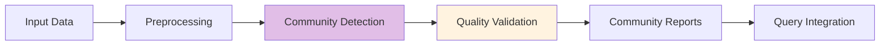

Community building trong GraphRAG là một **process tinh vi** kết hợp **graph theory**, **machine learning**, và **domain knowledge** để tạo ra kiến trúc hierarchy mạnh mẽ cho knowledge graph. Khi được implement đúng, nó cung cấp nền tảng vững chắc cho **multi-level reasoning** và **semantic search**.