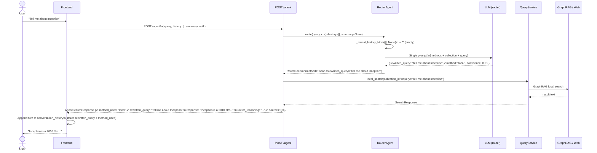
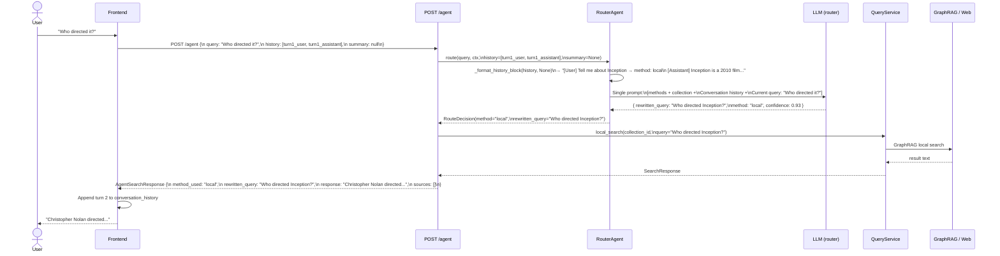
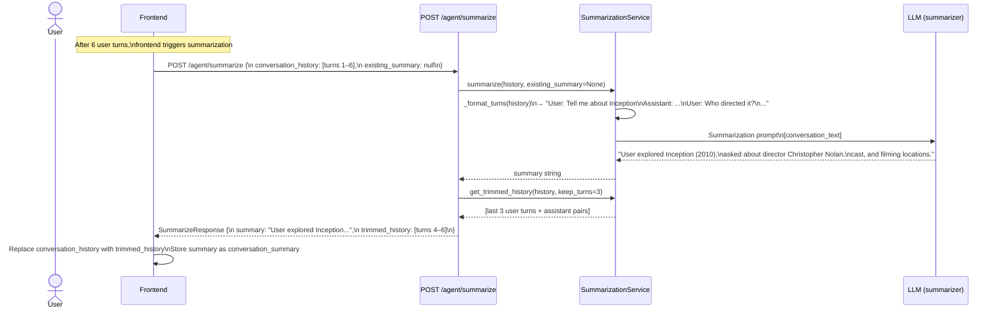
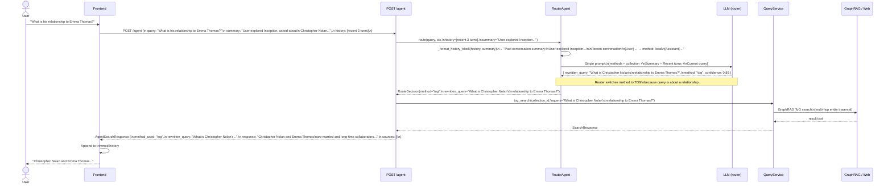
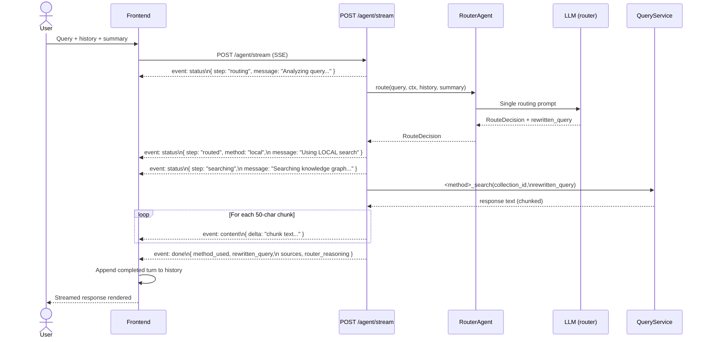
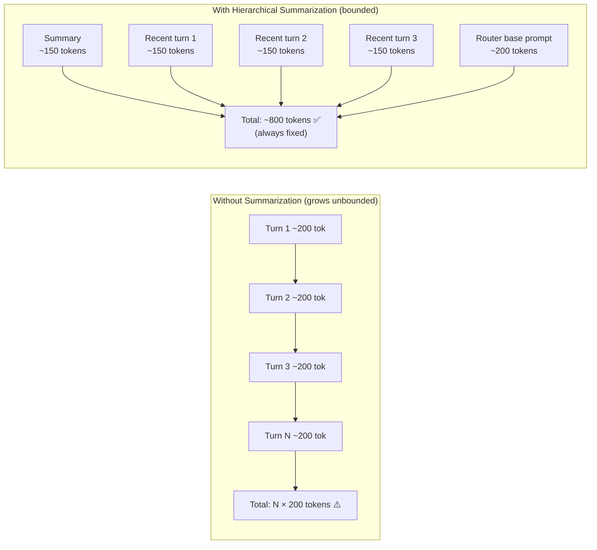
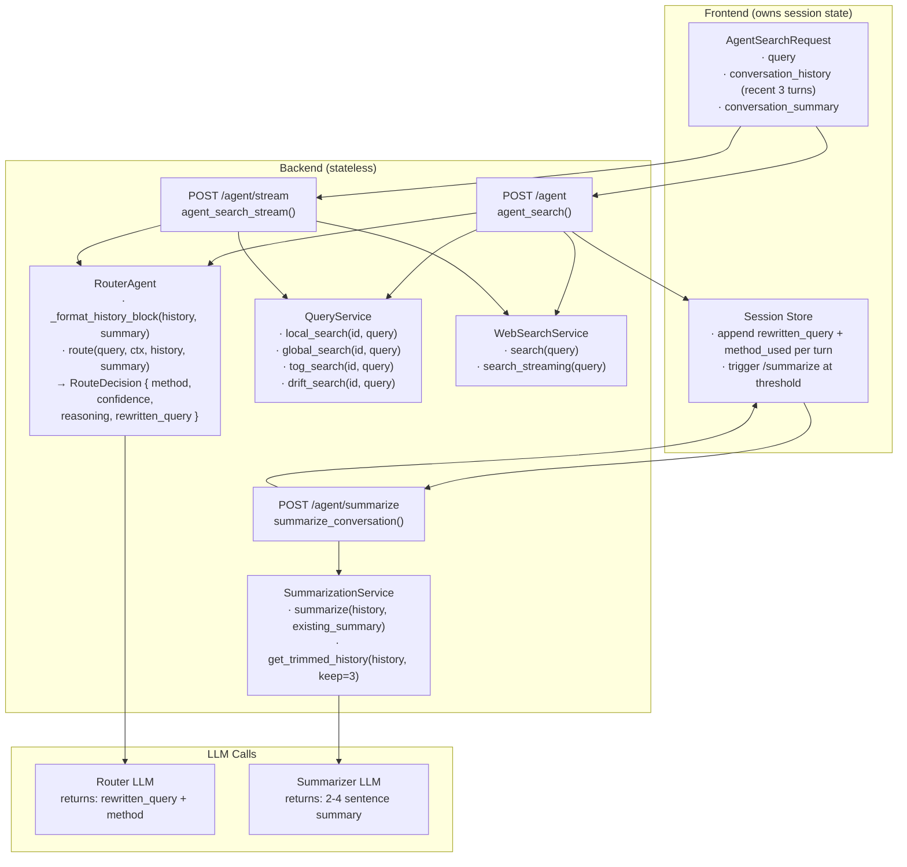

# Router Agent Conversation Flow (Post-Implementation)

> Illustrates the full flow from user query to final answer after implementing the conversation history + hierarchical summarization plan.

---

## 1. Happy Path — First Query (No History)

---

## 2. Happy Path — Follow-Up Query (With History, No Summary Yet)

---

## 3. Summarization Trigger — History Exceeds Threshold

> Frontend triggers this when `conversation_history` reaches the threshold (e.g. 6 user turns).

---

## 4. Query After Summarization (Summary + Recent Turns)

---

## 5. Streaming Variant Flow

---

## 6. Token Budget — How Summarization Keeps Prompts Bounded

---

## 7. Component Map

