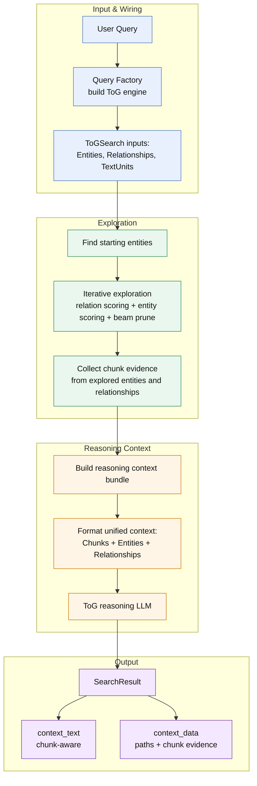
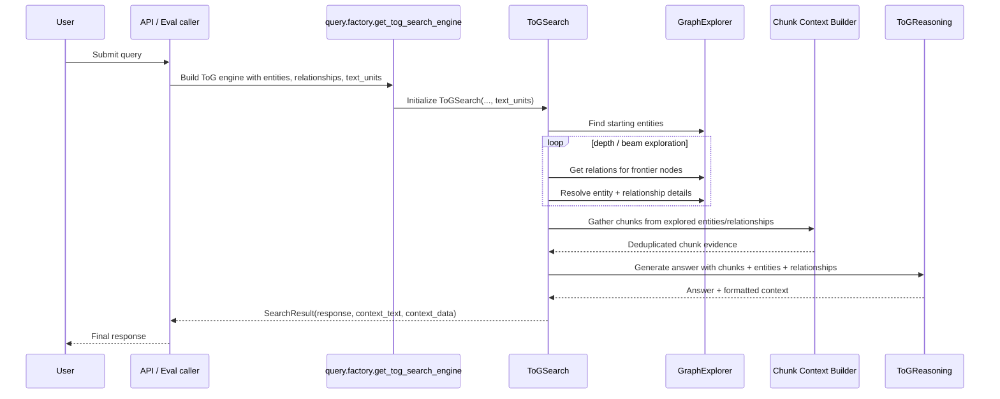

# ToG Chunk-Aware Context Flow

## Goal

Visualize the proposed ToG search flow after adding chunk context so the final reasoning context includes:

- chunks
- entities
- relationships

## Summary

Today, ToG search is initialized with entities and relationships, explores graph paths, and formats final reasoning context from graph evidence only.

The proposed flow adds `text_units` (chunks) into ToG, collects chunk evidence from explored entities and relationships, then merges all evidence into a unified reasoning context before generating the final answer.

## Proposed Flow



## Sequence View



## Main Changes in the New Flow

1. **ToG input expands**
   - `ToGSearch` receives `text_units` in addition to `entities` and `relationships`.

2. **Chunk evidence is collected during/after exploration**
   - explored entities contribute chunk IDs via `Entity.text_unit_ids`
   - explored relationships contribute chunk IDs via `Relationship.text_unit_ids`

3. **Reasoning context becomes unified**
   - context formatter includes:
     - `=== CHUNKS ===`
     - `=== ENTITIES ===`
     - `=== RELATIONSHIPS ===`

4. **SearchResult becomes chunk-aware**
   - `context_text` contains chunk evidence
   - `context_data` can expose chunk metadata in addition to exploration paths

## Key File Touchpoints

- `graphrag/query/factory.py`
- `graphrag/query/structured_search/tog_search/search.py`
- `graphrag/query/structured_search/tog_search/exploration.py`
- `graphrag/query/structured_search/tog_search/reasoning.py`
- `graphrag/query/structured_search/tog_search/state.py`
- `graphrag/query/context_builder/source_context.py`
- `graphrag/query/input/retrieval/text_units.py`
- `graphrag/api/query.py`
- `graphrag/eval/runner.py`

## Suggested Evidence Assembly Logic

```text
query
  -> starting entities
  -> explored nodes
  -> collect related entities and relationships
  -> collect linked text units/chunks
  -> deduplicate chunks
  -> trim chunks by token budget
  -> format final context
  -> reasoning LLM
```

## Notes

- Reuse existing text-unit formatting utilities where possible.
- Keep chunk selection deterministic and token-budgeted.
- Preserve current ToG exploration behavior; only extend the context assembly path.
