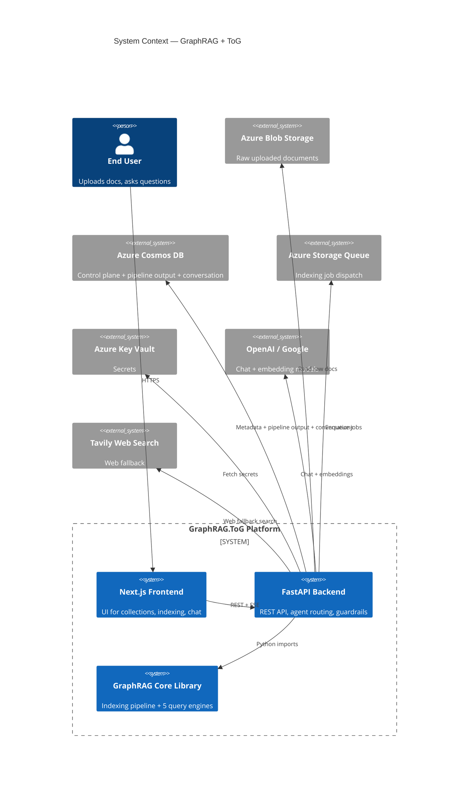
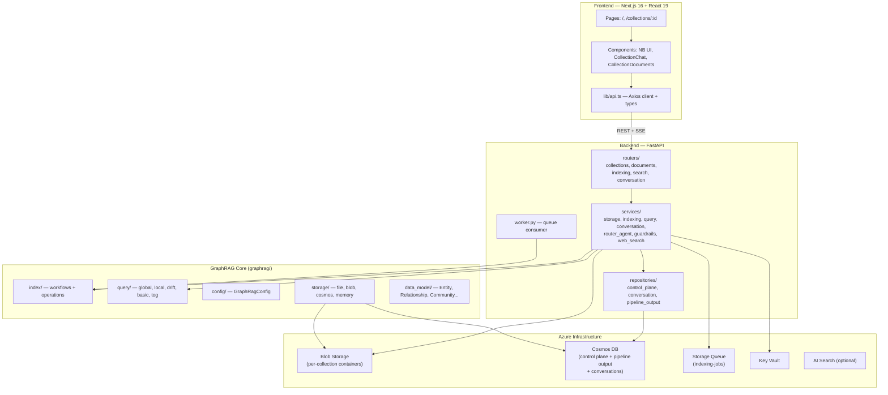
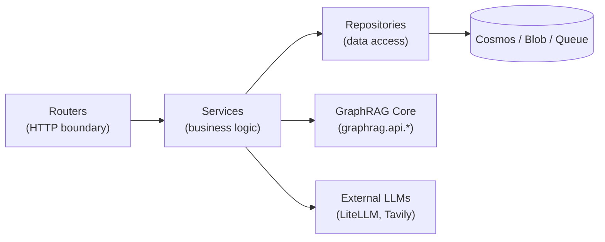
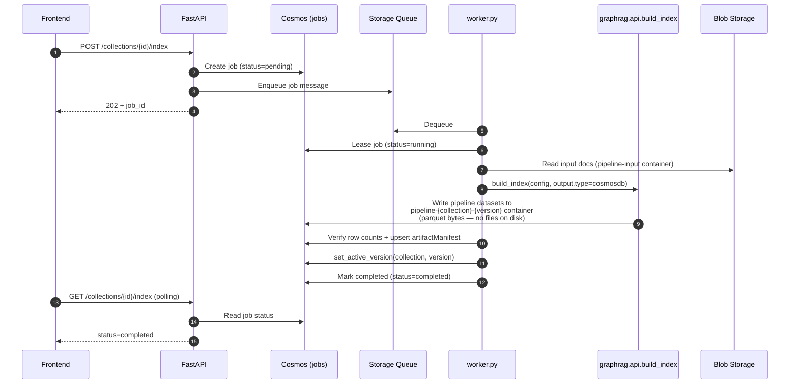
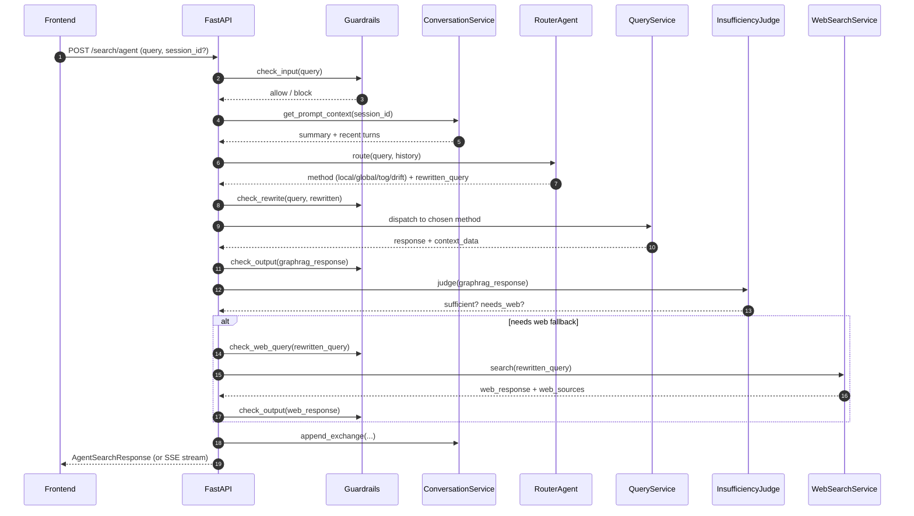

# Architecture Overview

This document describes the high-level architecture of the **GraphRAG with ToG Enhancement** system: how the frontend, backend, GraphRAG core library, and Azure infrastructure interact end-to-end.

## 1. System Context

The system is a knowledge-graph powered RAG application that:

1. Ingests user-uploaded documents into per-collection blob containers.
2. Builds a knowledge graph (entities, relationships, communities) via the GraphRAG indexing pipeline.
3. Serves five different search strategies (Global, Local, DRIFT, Basic, ToG) through a FastAPI backend.
4. Exposes a Next.js neo-brutalist frontend for collection management and conversational chat.

## 2. Logical Layers

## 3. Frontend Architecture

**Stack:** Next.js 16 (App Router), React 19, TypeScript, TanStack Query 5, Axios, Tailwind CSS v4.

**Routes:**

| Route | File | Purpose |
|---|---|---|
| `/` | `app/page.tsx` | Collections dashboard (list, create, delete) |
| `/collections/[id]` | `app/collections/[id]/page.tsx` | Collection detail with tabs (Documents, Chat) |
| `/api/health` | `app/api/health/route.ts` | Liveness probe for Docker |

**State management:**
- **Server state**: TanStack Query (`QueryClient`) — caches collections, documents, indexing status; auto-polls indexing status every 2s while running.
- **Local state**: per-component `useState` — chat messages, conversation history, search method selection, streaming controllers.

**API integration (`lib/api.ts`):**
- Axios instance with base URL `${NEXT_PUBLIC_API_BASE_URL}/api`.
- `validateStatus: () => true` + response interceptor that throws `ApiStatusError` for >= 400.
- SSE handled directly via `fetch()` with `ReadableStream` for `/search/agent/stream`.

**Design system — neo-brutalism:**
- 3px black borders, hard offset shadows (`4px 4px 0 0 #000`).
- Lime-green primary, pink secondary, cream background.
- Components: `NBButton`, `NBCard`, `NBInput`, `NBLayout`.

## 4. Backend Architecture

**Stack:** FastAPI, Pydantic v2, LiteLLM, Azure SDKs (cosmos, storage, identity, keyvault), NeMo Guardrails (optional), Tavily.

**Layered structure:**

**Routers** (`backend/app/routers/`):
- `collections.py` — CRUD for collections
- `documents.py` — Upload/list/delete documents
- `indexing.py` — Start/poll indexing jobs
- `search.py` — Direct + agent-routed search, web search, summarize
- `conversation.py` — Server-side session management

**Key services:**

| Service | Responsibility |
|---|---|
| `StorageService` | Collection + document CRUD across blob and Cosmos |
| `IndexingService` | Enqueue and track indexing jobs |
| `QueryService` | Orchestrate the 5 search methods, manage dataset cache |
| `RouterAgent` | LLM-based routing decision (which search method) |
| `InsufficiencyJudge` | Decides if web fallback is needed |
| `NemoGuardrailsService` | Input/output safety (deterministic + NeMo) |
| `ConversationService` | Server-side session persistence + recent turns |
| `SummarizationService` | Compress long conversations |
| `WebSearchService` | Tavily-backed web search with LLM synthesis |
| `QueueService` | Azure Storage Queue wrapper for job dispatch |

**Middleware (`main.py`):**
1. CORS (configurable origins).
2. Edge auth (`x-edge-secret`) when `REQUIRE_EDGE_AUTH=true`.
3. Trusted tunnel proxy detection (Cloudflare).
4. Rate limiting (in-memory, per-process).
5. Structured JSON logging with request IDs.

## 5. GraphRAG Core Library

The `graphrag/` package is consumed as a library by the backend (no separate process).

**Key sub-packages:**

| Package | Role |
|---|---|
| `graphrag.api` | Top-level entry points: `build_index`, `global_search`, `local_search`, `drift_search`, `basic_search`, `tog_search` |
| `graphrag.index` | Indexing pipeline (workflows + operations) |
| `graphrag.query` | 5 search engines (global, local, drift, basic, tog) |
| `graphrag.config` | `GraphRagConfig` Pydantic model + YAML loader |
| `graphrag.storage` | `PipelineStorage` abstraction (file, blob, cosmos, memory) |
| `graphrag.data_model` | `Entity`, `Relationship`, `Community`, `CommunityReport`, `TextUnit`, `Document`, `Covariate` |
| `graphrag.query.llm.tog` | ToG-specific exploration, pruning, reasoning |

See [index_flow.md](index_flow.md) and [query_flow.md](query_flow.md) for detailed flows.

## 6. Indexing Job Lifecycle (High-Level)

## 7. Query / Agent Search Lifecycle (High-Level)

## 8. Authentication & Security

- **Edge auth**: optional `x-edge-secret` header validated by middleware when `REQUIRE_EDGE_AUTH=true`.
- **Trusted tunnel**: Cloudflare Tunnel traffic from private IP ranges is recognized via `cf-ray` and `x-forwarded-for`.
- **Platform auth**: `REQUIRE_PLATFORM_AUTH=true` enables `X-MS-CLIENT-PRINCIPAL` validation (Azure Container Apps Easy Auth).
- **Secrets**: Pulled from Key Vault at startup via `azure_runtime.py`; never hardcoded.
- **Guardrails**: Deterministic regex checks + optional NeMo Rails for jailbreak/secret leakage detection.
- **Rate limiting**: Per-process in-memory limiter (not distributed — fronted by Cloudflare for production).

## 9. Deployment Topology (Production)

- **Frontend**: `ca-gtog-frontend-prod` (Azure Container Apps) — internal origin reachable only via Cloudflare Tunnel.
- **Backend**: `ca-gtog-api-prod` (Azure Container Apps) — Easy Auth `AllowAnonymous`, backend enforces auth via `REQUIRE_PLATFORM_AUTH=true`.
- **Public hostnames**: `app.gtog.id.vn` (frontend), `api.gtog.id.vn` (API).
- **Worker**: Same image as API, runs `python -m app.worker` to consume the indexing queue.
| **Storage** | Azure Blob (raw documents in `pipeline-input` container), Cosmos DB (control plane + pipeline output + conversations + on-demand vector containers `vec-{collection}-{version}-{embedding}`), Storage Queue (jobs). |

## 10. Cross-Cutting Concerns

| Concern | Implementation |
|---|---|
| **Configuration** | `backend/app/config.py` (Pydantic Settings) + `graphrag/settings.yaml` |
| **Secrets** | Azure Key Vault, fetched at startup |
| **Observability** | Structured JSON logs with `request_id`, `cf_ray`, latency, status |
| **Caching** | LRU dataset cache in `serving_context_cache.py` (configurable max entries) |
| **Async I/O** | All Azure SDK calls + LLM calls are async; SSE for streaming |
| **Versioning** | `semversioner` for changelog; image tags include date + commit |

## Related Docs

- [api.md](api.md) — REST API reference
- [database_schema.md](database_schema.md) — Cosmos containers + pipeline dataset schemas
- [index_flow.md](index_flow.md) — Detailed indexing pipeline
- [query_flow.md](query_flow.md) — Detailed query flows for all 5 methods
