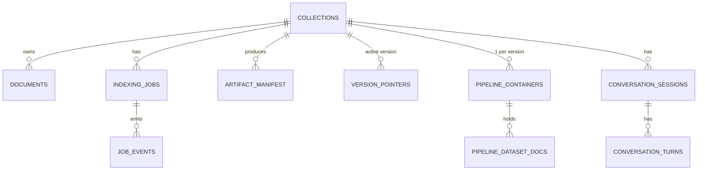
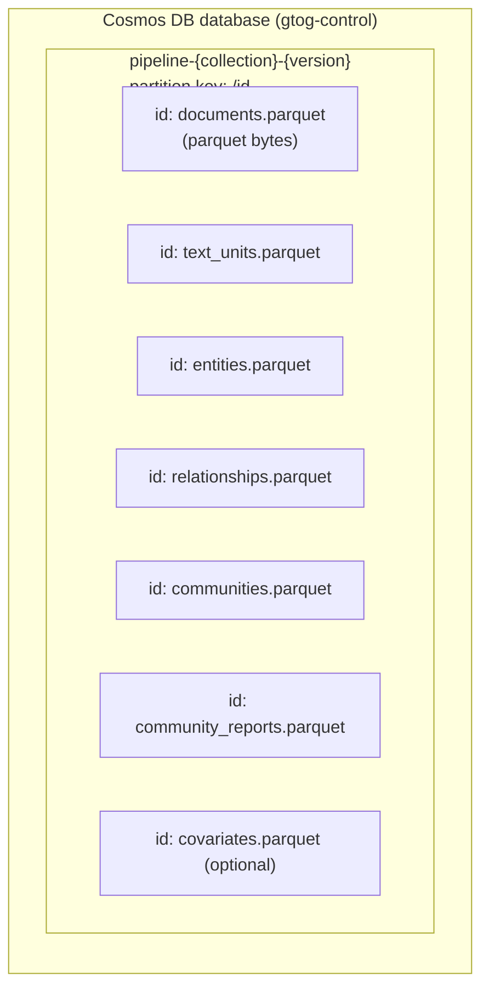

# Database Schema

This document describes the data stores used by the GraphRAG.ToG platform in **production / cosmos_pipeline mode**, the only mode used in deployed environments:

1. **Azure Cosmos DB** — three logical planes in one database:
   - **Control plane** — collections, documents, indexing jobs, version pointers.
   - **Pipeline output plane** — pipeline artifacts written directly by `CosmosDBPipelineStorage` (no parquet files on disk).
   - **Conversation plane** — chat sessions and turns.
2. **Azure Blob Storage** — raw user-uploaded documents (`.txt`, `.md`).
3. **Azure Storage Queue** — durable indexing-job dispatch (`indexing-jobs`).

> **Important** — the GraphRAG core can also write parquet to local files or blob, but this deployment uses `output.type: cosmosdb` in `settings.yaml`. Pipeline datasets are persisted as **parquet payloads stored inside Cosmos documents**, not as files on disk. This document only covers the cosmosdb mode.

## 1. Storage Map

```mermaid
flowchart LR
    subgraph CP["Cosmos DB — Control Plane"]
        C1[collections]
        C2[documents]
        C3[indexingJobs]
        C4[jobEvents]
        C5[artifactManifest]
        C6[collections.activeVersion]
    end

    subgraph PP["Cosmos DB — Pipeline Output Plane (per collection × version)"]
        P1[pipeline-{collection}-{version}<br/>documents.parquet, text_units.parquet,<br/>entities.parquet, relationships.parquet,<br/>communities.parquet, community_reports.parquet,<br/>covariates.parquet — stored as bytes]
    end

    subgraph CV["Cosmos DB — Conversation Plane"]
        V1[conversationSessions]
        V2[conversationTurns]
    end

    subgraph BL["Blob Storage"]
        B1[pipeline-input container<br/>raw .txt / .md per collection<br/>under base_dir=input]
    end

    subgraph QU["Storage Queue"]
        Q1[indexing-jobs]
    end

    Worker --> PP
    Worker --> CP
    API --> CP
    API --> CV
    API --> BL
    API --> QU
    Query["QueryService"] --> PP
    Query --> CP
```

## 2. Cosmos DB Overview

**Database:** `AZURE_COSMOS_DATABASE_NAME` (default `gtog-control`).

**Three kinds of containers** live in this database:

1. **Control + conversation containers** — fixed names, partition key `/collectionId`. They store collection metadata, documents, indexing jobs, conversation sessions and turns.
2. **Pipeline output containers** — one container *per collection × version*, named `pipeline-{collection}-{version}` (sanitized, ≤128 chars), partition key `/id`. They are created by `CosmosDBPipelineStorage` during an indexing run and hold the parquet payloads of all GraphRAG datasets.
3. **Vector containers (Cosmos vector store)** — created on-demand during indexing, named `vec-{collection}-{version}-{embedding}` (sanitized, ≤128 chars), partition key `/id`.



## 3. Control-Plane Containers

### `collections`

| Field | Type | Notes |
|---|---|---|
| `id` | string | Same as `collectionId`; primary key |
| `collectionId` | string | Partition key (`/collectionId`) |
| `name` | string | User-visible name (== id when matched the slug) |
| `description` | string \| null | Free text, ≤ 500 chars |
| `createdAt` | ISO datetime | UTC |
| `updatedAt` | ISO datetime | UTC, updated on doc count change |
| `documentCount` | int | Cached count of documents |
| `indexed` | bool | `true` once an indexing job completes |
| `lastIndexedAt` | ISO datetime \| null | Last successful indexing |
| `lastJobId` | string \| null | UUID of last indexing job |

### `documents`

| Field | Type | Notes |
|---|---|---|
| `id` | string | `{collectionId}/{name}` |
| `collectionId` | string | Partition key |
| `name` | string | Original filename incl. extension |
| `size` | int | Bytes |
| `contentType` | string | `text/plain`, `text/markdown` |
| `blobPath` | string | Blob URL or relative key |
| `uploadedAt` | ISO datetime | UTC |
| `etag` | string | Blob ETag for change detection |

### `indexingJobs`

Canonical job record (one per indexing run).

| Field | Type | Notes |
|---|---|---|
| `id` | string | UUID v4 |
| `collectionId` | string | Partition key |
| `status` | enum | `pending` \| `running` \| `retrying` \| `completed` \| `failed` \| `cancelled` |
| `attempt` | int | 1-based current attempt |
| `maxAttempts` | int | From `indexing_job_max_attempts` |
| `progress` | float | 0.0–100.0 |
| `message` | string \| null | Last workflow message |
| `error` | string \| null | Last error (set on retry/fail) |
| `leaseOwnerId` | string \| null | Worker ID currently holding the lease |
| `leaseExpiresAt` | ISO datetime \| null | When lease lapses |
| `heartbeatAt` | ISO datetime \| null | Last worker heartbeat |
| `startedAt` | ISO datetime \| null | First time `running` was set |
| `completedAt` | ISO datetime \| null | Terminal time |
| `retryAt` | ISO datetime \| null | Earliest re-lease time after failure |
| `enqueuedAt` | ISO datetime | When dispatched to queue |
| `jobType` | string | `index` (default), `update`, `reindex` |

**Key indexes:** by `collectionId` (partition), filtered by `status`. Queries: "any active job for this collection" and "all retrying jobs needing recovery."

### `jobEvents`

Append-only event log per job — useful for debugging and replay.

| Field | Type | Notes |
|---|---|---|
| `id` | string | `{jobId}/{seq}` |
| `collectionId` | string | Partition key |
| `jobId` | string | FK → `indexingJobs.id` |
| `seq` | int | Monotonic per-job sequence |
| `at` | ISO datetime | UTC |
| `kind` | enum | `enqueued` \| `leased` \| `progress` \| `workflow_done` \| `failed` \| `succeeded` \| `cancelled` |
| `data` | object | Event-specific payload |

### `artifactManifest`

One document per `(collectionId, version, artifactName)` recording row counts of pipeline datasets that were verified after a successful run. Written by `IndexingService.execute_indexing_job` via `control_plane.upsert_artifact_manifest(...)`.

| Field | Type | Notes |
|---|---|---|
| `id` | string | `{collectionId}/{version}/{artifactName}` |
| `collectionId` | string | Partition key |
| `version` | string | First 16 chars of jobId; identifies the pipeline run |
| `artifactName` | string | Currently always `pipeline-datasets` |
| `counts` | object | Row counts per dataset (see below) |
| `checksum` | string | Free text — `storageMode=cosmos_pipeline` for current writer |
| `createdAt` | ISO datetime | UTC |

**`counts` payload (from `_verify_pipeline_output`):**
```json
{
  "entities":          412,
  "relationships":     887,
  "text_units":        1340,
  "communities":       26,
  "community_reports": 26,
  "covariates":        53
}
```

`covariates` is included only when the dataset exists. The other five datasets are required and indexing fails if any is missing.

### `collections` active version fields

Tracks which version is currently served per collection. Written by `control_plane.set_active_version(...)` at the very end of a successful run, after manifest upsert. The query layer reads this to discover which `pipeline-{collection}-{version}` container to load.

| Field | Type | Notes |
|---|---|---|
| `id` | string | `{collectionId}/active` |
| `collectionId` | string | Partition key |
| `activeVersion` | string | The version slug (16-char prefix of `jobId`) |
| `previousVersion` | string \| null | Previous active version, if any |
| `updatedAt` | ISO datetime | UTC, set by `set_active_version` |

## 4. Pipeline Output Plane (Cosmos containers per version)

The GraphRAG core writes pipeline artifacts directly to Cosmos via `CosmosDBPipelineStorage` (selected by `output.type: cosmosdb` in `settings.yaml`). **No parquet files are written to disk.** Instead:

- One container is created per `(collection, version)`: name `pipeline-{collection}-{version}`, sanitized to `[a-z0-9-]`, capped at 128 chars (`backend/app/repositories/pipeline_output_repository.py::build_pipeline_container_name`).
- Partition key: `/id`.
- Each pipeline dataset is stored as a **single Cosmos document** keyed by `{dataset}.parquet`, whose body holds the parquet bytes serialized for retrieval. The reader (`PipelineOutputRepository._load_parquet_bytes`) calls `storage.get(key, as_bytes=True)` and `pd.read_parquet(BytesIO(...))` to materialize a DataFrame.



**Why one container per version:** atomic publish. The new run writes a fresh container; only after `_verify_pipeline_output` succeeds does the control plane swap `collections.activeVersion` to point at it. Old versions stay readable until cleaned up.

**Datasets and their schema:** the parquet payload of each dataset matches the GraphRAG core data model (`graphrag.data_model.*`). See section 5 for column-level detail.

## 4.1 Vector Containers (Cosmos vector store)

Vector containers are created during indexing (not pre-provisioned by DB scripts), with version-scoped names:

- `vec-{collection}-{version}-entity-description`
- `vec-{collection}-{version}-community-full-content`
- `vec-{collection}-{version}-text-unit-text`
- (optional by config) `vec-{collection}-{version}-relationship-description`

These containers are used for ANN similarity retrieval and are separate from the pipeline artifact container. Query flow uses both:

1. vector search from `vec-*` containers to fetch candidates,
2. then hydration from the active `pipeline-{collection}-{version}` datasets.

## 5. Pipeline Dataset Schemas (parquet payloads)

These are the columns inside each `{dataset}.parquet` document. Empty/optional columns may be omitted by the writer if the corresponding feature is disabled in `settings.yaml`.

### `documents.parquet`

| Column | Type | Notes |
|---|---|---|
| `id` | string | UUID |
| `human_readable_id` | int | Stable ordinal |
| `title` | string | Original filename |
| `type` | string | Default `text` |
| `text` | string | Full text |
| `text_unit_ids` | list[string] | All chunks derived from this doc |
| `attributes` | object \| null | Optional metadata |

### `text_units.parquet`

| Column | Type | Notes |
|---|---|---|
| `id` | string | UUID |
| `human_readable_id` | int | |
| `text` | string | Chunk text |
| `n_tokens` | int | Token count |
| `document_ids` | list[string] | Source documents |
| `entity_ids` | list[string] | Entities mentioned in this chunk |
| `relationship_ids` | list[string] | Relationships evidenced |
| `covariate_ids` | object \| null | `{type: list[string]}` |
| `attributes` | object \| null | |

### `entities.parquet`

| Column | Type | Notes |
|---|---|---|
| `id` | string | UUID |
| `human_readable_id` | int | |
| `title` | string | Canonical entity name |
| `type` | string \| null | Free-form (e.g. `ORGANIZATION`, `PERSON`) |
| `description` | string | LLM-summarized description |
| `description_embedding` | list[float] \| null | Required for Local/DRIFT/ToG |
| `name_embedding` | list[float] \| null | Used by ToG entity linking |
| `community` | int \| null | Top-level community id at default level |
| `text_unit_ids` | list[string] | Source chunks |
| `degree` | int | Graph degree |
| `rank` | int \| null | Centrality |
| `attributes` | object \| null | |

### `relationships.parquet`

| Column | Type | Notes |
|---|---|---|
| `id` | string | UUID |
| `human_readable_id` | int | |
| `source` | string | FK → entity.title |
| `target` | string | FK → entity.title |
| `description` | string | LLM-summarized edge description |
| `description_embedding` | list[float] \| null | Used by ToG relation pruning (`semantic`) |
| `weight` | float | Aggregated edge weight |
| `text_unit_ids` | list[string] | Source chunks |
| `rank` | int \| null | |
| `attributes` | object \| null | |

### `communities.parquet`

| Column | Type | Notes |
|---|---|---|
| `id` | string | UUID |
| `human_readable_id` | int | |
| `community` | int | Stable community number |
| `level` | int | Hierarchy level (0 = top) |
| `parent` | string \| null | Parent community id |
| `children` | list[string] | Child community ids |
| `entity_ids` | list[string] | Members |
| `relationship_ids` | list[string] | Internal edges |
| `text_unit_ids` | list[string] | All source chunks across members |
| `covariate_ids` | object \| null | |
| `size` | int | Number of text units |
| `period` | string \| null | Time-period tag |
| `attributes` | object \| null | |

### `community_reports.parquet`

| Column | Type | Notes |
|---|---|---|
| `id` | string | UUID |
| `human_readable_id` | int | |
| `community` | int | FK → community.community |
| `summary` | string | Short summary |
| `full_content` | string | Markdown report (`title`, `summary`, `findings`, etc.) |
| `full_content_embedding` | list[float] \| null | Used by Global/DRIFT |
| `rank` | float | LLM rating |
| `size` | int | Number of underlying text units |
| `period` | string \| null | |
| `attributes` | object | Structured fields parsed from report (`title`, `findings`, `rating`, `rating_explanation`) |

### `covariates.parquet` (optional)

Present only when `extract_claims.enabled=true` in `settings.yaml`.

| Column | Type | Notes |
|---|---|---|
| `id` | string | UUID |
| `human_readable_id` | int | |
| `type` | string | E.g. `claim` |
| `subject_id` | string | FK → entity.id |
| `object_id` | string \| null | FK → entity.id |
| `text_unit_id` | string \| null | FK → text_unit.id |
| `attributes` | object | Claim status, period, source, etc. |

