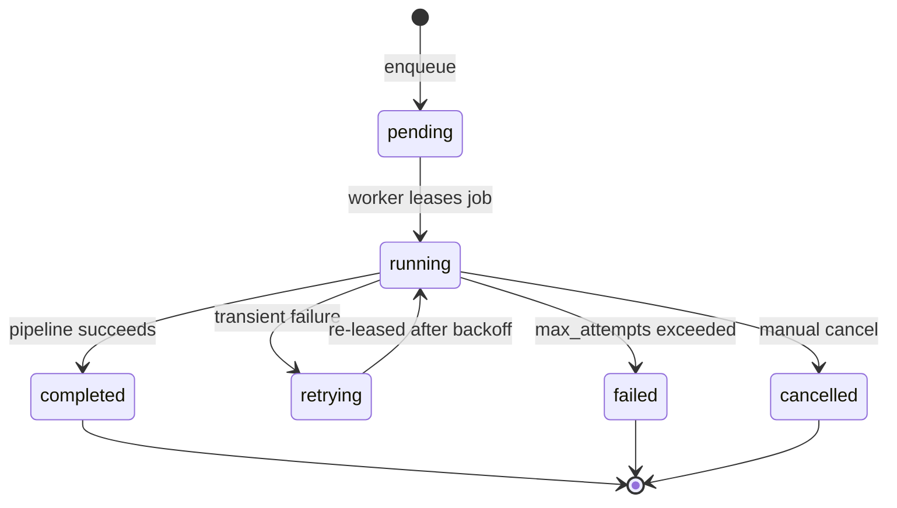
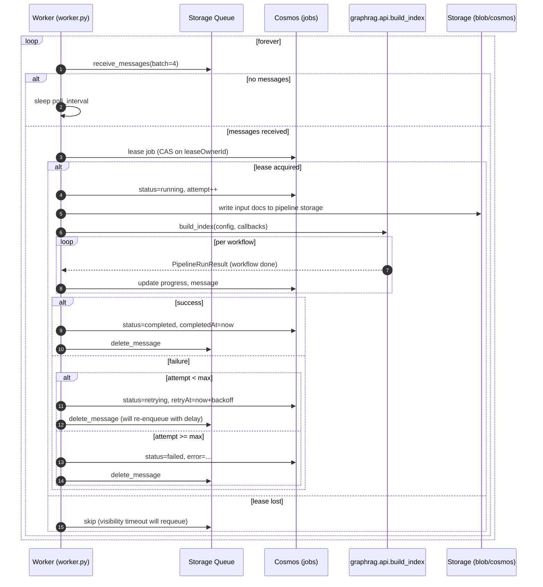
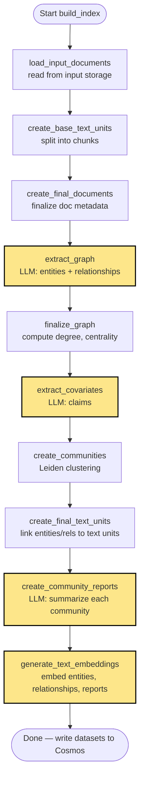
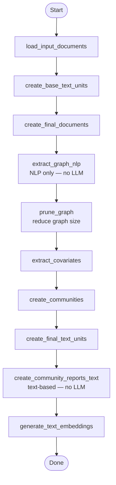
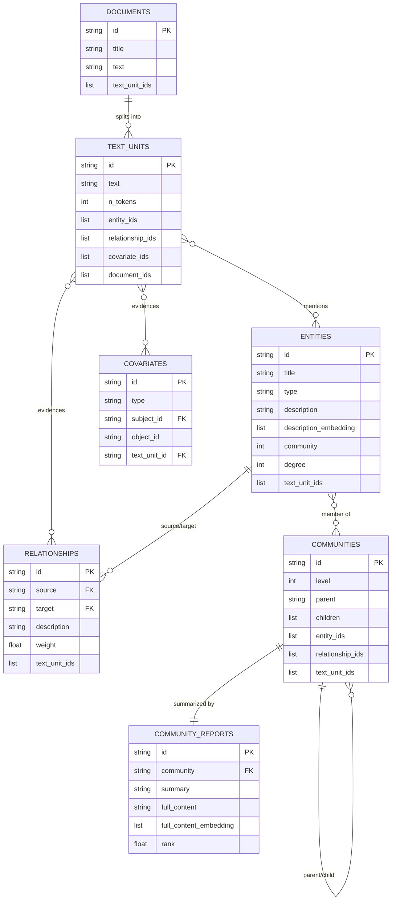
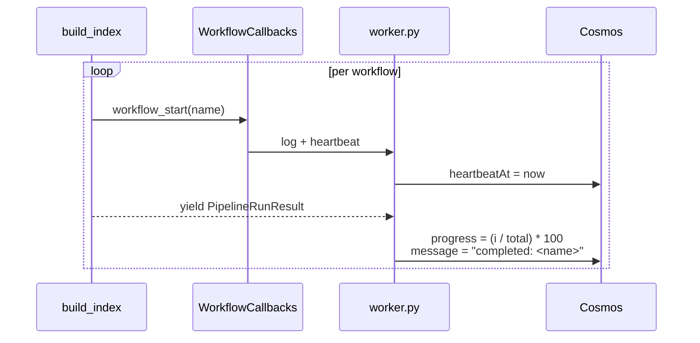
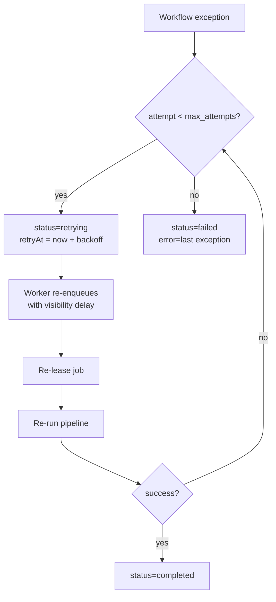

# Indexing Flow

This document explains the **GraphRAG indexing pipeline** — how raw documents become a queryable knowledge graph stored in **Azure Cosmos DB**. It covers both the backend job lifecycle (queue → worker → status updates) and the GraphRAG core workflow steps.

> This deployment runs in **cosmos_pipeline mode**: `settings.yaml` has `output.type: cosmosdb`, so pipeline datasets are written directly to Cosmos inside per-version `pipeline-{collection}-{version}` containers. The backend also overrides the GraphRAG Cosmos vector store at runtime so all vector embeddings are written into the shared `vectors` container and scoped by partition key. **No parquet files are written to disk.**

## 1. Two-Layer View

The indexing pipeline runs in two layers:

| Layer | Component | Responsibility |
|---|---|---|
| **Job orchestration** | `backend/app/services/indexing_service.py` + `backend/app/worker.py` | Job queueing, leasing, retries, status reporting |
| **Pipeline execution** | `graphrag.api.build_index` (calls `graphrag.index.run.run_pipeline`) | Workflow steps that produce pipeline datasets, written to Cosmos via `CosmosDBPipelineStorage` |

```mermaid
graph LR
    A[POST /collections/:id/index] --> B[IndexingService.start_indexing]
    B --> C[Cosmos: create job<br/>status=pending]
    B --> D[Queue: enqueue message]
    D --> E[worker.py poll loop]
    E --> F[Lease job<br/>status=running]
    F --> G[graphrag.api.build_index]
    G --> H[Workflow steps<br/>1..N]
    H --> I[Pipeline datasets in<br/>pipeline-{collection}-{version}]
    H --> J1[Vector embeddings in<br/>shared vectors container]
    I --> V[Verify pipeline datasets +<br/>verify vector scopes +<br/>upsert artifactManifest]
    J1 --> V
    V --> P[set_active_version<br/>in collections container]
    P --> J[Cosmos: status=completed]
    F -. failure .-> K[Retry up to<br/>max_attempts]
    K --> J2[status=failed]
```

## 2. Job Lifecycle (Backend)



**Job document fields** (Cosmos `indexingJobs` container):
- `id`, `collectionId` (partition key), `status`, `attempt`, `maxAttempts`
- `leaseOwnerId`, `leaseExpiresAt`, `heartbeatAt`
- `startedAt`, `completedAt`, `retryAt`, `progress`, `message`, `error`

**Lease semantics** (configurable in `Settings`):
- `indexing_worker_lease_duration_seconds` = 300
- `indexing_worker_heartbeat_interval_seconds` = 30
- `indexing_worker_recovery_interval_seconds` = 30
- `indexing_job_max_attempts` = 3

## 3. Worker Loop



## 4. GraphRAG Core Pipeline

`graphrag.api.build_index` calls `graphrag.index.run.run_pipeline.run_pipeline` which executes a sequence of workflows.

### Standard pipeline (default)



LLM-powered steps are highlighted (yellow). NLP/graph-only steps are deterministic and CPU-bound.

### Fast pipeline (`IndexingMethod.Fast`)



Fast mode trades quality for speed by skipping LLM-based extraction and report generation.

### Update pipeline

When `is_update_run=True`, additional `*_update` workflows run after the base pipeline:
- `update_entities_relationships`
- `update_communities`
- `update_community_reports`
- `update_covariates`
- `update_text_units`
- `update_text_embeddings`
- `update_clean_state`

Update workflows merge new artifacts with the previous index using timestamped storage.

## 5. Workflow Step Detail

### 5.1 `load_input_documents`

- Reads files from input storage matching `config.input.file_pattern` (e.g., `.*\.txt$`).
- Produces a `pd.DataFrame` of documents (id, title, text).

### 5.2 `create_base_text_units`

- Splits documents into chunks per `config.chunks.size` and `config.chunks.overlap`.
- Strategy: `tokens` (default) or `sentence`.
- Output schema: `id, document_ids, text, n_tokens`.

### 5.3 `extract_graph` (LLM)

- Uses `graphrag.index.operations.extract_graph` with the **entity extraction prompt**.
- For each text unit, the LLM emits a structured list of `(entity_name, entity_type, description)` and `(source, target, description, weight)`.
- Multiple `gleanings` rounds (default 1) re-prompt the LLM to find missed entities.
- Results are merged: duplicate entities are summarized via the **summarize descriptions prompt**.

### 5.4 `finalize_graph`

- Builds a NetworkX graph.
- Computes `degree` and ranks nodes/edges.
- Adds `human_readable_id` to each entity/relationship.

### 5.5 `extract_covariates` (LLM, optional)

- Extracts claims (subject, object, type, status, period, source text) per text unit.
- Disabled by default unless `config.extract_claims.enabled=true`.

### 5.6 `create_communities`

- Hierarchical Leiden clustering over the entity graph.
- Produces communities at multiple levels (level 0 = top-level clusters; level 1+ = sub-communities).
- Each community holds: `entity_ids`, `relationship_ids`, `text_unit_ids`, `parent`, `children`, `size`.

### 5.7 `create_final_text_units`

- Back-links text units to the entities and relationships they contain.
- Adds `entity_ids`, `relationship_ids`, `covariate_ids` columns to text units.

### 5.8 `create_community_reports` (LLM)

- For each community, the LLM produces a structured report (`title`, `summary`, `findings`, `rating`, `rating_explanation`).
- Reports are stored as `full_content` (Markdown) plus a structured `attributes` dict.

### 5.9 `generate_text_embeddings`

- Embeds (depending on `config.embed_text.target`):
  - `entity.description` and/or `entity.title`
  - `relationship.description`
  - `community_report.full_content`
  - `text_unit.text`
- Default backend: `openai_embedding` (`text-embedding-3-small`) via LiteLLM.
- Embeddings are required for Local, DRIFT, Basic, and ToG search.

## 6. Output Artifacts

After indexing completes, the following datasets exist as parquet payloads inside the per-version Cosmos container `pipeline-{collection}-{version}` (one Cosmos document per dataset, body = parquet bytes):



See [database_schema.md](database_schema.md) for the full column schema of each dataset.

## 7. Output Storage Layout

In **cosmos_pipeline mode** (this deployment), pipeline datasets for one indexing run live inside a versioned pipeline container, while vector embeddings for all versions share one physical Cosmos vector container:

| Container | Partition Key | Purpose |
|---|---|---|
| `pipeline-{collection}-{version}` | implementation-defined by GraphRAG cosmos pipeline storage | GraphRAG pipeline datasets for one collection version |
| `artifactManifest` | `/collectionId` | Verified dataset counts per `(collection, version)` |
| `collections` | `/collectionId` | Active version pointer per collection (`activeVersion`) |
| `vectors` | `/partitionKey` | Shared Cosmos vector container; logical scopes are `{collectionId}:{version}|{embeddingKind}` |

The backend worker verifies both the pipeline datasets and the expected vector scopes before calling `set_active_version(...)`. The query layer reads `collections.activeVersion` for the collection, then loads from the matching `pipeline-{collection}-{version}` container and the matching scoped partition inside `vectors`.

> File-backed development is not supported in this deployment — `settings.yaml` pins `output.type: cosmosdb`. The GraphRAG core supports `file` and `blob` modes, but they are not used here.

## 8. Progress Reporting

The worker injects `WorkflowCallbacks` into `build_index` to report progress.



The frontend polls `GET /api/collections/:id/index` every 2s while status is `running` or `pending`, displaying `progress` and `message` to the user.

## 9. Failure Handling & Retries



**Backoff:** exponential with jitter, capped at `AZURE_STORAGE_QUEUE_VISIBILITY_TIMEOUT_SECONDS` (300s default).

**Idempotency:** each indexing run targets a fresh `pipeline-{collection}-{version}` container (version = first 16 chars of `jobId`) and a fresh logical vector scope inside `vectors` for each embedding kind. Only after `_verify_pipeline_output(...)` and `_verify_vector_output(...)` succeed does `set_active_version(...)` swap the pointer in the `collections` container (`activeVersion`), so a retry from scratch writes a clean version without affecting the currently-served one.

## 10. Cache & Update Strategy

- **Cache** (`config.cache`): LLM responses cached by hash to avoid re-paying for the same prompts on retry.
- **Update runs** (`is_update_run=True`): pipeline writes a new version container, then `set_active_version` swaps the pointer atomically once verification passes. Used by `graphrag update` CLI.
- **Cache warming**: when `serving_cache_warm_on_index_complete=true`, the dataset cache is pre-loaded after a successful indexing run so the first query hits a warm cache.

## Related Docs

- [architecture.md](architecture.md) — System overview
- [database_schema.md](database_schema.md) — Parquet column schemas
- [query_flow.md](query_flow.md) — How pipeline datasets are consumed at query time
