# Query Flow

This document describes how queries are answered by the system. It covers:

1. The **agent-routed search** pipeline (default frontend behavior).
2. Each of the **five query methods**: Global, Local, DRIFT, Basic, ToG.
3. How **conversation context, guardrails, and web fallback** integrate.

## 1. Two Modes: Direct vs Agent

The frontend exposes two modes:

| Mode | Endpoint | Behavior |
|---|---|---|
| **Direct** | `POST /api/collections/:id/search/{global,local,drift,tog}` | User picks the method explicitly. No routing or rewrite, but request/response guardrails still apply at the route level. |
| **Agent** (default) | `POST /api/collections/:id/search/agent` (or `/stream`) | LLM routes the query to the best method, applies guardrails, may trigger web fallback, persists conversation. |

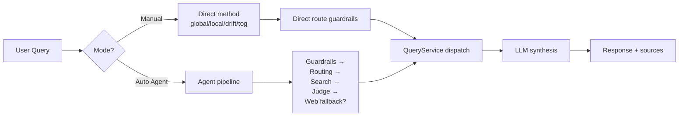

## 2. Agent Pipeline (Detailed, assuming `ai_guardrails_enabled=true`)

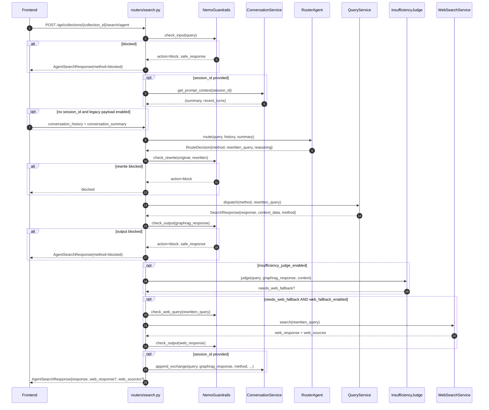

Notes:

- This sequence assumes `ai_guardrails_enabled=true`, so `check_input`, `check_rewrite`, `check_output`, and `check_web_query` are active checkpoints rather than no-op passes.
- The primary `response` in `AgentSearchResponse` is the GraphRAG answer. If web fallback runs and passes output guardrails, its synthesized answer is returned separately as `web_response` with `web_sources`.
- In `/agent`, `check_output` now runs twice when web fallback succeeds: once for the GraphRAG answer before insufficiency judgment, and once for the synthesized `web_response` before it is attached to the final payload.
- If the web fallback runs but its synthesized answer is blocked by output guardrails, the GraphRAG `response` is kept, `web_response` is omitted, `web_sources=[]`, and `web_search_triggered=true` still indicates that the fallback executed.
- `SummarizationService` is not called inline during `/search/agent`. Conversation summaries are updated later inside `ConversationService.append_exchange()` after persistence, once the configured user-turn threshold is exceeded.

### Streaming variant

`GET|POST /api/collections/{collection_id}/search/agent/stream` returns Server-Sent Events:

| Event | Payload | When |
|---|---|---|
| `status` | `{step, message, method?, rewritten_query?}` | Progress updates such as `routing`, `routed`, `searching`, `judging_sufficiency`, `web_searching` |
| `content` | `{delta}` | Chunked GraphRAG response text |
| `done` | Full `AgentSearchResponse` fields | Pipeline complete |
| `error` | `{message}` | Unrecoverable error |

The frontend (`CollectionChat`) consumes the stream via `fetch()` + `ReadableStream`, accumulates `content.delta` chunks into the rendered Markdown, and shows `status` messages as a step-by-step progress UI.

## 3. Common Pre-Search Steps

### 3.1 Guardrails (`NemoGuardrailsService`, enabled path)

With `ai_guardrails_enabled=true`, the agent route uses four checkpoints, each returning `GuardrailDecision{allowed, action, reason, safe_response, metadata}`:

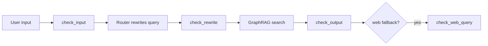

**Deterministic checks** (always run):
- Jailbreak patterns (e.g., "ignore previous instructions")
- Secret/credential patterns (API keys, JWT shape, AWS keys)
- Output leakage (system prompt fragments, internal IDs)

**NeMo Rails** (optional, when `nemoguardrails` is installed and `AI_GUARDRAILS_CONFIG_PATH` is set): LLM-based intent and safety checks run after deterministic checks.

**Modes:**
- `shadow` — log only, never block (used during rollout).
- `enforce` — block requests when action is `block`.

**Fail behavior:**
- `open` — allow on guardrail error (default for high availability).
- `closed` — block on error (used in stricter environments).

**Checkpoint coverage in `/agent`:**
- `check_input(query)` runs before routing.
- `check_rewrite(original_query, rewritten_query)` runs after the router chooses a method and rewritten standalone query.
- `check_output(graphrag_response)` runs immediately after GraphRAG search returns.
- `check_web_query(rewritten_query)` runs before web fallback is allowed to execute.
- `check_output(web_response)` runs after web fallback returns and before the synthesized answer is attached to `web_response`.

**Checkpoint coverage in direct/manual routes:**
- `POST /search/global`, `/local`, `/tog`, and `/drift` run `check_input(query)` before dispatching to `QueryService`.
- Those direct routes also run `check_output(response)` after the chosen GraphRAG method returns.
- If either direct-route check blocks, the API still returns a normal `SearchResponse` with the original `method` and a safe canned `response`.
- `POST /search/web` runs `check_web_query(query)` before Tavily search and `check_output(response)` after LLM synthesis.

### 3.2 Conversation context

If `session_id` is provided, the API loads:
- `summary` — running summary of older turns.
- `recent_turns` — up to `conversation_recent_user_turns` (default 3) most recent user/assistant pairs.

If `session_id` is not provided and `conversation_legacy_payload_enabled=true`, the client may send `conversation_history` and `conversation_summary` directly in the request body.

When the stored session's user-turn count exceeds `conversation_summarize_user_turn_threshold` (default 8), `ConversationService.append_exchange()` calls `SummarizationService.summarize()` after persistence and updates the session summary, retaining only the most recent turns verbatim for future prompts.

### 3.3 Routing (`RouterAgent`)

Uses `litellm.acompletion()` with `default_chat_model` and the prompt from `prompts/router_prompt.txt`. Output is a structured JSON:

```json
{
  "method": "local|global|tog|drift",
  "confidence": 0.0-1.0,
  "reasoning": "why this method",
  "rewritten_query": "standalone form of the query"
}
```

The rewrite step is critical for multi-turn queries (e.g., "what about its founder?" → "Who founded Microsoft?") so downstream search can run with a self-contained query.

## 4. Method-Specific Flows

### 4.1 Global Search

**Use case:** broad overview questions ("What are the main themes?")

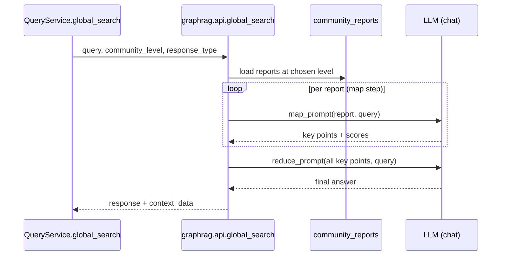

**Datasets read:** `entities`, `communities`, `community_reports`.

**Prompts:** `map_system_prompt`, `reduce_system_prompt`, `general_knowledge_inclusion_prompt`.

**Tunables:**
- `community_level` (0–10, default from config) — which level of the community hierarchy to use.
- `dynamic_community_selection` — if true, select communities based on relevance scoring instead of taking all at the level.
- `response_type` — controls the format of the final answer ("Single Paragraph", "Multiple Paragraphs", "List of 3-7 Points", etc.).

### 4.2 Local Search

**Use case:** entity-centric questions ("Tell me about Acme Corp's leadership.")

Before vector retrieval starts, the backend resolves the collection's `activeVersion`. Cosmos vector searches are then restricted to the matching logical scope inside the shared `vectors` container:

- `entity.description` → `{collectionId}:{activeVersion}|entity.description`
- `community.full_content` → `{collectionId}:{activeVersion}|community.full_content`
- `text_unit.text` → `{collectionId}:{activeVersion}|text_unit.text`

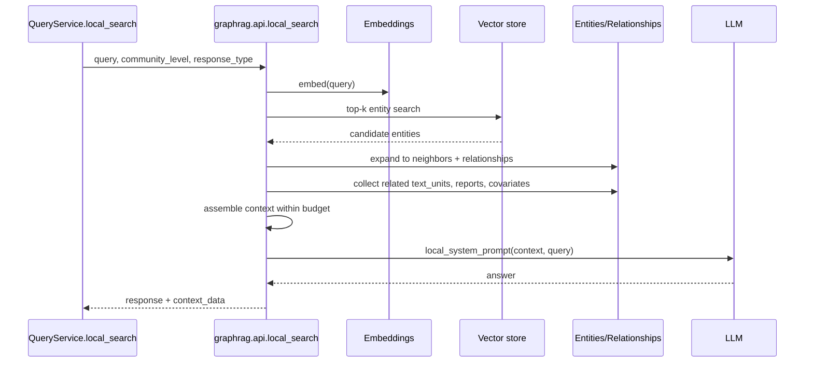

**Datasets read:** `entities`, `relationships`, `text_units`, `communities`, `community_reports`, `covariates` (optional).

**Prompts:** `local_search_system_prompt`.

**Tunables (from `LocalSearchConfig`):** `top_k_entities`, `top_k_relationships`, `text_unit_prop`, `community_prop`, `max_context_tokens`.

### 4.3 DRIFT Search

**Use case:** hypothetical / multi-hop questions that benefit from both local detail and global framing.

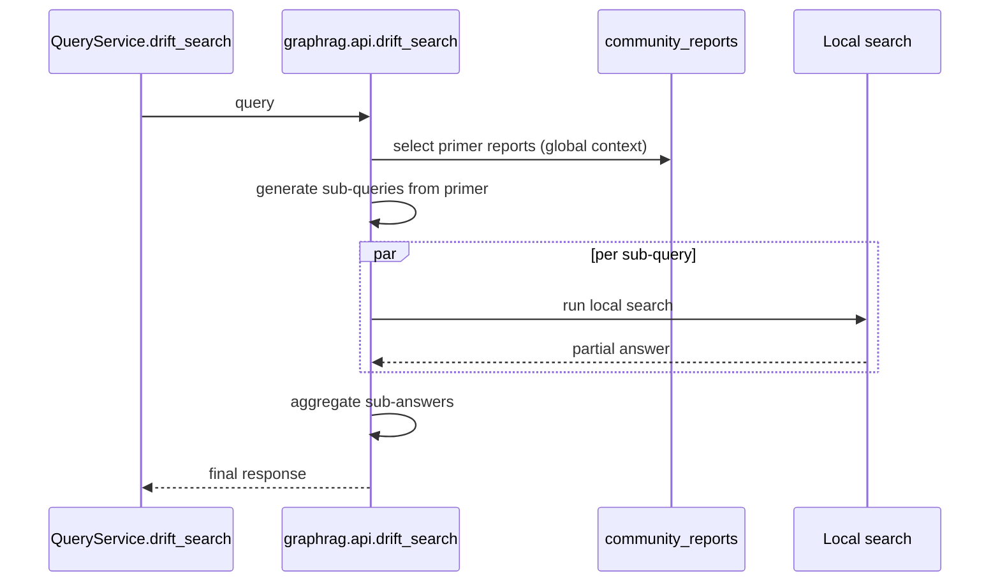

**Datasets read:** same as Local plus `community_reports` for primer.

**Prompts:** `drift_local_system_prompt`, `drift_reduce_prompt`.

**Tunables:** `n_depth`, `primer_folds`, `drift_k_followups`, `local_search_text_unit_prop`.

### 4.4 Basic Search

**Use case:** simple semantic search ("What does the document say about X?").

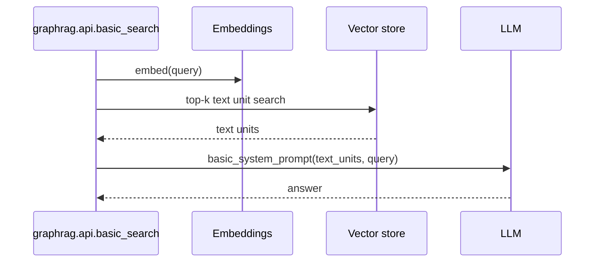

**Datasets read:** `text_units` only. No graph traversal.

**Prompts:** `basic_search_system_prompt`.

### 4.5 ToG Search (Think-on-Graph)

**Use case:** complex multi-hop reasoning ("How are X and Y connected through Z?")

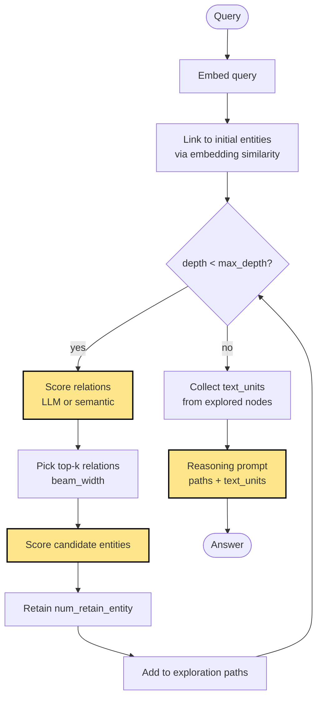

**Phases:**

1. **Linking** — `GraphExplorer` embeds the query and matches it to initial entities using `name_embedding` and `description_embedding` similarity.
2. **Exploration** — beam search of width `width` over `depth` levels:
   - For each frontier entity, retrieve outgoing+incoming relations.
   - Score relations via the chosen `prune_strategy` (`llm`, `semantic`, `bm25`).
   - Keep top-`width` relations; expand to candidate target entities.
   - Score candidates and retain top `num_retain_entity`.
3. **Reasoning** — final LLM call (low temperature) given the assembled exploration paths plus their associated text units.

**Pruning strategies** (`graphrag/query/structured_search/tog_search/pruning.py`):

| Strategy | How it scores | Cost | Quality |
|---|---|---|---|
| `llm` | LLM judges relevance to query | High (LLM calls) | High |
| `semantic` | Cosine similarity of embeddings | Low (precomputed) | Medium |
| `bm25` | BM25 keyword matching | Very low | Medium-low |

**Datasets read:** `entities`, `relationships`, `text_units`.

**Prompts:** `TOG_RELATION_SCORING_PROMPT`, `TOG_ENTITY_SCORING_PROMPT`, `TOG_REASONING_PROMPT`.

**Tunables (`ToGSearchConfig`):**
- `width` (default 3) — beam width.
- `depth` (default 3) — max traversal depth.
- `num_retain_entity` (default 5).
- `temperature_exploration` (default 0.4) — LLM creativity during scoring.
- `temperature_reasoning` (default 0.0) — deterministic final answer.
- `max_context_tokens` (default 8000) — cap on assembled context.
- `max_exploration_paths` (default 10).
- `prune_strategy` (default `llm`).

**Metrics returned:** `ToGMetrics{llm_calls, prompt_tokens, output_tokens, embedding_calls}` aggregated from exploration + reasoning phases.

## 5. Insufficiency Judge & Web Fallback

After GraphRAG produces a response, an optional second LLM judges if the answer is sufficient.

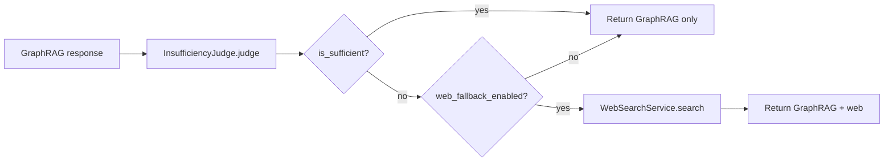

**`InsufficiencyDecision`:**
```python
{
    "is_sufficient": bool,
    "needs_web_fallback": bool,
    "confidence": 0.0-1.0,
    "reason": str,
    "missing_information": list[str],
    "risk": str
}
```

**Trigger conditions for web fallback:**
- `is_sufficient=False` AND `confidence >= insufficiency_judge_min_confidence` (default 0.5).
- `web_fallback_enabled=True` (Settings).
- Web query passes `check_web_query` guardrail.

**Web search** (`WebSearchService`):
- Tavily API → results.
- LLM synthesis using `prompts/web_synthesis_prompt.txt`.
- Returns `WebSearchResult{response, sources}`.
- In agent mode, the synthesized `response` is output-checked before it is appended as `web_response`.
- If that second output check blocks, the fallback still counts as executed, but `web_response` is omitted from the final `AgentSearchResponse`.

## 6. Dataset Caching

For Cosmos-backed retrieval, query execution reads from two storage planes tied to the collection's `activeVersion`:

1. `pipeline-{collection}-{activeVersion}` for GraphRAG datasets.
2. `vectors` for similarity search, filtered to `{collectionId}:{activeVersion}|{embeddingKind}`.

`QueryService` uses `serving_context_cache.py` (LRU) to avoid reloading pipeline datasets from Cosmos on every query.

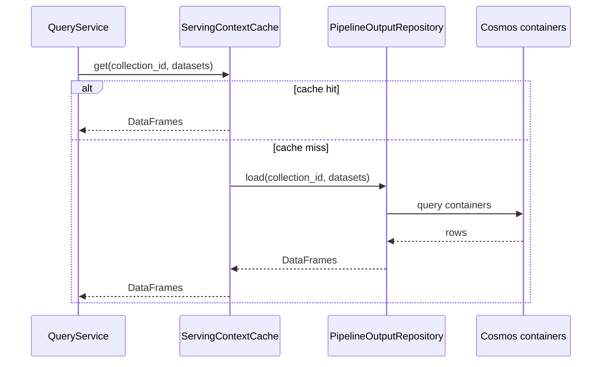

**Settings:**
- `serving_dataset_cache_max_entries` (default 96) — number of cached collection×datasets entries.
- `serving_cache_warm_on_index_complete` (default true) — pre-load after indexing.

**Per-method dataset requirements:**

| Method | entities | relationships | text_units | communities | community_reports | covariates |
|---|:---:|:---:|:---:|:---:|:---:|:---:|
| Global | ✓ | | | ✓ | ✓ | |
| Local | ✓ | ✓ | ✓ | ✓ | ✓ | optional |
| DRIFT | ✓ | ✓ | ✓ | ✓ | ✓ | |
| Basic | | | ✓ | | | |
| ToG | ✓ | ✓ | ✓ | | | |

## 7. Citations & Sources

GraphRAG responses contain inline citations of the form `[Data: <Dataset> (<ids>)]`, e.g.:

> The conflict began in 1948 [Data: Reports (12, 47); Entities (105)].

Datasets used in citations:
- **Reports** — community reports
- **Entities** — entity descriptions
- **Relationships** — edge descriptions
- **Sources** — text units (raw source chunks)
- **Claims** — covariates

The frontend (`CollectionChat`) parses these tokens and renders them as colored badges with hover tooltips showing the entity/report description.

For agent-routed responses, `sources` is currently returned as an empty list, while web fallback citations (when present and allowed) are returned separately in `web_sources`:

```typescript
web_sources: Array<{
  id: number;
  title: string;
  url?: string;
  text_unit_id?: string;
}>
```

## 8. Conversation Persistence

After every successful agent search, `ConversationService.append_exchange()` writes:

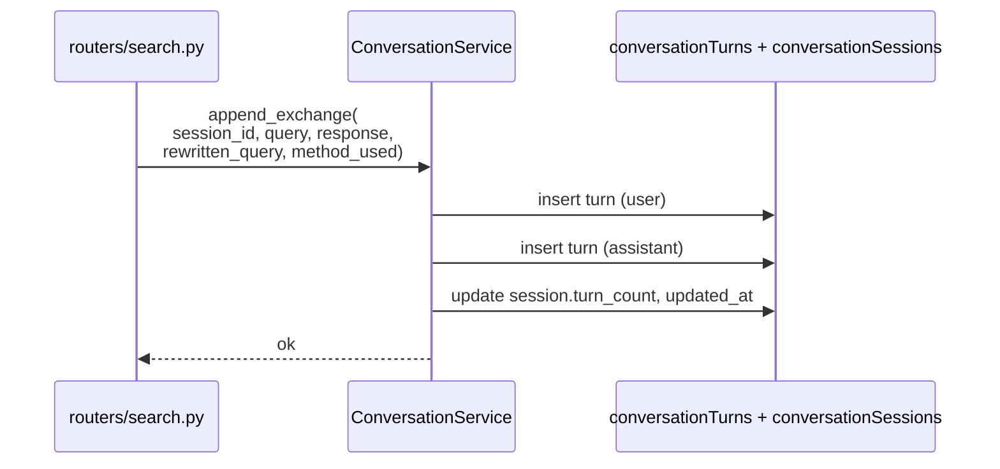

- Turns expire after `conversation_turn_ttl_days` (30 days).
- Sessions expire after `conversation_session_ttl_days` (90 days).
- Truncation: each turn's content capped at `conversation_turn_max_chars` to control storage.

## 9. Performance Notes

- **First query** on a cold collection pays the cost of loading pipeline datasets from Cosmos (one Cosmos read per dataset → parse parquet bytes into a DataFrame). With cache warming enabled, this is hidden behind the indexing-complete event.
- **ToG with `prune_strategy=llm`** is the most expensive method — easily 10–30 LLM calls per query. Use `semantic` pruning for latency-sensitive paths.
- **Global** scales with the number of community reports at the chosen level — `community_level=1` is usually a good balance.
- **Streaming** (`/search/agent/stream`) reduces perceived latency: users see the routing decision and content tokens incrementally.

## Related Docs

- [architecture.md](architecture.md) — System overview
- [api.md](api.md) — REST API reference (request/response shapes)
- [index_flow.md](index_flow.md) — How the pipeline datasets queried here are produced
- [database_schema.md](database_schema.md) — Schema of the artifacts read by each method
