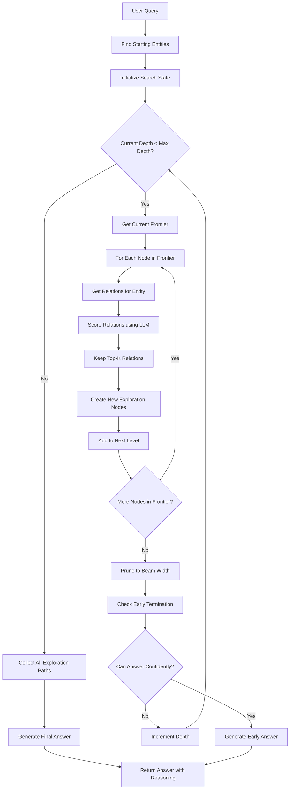
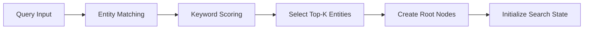
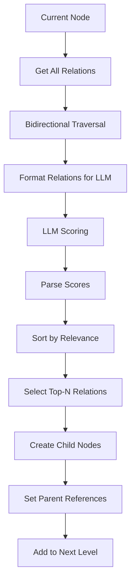
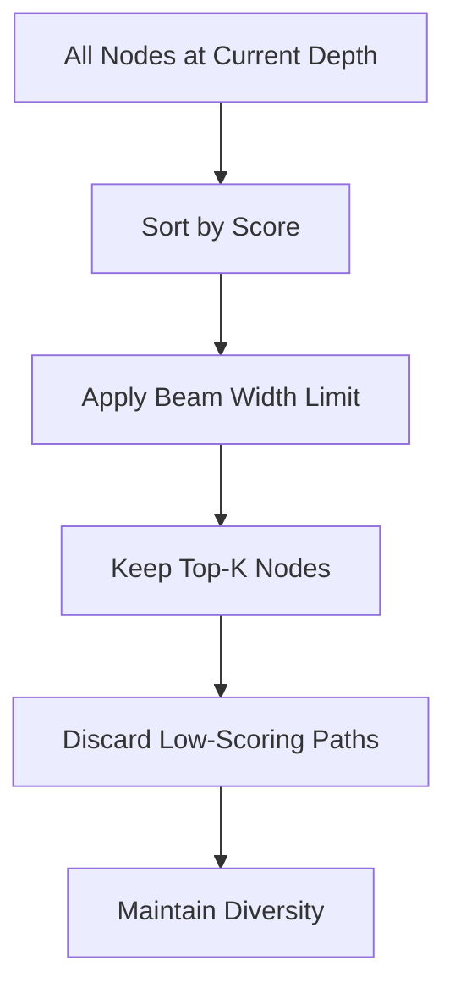
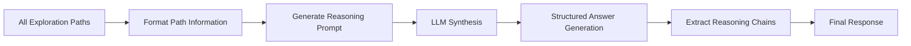

# ToG (Think-on-Graph) Search Algorithm

## Overview

ToG (Think-on-Graph) is a sophisticated search algorithm that performs deep reasoning through iterative graph traversal. Unlike traditional search methods that provide single-pass results, ToG explores multiple paths through the knowledge graph, scores and prunes them using LLM guidance, and generates evidence-based answers with transparent reasoning chains.

## Algorithm Flow



## Detailed Components

### 1. Initialization Phase



**Process:**
- **Entity Matching**: Finds entities relevant to the query using keyword matching and token overlap
- **Scoring**: Ranks entities based on query relevance (title matches get higher scores)
- **Selection**: Keeps top-K entities (default: 3) as starting points
- **State Initialization**: Creates `ToGSearchState` with beam width and max depth parameters

### 2. Exploration Phase



**Relation Scoring Process:**
1. **Collect Relations**: Gets both incoming and outgoing relations for current entity
2. **Format for LLM**: Creates structured prompt with relation descriptions and weights
3. **LLM Evaluation**: Asks LLM to score relations 1-10 based on query relevance
4. **Score Parsing**: Extracts numerical scores from LLM response
5. **Selection**: Keeps top-N relations (default: 5) for exploration

### 3. Pruning Strategy



**Beam Search Pruning:**
- Sorts all nodes at current depth by their relevance scores
- Keeps only beam width number of nodes (default: 3)
- Ensures exploration focuses on most promising paths
- Maintains diversity in selected paths

### 4. Reasoning Phase



**Answer Generation:**
1. **Path Formatting**: Converts exploration paths into readable format
2. **Prompt Construction**: Creates detailed reasoning prompt with path information
3. **LLM Synthesis**: Asks LLM to analyze paths and generate comprehensive answer
4. **Structured Output**: Returns answer in 3-part format:
   - Direct answer to the question
   - Supporting evidence from exploration
   - Key relationships that support the answer

## Key Data Structures

### ExplorationNode
```python
@dataclass
class ExplorationNode:
    entity_id: str
    entity_name: str
    entity_description: str
    depth: int
    score: float
    parent: ExplorationNode | None
    relation_from_parent: str | None
```

### ToGSearchState
```python
@dataclass
class ToGSearchState:
    query: str
    current_depth: int
    nodes_by_depth: Dict[int, List[ExplorationNode]]
    finished_paths: List[ExplorationNode]
    max_depth: int
    beam_width: int
```

## Configuration Parameters

| Parameter | Default | Description |
|-----------|----------|-------------|
| `width` | 3 | Beam width - number of parallel paths to maintain |
| `depth` | 3 | Maximum exploration depth |
| `prune_strategy` | "llm" | Method for scoring relations (llm/semantic) |
| `num_retain_entity` | 5 | Number of relations to keep per entity |
| `temperature_exploration` | 0.4 | LLM creativity during exploration |
| `temperature_reasoning` | 0.0 | LLM creativity for final answer |
| `max_context_tokens` | 8000 | Maximum tokens for context |
| `max_exploration_paths` | 10 | Maximum paths to explore |

## Example Walkthrough

**Query:** "How does ToG differ from Global Search?"

### Step 1: Entity Discovery
- Finds entities: "GLOBAL SEARCH", "TOG SEARCH", "EVIDENCE-BASED ANSWERS"
- Creates root nodes with score 1.0

### Step 2: Exploration (Depth 0 → 1)
- For "GLOBAL SEARCH": Finds relations to "HIGH-LEVEL QUESTIONS", "ENTIRE DATASET"
- For "TOG SEARCH": Finds relations to "ITERATIVE GRAPH TRAVERSAL", "DEEP REASONING"
- LLM scores relations based on query relevance
- Keeps top 5 relations per entity

### Step 3: Pruning
- Sorts all new nodes by score
- Keeps top 3 nodes (beam width = 3)
- Discards low-scoring paths

### Step 4: Continue Exploration
- Repeats process for depth 1 → 2, then 2 → 3
- Each level explores relations from retained nodes
- Continues until max depth reached

### Step 5: Reasoning
- Collects all exploration paths
- Formats paths for LLM analysis
- Generates structured answer with evidence

## Advantages of ToG

1. **Deep Reasoning**: Explores multiple hops through the knowledge graph
2. **Evidence-Based**: Every answer is backed by explicit exploration paths
3. **Transparent**: Users can see exactly how the algorithm reached conclusions
4. **Adaptive**: LLM-guided pruning focuses exploration on relevant paths
5. **Controlled**: Beam search prevents exponential growth while maintaining diversity

## Use Cases

- **Complex Relationship Analysis**: "How does A influence B through intermediary factors?"
- **Multi-hop Reasoning**: "What are the paths from entity X to concept Y?"
- **Comparative Analysis**: "Compare the roles of different entities"
- **Causal Inference**: "What are the cause-and-effect relationships?"

## Comparison with Other Methods

| Method | Approach | Depth | Transparency | Best For |
|--------|----------|--------|--------------|-----------|
| **Global Search** | Community-level aggregation | Shallow | Low | Dataset overview |
| **Local Search** | Entity neighborhood | Shallow | Medium | Specific entity details |
| **DRIFT Search** | Adaptive local+global | Medium | Medium | Dynamic exploration |
| **ToG Search** | Iterative graph traversal | Deep | High | Complex reasoning |

## Implementation Notes

- **Memory Efficiency**: Beam search controls memory usage by limiting parallel paths
- **LLM Usage**: Multiple LLM calls for relation scoring and final reasoning
- **Fallback Handling**: Graceful degradation when entities or relations are missing
- **Debug Support**: Detailed logging of exploration process for analysis

This algorithm represents a significant advancement in knowledge graph reasoning, combining the systematic exploration of traditional graph algorithms with the semantic understanding of large language models.