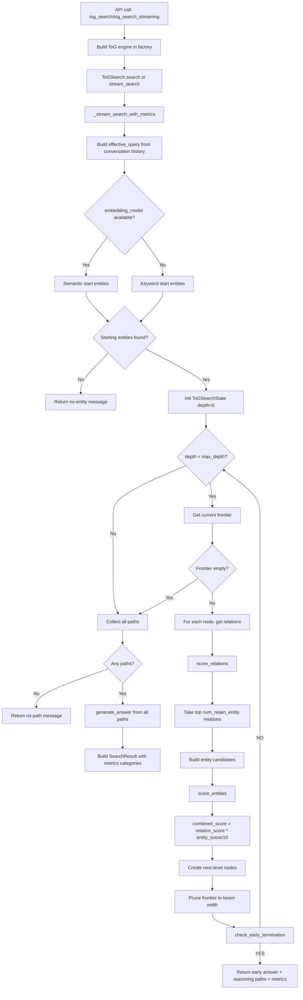

# ToG Current Flow (Implementation-Accurate)

Tai lieu nay mo ta ToG search hien tai trong repo (khong phai ban paper goc), bam sat code dang chay.

## Mermaid Flow

## End-to-End Steps

1. Entry point API:
- `graphrag/api/query.py` tao entities/relationships object, load embedding store, goi factory `get_tog_search_engine`, sau do goi `search()` hoac `stream_search()`.

2. Factory wiring:
- `graphrag/query/factory.py#get_tog_search_engine` tao:
- chat model + embedding model.
- pruning strategy theo config: `llm | semantic | bm25`.
- reasoning module.
- `ToGSearch(width, depth, num_retain_entity, ...)`.

3. Query preprocessing:
- Trong `ToGSearch._stream_search_with_metrics`:
- Neu co `conversation_history`, engine:
- enrich `effective_query` (them user turns gan day) de entity linking tot hon.
- tao `history_context` de reasoning stage dung lai context hoi dap.

4. Starting entities:
- Neu co embedding model: dung semantic linking (`find_starting_entities_semantic`).
- Neu khong: keyword matching fallback.
- Neu khong tim duoc entity: ket thuc som voi message "No relevant entities found...".

5. Exploration loop (beam search):
- Tai moi node frontier:
- lay relations (incoming + outgoing).
- `score_relations(...)`.
- lay top `num_retain_entity`.
- tao danh sach candidate entities tu cac relation nay.
- `score_entities(...)` tren candidate entities.
- tinh diem ket hop:
- `combined_score = relation_score * (entity_score / 10.0)`.
- tao `ExplorationNode` moi voi `combined_score`.
- sau khi mo rong xong mot depth: prune frontier con `beam_width`.

6. Early termination:
- Sau moi depth, goi `reasoning.check_early_termination(...)`.
- Neu model tra ve `YES: ...`, dung som va tra answer ngay.
- Neu `NO`, tiep tuc depth tiep theo.

7. Final reasoning:
- Het depth (hoac het frontier) thi gom toan bo paths.
- Neu khong co path: tra message "No exploration paths were generated...".
- Neu co path: goi `reasoning.generate_answer(...)`, tra answer + reasoning paths.

8. Metrics:
- ToG tong hop metrics exploration vs reasoning rieng:
- `llm_calls_categories`
- `prompt_tokens_categories`
- `output_tokens_categories`
- Da tach category dung theo stage (khong bi chong exploration/reasoning).

## Scoring Details

1. Relation scoring:
- `LLMPruning`: model score 1-10 tu prompt.
- `SemanticPruning`: cosine similarity -> scale 1-10.
- `BM25Pruning`: lexical score -> normalize 1-10.

2. Entity scoring:
- Cung co 3 mode tuong ung (`llm`, `semantic`, `bm25`).
- Diem entity duoc dung o stage 2 de branch selection tot hon (khong chi dua vao relation score).

3. Branch ranking:
- Do `combined_score` duoc gan vao node, beam prune se giu cac branch vua co relation hop ly vua co entity hop ly.

## Important Notes

1. Prompt loading:
- Neu config tro prompt `.txt` ma file khong ton tai, `LLMPruning`/`ToGReasoning` fallback ve prompt mac dinh trong code.

2. Output mode:
- Luong stream hien tai chi yield chunk text non-empty cho backward compatibility.

3. Context text:
- Reasoning context duoc format theo 2 phan:
- `=== ENTITIES ===`
- `=== RELATIONSHIPS ===`

## Vi Du Luong Thuc Te

### Vi du 1: Luong day du (khong early terminate)

Query:
- "Who is the coach of the team owned by Steve Bisciotti?"

Gia su config:
- `width=3`, `depth=3`, `num_retain_entity=5`, `prune_strategy=llm`.

Luong xu ly:
1. Entity linking tim duoc start entities:
- `Steve Bisciotti`, `Baltimore Ravens`, `NFL`.

2. Depth 1:
- Tu `Steve Bisciotti`, engine lay relations nhu `owner_of`, `teams_owned`, ...
- `score_relations` giu top relations.
- Lay entity candidates tu cac relation: `Baltimore Ravens`, `Allegis Group`, ...
- `score_entities` uu tien `Baltimore Ravens`.
- Tinh `combined_score` va prune frontier con top `width=3`.

3. Early termination check:
- Model tra `NO` (chua du thong tin coach), tiep tuc.

4. Depth 2:
- Tu `Baltimore Ravens`, relation lien quan `coach/head_coach`.
- Candidate entity co the la `John Harbaugh`.
- `score_entities` uu tien cao entity coach.
- Prune frontier.

5. Early termination check:
- Van `NO` hoac confidence chua cao -> tiep tuc den depth 3 (neu can).

6. Final reasoning:
- Gom all paths da explore.
- `generate_answer` tong hop va tra loi.
- Tra ve `SearchResult` gom response + `context_data.exploration_paths` + metrics categories.

### Vi du 2: Early terminate o depth 1

Query:
- "Rift Valley Province is in which country?"

Luong xu ly:
1. Start entity co the la `Rift Valley Province`.
2. Depth 1 tim relation truc tiep den `Kenya`.
3. `check_early_termination` danh gia da du bang chung va tra:
- `YES: ...`
4. Engine dung som, khong can di het `max_depth`, giam chi phi LLM.

### Vi du 3: Khong tim duoc entity khoi dau

Query:
- "xqzv non-existing term 12345"

Luong xu ly:
1. Semantic/keyword entity linking khong tim thay start entity.
2. Engine tra ngay message:
- "No relevant entities found for query ..."
3. Khong vao vong exploration, chi phi rat thap.
