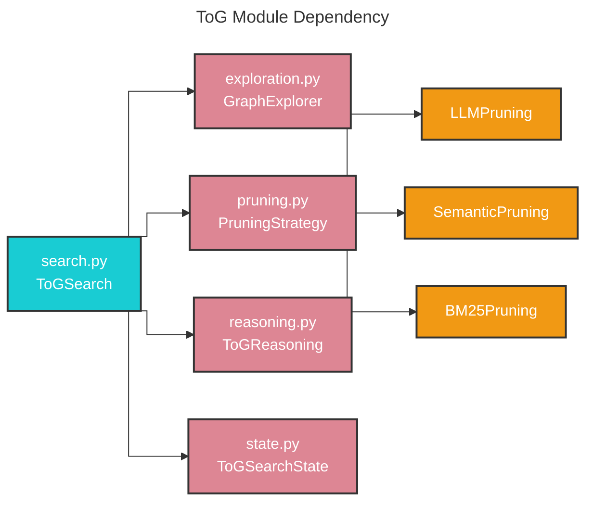

# ToG (Think-on-Graph) Search 🧠

## Deep Reasoning over Knowledge Graphs

Baseline RAG and even standard graph search methods struggle with queries that require multi-hop reasoning — tracing chains of relationships across the knowledge graph to reach a well-supported conclusion. Queries such as "How does character A influence the outcome through intermediary events?" cannot be answered by a single vector lookup or a shallow entity retrieval.

ToG (Think-on-Graph) solves this by performing iterative beam-search exploration guided by an LLM or embedding model at every hop. The algorithm expands promising paths, prunes unlikely ones, checks for early answers, and finally synthesizes a structured response from the discovered evidence — giving every answer an auditable reasoning chain.

## Methodology

```mermaid
---
title: ToG Search Dataflow
---
%%{ init: { 'flowchart': { 'curve': 'step' } } }%%
flowchart LR

    uq[User Query] --- .1
    ch1[Conversation History] --- .1

    subgraph EL[Entity Linking]
        direction TB
        el1[Semantic<br>Embedding]~~~el2[Keyword<br>Fallback]
    end

    .1 --Starting Entities--> EL --> init[Initialize<br>Search State]

    subgraph LOOP[Exploration Loop · depth 0 → max_depth]
        direction TB
        fr[Current Frontier] --> par[Parallel Node<br>Processing]
        par --> rel[Get Relations<br>Bidirectional]
        rel --> bt[Backtrack<br>Filter]
        bt --> ps[Score Relations<br>& Entities]
        ps --> np[Build Next-level<br>Candidates]
        np --> prune[Prune to<br>Beam Width]
        prune --> et{Early<br>Termination?}
        et --No--> fr
    end

    init --> LOOP

    et --YES: answer--> res[Response]
    LOOP --max depth reached--> rea[Reasoning<br>Module]
    rea --generate_answer--> res

     classDef green fill:#26B653,stroke:#333,stroke-width:2px,color:#fff;
     classDef turquoise fill:#19CCD3,stroke:#333,stroke-width:2px,color:#fff;
     classDef rose fill:#DD8694,stroke:#333,stroke-width:2px,color:#fff;
     classDef orange fill:#F19914,stroke:#333,stroke-width:2px,color:#fff;
     classDef purple fill:#B356CD,stroke:#333,stroke-width:2px,color:#fff;
     classDef invisible fill:#fff,stroke:#fff,stroke-width:0px,color:#fff, width:0px;
     class uq,ch1 turquoise;
     class el1,el2,fr,rel,bt,ps,np,prune rose;
     class init,et orange;
     class rea purple;
     class res green;
     class .1 invisible;
```



Given a user query and, optionally, conversation history, ToG search:

1. **Links entities** — finds the top-`width` starting entities using semantic embedding similarity (dot-product against pre-computed entity embeddings in the vector store) or keyword scoring as a fallback (`find_starting_entities_keyword`). When conversation history is present, past user turns (up to 5) are appended to the query for richer entity linking.
2. **Checks depth-0 early termination** — before any traversal begins, the reasoning module is asked whether the starting entities alone can answer the query (checking only the top-3 frontier nodes).
3. **Pre-computes query embedding** — if `SemanticPruning` is active, a single query embedding is computed once and reused across all hops to avoid redundant embedding calls.
4. **Explores iteratively (parallel)** — all nodes in the current frontier are processed concurrently via `asyncio.gather`. For each node:
   - Outgoing and incoming relations are retrieved bidirectionally.
   - A **backtrack filter** removes the reverse of the edge used to reach the current node (preventing A→B→A cycles, mirroring the original ToG paper's `pre_relations + pre_heads` filtering).
   - Relations are scored by the pruning strategy; the top-`width` unique relation groups are kept.
   - For each selected relation group, if the number of entity candidates reaches `ENTITY_CANDIDATE_SAMPLE_THRESHOLD` (20) and exceeds `num_retain_entity`, candidates are randomly sampled down to `num_retain_entity` before the entity-scoring step.
   - Entities are then scored and combined into a per-hop score: `rel_score × (entity_score / 10) × parent_score`.
5. **Prunes to beam width** — after each depth step, all new nodes are sorted by score descending and only the top `beam_width` survive.
6. **Checks early termination** — after every depth step, the LLM is asked (with the top-3 current frontier nodes as context) whether it can already answer confidently. If yes, the answer is returned immediately.
7. **Generates the final answer** — once `max_depth` is reached, all nodes across every depth are passed to `ToGReasoning.generate_answer`, which formats a rich context (CHUNKS → ENTITIES → RELATIONSHIPS) and synthesises a structured response.

## Module Architecture



## Exploration Phase Detail

```mermaid
---
title: Per-node Exploration (one frontier node)
---
%%{ init: { 'flowchart': { 'curve': 'step' } } }%%
flowchart LR

    node[Current Node] --> gr[get_relations<br>outgoing + incoming]
    gr --> bt[Backtrack Filter<br>remove reverse edge]
    bt --> sr[score_relations<br>PruningStrategy]
    sr --> toprel[Top-width Relation<br>Groups]
    toprel --> sample{candidates ≥ 20<br>& > num_retain_entity?}
    sample --Yes--> rand[Random Sample<br>to num_retain_entity]
    sample --No--> gfi[get_full_entity_info]
    rand --> gfi
    gfi --> se[score_entities<br>PruningStrategy]
    se --> comb[Combined Score<br>rel × (entity/10) × parent]
    comb --> newnode[New ExplorationNode<br>depth+1]

     classDef rose fill:#DD8694,stroke:#333,stroke-width:2px,color:#fff;
     classDef orange fill:#F19914,stroke:#333,stroke-width:2px,color:#fff;
     class node,gr,bt,sr,toprel rose;
     class sample,rand,gfi,se,comb,newnode orange;
```

**Two-stage scoring per hop:**

| Stage | Input | Method (LLM) | Method (Semantic) | Method (BM25) |
|-------|-------|---------------|-------------------|---------------|
| Relation scoring | `(query, entity_name, relations, current_path)` | `TOG_RELATION_SCORING_PROMPT` → scores 1–10 | Cosine similarity query↔relation text (scaled `[-1,1]→[0,10]`) | BM25 IDF-TF normalized 1–10 |
| Entity scoring | `(query, current_path, entity_candidates)` | `TOG_ENTITY_SCORING_PROMPT` → scores 1–10 | Cosine similarity query↔entity text (scaled `[-1,1]→[0,10]`) | BM25 IDF-TF normalized 1–10 |

If the number of entity candidates in a relation group reaches `ENTITY_CANDIDATE_SAMPLE_THRESHOLD` (20) and exceeds `num_retain_entity`, they are randomly sampled before the entity-scoring step (matching the original ToG paper semantics).

**Combined score formula:** `combined = parent.score × rel_score × (entity_score / 10.0)`

## Pruning Strategies

Three strategies implement the `PruningStrategy` base class:

| Class | Relation Scoring | Entity Scoring | LLM calls per hop | Notes |
|-------|-----------------|----------------|-------------------|-------|
| `LLMPruning` | Structured prompt → parse list; accepts `current_path` context | Structured prompt → parse list | 2 | Prompts loadable from `.txt`/`.md` file paths |
| `SemanticPruning` | Cosine similarity (pre-computed or on-demand embeddings); accepts optional `relationship_embedding_store` | Cosine similarity (pre-computed or on-demand embeddings); accepts optional `entity_embedding_store` | 0 (embedding only) | Query embedding pre-computed once per search and reused |
| `BM25Pruning` | BM25 IDF-TF lexical score over `"{entity} {direction} {rel_desc}"` | BM25 IDF-TF lexical score over `"{name}: {desc}"` | 0 | Parameters: `k1=1.5`, `b=0.75` |

## Reasoning Phase Detail

`ToGReasoning` provides four operations:

- **`check_early_termination`** — lightweight YES/NO LLM check against the **top-3** frontier nodes at each depth. Uses a structured prompt that requests citations via `[Data: Entities (...)]` format. Returns `(True, answer, metrics)` or `(False, None, metrics)`.
- **`generate_answer`** — builds a rich context block (CHUNKS → ENTITIES → RELATIONSHIPS with full descriptions) and calls the LLM with `TOG_REASONING_PROMPT` using streaming (`achat_stream`). Returns `(answer, reasoning_paths, metrics)`.
- **`format_paths`** (`_format_paths` internally) — formats all explored nodes into the structured context text (three sections: `=== CHUNKS ===`, `=== ENTITIES ===`, `=== RELATIONSHIPS ===`) used by both functions above. Relationship descriptions are only shown when they differ from and are longer than the relation label.
- **`get_reasoning_paths`** — returns a list of human-readable path strings (triplet chains) for the given nodes.

## Key Data Structures

### `ExplorationNode` (`state.py`)

```python
@dataclass
class ExplorationNode:
    entity_id: str
    entity_name: str
    entity_description: str
    depth: int
    score: float                              # accumulated: parent.score × rel_score × (entity_score/10)
    parent: ExplorationNode | None
    relation_from_parent: str | None
    relation_full_description: str | None     # full text from Relationship object
    entity_full_description: str | None       # full text from Entity object
    relation_direction_from_parent: str | None  # "outgoing" or "incoming"
    relation_source_id: str | None            # entity ID on the source side of the edge
    relation_target_id: str | None            # entity ID on the target side of the edge
```

Helper methods:
- `get_path()` — returns `(entity, relation)` pairs from root to node.
- `get_relation_history()` — returns structured `(parent, relation, child, direction)` tuples.
- `get_relation_history_text()` — compact multiline text representation of relation history.

### `ToGSearchState` (`state.py`)

```python
@dataclass
class ToGSearchState:
    query: str
    current_depth: int
    nodes_by_depth: Dict[int, List[ExplorationNode]]
    finished_paths: List[ExplorationNode]
    max_depth: int
    beam_width: int
```

`prune_current_frontier()` sorts nodes at `current_depth` by score descending and slices to `beam_width`.

### `ToGMetrics` (`search.py`)

Aggregates `PruningMetrics` (from exploration) and `ReasoningMetrics` (from reasoning), broken down into separate `exploration` / `reasoning` categories and returned in the final `SearchResult`. Also tracks `embedding_calls` and `embedding_tokens` for semantic strategies.

## Configuration

Below are the key parameters of the [`ToGSearch` class](https://github.com/microsoft/graphrag/blob/main//graphrag/query/structured_search/tog_search/search.py):

* `model`: `ChatModel` used for pruning (LLM strategy) and reasoning
* `entities`: list of `Entity` objects loaded from the indexed parquet files
* `relationships`: list of `Relationship` objects from the indexed output
* `tokenizer`: used for accurate token counting in metrics
* `pruning_strategy`: a `PruningStrategy` instance — `LLMPruning`, `SemanticPruning`, or `BM25Pruning`
* `reasoning_module`: a `ToGReasoning` instance for answer generation
* `text_units`: optional list of `TextUnit` objects for source-chunk grounding in the context
* `embedding_model`: optional `EmbeddingModel` for semantic entity linking and (if `SemanticPruning`) query embedding pre-computation
* `entity_text_embeddings`: optional `BaseVectorStore` with pre-computed entity embeddings
* `width`: beam width — number of parallel paths to maintain (default `3`)
* `depth`: maximum exploration depth / hops (default `3`)
* `num_retain_entity`: maximum entity candidates per relation group before random sampling; sampling only triggers when candidates also reach `ENTITY_CANDIDATE_SAMPLE_THRESHOLD` (20) (default `5`)
* `callbacks`: optional list of `QueryCallbacks` for streaming event hooks
* `debug`: enables verbose logging of exploration steps
* `debug_force_max_depth`: when `True` (and `debug=True`), ignores early termination signals and always explores to `max_depth` — useful for inspecting full graph traversal

## Comparison with Other Methods

| Method | Approach | Hops | LLM calls | Transparency | Best For |
|--------|----------|------|-----------|--------------|----------|
| **Global Search** | Map-reduce over community reports | Shallow | Many (parallel) | Low | Dataset-wide themes |
| **Local Search** | Entity neighbourhood retrieval | Shallow | Few | Medium | Specific entity details |
| **DRIFT Search** | Adaptive local + global | Medium | Medium | Medium | Dynamic exploration |
| **ToG Search** | Beam-search graph traversal with backtrack filtering and parallel node processing | Deep (configurable) | Many (sequential per depth) | High | Multi-hop causal/relational queries |

## How to Use

```bash
# CLI
graphrag query --root ./my-project --method tog "your multi-hop question"
```

An example notebook can be found at [`examples_notebooks/tog_search.ipynb`](../examples_notebooks/tog_search.ipynb).
