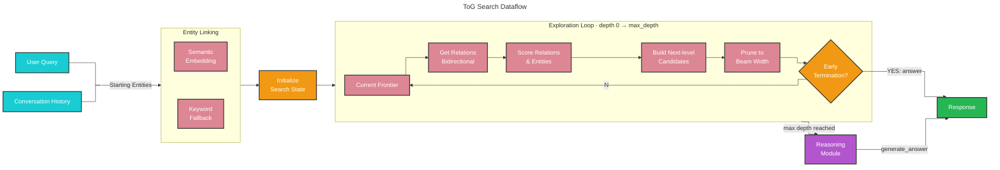
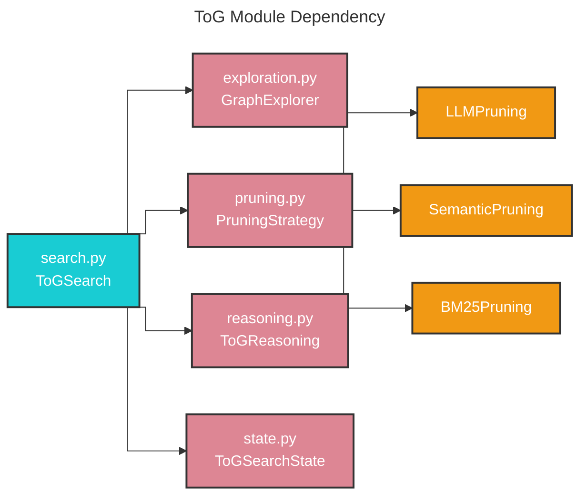
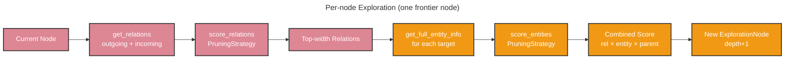

# ToG (Think-on-Graph) Search 🧠

## Deep Reasoning over Knowledge Graphs

Baseline RAG and even standard graph search methods struggle with queries that require multi-hop reasoning — tracing chains of relationships across the knowledge graph to reach a well-supported conclusion. Queries such as "How does character A influence the outcome through intermediary events?" cannot be answered by a single vector lookup or a shallow entity retrieval.

ToG (Think-on-Graph) solves this by performing iterative beam-search exploration guided by an LLM or embedding model at every hop. The algorithm expands promising paths, prunes unlikely ones, checks for early answers, and finally synthesizes a structured response from the discovered evidence — giving every answer an auditable reasoning chain.

## Methodology



Given a user query and, optionally, conversation history, ToG search:

1. **Links entities** — finds the top-`width` starting entities using semantic embedding similarity (dot-product against pre-computed entity embeddings in the vector store) or keyword scoring as a fallback.
2. **Checks depth-0 early termination** — before any traversal begins, the reasoning module is asked whether the starting entities alone can answer the query.
3. **Explores iteratively** — for each node in the current frontier, outgoing and incoming relations are retrieved bidirectionally, then scored by the pruning strategy. Entity candidates reachable via the top-scored relations are scored in a second stage and combined into a per-hop score (`rel_score × entity_score × parent_score`).
4. **Prunes to beam width** — after each depth step, all new nodes are sorted by score and only the top `beam_width` survive.
5. **Checks early termination** — after every depth step, the LLM is asked (with the current frontier as context) whether it can already answer confidently. If yes, the answer is streamed immediately.
6. **Generates the final answer** — once `max_depth` is reached, all nodes across every depth are passed to `ToGReasoning.generate_answer`, which formats a rich context (source chunks → entity descriptions → relationship descriptions) and synthesises a structured response.

## Module Architecture



## Exploration Phase Detail



**Two-stage scoring per hop:**

| Stage | Input | Method (LLM) | Method (Semantic) | Method (BM25) |
|-------|-------|---------------|-------------------|---------------|
| Relation scoring | `(query, entity_name, relations)` | `TOG_RELATION_SCORING_PROMPT` → scores 1–10 | Cosine similarity query↔relation text | BM25 normalized 1–10 |
| Entity scoring | `(query, current_path, entity_candidates)` | `TOG_ENTITY_SCORING_PROMPT` → scores 1–10 | Cosine similarity query↔entity text | BM25 normalized 1–10 |

If the number of entity candidates exceeds `num_retain_entity`, they are randomly sampled before the entity-scoring step (matching the original ToG paper semantics).

## Pruning Strategies

Three strategies implement the `PruningStrategy` base class:

| Class | Relation Scoring | Entity Scoring | LLM calls per hop |
|-------|-----------------|----------------|-------------------|
| `LLMPruning` | Structured prompt → parse list | Structured prompt → parse list | 2 |
| `SemanticPruning` | Cosine similarity (embeddings) | Cosine similarity (embeddings) | 0 (embedding only) |
| `BM25Pruning` | BM25 IDF-TF lexical score | BM25 IDF-TF lexical score | 0 |

## Reasoning Phase Detail

`ToGReasoning` provides three operations:

- **`check_early_termination`** — lightweight YES/NO LLM check against the top-3 frontier nodes at each depth. Returns `(True, answer)` or `(False, None)`.
- **`generate_answer`** — builds a rich context block (CHUNKS → ENTITIES → RELATIONSHIPS with full descriptions) and calls the LLM with `TOG_REASONING_PROMPT`. Returns `(answer, reasoning_paths, metrics)`.
- **`format_paths`** — formats all explored nodes into the structured context text used by both functions above.

## Key Data Structures

### `ExplorationNode` (`state.py`)

```python
@dataclass
class ExplorationNode:
    entity_id: str
    entity_name: str
    entity_description: str
    depth: int
    score: float                              # accumulated: parent.score × rel × entity
    parent: ExplorationNode | None
    relation_from_parent: str | None
    relation_full_description: str | None     # full text from Relationship object
    entity_full_description: str | None       # full text from Entity object
```

### `ToGSearchState` (`state.py`)

```python
@dataclass
class ToGSearchState:
    query: str
    current_depth: int
    nodes_by_depth: Dict[int, List[ExplorationNode]]
    finished_paths: List[ExplorationNode]
    max_depth: int
    beam_width: int
```

`prune_current_frontier()` sorts nodes at `current_depth` by score descending and slices to `beam_width`.

### `ToGMetrics` (`search.py`)

Aggregates `PruningMetrics` (from exploration) and `ReasoningMetrics` (from reasoning), broken down into separate `exploration` / `reasoning` categories and returned in the final `SearchResult`.

## Configuration

Below are the key parameters of the [`ToGSearch` class](https://github.com/microsoft/graphrag/blob/main//graphrag/query/structured_search/tog_search/search.py):

* `model`: `ChatModel` used for pruning (LLM strategy) and reasoning
* `entities`: list of `Entity` objects loaded from the indexed parquet files
* `relationships`: list of `Relationship` objects from the indexed output
* `tokenizer`: used for accurate token counting in metrics
* `pruning_strategy`: a `PruningStrategy` instance — `LLMPruning`, `SemanticPruning`, or `BM25Pruning`
* `reasoning_module`: a `ToGReasoning` instance for answer generation
* `text_units`: optional list of `TextUnit` objects for source-chunk grounding in the context
* `embedding_model`: optional `EmbeddingModel` for semantic entity linking
* `entity_text_embeddings`: optional `BaseVectorStore` with pre-computed entity embeddings
* `width`: beam width — number of parallel paths to maintain (default `3`)
* `depth`: maximum exploration depth / hops (default `3`)
* `num_retain_entity`: maximum entity candidates before random sampling in entity-scoring stage (default `5`)
* `callbacks`: optional list of `QueryCallbacks` for streaming event hooks
* `debug`: enables verbose logging of exploration steps

## Comparison with Other Methods

| Method | Approach | Hops | LLM calls | Transparency | Best For |
|--------|----------|------|-----------|--------------|----------|
| **Global Search** | Map-reduce over community reports | Shallow | Many (parallel) | Low | Dataset-wide themes |
| **Local Search** | Entity neighbourhood retrieval | Shallow | Few | Medium | Specific entity details |
| **DRIFT Search** | Adaptive local + global | Medium | Medium | Medium | Dynamic exploration |
| **ToG Search** | Beam-search graph traversal | Deep (configurable) | Many (sequential) | High | Multi-hop causal/relational queries |

## How to Use

```bash
# CLI
graphrag query --root ./my-project --method tog "your multi-hop question"
```

An example notebook can be found at [`examples_notebooks/tog_search.ipynb`](../examples_notebooks/tog_search.ipynb).
