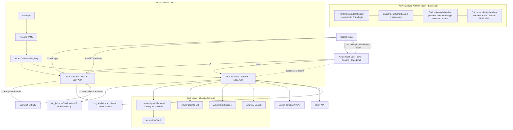

**Notes:**
- Auth is handled by ACA Easy Auth at the platform level (no custom JWT validation in app code).
- Frontend Easy Auth action: `RedirectToLoginPage`. Backend Easy Auth action: `Return401`.
- Browser calls `/api/*` through Front Door. Front Door routes to backend origin and injects `X-AFD-Secret`.
- Backend is protected against bypass by layered controls: Front Door route + `X-AFD-Secret` check + Easy Auth on backend.
- Backend uses Managed Identity to read runtime secrets from Key Vault. Frontend does not use Managed Identity.
- `AFD_ORIGIN_SECRET` must be different per environment (staging/prod).
- Data layer (Cosmos, Blob, Search, Key Vault + MI) is already provisioned from previous phases and must be reused.
