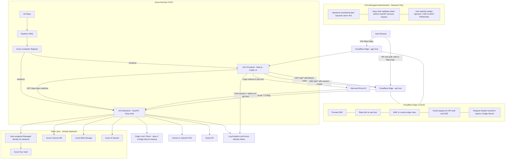

**Notes:**
- Cloudflare replaces Azure Front Door as the public edge because Front Door is not available in the target Azure Student setup.
- Public routing uses two hostnames, not one path-routed hostname:
  - `app.<domain>` -> frontend ACA
  - `api.<domain>` -> backend ACA
- Backend remains protected by layered controls: Cloudflare rate limiting/WAF, `X-Edge-Secret`, and Easy Auth on the backend.
- Frontend is public. Backend is the protected auth boundary.
- Frontend login/logout actions must target the backend auth host and redirect users back to `app.<domain>` after login/logout.
- Backend uses Managed Identity to read runtime secrets from Key Vault. Frontend does not use Managed Identity.
- `EDGE_ORIGIN_SECRET` must be different per environment (staging/prod).
- Data layer (Cosmos, Blob, Search, Key Vault + MI) is already provisioned from previous phases and must be reused.
- SSE endpoints (agent stream, indexing status) use session cookie auth because `EventSource` cannot set custom headers.
- SSE responses must emit heartbeat events every 25-30 seconds to avoid idle proxy timeout at the edge.
- Frontend image is built per environment (`frontend:<sha>-<env>`) because `NEXT_PUBLIC_` vars are inlined at build time.
- Backend image is environment-agnostic (runtime env vars only).
- Backend Easy Auth must have `allowedAudiences` including `api://<backend-app-id>` for token validation.
- Backend should log `Cf-Ray` for request correlation and `CF-Connecting-IP` as the original client IP when available.
- ACA custom domains should use uploaded certificates in this topology. Do not rely on ACA managed certificates behind Cloudflare proxying.
