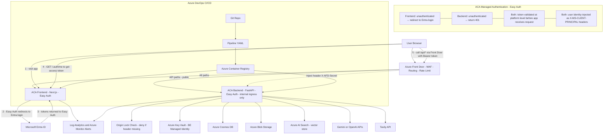

**Notes:**
- Auth is handled entirely by **ACA Easy Auth** at the platform level — no auth code in Next.js or FastAPI.
- Frontend Easy Auth action: `RedirectToLoginPage`. Backend Easy Auth action: `Return401`.
- Browser calls `/.auth/me` (served by Easy Auth) to get the access token, then sends it as `Authorization: Bearer` to `/api/*` via Front Door.
- Backend has **internal ingress only** — only reachable via Front Door publicly. Easy Auth on the backend validates the Bearer token before FastAPI processes the request.
- `X-AFD-Secret` origin lock applies to all Front Door → backend traffic.
- Backend Managed Identity used for Key Vault access only. Frontend does not need a Managed Identity.
- Separate `AFD_ORIGIN_SECRET` values per environment (staging vs prod) in Key Vault.
