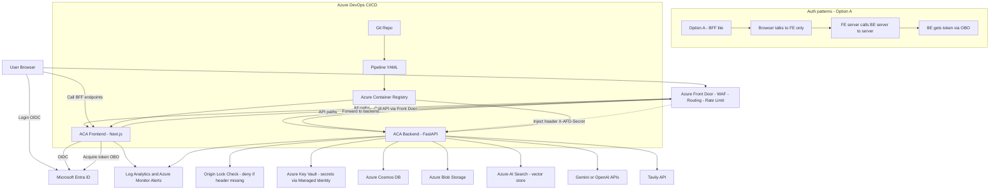

```mermaid
flowchart TB
  U[User Browser] --> FD[Azure Front Door - WAF - Routing - Rate Limit]
  U -->|Login OIDC| ENTRA[Microsoft Entra ID]

  FD -->|All paths| FE[ACA Frontend - Next.js]
  FD -->|API paths| BE[ACA Backend - FastAPI]

  FE -->|OIDC| ENTRA

  subgraph AUTH[Auth patterns - Option A]
    A1[Option A - BFF lite]
    A1a[Browser talks to FE only]
    A1b[FE server calls BE server to server]
    A1c[BE gets token via OBO]
    A1 --> A1a --> A1b --> A1c
  end

  U -->|Call BFF endpoints| FE
  FE -->|Call API via Front Door| FD
  FE -->|Acquire token OBO| ENTRA
  FD -->|Forward to backend| BE

  FD -.->|Inject header X-AFD-Secret| BE
  BE --> LOCK[Origin Lock Check - deny if header missing]

  BE --> KV[Azure Key Vault - secrets via Managed Identity]
  BE --> COSMOS[Azure Cosmos DB]
  BE --> BLOB[Azure Blob Storage]
  BE --> SEARCH[Azure AI Search - vector store]
  BE --> LLM[Gemini or OpenAI APIs]
  BE --> TAVILY[Tavily API]

  FE --> LAW[Log Analytics and Azure Monitor Alerts]
  BE --> LAW

  subgraph CICD[Azure DevOps CI/CD]
    REPO[Git Repo] --> PIPE[Pipeline YAML]
    PIPE --> ACR[Azure Container Registry]
    ACR --> FE
    ACR --> BE
  end
```