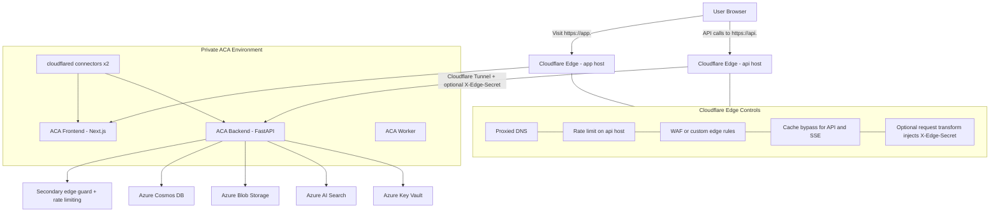

**Notes:**

- Cloudflare is the only public edge.
- Frontend and API stay split by hostname: `app.<domain>` and `api.<domain>`.
- Backend protection comes from private ingress, Cloudflare Tunnel, optional `X-Edge-Secret`, and application rate limiting.
- `CORS_ORIGINS` must allow only `https://app.<domain>`.
- SSE traffic stays on the API host and must emit heartbeat events.
