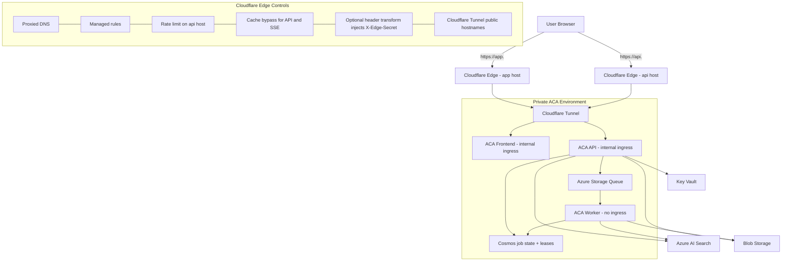

# Production Topology v3 - GToG

## Notes

- Cloudflare Tunnel replaces any public ACA API path.
- `X-Edge-Secret` is optional defense in depth, not the primary origin lock.
- Frontend and API use separate public hostnames, but both resolve through Cloudflare-only ingress.
- Worker execution remains off the synchronous API path.
