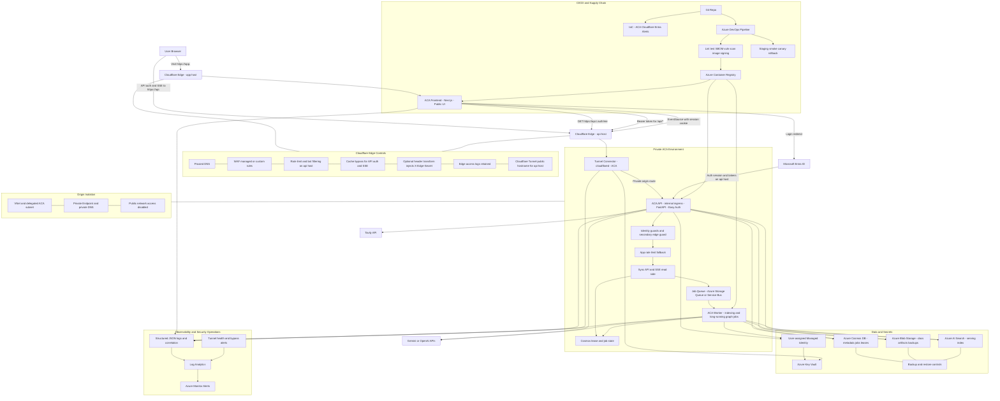

# Production Topology v3 - GToG

## What Changed from v2

- Split the single backend role into:
  - `ACA API`: auth boundary, synchronous API, SSE read-side
  - `ACA Worker`: indexing and long-running graph jobs
  - `Tunnel Connector`: private-origin connector for `api.<domain>`
- Replaced public API origin routing with `Cloudflare Tunnel -> private ACA API`.
- Added explicit private networking controls for the backend plane:
  - delegated ACA subnet
  - private endpoint and private DNS
  - public network access disabled
- Kept `X-Edge-Secret` only as a secondary application-layer guard instead of the primary origin lock.
- Added tunnel health and origin-bypass observability as first-class release concerns.

## Production Notes

- Required API hardening:
  - `api.<domain>` must route through Cloudflare Tunnel to a private ACA origin.
  - ACA backend environment must use private networking, and public network access must be disabled before production sign-off.
- Frontend remains public, but backend is the auth boundary.
- `X-Edge-Secret` may remain enabled as a secondary guard and telemetry signal, but it is not sufficient to claim production origin isolation on its own.
- `X-Edge-Secret` must be different per environment and rotated with a documented runbook when used.
- Cloudflare Tunnel should run with at least 2 replicas per environment.
- `CORS_ORIGINS` must only allow `https://app.<domain>`.
- Frontend should send Bearer tokens for normal `/api/*` calls and use Easy Auth session cookie only for `EventSource` and auth flows.
- SSE responses must emit heartbeat events every 25-30 seconds and disable caching and buffering.
- Backend API should stay stateless for request handling; job progress and lock ownership must live in Cosmos, not in process memory.

## Data Protection and Recovery

- Key Vault should have soft delete, purge protection, diagnostics, and secret expiry alerts.
- Blob should enable soft delete and versioning for uploaded documents and generated artifacts where cost permits.
- Cosmos should have a defined backup policy and a tested restore procedure.
- AI Search should be treated as rebuildable from Blob and Cosmos source-of-truth data.
- Document the target `RPO` and `RTO` for collection metadata, uploaded files, and serving indexes.

## Release Gates

- Every deploy should run:
  - unit and integration tests
  - container build
  - SBOM generation
  - image vulnerability scan
  - signed image publish
  - staging smoke tests through `api.<domain>`
  - public direct-origin denial test
  - tunnel connector failover test
  - auth audience isolation test
  - SSE long-running stream test
- Production deploy should use canary rollout with a fast ACA revision rollback path.

## Minimum Acceptance for "Production Ready"

1. The ACA API origin is not reachable from the public Internet.
2. `api.<domain>` is served only through Cloudflare Tunnel to the private ACA API.
3. Direct public origin probes fail at the network layer, not only at the header-validation layer.
4. Indexing runs in the worker path, not on the synchronous API path.
5. Job state survives replica restart and supports resume and retry.
6. Backup and restore steps are documented and tested.
7. Structured logs, alerts, and correlation IDs are visible end to end, including tunnel health.
8. Staging to production promotion uses a controlled rollout and rollback procedure.
