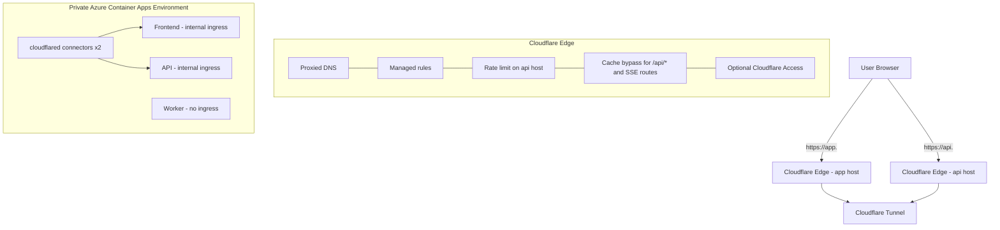

# Production Topology v4 - GToG

> Simplified production topology for a Cloudflare-only ingress model. Every browser request enters through Cloudflare, and no ACA origin is exposed directly to the public Internet.

## Design Principles

- Cloudflare is the only public edge for both frontend and API traffic.
- Frontend and API use internal ACA ingress only.
- The worker has no ingress.
- `X-Edge-Secret` can exist as a secondary guard, but origin isolation comes from topology.
- Direct-origin probes must fail because there is no public ACA ingress path.
