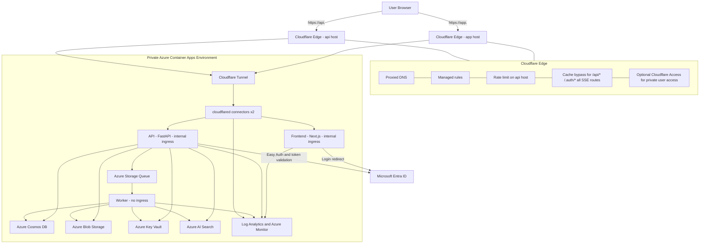

# Production Topology v4 - GToG

> Simplified production topology for a Cloudflare-only ingress model. Every browser request enters through Cloudflare, and no Azure application origin is exposed directly to the public Internet.

## Design Principles

- **Cloudflare is the only public edge** for both frontend and API traffic.
- **No ACA app has public ingress**. Frontend and API are reached only through Cloudflare Tunnel.
- **One tunnel per environment** publishes both `app.<domain>` and `api.<domain>`.
- **Frontend and API remain split by hostname** so auth, CORS, and browser behavior stay explicit.
- **The API remains stateless** for request handling, while the worker handles indexing and other long-running jobs.
- **Keep v1 simple** by hardening ingress first and deferring non-essential network complexity.

## What Changed from v3

- `app.<domain>` is now routed through **Cloudflare Tunnel** instead of pointing to a public ACA frontend origin.
- Both frontend and API now sit behind the same Cloudflare-only ingress model.
- The topology removes the assumption that any Azure application component is publicly reachable.
- The deploy design is simplified around a single release path rather than a canary-first rollout.
- `EDGE_ORIGIN_SECRET` is no longer a required primary control in the topology. If used, it is only a secondary defense-in-depth control.
- Full private-endpoint rollout for all managed Azure dependencies is deferred from the initial production design.

## Production Notes

- The ACA environment must not expose a public application origin for frontend or API traffic.
- The frontend service should keep **internal ingress only**.
- The API service should keep **internal ingress only**.
- The worker should have **no ingress**.
- `api.<domain>` remains the auth host for:
  - `/.auth/login/*`
  - `/.auth/logout/*`
  - `/.auth/me`
  - `/api/*`
- `CORS_ORIGINS` should allow only `https://app.<domain>`.
- SSE responses should emit heartbeat events every 25-30 seconds and disable caching/buffering.
- Run at least **2 cloudflared connector replicas** per environment.
- Direct-origin probes should fail because there is no public ACA ingress path.

## Optional Access Control Layer

If the application itself should only be reachable by approved users, add **Cloudflare Access** in front of `app.<domain>`.

Recommended usage:

- apply Access on `app.<domain>` first
- keep API authentication at the backend boundary on `api.<domain>` with Easy Auth as the primary control
- add Access on `api.<domain>` later only if the browser flow is validated end to end

This keeps the first production deployment simple while still allowing a stricter private-user gate later.

## Simplified Operational Model

Use a small release path:

1. **Validate**
2. **Build**
3. **Deploy**
4. **Smoke test**

For the initial production release:

- no canary rollout is required
- rollback can use the last known good ACA revision
- origin isolation is achieved by topology, not by header-only filtering

## Accepted Initial Risks

- Azure AI Search Free SKU remains an accepted production exception.
- Full private-endpoint alignment for Cosmos DB, Blob Storage, and Key Vault is deferred.
- Cloudflare Free-tier controls are used for v1, so only a minimal edge policy set is assumed.

## Minimum Acceptance for This Topology

1. `app.<domain>` is served through Cloudflare only.
2. `api.<domain>` is served through Cloudflare only.
3. Frontend and API ACA ingress are internal-only.
4. The worker is not publicly reachable.
5. A direct probe to the ACA origin fails.
6. Login, `/.auth/me`, health checks, indexing submission, status polling, and SSE work end to end.
7. Cloudflare and ACA logs provide enough request correlation for support and incident triage.
