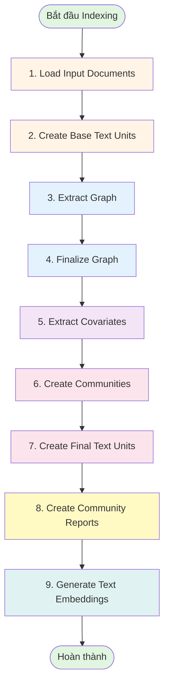
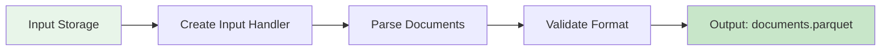
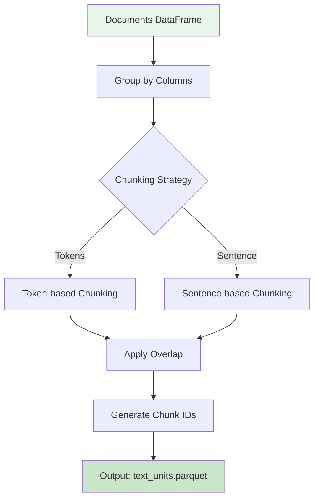
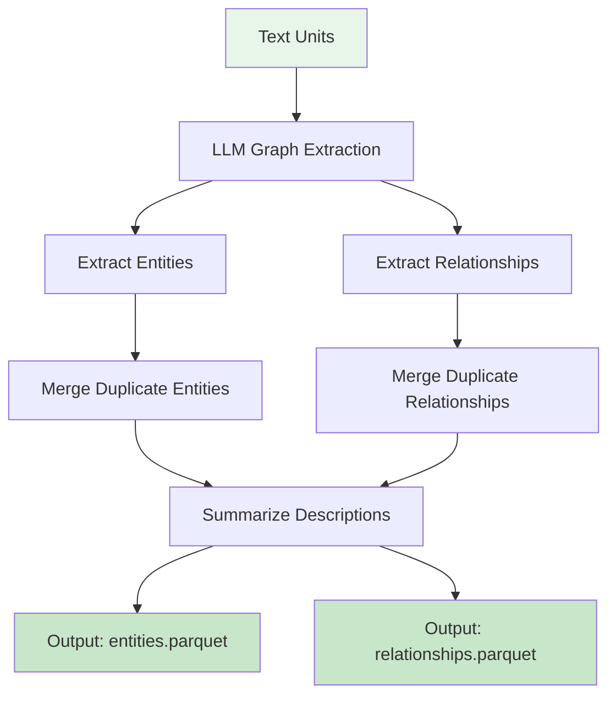
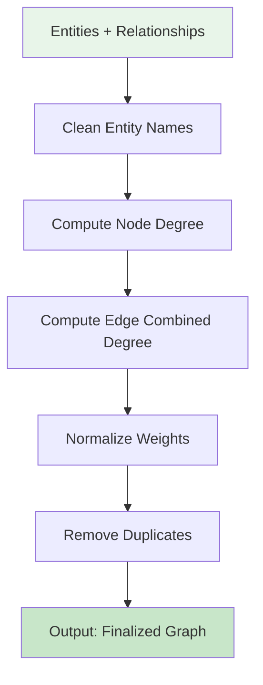
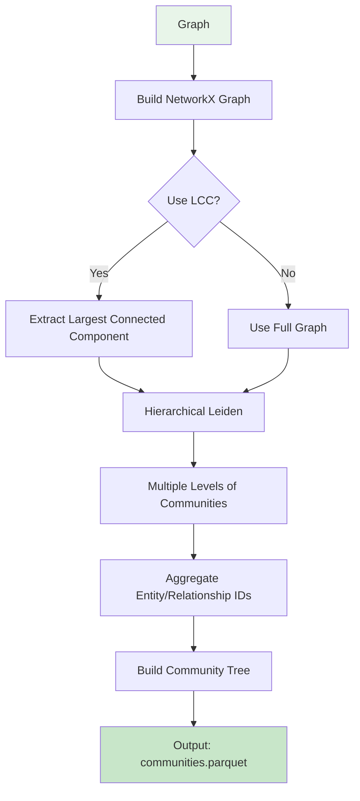
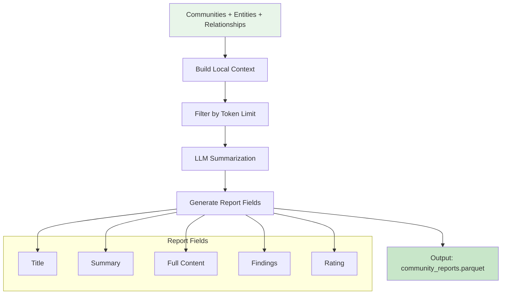
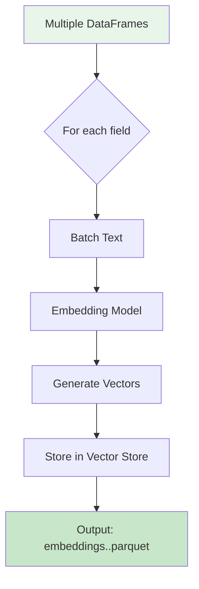
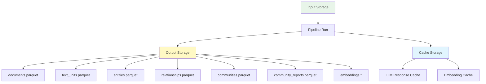
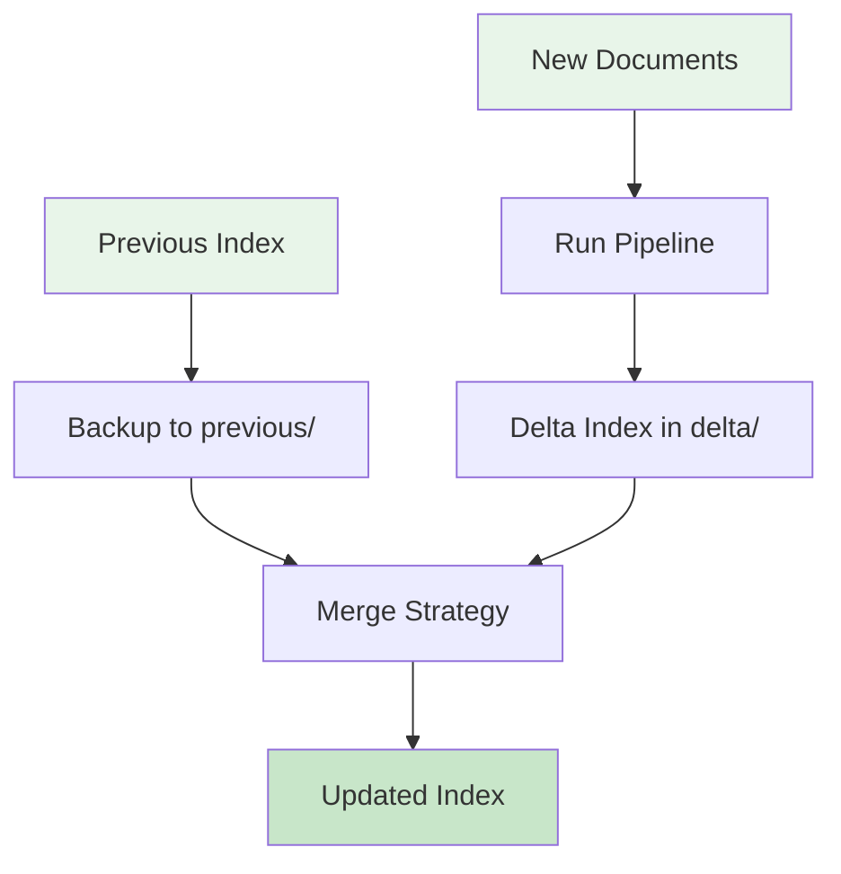

# GraphRAG Document Indexing Flow

## Tổng quan

Hệ thống GraphRAG sử dụng một pipeline indexing phức tạp để chuyển đổi các document thô thành một knowledge graph có cấu trúc, được tối ưu hóa cho việc truy vấn và tìm kiếm thông tin. Quá trình indexing diễn ra qua nhiều workflow tuần tự, mỗi workflow thực hiện một nhiệm vụ cụ thể trong việc xử lý và làm giàu dữ liệu.

## Kiến trúc Pipeline

Hệ thống hỗ trợ 4 loại pipeline indexing:

1. **Standard Indexing** - Pipeline đầy đủ với LLM-based entity extraction
2. **Fast Indexing** - Pipeline nhanh hơn sử dụng NLP-based extraction
3. **Standard Update** - Cập nhật incremental cho pipeline standard
4. **Fast Update** - Cập nhật incremental cho pipeline fast

## Flow Chart - Standard Indexing Pipeline



## Chi tiết từng Workflow

### 1. Load Input Documents
**File**: `graphrag/index/workflows/load_input_documents.py`

**Mục đích**: Đọc và phân tích các document đầu vào từ storage (file system, blob storage, etc.)

**Quy trình**:


**Input**: 
- Raw documents từ `input/` directory
- Supported formats: text, csv, json

**Output**: 
- DataFrame với schema:
  - `id`: Document identifier
  - `text`: Document content
  - `metadata`: Optional metadata (JSON string)

**Ví dụ thực tế**:
```python
# Input: input/document1.txt
"""
Công ty ABC được thành lập năm 2020 bởi Nguyễn Văn A. 
Công ty chuyên về phát triển phần mềm AI.
"""

# Output: documents.parquet
{
    "id": "doc_001",
    "text": "Công ty ABC được thành lập năm 2020...",
    "metadata": "{\"source\": \"document1.txt\", \"type\": \"text\"}"
}
```

---

### 2. Create Base Text Units
**File**: `graphrag/index/workflows/create_base_text_units.py`

**Mục đích**: Chia nhỏ documents thành các text chunks có kích thước phù hợp để xử lý

**Quy trình**:


**Thuật toán chunking**:
1. Group documents theo `group_by_columns` (default: `[id]`)
2. Aggregate text từ tất cả documents trong group
3. Split text thành chunks với:
   - `size`: Maximum tokens per chunk (default: 1200)
   - `overlap`: Tokens overlap giữa các chunks (default: 100)
4. Prepend metadata nếu được config
5. Tạo unique SHA512 hash cho mỗi chunk

**Output**:
- DataFrame với schema:
  - `id`: Chunk identifier (SHA512 hash)
  - `text`: Chunk content
  - `document_ids`: List of source document IDs
  - `n_tokens`: Number of tokens in chunk

**Ví dụ thực tế**:
```python
# Input: 1 document với 2500 tokens
# Config: size=1200, overlap=100

# Output: 3 text units
[
    {
        "id": "chunk_001_hash",
        "text": "Công ty ABC được thành lập...",  # tokens 0-1200
        "document_ids": ["doc_001"],
        "n_tokens": 1200
    },
    {
        "id": "chunk_002_hash",
        "text": "...phát triển phần mềm AI...",  # tokens 1100-2300 (overlap 100)
        "document_ids": ["doc_001"],
        "n_tokens": 1200
    },
    {
        "id": "chunk_003_hash",
        "text": "...và mở rộng thị trường.",  # tokens 2200-2500
        "document_ids": ["doc_001"],
        "n_tokens": 300
    }
]
```

---

### 3. Extract Graph (LLM-based)
**File**: `graphrag/index/workflows/extract_graph.py`

**Mục đích**: Trích xuất entities và relationships từ text units bằng LLM

**Quy trình**:


**LLM Strategy**:
1. Sử dụng prompt `extract_graph.txt` để hướng dẫn LLM
2. Trích xuất các entity types được định nghĩa (organization, person, geo, event)
3. Xác định relationships giữa các entities
4. Gleanings: Lặp lại extraction để thu thập thêm thông tin (max_gleanings)
5. Async processing với concurrent requests

**Entity Schema**:
- `id`: Entity identifier
- `title`: Entity name
- `type`: Entity type (organization, person, etc.)
- `description`: Summarized description from all mentions
- `text_unit_ids`: List of chunks where entity appears

**Relationship Schema**:
- `id`: Relationship identifier
- `source`: Source entity title
- `target`: Target entity title
- `description`: Relationship description
- `weight`: Relationship strength (optional)
- `text_unit_ids`: List of chunks where relationship appears

**Ví dụ thực tế**:
```python
# Input text unit:
"""
Công ty ABC được thành lập năm 2020 bởi Nguyễn Văn A ở Hà Nội. 
Công ty chuyên về phát triển phần mềm AI.
"""

# Output entities:
[
    {
        "id": "entity_001",
        "title": "Công ty ABC",
        "type": "organization",
        "description": "Công ty chuyên về phát triển phần mềm AI, được thành lập năm 2020",
        "text_unit_ids": ["chunk_001_hash"]
    },
    {
        "id": "entity_002",
        "title": "Nguyễn Văn A",
        "type": "person",
        "description": "Nhà sáng lập Công ty ABC",
        "text_unit_ids": ["chunk_001_hash"]
    },
    {
        "id": "entity_003",
        "title": "Hà Nội",
        "type": "geo",
        "description": "Địa điểm thành lập Công ty ABC",
        "text_unit_ids": ["chunk_001_hash"]
    }
]

# Output relationships:
[
    {
        "id": "rel_001",
        "source": "Nguyễn Văn A",
        "target": "Công ty ABC",
        "description": "Nguyễn Văn A là người thành lập Công ty ABC",
        "weight": 1.0,
        "text_unit_ids": ["chunk_001_hash"]
    },
    {
        "id": "rel_002",
        "source": "Công ty ABC",
        "target": "Hà Nội",
        "description": "Công ty ABC được thành lập tại Hà Nội",
        "weight": 0.8,
        "text_unit_ids": ["chunk_001_hash"]
    }
]
```

---

### 4. Finalize Graph
**File**: `graphrag/index/workflows/finalize_graph.py`

**Mục đích**: Làm sạch và chuẩn hóa graph, tính toán các thuộc tính bổ sung

**Quy trình**:


**Xử lý**:
- Chuẩn hóa entity names (trim, lowercase for matching)
- Tính `degree` cho mỗi entity (số lượng relationships)
- Tính `combined_degree` cho mỗi relationship
- Remove orphan entities (entities không có relationships)
- Deduplicate based on entity titles

---

### 5. Extract Covariates (Optional)
**File**: `graphrag/index/workflows/extract_covariates.py`

**Mục đích**: Trích xuất claims và facts từ text units (nếu enabled)

**Output**: `covariates.parquet` chứa các claims/facts được trích xuất

---

### 6. Create Communities
**File**: `graphrag/index/workflows/create_communities.py`

**Mục đích**: Phát hiện communities (nhóm entities liên kết chặt chẽ) trong graph

**Thuật toán**: Hierarchical Leiden Clustering



**Parameters**:
- `max_cluster_size`: Maximum size per community (default: 10)
- `use_lcc`: Only use largest connected component
- `seed`: Random seed for reproducibility

**Community Schema**:
- `id`: Community identifier
- `level`: Hierarchy level (0 = lowest, higher = more aggregated)
- `title`: Community title
- `entity_ids`: List of entity IDs in community
- `relationship_ids`: List of relationship IDs within community
- `text_unit_ids`: List of relevant text units
- `parent`: Parent community ID
- `children`: List of child community IDs
- `size`: Number of entities

**Ví dụ thực tế**:
```python
# Input: Graph với 10 entities và 15 relationships
# Communities discovered at 2 levels:

# Level 0 (fine-grained):
[
    {
        "id": "comm_001",
        "level": 0,
        "title": "Community 1",
        "entity_ids": ["entity_001", "entity_002", "entity_003"],
        "relationship_ids": ["rel_001", "rel_002"],
        "parent": 1,  # belongs to community 1 at level 1
        "children": [],
        "size": 3
    },
    {
        "id": "comm_002",
        "level": 0,
        "title": "Community 2",
        "entity_ids": ["entity_004", "entity_005"],
        "relationship_ids": ["rel_003"],
        "parent": 1,
        "children": [],
        "size": 2
    }
]

# Level 1 (coarse-grained):
[
    {
        "id": "comm_003",
        "level": 1,
        "title": "Community 1",
        "entity_ids": ["entity_001", "entity_002", "entity_003", "entity_004", "entity_005"],
        "relationship_ids": ["rel_001", "rel_002", "rel_003"],
        "parent": -1,  # top level
        "children": [1, 2],  # communities 1 and 2 from level 0
        "size": 5
    }
]
```

---

### 7. Create Final Text Units
**File**: `graphrag/index/workflows/create_final_text_units.py`

**Mục đích**: Enrichment text units với entity và relationship information

**Output**: Text units được bổ sung với:
- List of entity IDs mentioned
- List of relationship IDs present
- Community assignments

---

### 8. Create Community Reports
**File**: `graphrag/index/workflows/create_community_reports.py`

**Mục đích**: Tạo summaries cho mỗi community bằng LLM

**Quy trình**:


**LLM Strategy**:
1. Collect entities, relationships, và claims trong community
2. Build local context với token budget (max_input_length: 8000)
3. Sử dụng prompts:
   - `community_report_graph.txt` - cho graph-based communities
   - `community_report_text.txt` - cho text-based communities
4. Generate structured report với các sections

**Report Schema**:
- `id`: Report identifier
- `community`: Community ID
- `level`: Hierarchy level
- `title`: Report title
- `summary`: Executive summary (short)
- `full_content`: Detailed report content
- `findings`: List of key findings (JSON)
- `rating`: Importance rating (float)
- `rating_explanation`: Explanation for rating

**Ví dụ thực tế**:
```json
{
    "id": "report_001",
    "community": 1,
    "level": 0,
    "title": "Hệ sinh thái Công ty ABC và Nhà sáng lập",
    "summary": "Community này tập trung vào Công ty ABC, nhà sáng lập Nguyễn Văn A, và các hoạt động kinh doanh phần mềm AI tại Hà Nội.",
    "full_content": "# Tổng quan\n\nCông ty ABC là một tổ chức...",
    "findings": [
        {
            "summary": "Công ty ABC được thành lập năm 2020",
            "explanation": "Nguyễn Văn A là người sáng lập công ty này"
        },
        {
            "summary": "Chuyên môn về AI",
            "explanation": "Công ty tập trung vào phát triển phần mềm AI"
        }
    ],
    "rating": 8.5,
    "rating_explanation": "Community có tầm quan trọng cao do liên quan đến startup công nghệ và nhân vật chủ chốt"
}
```

---

### 9. Generate Text Embeddings
**File**: `graphrag/index/workflows/generate_text_embeddings.py`

**Mục đích**: Tạo vector embeddings cho các text fields để hỗ trợ semantic search

**Các trường được embed** (configurable):
1. `document.text` - Document embeddings
2. `entity.title` - Entity name embeddings
3. `entity.description` - Entity description embeddings
4. `relationship.description` - Relationship embeddings
5. `text_unit.text` - Text unit embeddings
6. `community_report.title` - Report title embeddings
7. `community_report.summary` - Report summary embeddings
8. `community_report.full_content` - Full report embeddings

**Quy trình**:


**Embedding Strategy**:
- Model: `text-embedding-3-small` (configurable)
- Batch processing với:
  - `batch_size`: 16 items per batch
  - `batch_max_tokens`: 8191 tokens per batch
- Concurrent requests: 25
- Vector dimension: 1536 (model-dependent)

**Output**: Separate parquet files cho mỗi embedded field
```python
# embeddings.entity.description.parquet
[
    {
        "id": "entity_001",
        "embedding": [0.123, -0.456, 0.789, ...]  # 1536-dim vector
    },
    ...
]
```

**Storage**: Embeddings được lưu vào Vector Store (LanceDB)
- Table per entity type
- Supports similarity search
- Optimized for retrieval

---

## Pipeline Execution Context

### Storage Architecture


### Runtime Context
- **Callbacks**: Progress tracking, logging, monitoring
- **Cache**: LLM response caching để tránh duplicate calls
- **Stats**: Performance metrics cho mỗi workflow
- **State**: Shared state between workflows

### Incremental Update Mode

Khi chạy incremental update (`is_update_run=True`):



**Update Workflows** (chạy sau standard workflows):
1. `update_entities_relationships` - Merge new entities/relationships
2. `update_communities` - Recompute communities
3. `update_community_reports` - Update reports
4. `update_text_embeddings` - Generate embeddings cho new content
5. `update_clean_state` - Cleanup và finalization

---

## Configuration Example

**File**: `settings.yaml`

```yaml
# Chunking
chunks:
  size: 1200          # tokens per chunk
  overlap: 100        # overlap between chunks
  group_by_columns: [id]

# Entity Extraction
extract_graph:
  model_id: default_chat_model
  prompt: "prompts/extract_graph.txt"
  entity_types: [organization, person, geo, event]
  max_gleanings: 1    # số lần iteration để extract thêm

# Community Detection
cluster_graph:
  max_cluster_size: 10
  use_lcc: true       # chỉ dùng largest connected component
  seed: 42            # reproducibility

# Community Reports
community_reports:
  model_id: default_chat_model
  max_length: 2000         # max report length
  max_input_length: 8000   # max context for LLM

# Embeddings
embed_text:
  model_id: default_embedding_model
  vector_store_id: default_vector_store
  # Names of fields to embed:
  names:
    - entity.description
    - text_unit.text
    - community_report.summary
```

---

## Performance Considerations

### Bottlenecks
1. **LLM Calls** - Extract graph và community reports
   - Mitigation: Concurrent requests, caching
2. **Embeddings** - Large number of texts
   - Mitigation: Batching, async processing
3. **Graph Clustering** - Large graphs
   - Mitigation: LCC filtering, max_cluster_size

### Optimization Tips
1. **Use Fast Pipeline** - NLP-based extraction thay vì LLM (nhanh hơn 10-20x)
2. **Adjust chunk size** - Balance giữa context và processing speed
3. **Limit entity types** - Giảm complexity của extraction
4. **Cache aggressively** - Reuse LLM responses
5. **Tune concurrency** - Balance giữa speed và rate limits

### Monitoring
```python
# stats.json output after indexing
{
    "total_runtime": 1234.56,
    "num_documents": 100,
    "workflows": {
        "load_input_documents": {"overall": 5.2},
        "create_base_text_units": {"overall": 12.8},
        "extract_graph": {"overall": 856.3},
        "create_communities": {"overall": 45.1},
        "create_community_reports": {"overall": 267.4},
        "generate_text_embeddings": {"overall": 47.6}
    }
}
```

---

## Ví dụ thực tế End-to-End

### Input
**File**: `input/company_profile.txt`
```
Công ty ABC Technology được thành lập vào tháng 3 năm 2020 bởi hai nhà đồng sáng lập 
Nguyễn Văn A và Trần Thị B tại Hà Nội. Công ty chuyên về phát triển các giải pháp 
trí tuệ nhân tạo cho ngành tài chính.

Năm 2021, công ty đã huy động được 5 triệu USD từ quỹ đầu tư XYZ Ventures. 
CEO Nguyễn Văn A cho biết, nguồn vốn này sẽ được sử dụng để mở rộng đội ngũ 
và phát triển sản phẩm mới.

Hiện tại, ABC Technology có văn phòng tại Hà Nội và TP.HCM, với hơn 50 nhân viên.
```

### Processing Steps

**Step 1: Load Documents**
```python
documents = [{
    "id": "doc_001",
    "text": "Công ty ABC Technology được thành lập...",
    "metadata": '{"source": "company_profile.txt"}'
}]
```

**Step 2: Create Text Units** (với chunk_size=200 tokens)
```python
text_units = [
    {
        "id": "chunk_001",
        "text": "Công ty ABC Technology được thành lập vào tháng 3 năm 2020...",
        "n_tokens": 200
    },
    {
        "id": "chunk_002", 
        "text": "Năm 2021, công ty đã huy động được 5 triệu USD...",
        "n_tokens": 180
    }
]
```

**Step 3: Extract Graph**
```python
entities = [
    {"title": "ABC Technology", "type": "organization"},
    {"title": "Nguyễn Văn A", "type": "person"},
    {"title": "Trần Thị B", "type": "person"},
    {"title": "XYZ Ventures", "type": "organization"},
    {"title": "Hà Nội", "type": "geo"},
    {"title": "TP.HCM", "type": "geo"}
]

relationships = [
    {"source": "Nguyễn Văn A", "target": "ABC Technology", "description": "đồng sáng lập"},
    {"source": "Trần Thị B", "target": "ABC Technology", "description": "đồng sáng lập"},
    {"source": "ABC Technology", "target": "Hà Nội", "description": "có trụ sở tại"},
    {"source": "XYZ Ventures", "target": "ABC Technology", "description": "đầu tư vào"}
]
```

**Step 4: Create Communities**
```python
communities_level_0 = [
    {
        "id": 1,
        "title": "Community 1",
        "entity_ids": ["ABC Technology", "Nguyễn Văn A", "Trần Thị B"],
        "level": 0
    },
    {
        "id": 2,
        "title": "Community 2",
        "entity_ids": ["XYZ Ventures", "ABC Technology"],
        "level": 0
    }
]
```

**Step 5: Community Reports**
```json
{
    "title": "Hệ sinh thái ABC Technology",
    "summary": "Công ty công nghệ AI cho tài chính được thành lập bởi 2 founders và nhận đầu tư từ XYZ Ventures",
    "findings": [
        "ABC Technology được thành lập năm 2020 tại Hà Nội",
        "Nhận đầu tư 5 triệu USD năm 2021",
        "Có 2 văn phòng và 50+ nhân viên"
    ],
    "rating": 8.5
}
```

**Step 6: Generate Embeddings**
```python
# Entity embeddings
entity_embeddings = {
    "ABC Technology": [0.123, -0.456, 0.789, ...],  # 1536-dim
    "Nguyễn Văn A": [0.234, -0.567, 0.890, ...],
    ...
}

# Report embeddings
report_embeddings = {
    "community_1": [0.345, -0.678, 0.901, ...]
}
```

### Output Structure
```
output/
├── documents.parquet           # 1 document
├── text_units.parquet          # 2 text units
├── entities.parquet            # 6 entities
├── relationships.parquet       # 4 relationships
├── communities.parquet         # 2 communities (level 0)
├── community_reports.parquet   # 2 reports
├── embeddings.entity.description.parquet
├── embeddings.community_report.summary.parquet
└── stats.json                  # Performance metrics
```

---

## Summary

Pipeline indexing của GraphRAG chuyển đổi raw documents thành một knowledge graph được cấu trúc hóa cao thông qua 9 workflows chính:

1. **Load Documents** → Parse input
2. **Chunk Text** → Split into processable units
3. **Extract Graph** → LLM extracts entities & relationships
4. **Finalize Graph** → Clean and compute metrics
5. **Extract Covariates** → Extract claims/facts (optional)
6. **Create Communities** → Detect entity clusters
7. **Finalize Text Units** → Enrich with graph data
8. **Create Reports** → LLM summarizes communities
9. **Generate Embeddings** → Vector representations for search

Output là một rich knowledge graph với:
- **Entities** với types và descriptions
- **Relationships** với weights
- **Communities** với hierarchical structure
- **Reports** với summaries và findings
- **Embeddings** cho semantic search

Hệ thống hỗ trợ cả full indexing và incremental updates, với extensive caching và monitoring capabilities.
