# GraphRAG Document Indexing Flow

## Tổng quan

GraphRAG (Graph Retrieval-Augmented Generation) là một hệ thống xử lý và indexing tài liệu thông minh sử dụng knowledge graph và LLM để trích xuất thông tin từ dữ liệu phi cấu trúc. Hệ thống chuyển đổi các tài liệu đầu vào thành một knowledge graph có cấu trúc với entities, relationships, và community reports.

## Kiến trúc Pipeline

GraphRAG sử dụng một pipeline workflow có thể cấu hình với nhiều bước xử lý tuần tự. Hệ thống hỗ trợ 2 phương thức indexing chính:

1. **Standard Indexing** - Sử dụng LLM để trích xuất graph
2. **Fast Indexing** - Sử dụng NLP (spaCy) để trích xuất nhanh hơn

## Sơ đồ Flow Tổng quan


## Chi tiết từng Workflow

### 1. Load Input Documents
**File:** `graphrag/index/workflows/load_input_documents.py`


**Chức năng:**
- Đọc tài liệu từ nhiều nguồn (CSV, JSON, Text files)
- Parse và chuẩn hóa thành format chuẩn
- Tạo DataFrame với các cột: `id`, `text`, `title`, `metadata`
- Lưu vào output storage dưới dạng `documents.parquet`

**Input:**
- Raw documents từ input storage

**Output:**
```
documents.parquet
├── id: str
├── text: str
├── title: str (optional)
└── metadata: dict (optional)
```

---

### 2. Create Base Text Units
**File:** `graphrag/index/workflows/create_base_text_units.py`


**Chức năng:**
- Chia tài liệu thành các chunk nhỏ hơn (text units)
- Áp dụng chunking strategy có thể cấu hình:
  - **Size**: Số token tối đa mỗi chunk (mặc định: 300)
  - **Overlap**: Số token trùng lặp giữa các chunk (mặc định: 100)
  - **Strategy**: `tokens` hoặc `sentences`
- Prepend metadata vào mỗi chunk nếu được cấu hình
- Tạo unique ID cho mỗi text unit

**Cấu hình quan trọng:**
```python
chunks:
  size: 300              # Tokens per chunk
  overlap: 100           # Overlap tokens
  encoding_model: cl100k_base
  strategy: tokens       # hoặc 'sentences'
  group_by_columns: []   # Nhóm theo metadata
  prepend_metadata: false
```

**Output:**
```
text_units.parquet
├── id: str (SHA512 hash)
├── text: str (chunked text)
├── n_tokens: int
└── document_ids: list[str]
```

---

### 3. Extract Graph
**File:** `graphrag/index/workflows/extract_graph.py`


**Chức năng:**

#### A. Entity Extraction
- Sử dụng LLM để nhận diện entities trong text
- Trích xuất:
  - **Title**: Tên entity
  - **Type**: Loại entity (PERSON, ORG, LOCATION, etc.)
  - **Description**: Mô tả chi tiết
  - **Source IDs**: Text unit IDs chứa entity này

#### B. Relationship Extraction
- Nhận diện mối quan hệ giữa các entities
- Trích xuất:
  - **Source**: Entity nguồn
  - **Target**: Entity đích
  - **Type**: Loại relationship
  - **Description**: Mô tả mối quan hệ
  - **Weight**: Độ mạnh của mối quan hệ (optional)

#### C. Summarization
- **Entities**: Merge các mentions của cùng một entity, tổng hợp descriptions
- **Relationships**: Combine các descriptions của cùng một relationship

**LLM Strategy Configuration:**
```python
extract_graph:
  model_id: gpt-4-turbo-preview
  entity_types: [
    "PERSON",
    "ORGANIZATION", 
    "LOCATION",
    "EVENT",
    "CONCEPT"
  ]
  max_gleanings: 1       # Số lần LLM refine extraction
```

**Output:**
```
entities.parquet
├── id: str
├── title: str
├── type: str
├── description: str
├── text_unit_ids: list[str]
└── degree: int (added later)

relationships.parquet
├── id: str
├── source: str
├── target: str
├── description: str
├── weight: float
└── text_unit_ids: list[str]
```

---

### 4. Finalize Graph
**File:** `graphrag/index/workflows/finalize_graph.py`


**Chức năng:**
- Tạo graph structure từ entities và relationships
- Tính toán graph metrics:
  - **Node Degree**: Số lượng connections của mỗi entity
  - **Edge Combined Degree**: Tổng degree của source và target
- Tạo graph layout (visualization coordinates):
  - **UMAP**: Dimensionality reduction để tạo 2D layout
  - **Zero**: Default layout tại (0,0)
- Thêm short IDs cho entities và relationships

**Output:**
```
finalized_entities.parquet (replaces entities.parquet)
├── ... (all entity fields)
├── degree: int
├── x: float (layout coordinate)
└── y: float (layout coordinate)

finalized_relationships.parquet
├── ... (all relationship fields)
├── combined_degree: int
├── source_degree: int
└── target_degree: int
```

---

### 5. Extract Covariates (Claims)
**File:** `graphrag/index/workflows/extract_covariates.py`


**Chức năng:**
- Trích xuất các "claims" hoặc "facts" từ text
- Claims là các phát biểu có thể verify (đúng/sai/nghi ngờ)
- Liên kết claims với entities và text units
- Sử dụng trong community reports để cung cấp bằng chứng

**Configuration:**
```python
extract_claims:
  enabled: true
  max_gleanings: 1
  description: "Any claims or facts that could be relevant to information discovery."
```

**Output:**
```
covariates.parquet
├── id: str
├── subject_id: str (entity ID)
├── subject_text: str
├── object_id: str (entity ID, optional)
├── object_text: str
├── type: str
├── status: str (TRUE/FALSE/SUSPECTED)
├── description: str
├── source_text: str
└── text_unit_id: str
```

---

### 6. Create Communities
**File:** `graphrag/index/workflows/create_communities.py`


**Chức năng:**
- Áp dụng thuật toán **Hierarchical Leiden Clustering** để phát hiện communities
- Tạo cấu trúc phân cấp (hierarchical) của communities:
  - **Level 0**: Communities chi tiết nhất (nhiều communities nhỏ)
  - **Level N**: Communities tổng quát nhất (ít communities lớn)
- Mỗi community chứa:
  - Danh sách entities thuộc community
  - Danh sách relationships nội bộ (source và target cùng community)
  - Danh sách text units liên quan
  - Parent community (ở level cao hơn)
  - Children communities (ở level thấp hơn)

**Configuration:**
```python
cluster_graph:
  max_cluster_size: 10    # Max entities per community
  use_lcc: true           # Use only largest connected component
  seed: 0xDEADBEEF        # Random seed cho reproducibility
```

**Thuật toán Leiden:**
- Cải tiến của Louvain algorithm
- Tối ưu hóa modularity của graph partitioning
- Tạo communities có high internal connectivity, low external connectivity

**Output:**
```
communities.parquet
├── id: str (UUID)
├── community: int (community number)
├── level: int (hierarchy level)
├── title: str ("Community X")
├── entity_ids: list[str]
├── relationship_ids: list[str]
├── text_unit_ids: list[str]
├── parent: int (parent community)
├── children: list[int]
├── period: str (ISO date)
├── size: int (number of entities)
└── human_readable_id: int
```

---

### 7. Create Final Text Units
**File:** `graphrag/index/workflows/create_final_text_units.py`


**Chức năng:**
- Linking text units với tất cả các entities, relationships, communities, và claims được trích xuất từ chúng
- Tạo "enriched" text units với đầy đủ context
- Mỗi text unit biết nó chứa entities nào, relationships nào, thuộc communities nào

**Output:**
```
final_text_units.parquet
├── id: str
├── text: str
├── n_tokens: int
├── document_ids: list[str]
├── entity_ids: list[str]
├── relationship_ids: list[str]
└── covariate_ids: list[str] (nếu có)
```

---

### 8. Create Community Reports
**File:** `graphrag/index/workflows/create_community_reports.py`

```mermaid
flowchart TB
    A[Communities] --> B[Explode Communities<br/>Join with Entities]
    
    B --> C[Build Local Context<br/>per Community]
    
    C --> D[Collect Entities<br/>in community]
    C --> E[Collect Relationships<br/>in community]
    C --> F[Collect Claims<br/>in community]
    
    D --> G[Format Graph Context<br/>Nodes + Edges + Claims]
    E --> G
    F --> G
    
    G --> H[Apply Token Limit<br/>max_input_length]
    
    H --> I[LLM Summarization<br/>Generate Report]
    
    I --> J[Extract Report Components]
    
    J --> K1[Title]
    J --> K2[Summary]
    J --> K3[Full Content]
    J --> K4[Findings]
    J --> K5[Rating]
    J --> K6[Rating Explanation]
    
    K1 --> L[Finalize Reports<br/>Add metadata]
    K2 --> L
    K3 --> L
    K4 --> L
    K5 --> L
    K6 --> L
    
    L --> M[community_reports.parquet]
```



**Chức năng:**

#### A. Build Context
Cho mỗi community, xây dựng context bao gồm:
- **Entities**: Tất cả entities trong community với descriptions
- **Relationships**: Tất cả relationships nội bộ
- **Claims**: Các claims liên quan (nếu có)
- Format thành prompt cho LLM

#### B. LLM Summarization
- Gửi context đến LLM với prompt yêu cầu tạo comprehensive report
- LLM tạo structured report với:
  - **Title**: Tên tóm tắt cho community
  - **Summary**: Tóm tắt ngắn gọn
  - **Full Content**: Nội dung đầy đủ (2-3 paragraphs)
  - **Findings**: Danh sách các insights chính
  - **Rating**: Importance rating (1-10)
  - **Rating Explanation**: Giải thích rating

#### C. Hierarchical Processing
- Process communities từ level thấp đến level cao
- Communities ở level cao aggregate context từ children communities

**Configuration:**
```python
community_reports:
  model_id: gpt-4-turbo-preview
  max_input_length: 16000  # Token limit for context
  max_report_length: 2000  # Token limit for report
```

**Output:**
```
community_reports.parquet
├── id: str (community ID)
├── community: int
├── level: int
├── title: str
├── summary: str
├── full_content: str
├── findings: list[dict]
│   ├── summary: str
│   └── explanation: str
├── rating: float
├── rating_explanation: str
└── period: str
```

---

### 9. Generate Text Embeddings
**File:** `graphrag/index/workflows/generate_text_embeddings.py`


**Chức năng:**
- Tạo vector embeddings cho các text fields quan trọng
- Embeddings được sử dụng cho:
  - **Similarity search**: Tìm entities/communities tương tự
  - **Query matching**: Match user query với relevant content
  - **Hybrid search**: Kết hợp với graph traversal
- Batch processing để tối ưu hóa API calls
- Cache embeddings để tránh tính toán lại

**Supported Embedding Fields:**
1. **document_text**: Toàn bộ document text
2. **entity_title**: Tên entities
3. **entity_description**: Title + Description của entities
4. **relationship_description**: Descriptions của relationships
5. **text_unit_text**: Text của các chunks
6. **community_title**: Tên communities
7. **community_summary**: Summary của community reports
8. **community_full_content**: Full content của community reports

**Configuration:**
```python
embed_text:
  model_id: text-embedding-3-small
  names: [
    "entity_description",
    "community_full_content",
    "text_unit_text"
  ]
  batch_size: 256
  batch_max_tokens: 8191
```

**Output:**
```
embeddings.{field_name}.parquet
├── id: str (entity/document/community ID)
└── embedding: list[float] (vector dimensions: 1536)
```

---

## Luồng xử lý Update (Incremental Indexing)

GraphRAG hỗ trợ **incremental indexing** để update knowledge graph khi có tài liệu mới:


**Update Workflows:**
- `update_final_documents`
- `update_entities_relationships`
- `update_text_units`
- `update_covariates`
- `update_communities`
- `update_community_reports`
- `update_text_embeddings`
- `update_clean_state`

**Strategy:**
1. Index new documents separately (delta index)
2. Merge delta với previous index
3. Re-run clustering và reporting chỉ cho affected communities
4. Update embeddings chỉ cho new/changed items

---

## Output Structure

Sau khi hoàn thành indexing, output storage chứa các file sau:

```
output/
├── documents.parquet              # Raw documents
├── text_units.parquet             # Chunked text
├── entities.parquet               # Extracted entities
├── relationships.parquet          # Extracted relationships
├── communities.parquet            # Detected communities
├── community_reports.parquet      # LLM-generated reports
├── final_text_units.parquet       # Enriched text units
├── covariates.parquet            # Claims (if enabled)
├── embeddings.entity_description.parquet
├── embeddings.community_full_content.parquet
├── embeddings.text_unit_text.parquet
├── stats.json                     # Indexing statistics
└── context.json                   # Pipeline state
```

**stats.json structure:**
```json
{
  "total_runtime": 1234.56,
  "num_documents": 100,
  "workflows": {
    "create_base_text_units": {"overall": 45.2},
    "extract_graph": {"overall": 567.8},
    "create_communities": {"overall": 89.3},
    "create_community_reports": {"overall": 234.5},
    "generate_text_embeddings": {"overall": 156.7}
  }
}
```

---

## Cấu hình Pipeline

Pipeline có thể được cấu hình thông qua `GraphRagConfig`:

### Standard Pipeline
```python
workflows = [
    "load_input_documents",
    "create_base_text_units",
    "create_final_documents",
    "extract_graph",
    "finalize_graph",
    "extract_covariates",
    "create_communities",
    "create_final_text_units",
    "create_community_reports",
    "generate_text_embeddings"
]
```

### Fast Pipeline (NLP-based)
```python
workflows = [
    "load_input_documents",
    "create_base_text_units",
    "create_final_documents",
    "extract_graph_nlp",       # spaCy instead of LLM
    "prune_graph",             # Remove low-quality edges
    "finalize_graph",
    "create_communities",
    "create_final_text_units",
    "create_community_reports_text",  # Text-based instead of LLM
    "generate_text_embeddings"
]
```

---

## Cache Strategy

GraphRAG sử dụng multi-level caching:


**Cache Types:**
- **LLM Response Cache**: Cache LLM API calls
- **Embedding Cache**: Cache embedding vectors
- **Computation Cache**: Cache expensive graph computations

**Cache Key:**
```python
cache_key = hash({
    "prompt": prompt_text,
    "model": model_id,
    "temperature": temperature,
    "parameters": {...}
})
```

---

## Error Handling & Validation

### Validation Checks

1. **Document Loading:**
   - Validate document format
   - Check required fields (id, text)
   - Validate metadata structure

2. **Entity Extraction:**
   ```python
   if len(extracted_entities) == 0:
       raise ValueError("No entities detected")
   ```

3. **Relationship Extraction:**
   ```python
   if len(extracted_relationships) == 0:
       raise ValueError("No relationships detected")
   ```

4. **Community Detection:**
   - Validate graph connectivity
   - Check if LCC exists (if use_lcc=true)

### Error Recovery


---

## Performance Optimization

### 1. Parallel Processing

```python
extraction_num_threads: 4      # Parallel LLM calls
summarization_num_threads: 4
async_mode: asyncio            # Async execution
```

### 2. Batch Processing

- **Embeddings**: Batch size = 256
- **LLM Calls**: Group similar prompts
- **Graph Operations**: Vectorized pandas operations

### 3. Memory Management

- Stream large DataFrames
- Chunk-wise processing for huge documents
- Clear intermediate results

---

## Query-time Usage

Sau khi indexing, có thể query theo nhiều cách:

### 1. Global Search (Community-based)


### 2. Local Search (Entity-based)


### 3. Hybrid Search
Kết hợp global và local search cho kết quả tốt nhất.

---

## Best Practices

### 1. Document Preparation
- ✅ Clean và normalize text trước khi index
- ✅ Include meaningful metadata
- ✅ Split quá lớn documents thành sections
- ❌ Không include boilerplate text

### 2. Chunking Strategy
- ✅ Tune chunk size theo domain (300-600 tokens)
- ✅ Use overlap để preserve context (100-200 tokens)
- ✅ Test different strategies (tokens vs sentences)

### 3. Entity Types
- ✅ Define domain-specific entity types
- ✅ Limit to 5-10 core types
- ❌ Không quá generic (e.g., "THING")

### 4. Community Reports
- ✅ Use powerful LLM (GPT-4) cho reports
- ✅ Set appropriate max_input_length
- ✅ Review sample reports để tune prompts

### 5. Embeddings
- ✅ Embed the most important fields only
- ✅ Use smaller models cho cost efficiency
- ✅ Cache embeddings aggressively

---

## Kết luận

GraphRAG indexing pipeline là một hệ thống phức tạp nhưng mạnh mẽ để chuyển đổi dữ liệu phi cấu trúc thành structured knowledge graph. Các thành phần chính:

1. **Text Processing**: Chunking và chuẩn hóa
2. **Knowledge Extraction**: LLM-based entity và relationship extraction
3. **Graph Construction**: NetworkX graph với metrics
4. **Community Detection**: Hierarchical clustering
5. **Summarization**: LLM-generated community reports
6. **Embedding**: Vector representations cho similarity search

Pipeline này cho phép:
- ✅ Trả lời complex questions spanning nhiều documents
- ✅ Discover hidden connections trong data
- ✅ Summarize large document collections
- ✅ Incremental updates khi có new data
