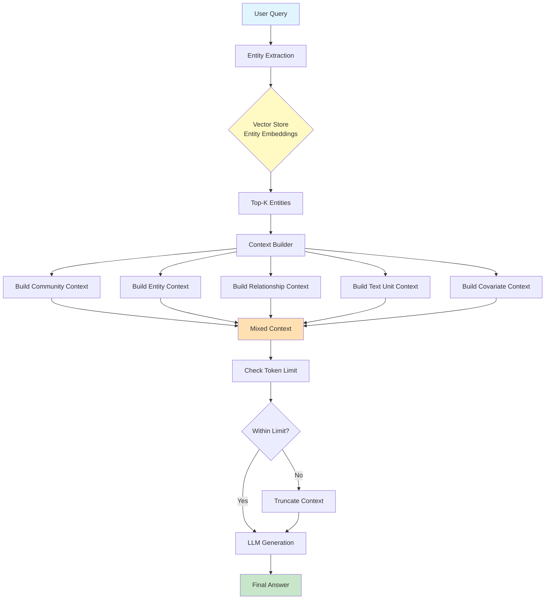
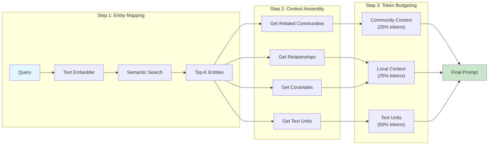
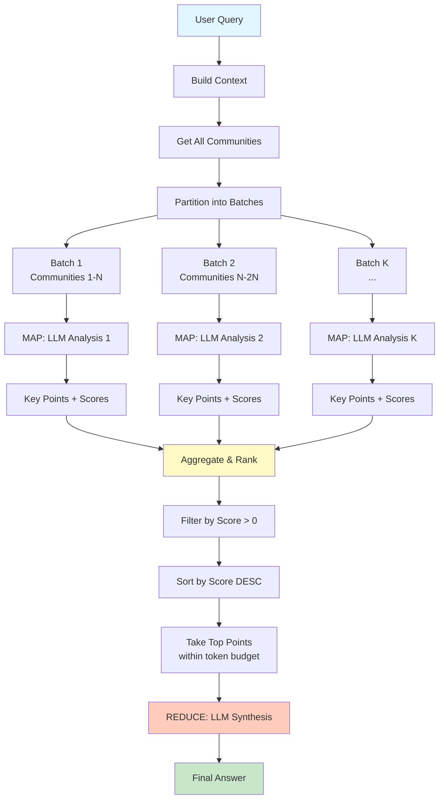
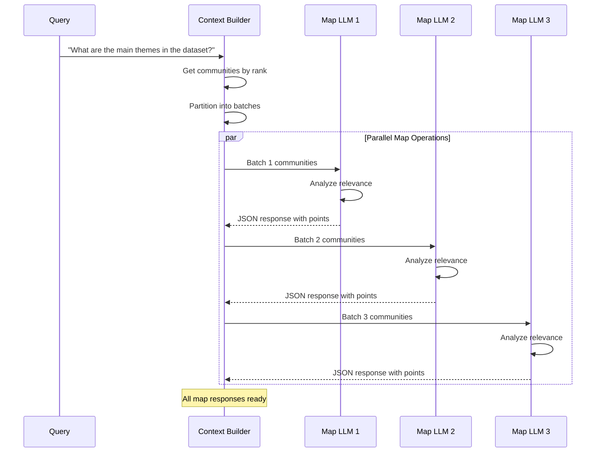
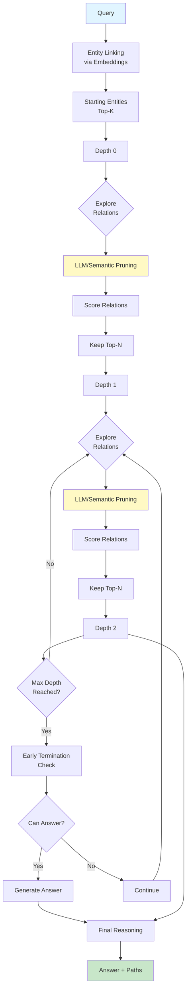
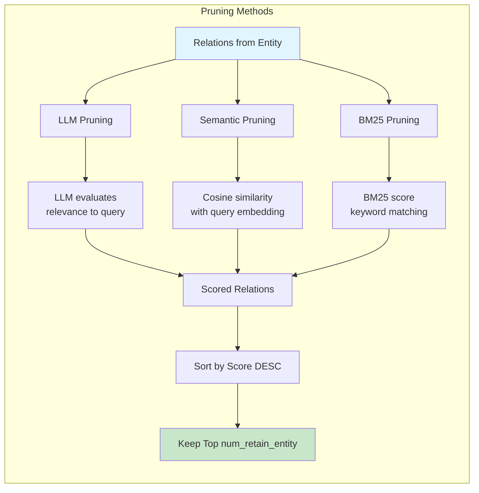

# GraphRAG Retrieval Flow - Cơ chế Truy vấn và Retrieve

## Tổng quan

GraphRAG cung cấp nhiều phương thức retrieve khác nhau để trả lời các loại câu hỏi khác nhau:
- **Local Search**: Câu hỏi cụ thể về entities/relationships
- **Global Search**: Câu hỏi tổng quan, nhiều community
- **ToG Search** (Think-on-Graph): Câu hỏi phức tạp cần reasoning trên graph
- **DRIFT Search**: Hybrid search kết hợp local và global
- **Basic Search**: Simple text embedding search

---

## 1. Local Search - Tìm kiếm cục bộ

### 1.1. Kiến trúc và luồng hoạt động



### 1.2. Chi tiết Context Building



### 1.3. Ví dụ thực tế

**Câu hỏi:** "Mối quan hệ giữa OpenAI và Microsoft là gì?"

**Bước 1: Entity Extraction**
```python
# Query embedding
query = "Mối quan hệ giữa OpenAI và Microsoft là gì?"

# Semantic search trong vector store
top_entities = vector_store.similarity_search(
    query_embedding,
    k=10  # top_k_mapped_entities
)
# Kết quả: ["OpenAI", "Microsoft", "Sam Altman", "Satya Nadella", ...]
```

**Bước 2: Build Context**
```
Token budget: 8000 tokens
├── Community Context (25% = 2000 tokens)
│   ├── Community #123: "Tech Giants Partnership"
│   │   └── Summary: OpenAI và Microsoft có quan hệ đối tác chiến lược...
│   └── Rank: 89
│
├── Local Context (25% = 2000 tokens)
│   ├── Entities:
│   │   ├── OpenAI (rank: 95)
│   │   └── Microsoft (rank: 98)
│   ├── Relationships:
│   │   └── OpenAI --[PARTNERSHIP_WITH]--> Microsoft
│   └── Covariates:
│       └── INVESTMENT: $13 billion từ Microsoft
│
└── Text Units (50% = 4000 tokens)
    ├── Text #456: "In 2023, Microsoft invested..."
    └── Text #789: "OpenAI and Microsoft announced..."
```

**Code Implementation:**
```python
# File: graphrag/query/structured_search/local_search/mixed_context.py

def build_context(
    self,
    query: str,
    max_context_tokens: int = 8000,
    text_unit_prop: float = 0.5,      # 50%
    community_prop: float = 0.25,      # 25%
    top_k_mapped_entities: int = 10,
    top_k_relationships: int = 10,
):
    # 1. Map query to entities
    selected_entities = map_query_to_entities(
        query=query,
        text_embedding_vectorstore=self.entity_text_embeddings,
        text_embedder=self.text_embedder,
        k=top_k_mapped_entities,
        oversample_scaler=2
    )
    
    # 2. Build community context (25%)
    community_tokens = int(max_context_tokens * community_prop)
    community_context = self._build_community_context(
        selected_entities,
        max_context_tokens=community_tokens
    )
    
    # 3. Build local context (25%)
    local_tokens = int(max_context_tokens * (1 - community_prop - text_unit_prop))
    local_context = self._build_local_context(
        selected_entities,
        max_context_tokens=local_tokens,
        top_k_relationships=top_k_relationships
    )
    
    # 4. Build text unit context (50%)
    text_unit_tokens = int(max_context_tokens * text_unit_prop)
    text_unit_context = self._build_text_unit_context(
        selected_entities,
        max_context_tokens=text_unit_tokens
    )
    
    return ContextBuilderResult(
        context_chunks="\n\n".join([
            community_context,
            local_context,
            text_unit_context
        ])
    )
```

---

## 2. Global Search - Tìm kiếm toàn cục

### 2.1. Map-Reduce Architecture



### 2.2. Map Phase - Parallel Analysis



### 2.3. Ví dụ thực tế

**Câu hỏi:** "Các chủ đề chính trong dataset về AI là gì?"

**MAP Phase:**

```json
// Map Response from Batch 1
{
  "points": [
    {
      "description": "Machine Learning frameworks và tools (TensorFlow, PyTorch) được thảo luận rộng rãi",
      "score": 8
    },
    {
      "description": "Ethical concerns về AI bias và fairness",
      "score": 9
    }
  ]
}

// Map Response from Batch 2
{
  "points": [
    {
      "description": "Large Language Models (GPT, BERT) và applications",
      "score": 10
    },
    {
      "description": "AI trong healthcare và medical diagnosis",
      "score": 7
    }
  ]
}
```

**REDUCE Phase:**

```
Aggregated Key Points (sorted by score):
----Analyst 2----
Importance Score: 10
Large Language Models (GPT, BERT) và applications

----Analyst 1----
Importance Score: 9
Ethical concerns về AI bias và fairness

----Analyst 1----
Importance Score: 8
Machine Learning frameworks và tools

...

[LLM synthesizes final answer from these points]
```

**Code Implementation:**
```python
# File: graphrag/query/structured_search/global_search/search.py

async def search(self, query: str) -> GlobalSearchResult:
    # Step 1: Build context - get all communities
    context_result = await self.context_builder.build_context(
        query=query
    )
    
    # Step 2: MAP - parallel analysis
    map_responses = await asyncio.gather(*[
        self._map_response_single_batch(
            context_data=data,
            query=query,
            max_length=self.map_max_length
        )
        for data in context_result.context_chunks
    ])
    
    # Step 3: REDUCE - synthesize final answer
    reduce_response = await self._reduce_response(
        map_responses=map_responses,
        query=query
    )
    
    return reduce_response
```

**_reduce_response detail:**
```python
async def _reduce_response(self, map_responses, query):
    # Collect all key points
    key_points = []
    for index, response in enumerate(map_responses):
        for element in response.response:
            key_points.append({
                "analyst": index,
                "answer": element["answer"],
                "score": element["score"]
            })
    
    # Filter score > 0 and sort
    filtered_key_points = [p for p in key_points if p["score"] > 0]
    filtered_key_points.sort(key=lambda x: x["score"], reverse=True)
    
    # Format within token budget
    data = []
    total_tokens = 0
    for point in filtered_key_points:
        formatted_text = f"""----Analyst {point['analyst'] + 1}----
Importance Score: {point['score']}
{point['answer']}"""
        
        if total_tokens + len(tokenizer.encode(formatted_text)) > self.max_data_tokens:
            break
        data.append(formatted_text)
        total_tokens += len(tokenizer.encode(formatted_text))
    
    # LLM synthesis
    text_data = "\n\n".join(data)
    search_prompt = self.reduce_system_prompt.format(
        report_data=text_data,
        response_type=self.response_type
    )
    
    return await self.model.achat(prompt=query, history=[
        {"role": "system", "content": search_prompt}
    ])
```

---

## 3. ToG Search - Think-on-Graph

### 3.1. Iterative Graph Exploration



### 3.2. Pruning Strategies



### 3.3. Ví dụ thực tế

**Câu hỏi:** "Satya Nadella có kết nối gì với OpenAI?"

**Step-by-step Exploration:**

```
=== DEPTH 0: Starting Entities ===
Via semantic similarity:
1. Satya Nadella (score: 0.95)
2. Microsoft (score: 0.82)
3. OpenAI (score: 0.79)

=== DEPTH 1: Explore from "Satya Nadella" ===
Relations:
- Satya Nadella --[CEO_OF]--> Microsoft (score: 0.92)
- Satya Nadella --[ANNOUNCED]--> Cloud Partnership (score: 0.78)
- Satya Nadella --[MET_WITH]--> Sam Altman (score: 0.85)

After pruning (top 3):
✓ CEO_OF -> Microsoft
✓ MET_WITH -> Sam Altman  
✓ ANNOUNCED -> Cloud Partnership

=== DEPTH 2: Explore from "Microsoft" ===
Relations:
- Microsoft --[PARTNERSHIP_WITH]--> OpenAI (score: 0.95) ✓ FOUND!
- Microsoft --[INVESTED_IN]--> OpenAI (score: 0.93) ✓ FOUND!
- Microsoft --[AZURE_PROVIDER_FOR]--> OpenAI (score: 0.88)

=== Early Termination Check ===
Reasoning: We found direct connection paths!
Paths:
1. Satya Nadella -> CEO_OF -> Microsoft -> PARTNERSHIP_WITH -> OpenAI
2. Satya Nadella -> CEO_OF -> Microsoft -> INVESTED_IN -> OpenAI

Answer: Satya Nadella, với tư cách CEO của Microsoft, có mối liên hệ trực tiếp 
với OpenAI thông qua quan hệ đối tác chiến lược và khoản đầu tư 13 tỷ đô la...
```

**Code Implementation:**
```python
# File: graphrag/query/structured_search/tog_search/search.py

async def stream_search(self, query: str):
    # 1. Find starting entities via embeddings
    if self.embedding_model:
        starting_entities = await self.explorer.find_starting_entities_semantic(
            query, top_k=self.width  # e.g., 3
        )
    
    # 2. Initialize search state
    state = ToGSearchState(
        query=query,
        max_depth=self.depth,      # e.g., 3
        beam_width=self.width       # e.g., 3
    )
    
    # Create initial nodes
    for entity_id in starting_entities:
        initial_node = ExplorationNode(
            entity_id=entity_id,
            depth=0,
            score=1.0
        )
        state.add_node(initial_node)
    
    # 3. Exploration loop
    while state.current_depth < state.max_depth:
        current_nodes = state.get_current_frontier()
        
        for node in current_nodes:
            # Get relations
            relations = self.explorer.get_relations(node.entity_id)
            
            # Score with pruning strategy
            scored_relations = await self.pruning_strategy.score_relations(
                query, node.entity_name, relations
            )
            
            # Keep top N
            scored_relations.sort(key=lambda x: x[4], reverse=True)
            top_relations = scored_relations[:self.num_retain_entity]
            
            # Create new nodes
            for rel_desc, target_id, direction, weight, score in top_relations:
                new_node = ExplorationNode(
                    entity_id=target_id,
                    depth=state.current_depth + 1,
                    score=score,
                    parent=node,
                    relation_from_parent=rel_desc
                )
                state.add_node(new_node)
        
        # Check early termination
        should_terminate, answer = await self.reasoning_module.check_early_termination(
            query, state.get_current_frontier()
        )
        
        if should_terminate and answer:
            yield answer
            return
    
    # 4. Generate final answer from all paths
    answer, paths = await self.reasoning_module.generate_answer(
        query, state.get_all_paths()
    )
    yield answer
```

---

## 4. Retrieval Components - Chi tiết

### 4.1. Entity Extraction & Ranking

```python
# File: graphrag/query/context_builder/entity_extraction.py

def map_query_to_entities(
    query: str,
    text_embedding_vectorstore: BaseVectorStore,
    text_embedder: EmbeddingModel,
    all_entities_dict: dict[str, Entity],
    k: int = 10,
    oversample_scaler: int = 2
):
    """
    Map user query to relevant entities using semantic similarity.
    
    Process:
    1. Embed query text
    2. Search vector store for top K*oversample_scaler entities
    3. Re-rank based on entity attributes
    4. Return top K entities
    """
    # 1. Get query embedding
    query_embedding = text_embedder.embed(query)
    
    # 2. Semantic search with oversampling
    search_results = text_embedding_vectorstore.similarity_search(
        query_embedding,
        k=k * oversample_scaler  # e.g., 10 * 2 = 20
    )
    
    # 3. Map to full entities
    selected_entities = []
    for result in search_results[:k]:
        entity = all_entities_dict.get(result.id)
        if entity:
            selected_entities.append(entity)
    
    return selected_entities
```

### 4.2. Relationship Filtering

```python
# File: graphrag/query/context_builder/local_context.py

def _filter_relationships(
    selected_entities: list[Entity],
    relationships: list[Relationship],
    top_k_relationships: int = 10
):
    """
    Filter and prioritize relationships:
    
    Priority 1: In-network (between selected entities)
    Priority 2: Out-network (connecting to external entities)
                - Prefer mutual connections (entities connected to multiple selected entities)
    """
    selected_names = [e.title for e in selected_entities]
    
    # Priority 1: In-network relationships
    in_network = [
        r for r in relationships
        if r.source in selected_names and r.target in selected_names
    ]
    
    # Priority 2: Out-network relationships
    out_network = [
        r for r in relationships
        if (r.source in selected_names) != (r.target in selected_names)
    ]
    
    # Count links for out-network entities
    entity_links = defaultdict(int)
    for rel in out_network:
        external_entity = (
            rel.target if rel.source in selected_names else rel.source
        )
        entity_links[external_entity] += 1
    
    # Sort by: number of links DESC, then rank DESC
    for rel in out_network:
        external = rel.target if rel.source in selected_names else rel.source
        rel.attributes["links"] = entity_links[external]
    
    out_network.sort(
        key=lambda x: (x.attributes["links"], x.rank),
        reverse=True
    )
    
    budget = top_k_relationships * len(selected_entities)
    return in_network + out_network[:budget]
```

### 4.3. Text Unit Ranking

```python
# File: graphrag/query/structured_search/local_search/mixed_context.py

def _build_text_unit_context(
    self,
    selected_entities: list[Entity],
    max_context_tokens: int = 8000
):
    """
    Rank text units by:
    1. Entity order (entities ranked higher by similarity to query)
    2. Number of relationships mentioned in text unit
    """
    unit_info_list = []
    
    for index, entity in enumerate(selected_entities):
        # Get entity's relationships
        entity_relationships = [
            rel for rel in self.relationships.values()
            if rel.source == entity.title or rel.target == entity.title
        ]
        
        # For each text unit of this entity
        for text_id in entity.text_unit_ids or []:
            text_unit = self.text_units[text_id]
            
            # Count how many relationships are mentioned
            num_relationships = count_relationships(
                entity_relationships, 
                text_unit
            )
            
            unit_info_list.append((
                text_unit,
                index,              # Entity order
                num_relationships   # Relationship count
            ))
    
    # Sort by entity order, then by relationship count DESC
    unit_info_list.sort(key=lambda x: (x[1], -x[2]))
    
    selected_text_units = [unit[0] for unit in unit_info_list]
    
    # Build context within token budget
    return build_text_unit_context(
        text_units=selected_text_units,
        max_context_tokens=max_context_tokens
    )
```

---

## 5. So sánh các phương thức Retrieve

| Feature | Local Search | Global Search | ToG Search | DRIFT | Basic |
|---------|--------------|---------------|------------|-------|-------|
| **Use Case** | Specific questions | Overview questions | Complex reasoning | Hybrid | Simple lookup |
| **Entity-based** | ✅ Top-K semantic | ❌ All communities | ✅ Iterative exploration | ✅ Hybrid | ❌ Text-only |
| **LLM Calls** | 1 | K (map) + 1 (reduce) | N*depth (pruning) + 1 | 2+ | 1 |
| **Latency** | Low (~2s) | Medium (~5-10s) | High (~10-30s) | Medium | Very Low (~1s) |
| **Context Type** | Mixed (entities, rels, communities, texts) | Community reports only | Graph paths | Local + Global | Text embeddings only |
| **Token Budget** | 8000 (configurable) | 8000 per batch | Dynamic | Dynamic | 8000 |
| **Best For** | "Who is X?" | "Summarize themes" | "How X relates to Y?" | General purpose | Keyword search |

---

## 6. Ví dụ End-to-End

### Ví dụ 1: Local Search

**Input:**
```python
from graphrag.query.factory import get_local_search_engine

search_engine = get_local_search_engine(
    config=config,
    entities=entities,
    relationships=relationships,
    text_units=text_units,
    reports=reports,
    description_embedding_store=vector_store
)

result = await search_engine.search(
    "Công nghệ nào mà Tesla đang phát triển?"
)
```

**Output:**
```
Context Retrieved:
- Entities: Tesla, Elon Musk, Autopilot, Full Self-Driving, Battery Technology
- Relationships: 
  * Tesla --[DEVELOPS]--> Autopilot
  * Tesla --[INVESTS_IN]--> Battery Research
- Text Units: 3 units discussing Tesla's R&D
- Community: "Electric Vehicle Innovation" (rank 92)

Answer:
Tesla đang phát triển nhiều công nghệ tiên tiến, bao gồm:
1. Autopilot và Full Self-Driving (FSD) - hệ thống lái tự động
2. Battery technology - công nghệ pin 4680 cells
3. AI training infrastructure cho autonomous driving
...
```

### Ví dụ 2: Global Search

**Input:**
```python
global_search_engine = get_global_search_engine(
    config=config,
    reports=reports,
    entities=entities,
    communities=communities
)

result = await global_search_engine.search(
    "Tổng quan về xu hướng AI trong 2024?"
)
```

**Output:**
```
MAP Phase (4 batches processed):
Batch 1 (Communities 0-50):
  - Point 1: "LLM scaling continues" (score: 9)
  - Point 2: "Multimodal AI emerges" (score: 8)

Batch 2 (Communities 51-100):
  - Point 1: "AI regulation debates" (score: 10)
  - Point 2: "Open source AI growth" (score: 7)

...

REDUCE Phase:
Aggregating 25 key points from 4 analysts...

Final Answer:
Năm 2024 chứng kiến các xu hướng AI chính:
1. Quy định AI (score 10): Chính phủ các nước tăng cường điều tiết...
2. LLM scaling (score 9): Các mô hình ngày càng lớn hơn...
3. Multimodal AI (score 8): GPT-4V, Gemini Ultra...
...
```

### Ví dụ 3: ToG Search

**Input:**
```python
tog_search_engine = get_tog_search_engine(
    config=config,
    entities=entities,
    relationships=relationships
)

result = await tog_search_engine.stream_search(
    "Con đường từ Steve Jobs đến iPhone như thế nào?"
)
```

**Output:**
```
=== ToG EXPLORATION ===
Depth 0: [Steve Jobs]
Depth 1: Steve Jobs --[FOUNDED]--> Apple (score: 0.98)
Depth 2: Apple --[LAUNCHED]--> iPhone (score: 0.96) ✓

=== REASONING PATHS ===
Path 1: Steve Jobs → FOUNDED → Apple → LAUNCHED → iPhone
  Details:
  - Steve Jobs thành lập Apple năm 1976
  - Apple phát triển nhiều sản phẩm (Mac, iPod, iTunes)
  - 2007: Steve Jobs công bố iPhone tại Macworld

Path 2: Steve Jobs → VISION_FOR → Revolutionary Product → REALIZED_AS → iPhone
  Details:
  - Jobs có vision về "điện thoại thông minh"
  - Kết hợp iPod + Phone + Internet
  - iPhone ra mắt là kết quả của vision này

=== ANSWER ===
Steve Jobs, người sáng lập Apple, có vai trò then chốt trong sự ra đời của iPhone.
Con đường bắt đầu từ việc thành lập Apple năm 1976, qua các sản phẩm tiền nhiệm
như iPod và iTunes, cuối cùng dẫn đến iPhone năm 2007 - sản phẩm혁명 hóa 
ngành công nghiệp di động...
```

---

## 7. Performance Tuning

### 7.1. Local Search Optimization

```python
# Tối ưu token budget
context_builder_params = {
    "max_context_tokens": 8000,      # Giảm nếu cần response nhanh
    "text_unit_prop": 0.5,           # 50% for detailed source context
    "community_prop": 0.25,          # 25% for high-level summaries
    "top_k_mapped_entities": 10,     # Tăng for better recall
    "top_k_relationships": 10,       # Relationships per entity
}

# Trade-off:
# - Higher token budget = more context = better answers = slower
# - Lower top_k = faster but might miss relevant info
```

### 7.2. Global Search Optimization

```python
# Tối ưu parallelization
global_search_params = {
    "concurrent_coroutines": 32,     # Parallel map calls
    "max_data_tokens": 8000,         # Token budget for reduce phase
    "map_max_length": 1000,          # Max output per map call
    "reduce_max_length": 2000,       # Max final answer length
}

# Trade-off:
# - More concurrent_coroutines = faster but more API cost
# - Larger max_data_tokens = more comprehensive but takes more tokens
```

### 7.3. ToG Search Optimization

```python
# Tối ưu exploration
tog_search_params = {
    "width": 3,                      # Beam width (entities per level)
    "depth": 3,                      # Max exploration depth
    "num_retain_entity": 5,          # Relations to explore per entity
    "pruning_strategy": "semantic",  # "llm" | "semantic" | "bm25"
}

# Trade-off:
# - width↑ × depth↑ = exponential complexity
#   e.g., 3^3 = 27 paths vs 5^5 = 3125 paths
# - "llm" pruning = accurate but slow
# - "semantic" pruning = fast but less accurate
```

---

## 8. Kết luận

GraphRAG cung cấp một hệ thống retrieve linh hoạt với nhiều strategies:
- **Local Search**: Tốt nhất cho câu hỏi cụ thể, fast (~2s)
- **Global Search**: Tổng quan toàn dataset, comprehensive
- **ToG Search**: Reasoning phức tạp trên graph, explainable paths
- **DRIFT**: Hybrid approach, balanced

**Best Practices:**
1. Sử dụng Local Search làm mặc định
2. Global Search cho overview/summarization tasks
3. ToG Search khi cần explanation và reasoning chains
4. Tune các tham số dựa trên latency requirements và quality needs
