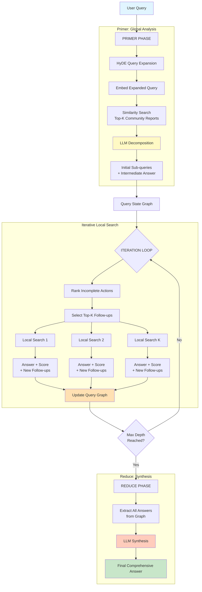
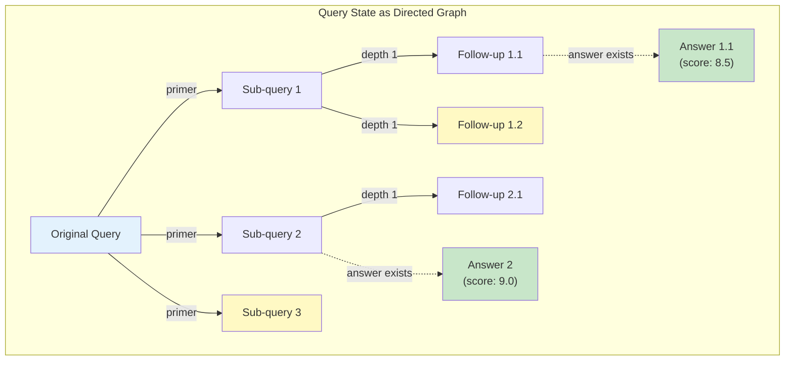

# GraphRAG Retrieval Flow - Cơ chế Truy vấn và Retrieve

## Tổng quan

GraphRAG cung cấp nhiều phương thức retrieve khác nhau để trả lời các loại câu hỏi khác nhau:
- **Local Search**: Câu hỏi cụ thể về entities/relationships
- **Global Search**: Câu hỏi tổng quan, nhiều community
- **ToG Search** (Think-on-Graph): Câu hỏi phức tạp cần reasoning trên graph
- **DRIFT Search**: Hybrid search kết hợp local và global
- **Basic Search**: Simple text embedding search

---

## 1. Local Search - Tìm kiếm cục bộ

### 1.1. Kiến trúc và luồng hoạt động


### 1.2. Chi tiết Context Building


### 1.3. Ví dụ thực tế

**Câu hỏi:** "Mối quan hệ giữa OpenAI và Microsoft là gì?"

**Bước 1: Entity Extraction**
```python
# Query embedding
query = "Mối quan hệ giữa OpenAI và Microsoft là gì?"

# Semantic search trong vector store
top_entities = vector_store.similarity_search(
    query_embedding,
    k=10  # top_k_mapped_entities
)
# Kết quả: ["OpenAI", "Microsoft", "Sam Altman", "Satya Nadella", ...]
```

**Bước 2: Build Context**
```
Token budget: 8000 tokens
├── Community Context (25% = 2000 tokens)
│   ├── Community #123: "Tech Giants Partnership"
│   │   └── Summary: OpenAI và Microsoft có quan hệ đối tác chiến lược...
│   └── Rank: 89
│
├── Local Context (25% = 2000 tokens)
│   ├── Entities:
│   │   ├── OpenAI (rank: 95)
│   │   └── Microsoft (rank: 98)
│   ├── Relationships:
│   │   └── OpenAI --[PARTNERSHIP_WITH]--> Microsoft
│   └── Covariates:
│       └── INVESTMENT: $13 billion từ Microsoft
│
└── Text Units (50% = 4000 tokens)
    ├── Text #456: "In 2023, Microsoft invested..."
    └── Text #789: "OpenAI and Microsoft announced..."
```

**Code Implementation:**
```python
# File: graphrag/query/structured_search/local_search/mixed_context.py

def build_context(
    self,
    query: str,
    max_context_tokens: int = 8000,
    text_unit_prop: float = 0.5,      # 50%
    community_prop: float = 0.25,      # 25%
    top_k_mapped_entities: int = 10,
    top_k_relationships: int = 10,
):
    # 1. Map query to entities
    selected_entities = map_query_to_entities(
        query=query,
        text_embedding_vectorstore=self.entity_text_embeddings,
        text_embedder=self.text_embedder,
        k=top_k_mapped_entities,
        oversample_scaler=2
    )
    
    # 2. Build community context (25%)
    community_tokens = int(max_context_tokens * community_prop)
    community_context = self._build_community_context(
        selected_entities,
        max_context_tokens=community_tokens
    )
    
    # 3. Build local context (25%)
    local_tokens = int(max_context_tokens * (1 - community_prop - text_unit_prop))
    local_context = self._build_local_context(
        selected_entities,
        max_context_tokens=local_tokens,
        top_k_relationships=top_k_relationships
    )
    
    # 4. Build text unit context (50%)
    text_unit_tokens = int(max_context_tokens * text_unit_prop)
    text_unit_context = self._build_text_unit_context(
        selected_entities,
        max_context_tokens=text_unit_tokens
    )
    
    return ContextBuilderResult(
        context_chunks="\n\n".join([
            community_context,
            local_context,
            text_unit_context
        ])
    )
```

---

## 2. Global Search - Tìm kiếm toàn cục

### 2.1. Map-Reduce Architecture


### 2.2. Map Phase - Parallel Analysis


### 2.3. Ví dụ thực tế

**Câu hỏi:** "Các chủ đề chính trong dataset về AI là gì?"

**MAP Phase:**

```json
// Map Response from Batch 1
{
  "points": [
    {
      "description": "Machine Learning frameworks và tools (TensorFlow, PyTorch) được thảo luận rộng rãi",
      "score": 8
    },
    {
      "description": "Ethical concerns về AI bias và fairness",
      "score": 9
    }
  ]
}

// Map Response from Batch 2
{
  "points": [
    {
      "description": "Large Language Models (GPT, BERT) và applications",
      "score": 10
    },
    {
      "description": "AI trong healthcare và medical diagnosis",
      "score": 7
    }
  ]
}
```

**REDUCE Phase:**

```
Aggregated Key Points (sorted by score):
----Analyst 2----
Importance Score: 10
Large Language Models (GPT, BERT) và applications

----Analyst 1----
Importance Score: 9
Ethical concerns về AI bias và fairness

----Analyst 1----
Importance Score: 8
Machine Learning frameworks và tools

...

[LLM synthesizes final answer from these points]
```

**Code Implementation:**
```python
# File: graphrag/query/structured_search/global_search/search.py

async def search(self, query: str) -> GlobalSearchResult:
    # Step 1: Build context - get all communities
    context_result = await self.context_builder.build_context(
        query=query
    )
    
    # Step 2: MAP - parallel analysis
    map_responses = await asyncio.gather(*[
        self._map_response_single_batch(
            context_data=data,
            query=query,
            max_length=self.map_max_length
        )
        for data in context_result.context_chunks
    ])
    
    # Step 3: REDUCE - synthesize final answer
    reduce_response = await self._reduce_response(
        map_responses=map_responses,
        query=query
    )
    
    return reduce_response
```

**_reduce_response detail:**
```python
async def _reduce_response(self, map_responses, query):
    # Collect all key points
    key_points = []
    for index, response in enumerate(map_responses):
        for element in response.response:
            key_points.append({
                "analyst": index,
                "answer": element["answer"],
                "score": element["score"]
            })
    
    # Filter score > 0 and sort
    filtered_key_points = [p for p in key_points if p["score"] > 0]
    filtered_key_points.sort(key=lambda x: x["score"], reverse=True)
    
    # Format within token budget
    data = []
    total_tokens = 0
    for point in filtered_key_points:
        formatted_text = f"""----Analyst {point['analyst'] + 1}----
Importance Score: {point['score']}
{point['answer']}"""
        
        if total_tokens + len(tokenizer.encode(formatted_text)) > self.max_data_tokens:
            break
        data.append(formatted_text)
        total_tokens += len(tokenizer.encode(formatted_text))
    
    # LLM synthesis
    text_data = "\n\n".join(data)
    search_prompt = self.reduce_system_prompt.format(
        report_data=text_data,
        response_type=self.response_type
    )
    
    return await self.model.achat(prompt=query, history=[
        {"role": "system", "content": search_prompt}
    ])
```

---

## 3. ToG Search - Think-on-Graph

### 3.1. Iterative Graph Exploration


### 3.2. Pruning Strategies


### 3.3. Ví dụ thực tế

**Câu hỏi:** "Satya Nadella có kết nối gì với OpenAI?"

**Step-by-step Exploration:**

```
=== DEPTH 0: Starting Entities ===
Via semantic similarity:
1. Satya Nadella (score: 0.95)
2. Microsoft (score: 0.82)
3. OpenAI (score: 0.79)

=== DEPTH 1: Explore from "Satya Nadella" ===
Relations:
- Satya Nadella --[CEO_OF]--> Microsoft (score: 0.92)
- Satya Nadella --[ANNOUNCED]--> Cloud Partnership (score: 0.78)
- Satya Nadella --[MET_WITH]--> Sam Altman (score: 0.85)

After pruning (top 3):
✓ CEO_OF -> Microsoft
✓ MET_WITH -> Sam Altman  
✓ ANNOUNCED -> Cloud Partnership

=== DEPTH 2: Explore from "Microsoft" ===
Relations:
- Microsoft --[PARTNERSHIP_WITH]--> OpenAI (score: 0.95) ✓ FOUND!
- Microsoft --[INVESTED_IN]--> OpenAI (score: 0.93) ✓ FOUND!
- Microsoft --[AZURE_PROVIDER_FOR]--> OpenAI (score: 0.88)

=== Early Termination Check ===
Reasoning: We found direct connection paths!
Paths:
1. Satya Nadella -> CEO_OF -> Microsoft -> PARTNERSHIP_WITH -> OpenAI
2. Satya Nadella -> CEO_OF -> Microsoft -> INVESTED_IN -> OpenAI

Answer: Satya Nadella, với tư cách CEO của Microsoft, có mối liên hệ trực tiếp 
với OpenAI thông qua quan hệ đối tác chiến lược và khoản đầu tư 13 tỷ đô la...
```

**Code Implementation:**
```python
# File: graphrag/query/structured_search/tog_search/search.py

async def stream_search(self, query: str):
    # 1. Find starting entities via embeddings
    if self.embedding_model:
        starting_entities = await self.explorer.find_starting_entities_semantic(
            query, top_k=self.width  # e.g., 3
        )
    
    # 2. Initialize search state
    state = ToGSearchState(
        query=query,
        max_depth=self.depth,      # e.g., 3
        beam_width=self.width       # e.g., 3
    )
    
    # Create initial nodes
    for entity_id in starting_entities:
        initial_node = ExplorationNode(
            entity_id=entity_id,
            depth=0,
            score=1.0
        )
        state.add_node(initial_node)
    
    # 3. Exploration loop
    while state.current_depth < state.max_depth:
        current_nodes = state.get_current_frontier()
        
        for node in current_nodes:
            # Get relations
            relations = self.explorer.get_relations(node.entity_id)
            
            # Score with pruning strategy
            scored_relations = await self.pruning_strategy.score_relations(
                query, node.entity_name, relations
            )
            
            # Keep top N
            scored_relations.sort(key=lambda x: x[4], reverse=True)
            top_relations = scored_relations[:self.num_retain_entity]
            
            # Create new nodes
            for rel_desc, target_id, direction, weight, score in top_relations:
                new_node = ExplorationNode(
                    entity_id=target_id,
                    depth=state.current_depth + 1,
                    score=score,
                    parent=node,
                    relation_from_parent=rel_desc
                )
                state.add_node(new_node)
        
        # Check early termination
        should_terminate, answer = await self.reasoning_module.check_early_termination(
            query, state.get_current_frontier()
        )
        
        if should_terminate and answer:
            yield answer
            return
    
    # 4. Generate final answer from all paths
    answer, paths = await self.reasoning_module.generate_answer(
        query, state.get_all_paths()
    )
    yield answer
```

---

## 4. DRIFT Search - Dynamic Reasoning and Iterative Follow-up Thinking

### 4.1. Kiến trúc tổng quan

DRIFT (Dynamic Reasoning and Iterative Follow-up Thinking) kết hợp cả Global và Local search thông qua một quy trình lặp:
1. **Primer Phase**: Phân tích global (community reports) để tạo câu hỏi con
2. **Iterative Search**: Dùng Local Search trả lời từng câu hỏi con
3. **Follow-up Generation**: Từ mỗi câu trả lời, sinh ra câu hỏi follow-up mới
4. **Reduce Phase**: Tổng hợp tất cả answers thành câu trả lời cuối cùng



### 4.2. Query State Graph

DRIFT sử dụng NetworkX MultiDiGraph để quản lý state:



**Node Properties:**
- `query`: Câu hỏi
- `answer`: Câu trả lời (None nếu chưa complete)
- `score`: Độ liên quan (float hoặc -inf)
- `follow_ups`: List các câu hỏi con
- `metadata`: Context data, token counts

**Edge Properties:**
- `weight`: Mức độ quan trọng của follow-up

### 4.3. Chi tiết từng Phase

#### Phase 1: Primer - Global Decomposition

```python
# File: graphrag/query/structured_search/drift_search/primer.py

class DRIFTPrimer:
    async def search(self, query: str, top_k_reports: pd.DataFrame):
        """
        Phân tích query dựa trên community reports để tạo sub-queries.
        
        Steps:
        1. Split reports into folds (for parallel processing)
        2. Decompose query for each fold
        3. Return initial actions
        """
        # 1. Split reports into multiple folds
        report_folds = self.split_reports(top_k_reports)
        
        # 2. Parallel decomposition
        tasks = [
            self.decompose_query(query, fold) 
            for fold in report_folds
        ]
        results = await asyncio.gather(*tasks)
        
        # 3. Package results
        return SearchResult(
            response=results,  # List of decomposed sub-queries
            context_data={"top_k_reports": top_k_reports}
        )
    
    async def decompose_query(self, query: str, reports: pd.DataFrame):
        """
        Decompose query into sub-queries using LLM.
        
        Returns JSON:
        {
            "intermediate_answer": "Partial answer from community reports",
            "follow_up_queries": ["sub-query 1", "sub-query 2", ...],
            "score": 8.5
        }
        """
        community_reports = "\n\n".join(reports["full_content"].tolist())
        
        prompt = DRIFT_PRIMER_PROMPT.format(
            query=query,
            community_reports=community_reports
        )
        
        response = await self.chat_model.achat(prompt, json=True)
        return json.loads(response.output.content)
```

**HyDE (Hypothetical Document Embeddings)**

```python
# File: graphrag/query/structured_search/drift_search/primer.py

class PrimerQueryProcessor:
    async def expand_query(self, query: str):
        """
        Expand query bằng cách tạo hypothetical answer theo template.
        
        Ví dụ:
        Query: "What is GraphRAG?"
        Template: (random community report structure)
        Output: Hypothetical detailed answer về GraphRAG
        """
        template = random.choice(self.reports).full_content
        
        prompt = f"""Create a hypothetical answer to: {query}
        
        Format it to follow this template:
        {template}
        
        Ensure no new entities not in the original query."""
        
        text = await self.chat_model.achat(prompt)
        return text
    
    async def __call__(self, query: str):
        """Expand và embed query."""
        hyde_query = await self.expand_query(query)
        return self.text_embedder.embed(hyde_query)
```

#### Phase 2: Iterative Local Search

```python
# File: graphrag/query/structured_search/drift_search/search.py

class DRIFTSearch:
    async def search(self, query: str, reduce: bool = True):
        """
        Main DRIFT search loop.
        """
        # 1. PRIMER PHASE (if query state is empty)
        if not self.query_state.graph:
            # Get top-K community reports via HyDE
            primer_context = await self.context_builder.build_context(query)
            
            # Decompose query
            primer_response = await self.primer.search(
                query=query,
                top_k_reports=primer_context
            )
            
            # Convert to DriftAction and add to graph
            init_action = self._process_primer_results(query, primer_response)
            self.query_state.add_action(init_action)
            self.query_state.add_all_follow_ups(init_action, init_action.follow_ups)
        
        # 2. ITERATIVE SEARCH LOOP
        epochs = 0
        while epochs < self.config.n_depth:
            # Get incomplete actions (unanswered queries)
            actions = self.query_state.rank_incomplete_actions()
            if len(actions) == 0:
                break
            
            # Select top-K follow-ups
            actions = actions[:self.config.drift_k_followups]
            
            # Execute local search for each action (parallel)
            results = await self._search_step(
                global_query=query,
                search_engine=self.local_search,
                actions=actions
            )
            
            # Update graph with results
            for action in results:
                self.query_state.add_action(action)
                self.query_state.add_all_follow_ups(action, action.follow_ups)
            
            epochs += 1
        
        # 3. REDUCE PHASE
        if reduce:
            response_state, context_data, context_text = self.query_state.serialize()
            reduced_response = await self._reduce_response(
                responses=response_state,
                query=query
            )
            return reduced_response
        
        return self.query_state.serialize()
```

**DriftAction Class:**

```python
# File: graphrag/query/structured_search/drift_search/action.py

class DriftAction:
    """
    Represents a query node in the graph.
    """
    def __init__(self, query: str, answer: str = None, follow_ups: list = None):
        self.query = query
        self.answer = answer  # None if incomplete
        self.score = None
        self.follow_ups = follow_ups or []
        self.metadata = {
            "llm_calls": 0,
            "prompt_tokens": 0,
            "output_tokens": 0
        }
    
    @property
    def is_complete(self):
        """Action is complete if it has an answer."""
        return self.answer is not None
    
    async def search(self, search_engine, global_query: str):
        """
        Execute local search for this action.
        
        Returns:
        - self with updated answer, score, follow_ups
        """
        if self.is_complete:
            return self
        
        # Local search with drift_query context
        search_result = await search_engine.search(
            drift_query=global_query,  # Original global query
            query=self.query            # Sub-query
        )
        
        # Parse JSON response
        response = json.loads(search_result.response)
        
        self.answer = response.get("response")
        self.score = response.get("score", float("-inf"))
        self.follow_ups = response.get("follow_up_queries", [])
        
        # Update metadata
        self.metadata["llm_calls"] += 1
        self.metadata["prompt_tokens"] += search_result.prompt_tokens
        self.metadata["output_tokens"] += search_result.output_tokens
        
        return self
```

#### Phase 3: Reduce

```python
async def _reduce_response(self, responses: dict, query: str):
    """
    Synthesize all answers into final response.
    
    Input responses structure:
    {
        "nodes": [
            {"query": "...", "answer": "...", "score": 8.5},
            {"query": "...", "answer": "...", "score": 9.0},
            ...
        ],
        "edges": [...]
    }
    """
    # Extract all answers
    reduce_responses = [
        node["answer"]
        for node in responses.get("nodes", [])
        if node.get("answer")
    ]
    
    # Build reduce prompt
    search_prompt = self.reduce_system_prompt.format(
        context_data=reduce_responses,
        response_type=self.response_type
    )
    
    # LLM synthesis
    model_response = await self.model.achat(
        prompt=query,
        history=[{"role": "system", "content": search_prompt}]
    )
    
    return model_response.output.content
```

### 4.4. Ví dụ thực tế

**Câu hỏi:** "Impact của AI trên healthcare và các thách thức?"

**PRIMER PHASE:**

```
HyDE Expansion:
Query: "Impact của AI trên healthcare..."
→ Expanded: "AI đang cách mạng hóa healthcare thông qua machine learning 
   cho medical imaging, predictive analytics cho disease diagnosis..."

Similarity Search:
Top-3 Community Reports:
1. Community #45: "Healthcare AI Applications" (similarity: 0.92)
2. Community #78: "AI Ethics and Challenges" (similarity: 0.88)
3. Community #12: "Medical Technology Innovation" (similarity: 0.85)

LLM Decomposition (parallel on 3 reports):
Fold 1 (Report #45):
{
  "intermediate_answer": "AI applications trong healthcare bao gồm medical 
                          imaging analysis, disease prediction, và drug discovery...",
  "follow_up_queries": [
    "Các ứng dụng cụ thể của AI trong medical imaging?",
    "AI giúp drug discovery như thế nào?"
  ],
  "score": 9.0
}

Fold 2 (Report #78):
{
  "intermediate_answer": "Thách thức chính bao gồm data privacy, 
                          algorithmic bias, và regulatory compliance...",
  "follow_up_queries": [
    "Làm thế nào để đảm bảo AI không bias trong medical decisions?",
    "Quy định nào đang được áp dụng cho AI trong healthcare?"
  ],
  "score": 8.5
}
```

**Query State after Primer:**

```
Graph nodes:
- Original Query (depth 0)
  ├─ Sub-query 1: "Các ứng dụng cụ thể của AI trong medical imaging?" [INCOMPLETE]
  ├─ Sub-query 2: "AI giúp drug discovery như thế nào?" [INCOMPLETE]
  ├─ Sub-query 3: "Làm thế nào để đảm bảo AI không bias?" [INCOMPLETE]
  └─ Sub-query 4: "Quy định nào áp dụng cho AI healthcare?" [INCOMPLETE]
```

**ITERATION 1:**

```
Rank incomplete actions → All 4 have no score yet, random shuffle
Select top 2 (drift_k_followups=2):
  - Sub-query 1: "Các ứng dụng cụ thể của AI trong medical imaging?"
  - Sub-query 3: "Làm thế nào để đảm bảo AI không bias?"

Execute Local Search (parallel):

Action 1 Result:
{
  "response": "AI trong medical imaging bao gồm:
               1. X-ray analysis với CNN models
               2. MRI segmentation
               3. CT scan anomaly detection...",
  "score": 9.2,
  "follow_up_queries": [
    "Độ chính xác của AI trong detecting cancer từ X-ray?",
    "So sánh AI vs radiologist trong MRI reading?"
  ]
}

Action 3 Result:
{
  "response": "Để tránh bias cần:
               1. Diverse training data
               2. Fairness metrics
               3. Regular auditing...",
  "score": 8.7,
  "follow_up_queries": [
    "Metrics nào được dùng để measure fairness trong medical AI?"
  ]
}

Update Graph:
- Sub-query 1: COMPLETE (answer exists, score=9.2)
  └─ New follow-up: "Độ chính xác của AI trong detecting cancer từ X-ray?" [INCOMPLETE]
  └─ New follow-up: "So sánh AI vs radiologist trong MRI reading?" [INCOMPLETE]
- Sub-query 3: COMPLETE (answer exists, score=8.7)
  └─ New follow-up: "Metrics nào để measure fairness?" [INCOMPLETE]
```

**ITERATION 2:**

```
Ranked incomplete actions (by score from parent or random):
1. "Độ chính xác của AI trong detecting cancer từ X-ray?"
2. "So sánh AI vs radiologist trong MRI reading?"
3. "Metrics nào để measure fairness?"
4. Sub-query 2: "AI giúp drug discovery như thế nào?"
5. Sub-query 4: "Quy định nào áp dụng cho AI healthcare?"

Select top 2:
... (continue iterating)
```

**REDUCE PHASE:**

```
All completed answers:
1. (score 9.2): "AI trong medical imaging bao gồm..."
2. (score 9.0): "AI applications trong healthcare bao gồm..."
3. (score 8.7): "Để tránh bias cần..."
4. (score 8.5): "Thách thức chính bao gồm..."
5. ...

Reduce Prompt:
"Given these intermediate answers about AI in healthcare, 
 synthesize a comprehensive response to: 
 'Impact của AI trên healthcare và các thách thức?'"

Final Answer:
AI đang có impact sâu rộng trong healthcare:

**Ứng dụng chính:**
1. Medical Imaging: AI phân tích X-ray, MRI, CT scans với độ chính xác cao,
   hỗ trợ radiologists trong detecting cancer và các bệnh lý...
2. Drug Discovery: AI giúp tăng tốc quá trình phát hiện thuốc mới...
3. Predictive Analytics: Dự đoán disease progression, readmission risks...

**Thách thức:**
1. Data Privacy: Bảo vệ patient data trong training models
2. Algorithmic Bias: Đảm bảo fairness cho mọi demographic groups
3. Regulatory Compliance: Tuân thủ FDA, HIPAA, và các quy định khác
4. Clinical Validation: Chứng minh hiệu quả trong real-world settings

[Comprehensive synthesized answer...]
```

### 4.5. So sánh DRIFT với các phương pháp khác

| Aspect | Local Search | Global Search | DRIFT | ToG |
|--------|--------------|---------------|-------|-----|
| **Scope** | Narrow (entity-focused) | Broad (all communities) | **Adaptive** | Graph paths |
| **Query Decomposition** | ❌ No | ❌ No | ✅ **Automatic** | ❌ No |
| **Iterative Refinement** | ❌ No | ❌ No | ✅ **Yes** | ✅ Yes |
| **Follow-up Handling** | ❌ Manual | ❌ Manual | ✅ **Automatic** | Via exploration |
| **Context Type** | Local+Community | Community only | **Both** | Entity+Relations |
| **Best For** | Simple facts | Dataset overview | **Complex, multi-faceted questions** | Reasoning chains |
| **Latency** | Low (~2s) | Medium (~5-10s) | **Medium-High (~5-15s)** | High (~10-30s) |
| **LLM Calls** | 1 | K+1 | **Primer + Depth*K + 1** | Depth*K |

**Khi nào dùng DRIFT:**
- ✅ Câu hỏi phức tạp cần nhiều angles (e.g., "Impact và challenges của X?")
- ✅ Cần comprehensive answer covering nhiều sub-topics
- ✅ Dataset lớn với nhiều communities
- ✅ Muốn balance giữa global overview và local details
- ❌ KHÔNG dùng cho simple factual questions → Local Search tốt hơn

### 4.6. Configuration & Tuning

```python
# File: graphrag/config/models/drift_search_config.py

class DRIFTSearchConfig:
    # Primer settings
    primer_folds: int = 1                    # Parallel decomposition folds
    drift_k_followups: int = 3               # Top-K follow-ups per iteration
    
    # Iteration settings
    n_depth: int = 2                         # Max iteration depth
    
    # Local search settings (reused for each action)
    local_search_text_unit_prop: float = 0.5
    local_search_community_prop: float = 0.25
    local_search_top_k_mapped_entities: int = 10
    local_search_top_k_relationships: int = 10
    local_search_max_data_tokens: int = 8000
    
    # Reduce settings
    reduce_max_tokens: int = 2000
    reduce_temperature: float = 0.0

# Tuning guidelines:
# 1. primer_folds: Tăng for faster primer (parallel), nhưng dùng nhiều tokens
# 2. drift_k_followups: Balance giữa breadth (nhiều follow-ups) và depth
# 3. n_depth: Tăng for deeper exploration, nhưng exponential cost
#    - depth=1: Primer only
#    - depth=2: Primer + 1 round of follow-ups (recommended)
#    - depth=3+: Very expensive, use carefully
```

**Cost Analysis:**

```
Example: drift_k_followups=3, n_depth=2, primer_folds=2

LLM calls:
- Primer decomposition: 2 folds = 2 calls
- Iteration 1: 3 local searches = 3 calls
- Iteration 2: 3 local searches = 3 calls (assuming 3 new follow-ups)
- Reduce: 1 call
Total: 2 + 3 + 3 + 1 = 9 LLM calls

Comparison:
- Local Search: 1 call
- Global Search (10 communities): 10 + 1 = 11 calls
- DRIFT: ~9 calls (but more comprehensive)
```

---

## 5. Retrieval Components - Chi tiết

### 5.1. Entity Extraction & Ranking

```python
# File: graphrag/query/context_builder/entity_extraction.py

def map_query_to_entities(
    query: str,
    text_embedding_vectorstore: BaseVectorStore,
    text_embedder: EmbeddingModel,
    all_entities_dict: dict[str, Entity],
    k: int = 10,
    oversample_scaler: int = 2
):
    """
    Map user query to relevant entities using semantic similarity.
    
    Process:
    1. Embed query text
    2. Search vector store for top K*oversample_scaler entities
    3. Re-rank based on entity attributes
    4. Return top K entities
    """
    # 1. Get query embedding
    query_embedding = text_embedder.embed(query)
    
    # 2. Semantic search with oversampling
    search_results = text_embedding_vectorstore.similarity_search(
        query_embedding,
        k=k * oversample_scaler  # e.g., 10 * 2 = 20
    )
    
    # 3. Map to full entities
    selected_entities = []
    for result in search_results[:k]:
        entity = all_entities_dict.get(result.id)
        if entity:
            selected_entities.append(entity)
    
    return selected_entities
```

### 5.2. Relationship Filtering

```python
# File: graphrag/query/context_builder/local_context.py

def _filter_relationships(
    selected_entities: list[Entity],
    relationships: list[Relationship],
    top_k_relationships: int = 10
):
    """
    Filter and prioritize relationships:
    
    Priority 1: In-network (between selected entities)
    Priority 2: Out-network (connecting to external entities)
                - Prefer mutual connections (entities connected to multiple selected entities)
    """
    selected_names = [e.title for e in selected_entities]
    
    # Priority 1: In-network relationships
    in_network = [
        r for r in relationships
        if r.source in selected_names and r.target in selected_names
    ]
    
    # Priority 2: Out-network relationships
    out_network = [
        r for r in relationships
        if (r.source in selected_names) != (r.target in selected_names)
    ]
    
    # Count links for out-network entities
    entity_links = defaultdict(int)
    for rel in out_network:
        external_entity = (
            rel.target if rel.source in selected_names else rel.source
        )
        entity_links[external_entity] += 1
    
    # Sort by: number of links DESC, then rank DESC
    for rel in out_network:
        external = rel.target if rel.source in selected_names else rel.source
        rel.attributes["links"] = entity_links[external]
    
    out_network.sort(
        key=lambda x: (x.attributes["links"], x.rank),
        reverse=True
    )
    
    budget = top_k_relationships * len(selected_entities)
    return in_network + out_network[:budget]
```

### 5.3. Text Unit Ranking

```python
# File: graphrag/query/structured_search/local_search/mixed_context.py

def _build_text_unit_context(
    self,
    selected_entities: list[Entity],
    max_context_tokens: int = 8000
):
    """
    Rank text units by:
    1. Entity order (entities ranked higher by similarity to query)
    2. Number of relationships mentioned in text unit
    """
    unit_info_list = []
    
    for index, entity in enumerate(selected_entities):
        # Get entity's relationships
        entity_relationships = [
            rel for rel in self.relationships.values()
            if rel.source == entity.title or rel.target == entity.title
        ]
        
        # For each text unit of this entity
        for text_id in entity.text_unit_ids or []:
            text_unit = self.text_units[text_id]
            
            # Count how many relationships are mentioned
            num_relationships = count_relationships(
                entity_relationships, 
                text_unit
            )
            
            unit_info_list.append((
                text_unit,
                index,              # Entity order
                num_relationships   # Relationship count
            ))
    
    # Sort by entity order, then by relationship count DESC
    unit_info_list.sort(key=lambda x: (x[1], -x[2]))
    
    selected_text_units = [unit[0] for unit in unit_info_list]
    
    # Build context within token budget
    return build_text_unit_context(
        text_units=selected_text_units,
        max_context_tokens=max_context_tokens
    )
```

---

## 6. So sánh các phương thức Retrieve

| Feature | Local Search | Global Search | ToG Search | DRIFT | Basic |
|---------|--------------|---------------|------------|-------|-------|
| **Use Case** | Specific questions | Overview questions | Complex reasoning | **Multi-faceted complex questions** | Simple lookup |
| **Entity-based** | ✅ Top-K semantic | ❌ All communities | ✅ Iterative exploration | ✅ **Adaptive (both)** | ❌ Text-only |
| **Query Decomposition** | ❌ No | ❌ No | ❌ No | ✅ **Automatic via LLM** | ❌ No |
| **Iterative Refinement** | ❌ No | ❌ No | ✅ Yes (exploration) | ✅ **Yes (follow-ups)** | ❌ No |
| **LLM Calls** | 1 | K (map) + 1 (reduce) | N*depth (pruning) + 1 | **Primer + Depth×K + 1** | 1 |
| **Latency** | Low (~2s) | Medium (~5-10s) | High (~10-30s) | **Medium-High (~5-15s)** | Very Low (~1s) |
| **Context Type** | Mixed (entities, rels, communities, texts) | Community reports only | Graph paths | **Both (Global primer + Local iterations)** | Text embeddings only |
| **Token Budget** | 8000 (configurable) | 8000 per batch | Dynamic | Dynamic | 8000 |
| **Best For** | "Who is X?" | "Summarize themes" | "How X relates to Y?" | **"Impact và challenges của X?"** | Keyword search |
| **Explainability** | Medium | Low | High (paths shown) | **High (query graph + intermediate answers)** | Low |
| **Parallelization** | ❌ Single call | ✅ Map phase | ❌ Sequential | ✅ **Per iteration** | ❌ Single call |

---

## 7. Ví dụ End-to-End

### 7.1. Ví dụ 1: Local Search

**Input:**
```python
from graphrag.query.factory import get_local_search_engine

search_engine = get_local_search_engine(
    config=config,
    entities=entities,
    relationships=relationships,
    text_units=text_units,
    reports=reports,
    description_embedding_store=vector_store
)

result = await search_engine.search(
    "Công nghệ nào mà Tesla đang phát triển?"
)
```

**Output:**
```
Context Retrieved:
- Entities: Tesla, Elon Musk, Autopilot, Full Self-Driving, Battery Technology
- Relationships: 
  * Tesla --[DEVELOPS]--> Autopilot
  * Tesla --[INVESTS_IN]--> Battery Research
- Text Units: 3 units discussing Tesla's R&D
- Community: "Electric Vehicle Innovation" (rank 92)

Answer:
Tesla đang phát triển nhiều công nghệ tiên tiến, bao gồm:
1. Autopilot và Full Self-Driving (FSD) - hệ thống lái tự động
2. Battery technology - công nghệ pin 4680 cells
3. AI training infrastructure cho autonomous driving
...
```

### 7.2. Ví dụ 2: Global Search

**Input:**
```python
global_search_engine = get_global_search_engine(
    config=config,
    reports=reports,
    entities=entities,
    communities=communities
)

result = await global_search_engine.search(
    "Tổng quan về xu hướng AI trong 2024?"
)
```

**Output:**
```
MAP Phase (4 batches processed):
Batch 1 (Communities 0-50):
  - Point 1: "LLM scaling continues" (score: 9)
  - Point 2: "Multimodal AI emerges" (score: 8)

Batch 2 (Communities 51-100):
  - Point 1: "AI regulation debates" (score: 10)
  - Point 2: "Open source AI growth" (score: 7)

...

REDUCE Phase:
Aggregating 25 key points from 4 analysts...

Final Answer:
Năm 2024 chứng kiến các xu hướng AI chính:
1. Quy định AI (score 10): Chính phủ các nước tăng cường điều tiết...
2. LLM scaling (score 9): Các mô hình ngày càng lớn hơn...
3. Multimodal AI (score 8): GPT-4V, Gemini Ultra...
...
```

### 7.3. Ví dụ 3: ToG Search

**Input:**
```python
tog_search_engine = get_tog_search_engine(
    config=config,
    entities=entities,
    relationships=relationships
)

result = await tog_search_engine.stream_search(
    "Con đường từ Steve Jobs đến iPhone như thế nào?"
)
```

**Output:**
```
=== ToG EXPLORATION ===
Depth 0: [Steve Jobs]
Depth 1: Steve Jobs --[FOUNDED]--> Apple (score: 0.98)
Depth 2: Apple --[LAUNCHED]--> iPhone (score: 0.96) ✓

=== REASONING PATHS ===
Path 1: Steve Jobs → FOUNDED → Apple → LAUNCHED → iPhone
  Details:
  - Steve Jobs thành lập Apple năm 1976
  - Apple phát triển nhiều sản phẩm (Mac, iPod, iTunes)
  - 2007: Steve Jobs công bố iPhone tại Macworld

Path 2: Steve Jobs → VISION_FOR → Revolutionary Product → REALIZED_AS → iPhone
  Details:
  - Jobs có vision về "điện thoại thông minh"
  - Kết hợp iPod + Phone + Internet
  - iPhone ra mắt là kết quả của vision này

=== ANSWER ===
Steve Jobs, người sáng lập Apple, có vai trò then chốt trong sự ra đời của iPhone.
Con đường bắt đầu từ việc thành lập Apple năm 1976, qua các sản phẩm tiền nhiệm
như iPod và iTunes, cuối cùng dẫn đến iPhone năm 2007 - sản phẩm혁명 hóa 
ngành công nghiệp di động...
```

### 7.4. Ví dụ 4: DRIFT Search

**Input:**
```python
drift_search_engine = get_drift_search_engine(
    config=config,
    reports=reports,
    entities=entities,
    relationships=relationships,
    text_units=text_units,
    description_embedding_store=vector_store
)

result = await drift_search_engine.search(
    "Chiến lược và thách thức của Tesla trong việc phát triển autonomous driving?"
)
```

**Output:**
```
=== PRIMER PHASE ===
HyDE Expansion: "Tesla đang phát triển công nghệ autonomous driving..."
Top-3 Communities: 
  - "Electric Vehicle Innovation"
  - "AI in Transportation"
  - "Automotive Industry Challenges"

Decomposed Sub-queries:
1. "Chiến lược kỹ thuật của Tesla trong autonomous driving?"
   → Intermediate Answer: "Tesla sử dụng vision-only approach..."
   → Follow-ups: ["So sánh vision vs Lidar?", "Neural network architecture?"]

2. "Thách thức regulatory cho Tesla FSD?"
   → Intermediate Answer: "Tesla đối mặt với regulations từ NHTSA..."
   → Follow-ups: ["Incidents và investigations?", "Compliance requirements?"]

=== ITERATION 1 ===
Processing 3 follow-ups in parallel...
✓ "So sánh vision vs Lidar?" → Answer (score: 9.1)
✓ "Neural network architecture?" → Answer (score: 8.8)
✓ "Incidents và investigations?" → Answer (score: 8.5)
  → New follow-ups generated: ["Latest NHTSA findings?", ...]

=== ITERATION 2 ===
Processing 3 more follow-ups...
...

=== REDUCE PHASE ===
Synthesizing 12 intermediate answers...

Final Answer:
**Chiến lược của Tesla:**
1. Vision-only Approach: Tesla loại bỏ radar/lidar, chỉ dùng cameras với 
   neural networks, cho phép scale nhanh và cost-effective...
2. Data Flywheel: Fleet learning từ hàng triệu vehicles cung cấp training data...
3. Hardware-Software Integration: Thiết kế custom chips (FSD computer)...

**Thách thức chính:**
1. Technical: Pure vision approach có limitations trong adverse weather...
2. Regulatory: NHTSA investigations về FSD safety incidents...
3. Public Perception: High-profile accidents ảnh hưởng trust...
4. Competitive Pressure: Waymo, Cruise dùng lidar approach...

[Comprehensive answer with details from 12+ intermediate searches...]
```

---

## 8. Performance Tuning

### 8.1. Local Search Optimization

```python
# Tối ưu token budget
context_builder_params = {
    "max_context_tokens": 8000,      # Giảm nếu cần response nhanh
    "text_unit_prop": 0.5,           # 50% for detailed source context
    "community_prop": 0.25,          # 25% for high-level summaries
    "top_k_mapped_entities": 10,     # Tăng for better recall
    "top_k_relationships": 10,       # Relationships per entity
}

# Trade-off:
# - Higher token budget = more context = better answers = slower
# - Lower top_k = faster but might miss relevant info
```

### 8.2. Global Search Optimization

```python
# Tối ưu parallelization
global_search_params = {
    "concurrent_coroutines": 32,     # Parallel map calls
    "max_data_tokens": 8000,         # Token budget for reduce phase
    "map_max_length": 1000,          # Max output per map call
    "reduce_max_length": 2000,       # Max final answer length
}

# Trade-off:
# - More concurrent_coroutines = faster but more API cost
# - Larger max_data_tokens = more comprehensive but takes more tokens
```

### 8.3. ToG Search Optimization

```python
# Tối ưu exploration
tog_search_params = {
    "width": 3,                      # Beam width (entities per level)
    "depth": 3,                      # Max exploration depth
    "num_retain_entity": 5,          # Relations to explore per entity
    "pruning_strategy": "semantic",  # "llm" | "semantic" | "bm25"
}

# Trade-off:
# - width↑ × depth↑ = exponential complexity
#   e.g., 3^3 = 27 paths vs 5^5 = 3125 paths
# - "llm" pruning = accurate but slow
# - "semantic" pruning = fast but less accurate
```

---

## 9. Kết luận

GraphRAG cung cấp một hệ thống retrieve linh hoạt với nhiều strategies:
- **Local Search**: Tốt nhất cho câu hỏi cụ thể, fast (~2s)
- **Global Search**: Tổng quan toàn dataset, comprehensive
- **ToG Search**: Reasoning phức tạp trên graph, explainable paths
- **DRIFT Search**: Hybrid iterative approach, tự động decompose query và follow-up
- **Basic Search**: Simple embedding-based lookup

**Best Practices:**
1. **Sử dụng Local Search** làm mặc định cho factual questions
2. **Global Search** cho overview/summarization tasks
3. **DRIFT Search** cho complex multi-faceted questions cần nhiều perspectives
4. **ToG Search** khi cần explanation và reasoning chains trên graph
5. Tune các tham số dựa trên latency requirements và quality needs

**Decision Tree:**
```
Câu hỏi của bạn:
├─ Simple fact about specific entity? → Local Search
├─ Overview/summary of entire dataset? → Global Search
├─ Complex question với nhiều aspects? → DRIFT Search
├─ Reasoning path between entities? → ToG Search
└─ Just keyword lookup? → Basic Search
```

**Performance vs Quality Trade-off:**
```
Speed:  Basic > Local > DRIFT ≈ Global > ToG
Quality: DRIFT ≈ ToG > Global > Local > Basic
Cost:   Basic < Local < Global < DRIFT < ToG
```
