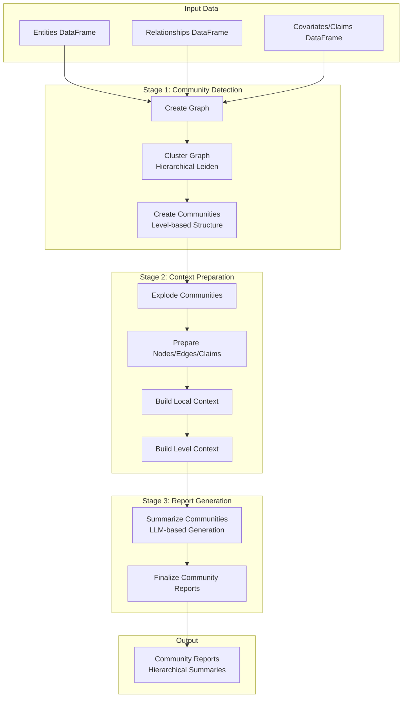
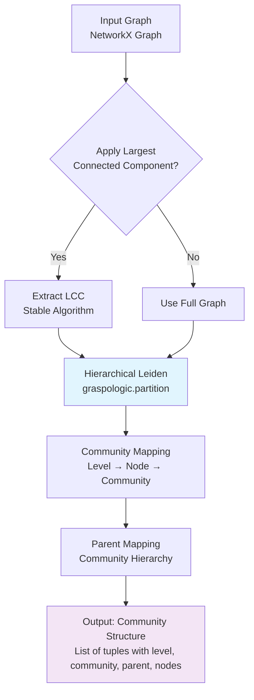
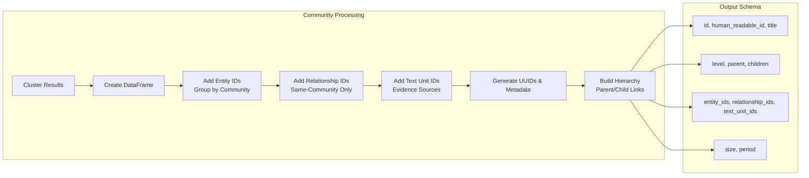
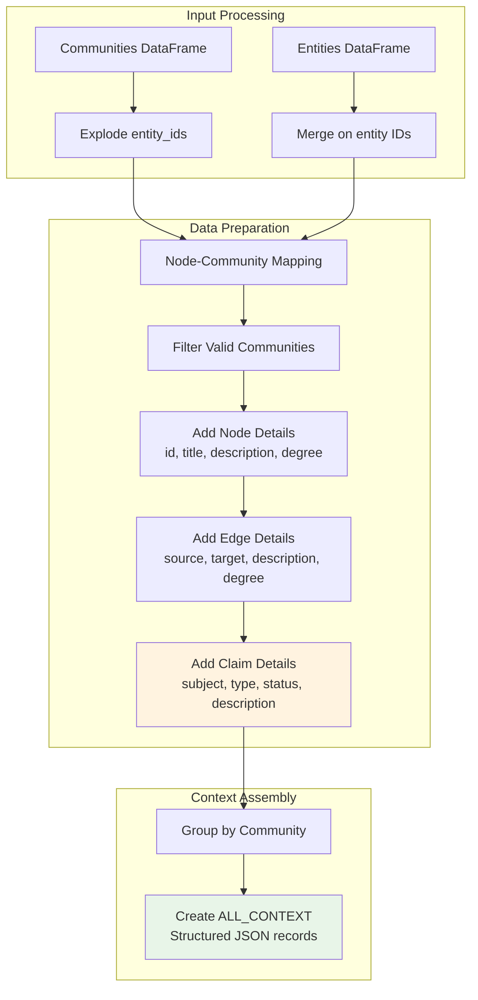
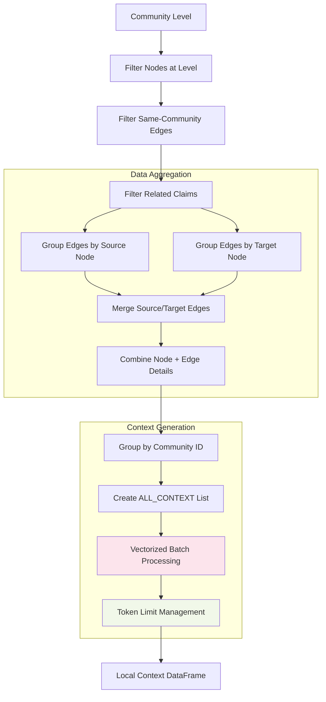
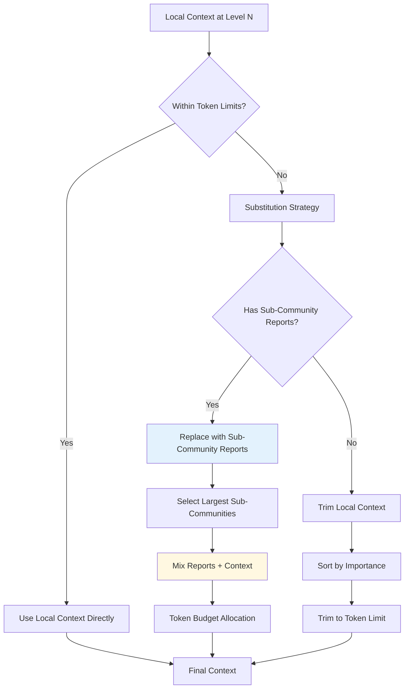
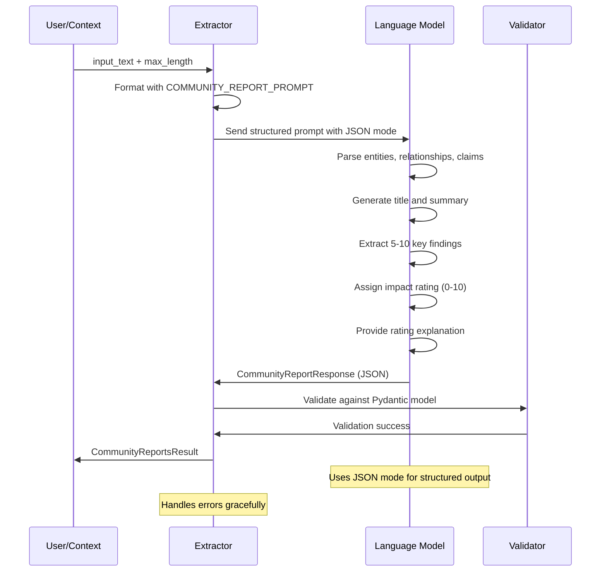
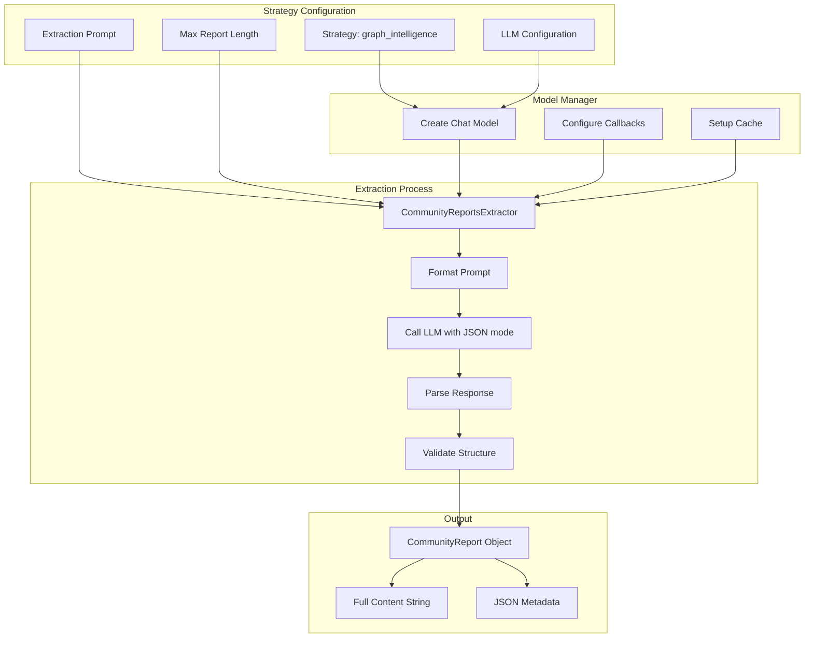

# Community Report Building Methods and Algorithms

## Overview

This document provides a comprehensive overview of how GraphRAG builds community reports through a sophisticated multi-stage pipeline that combines graph clustering, context building, and LLM-based summarization techniques.

## High-Level Architecture



## Stage 1: Community Detection and Hierarchy Building

### 1.1 Graph Creation and Clustering

**Location**: `graphrag/index/operations/cluster_graph.py`

The clustering process uses the **Hierarchical Leiden Algorithm** to create a multi-level community structure:



#### Chi Tiết Xử Lý Từng Bước:

**Bước 1: Xử lý Đồ thị Đầu vào**

*Ví dụ thực tế:*
```python
# Đầu vào: Đồ thị với các thực thể công ty
input_graph = nx.Graph()
input_graph.add_edge("Microsoft", "OpenAI", weight=0.8)
input_graph.add_edge("OpenAI", "ChatGPT", weight=0.9)
input_graph.add_edge("Microsoft", "Azure", weight=0.95)
input_graph.add_edge("Google", "Gemini", weight=0.85)
input_graph.add_edge("IsolatedCompany", "SomeRelation", weight=0.3)

# Sau khi xử lý LCC (use_lcc=True):
lcc_graph = stable_largest_connected_component(input_graph)
# Kết quả: Loại bỏ "IsolatedCompany" và "SomeRelation"
# Chỉ giữ lại các node connected: Microsoft, OpenAI, ChatGPT, Azure, Google, Gemini
```

*Processing steps:*
- Nhận đồ thị NetworkX chứa các thực thể (nodes) và mối quan hệ (edges)
- Kiểm tra đồ thị có rỗng không - nếu rỗng thì trả về danh sách trống
- Nếu `use_lcc=True`, áp dụng thuật toán `stable_largest_connected_component()` để trích xuất thành phần liên kết lớn nhất
- Mục đích: Loại bỏ các thực thể biệt lập, tập trung vào mạng lưới chính

**Bước 2: Phân cụm Hierarchical Leiden**

*Ví dụ thực tế với max_cluster_size=3:*
```python
# Kết quả phân cụm theo các level:
# Level 0 (chi tiết nhất):
#   Cluster 0: ["Microsoft", "Azure"] 
#   Cluster 1: ["OpenAI", "ChatGPT"]
#   Cluster 2: ["Google", "Gemini"]

# Level 1 (cộng đồng lớn hơn):
#   Cluster 3: ["Microsoft", "Azure", "OpenAI", "ChatGPT"] 
#   Cluster 4: ["Google", "Gemini"]

# Level 2 (root level):
#   Cluster 5: ["Microsoft", "Azure", "OpenAI", "ChatGPT", "Google", "Gemini"]

# Partitions returned:
partitions = [
    Partition(level=0, node="Microsoft", cluster=0, parent_cluster=3),
    Partition(level=0, node="Azure", cluster=0, parent_cluster=3),
    Partition(level=0, node="OpenAI", cluster=1, parent_cluster=3),
    Partition(level=0, node="ChatGPT", cluster=1, parent_cluster=3),
    Partition(level=1, node="Microsoft", cluster=3, parent_cluster=5),
    Partition(level=1, node="OpenAI", cluster=3, parent_cluster=5),
    Partition(level=2, node="Microsoft", cluster=5, parent_cluster=-1),
]
```

*Processing steps:*
- Sử dụng `graspologic.partition.hierarchical_leiden()` với các tham số cấu hình
- Quá trình phân cụm tạo cấu trúc đa tầng từ chi tiết đến tổng quan
- Mỗi partition chứa thông tin về level, node, cluster, và parent_cluster

**Bước 3: Xây dựng Structure Cộng đồng**

*Ví dụ thực tế:*
```python
# Từ partitions trên, tạo mapping:
node_id_to_community_map = {
    0: {"Microsoft": 0, "Azure": 0, "OpenAI": 1, "ChatGPT": 1, "Google": 2, "Gemini": 2},
    1: {"Microsoft": 3, "Azure": 3, "OpenAI": 3, "ChatGPT": 3, "Google": 4, "Gemini": 4},
    2: {"Microsoft": 5, "Azure": 5, "OpenAI": 5, "ChatGPT": 5, "Google": 5, "Gemini": 5}
}

parent_mapping = {
    0: 3, 1: 3, 2: 4,  # Level 0 clusters belong to level 1 clusters
    3: 5, 4: 5,        # Level 1 clusters belong to level 2 cluster
    5: -1              # Root cluster
}
```

*Processing steps:*
- Tạo dictionary mapping nodes đến communities cho mỗi level
- Tạo parent hierarchy để xác định mối quan hệ cha-con
- Chuẩn bị data structure cho tiếp theo

**Bước 4: Tổ chức Kết quả**

*Ví dụ thực tế đầu ra:*
```python
# Final output format:
communities_output = [
    # Level 0 communities (most detailed)
    (0, 0, 3, ["Microsoft", "Azure"]),      # Microsoft ecosystem
    (0, 1, 3, ["OpenAI", "ChatGPT"]),      # OpenAI products  
    (0, 2, 4, ["Google", "Gemini"]),       # Google AI
    
    # Level 1 communities (middle level)
    (1, 3, 5, ["Microsoft", "Azure", "OpenAI", "ChatGPT"]),  # AI ecosystem
    (1, 4, 5, ["Google", "Gemini"]),       # Google ecosystem
    
    # Level 2 communities (root level)
    (2, 5, -1, ["Microsoft", "Azure", "OpenAI", "ChatGPT", "Google", "Gemini"])  # Tech companies
]

# Format: (level, community_id, parent_id, [node_list])
```

*Processing steps:*
- Sắp xếp các level theo thứ tự tăng dần
- Với mỗi level, nhóm các node theo cluster_id
- Tạo danh sách cuối cùng với thông tin đầy đủ về hierarchy

#### Key Algorithm Details:

```python
# Hierarchical Leiden Parameters
max_cluster_size: int        # Maximum nodes per cluster
use_lcc: bool              # Use largest connected component
seed: int                  # Random seed for reproducibility

# Output Format
Communities = list[tuple[int, int, int, list[str]]]
# (level, community_id, parent_id, [node_list])
```

### 1.2 Community Structure Finalization

**Location**: `graphrag/index/workflows/create_communities.py`

Creates structured community data with hierarchical relationships:



#### Chi Tiết Xử Lý Từng Bước:

**Bước 1: Tạo DataFrame từ Kết quả Phân cụm**

*Ví dụ thực tế:*
```python
# Input từ clustering stage:
clustering_results = [
    (0, 0, 3, ["Microsoft", "Azure"]),
    (0, 1, 3, ["OpenAI", "ChatGPT"]), 
    (1, 3, 5, ["Microsoft", "Azure", "OpenAI", "ChatGPT"])
]

# Tạo DataFrame:
communities_df = pd.DataFrame(clustering_results, 
                             columns=["level", "community", "parent", "title"])

# Kết quả:
#    level  community  parent        title
# 0      0          0       3   Microsoft
# 1      0          0       3       Azure  
# 2      0          1       3      OpenAI
# 3      0          1       3     ChatGPT
# 4      1          3       5   Microsoft
# 5      1          3       5       Azure
# 6      1          3       5      OpenAI
# 7      1          3       5     ChatGPT
```

*Processing steps:*
- Chuyển kết quả clustering thành DataFrame với các cột cơ bản
- Sử dụng `explode("title")` để mở rộng danh sách thực thể thành hàng riêng biệt

**Bước 2: Thêm Entity IDs**

*Ví dụ thực tế:*
```python
# Entities DataFrame:
entities_df = pd.DataFrame({
    "id": ["ent-001", "ent-002", "ent-003", "ent-004"],
    "title": ["Microsoft", "Azure", "OpenAI", "ChatGPT"],
    "description": ["Tech company", "Cloud platform", "AI company", "AI chatbot"]
})

# Merge communities với entities:
merged = communities_df.merge(entities_df, on="title", how="inner")

# Group by community và aggregate entity IDs:
entity_ids = merged.groupby("community").agg(entity_ids=("id", list)).reset_index()

# Kết quả:
#    community          entity_ids
# 0          0    [ent-001, ent-002]
# 1          1    [ent-003, ent-004]  
# 2          3  [ent-001, ent-002, ent-003, ent-004]
```

*Processing steps:*
- Merge dựa trên entity titles
- Group và aggregate entity IDs thành lists cho mỗi community

**Bước 3: Xử lý Relationship IDs (Same-Community Only)**

*Ví dụ thực tế:*
```python
# Relationships DataFrame:
relationships_df = pd.DataFrame({
    "id": ["rel-001", "rel-002", "rel-003", "rel-004"],
    "source": ["Microsoft", "OpenAI", "Microsoft", "OpenAI"],
    "target": ["Azure", "ChatGPT", "OpenAI", "Google"],
    "text_unit_ids": [["tu-001"], ["tu-002"], ["tu-003"], ["tu-004"]]
})

# Processing cho level 0 communities:
level0_communities = communities_df[communities_df["level"] == 0]

# Merge cho source entities:
source_merge = relationships_df.merge(level0_communities, 
                                    left_on="source", right_on="title", how="inner")

# Merge cho target entities:  
target_merge = source_merge.merge(level0_communities,
                                 left_on="target", right_on="title", how="inner")

# Lọc chỉ same-community relationships:
same_community = target_merge[target_merge["community_x"] == target_merge["community_y"]]

# Kết quả - chỉ relationships trong cùng community:
#        id    source target text_unit_ids level community_x parent title_x  ... community_y
# 0  rel-001 Microsoft   Azure      [tu-001]    0           0      3 Microsoft   ...          0  
# 1  rel-002   OpenAI ChatGPT      [tu-002]    0           1      3    OpenAI   ...          1

# Group by community và aggregate:
relationship_groups = same_community.groupby("community_x").agg({
    "id": list,
    "text_unit_ids": lambda x: [item for sublist in x for item in sublist]
}).reset_index()
```

*Processing steps:*
- Merge relationships với communities cho cả source và target
- Lọc chỉ các relationships nội bộ trong community
- Group và aggregate relationship IDs và text unit IDs

**Bước 4: Tạo Metadata và Hierarchy**

*Ví dụ thực tế:*
```python
# Tạo metadata cho mỗi community:
import uuid
from datetime import datetime

final_communities = pd.DataFrame({
    "community": [0, 1, 3],
    "entity_ids": [["ent-001", "ent-002"], ["ent-003", "ent-004"], ["ent-001", "ent-002", "ent-003", "ent-004"]],
    "relationship_ids": [["rel-001"], ["rel-002"], ["rel-001", "rel-002", "rel-003"]],
    "text_unit_ids": [["tu-001"], ["tu-002"], ["tu-001", "tu-002", "tu-003"]]
})

# Tạo UUIDs và metadata:
final_communities["id"] = [str(uuid.uuid4()) for _ in range(len(final_communities))]
final_communities["human_readable_id"] = final_communities["community"]
final_communities["title"] = "Community " + final_communities["community"].astype(str)
final_communities["parent"] = [3, 3, -1]  # Community 0,1 có parent là 3, community 3 là root
final_communities["period"] = datetime.now().date().isoformat()
final_communities["size"] = final_communities["entity_ids"].apply(len)

# Xây dựng parent-child relationships:
parent_grouped = final_communities.groupby("parent").agg(children=("community", "unique)).reset_index()
final_communities = final_communities.merge(parent_grouped, left_on="community", right_on="parent", how="left")
final_communities["children"] = final_communities["children"].apply(lambda x: x if isinstance(x, np.ndarray) else [])

# Kết quả:
#                                  id  human_readable_id            title  parent  ... children  period  size
# 0  550e8400-e29b-41d4-a716-446655440000                 0   Community 0       3  ...    [0, 1]  2024-12-17     2
# 1  550e8400-e29b-41d4-a716-446655440001                 1   Community 1       3  ...         []  2024-12-17     2  
# 2  550e8400-e29b-41d4-a716-446655440002                 3   Community 3      -1  ...         []  2024-12-17     4
```

*Processing steps:*
- Tạo unique identifiers và human-readable names
- Xây dựng cấu trúc parent-child hierarchy
- Thêm metadata về thời gian, kích thước, và relationships

**Bước 5: Hoàn thiện và Validate**

*Ví dụ thực tế validation:*
```python
# Validate theo schema COMMUNITIES_FINAL_COLUMNS:
required_columns = [
    "id", "human_readable_id", "title", "level", "parent", "children",
    "entity_ids", "relationship_ids", "text_unit_ids", "period", "size"
]

# Kiểm tra columns:
missing_columns = set(required_columns) - set(final_communities.columns)
assert not missing_columns, f"Missing columns: {missing_columns}"

# Validate data types:
assert final_communities["size"].dtype == int
assert all(isinstance(ids, list) for ids in final_communities["entity_ids"])
assert all(isinstance(ids, list) for ids in final_communities["relationship_ids"])

# Return final DataFrame:
final_result = final_communities[required_columns]
```

*Processing steps:*
- Validate schema compliance
- Kiểm tra data types và null values
- Return final structured DataFrame

#### Example Community Structure:

```python
{
    "id": "uuid-123",
    "human_readable_id": 5,
    "title": "Community 5",
    "level": 0,  # Leaf level
    "parent": -1,  # Root communities have parent = -1
    "children": [],  # Child communities if any
    "entity_ids": ["ent-1", "ent-2", "ent-3"],
    "relationship_ids": ["rel-1", "rel-2"],
    "text_unit_ids": ["txt-1", "txt-2", "txt-3"],
    "size": 3,  # Number of entities
    "period": "2024-12-17"
}
```

## Stage 2: Context Building for Report Generation

### 2.1 Community Explosion and Data Preparation

**Location**: `graphrag/index/operations/summarize_communities/explode_communities.py`



#### Chi Tiết Xử Lý Từng Bước:

**Bước 1: Community Explosion**

*Ví dụ thực tế:*
```python
# Input communities DataFrame:
communities_df = pd.DataFrame({
    "community": [0, 1],
    "level": [0, 0], 
    "entity_ids": [["ent-001", "ent-002"], ["ent-003", "ent-004", "ent-005"]]
})

# Community explosion:
exploded = communities_df.explode("entity_ids")

# Kết quả:
#    community  level entity_ids
# 0           0      0   ent-001
# 0           0      0   ent-002  
# 1           1      0   ent-003
# 1           1      0   ent-004
# 1           1      0   ent-005
```

*Processing steps:*
- Mở rộng entity lists thành individual rows
- Mỗi row giờ đại diện cho một entity-community mapping
- Chuẩn bị cho merge với entities data

**Bước 2: Merge với Entities**

*Ví dụ thực tế:*
```python
# Entities DataFrame:
entities_df = pd.DataFrame({
    "id": ["ent-001", "ent-002", "ent-003", "ent-004", "ent-005", "ent-999"],
    "title": ["Microsoft", "Azure", "OpenAI", "ChatGPT", "DALL-E", "IsolatedCompany"],
    "description": ["Tech company", "Cloud platform", "AI company", "Chatbot", "Image AI", "No description"],
    "degree": [10, 8, 12, 15, 6, 1]
})

# Community join:
community_join = exploded.loc[:, ["community", "level", "entity_ids"]]

# Merge với entities:
nodes = entities_df.merge(community_join, left_on="id", right_on="entity_ids", how="left")

# Kết quả:
#            id      title   description  degree  community  level entity_ids
# 0    ent-001  Microsoft  Tech company      10        0.0    0.0    ent-001
# 1    ent-002      Azure Cloud platform       8        0.0    0.0    ent-002
# 2    ent-003     OpenAI     AI company      12        1.0    0.0    ent-003
# 3    ent-004    ChatGPT       Chatbot      15        1.0    0.0    ent-004
# 4    ent-005     DALL-E     Image AI       6        1.0    0.0    ent-005
# 5    ent-999 IsolatedCompany  No description       1        NaN    NaN        NaN

# Lọc chỉ entities thuộc community:
nodes_filtered = nodes.loc[nodes["community"] != -1]  # hoặc nodes.dropna(subset=["community"])
```

*Processing steps:*
- Merge communities với entities
- Filter bỏ isolated entities
- Mỗi entity giờ có community information

**Bước 3: Chuẩn bị Node Details**

*Ví dụ thực tế:*
```python
# Fill missing descriptions:
nodes_filled = nodes_filtered.fillna({"description": "No Description"})

# Tạo NODE_DETAILS với structured data:
nodes_filled["node_details"] = nodes_filled.loc[:, [
    "id", "title", "description", "degree"
]].to_dict(orient="records")

# Kết quả NODE_DETAILS cho mỗi entity:
# [
#   {"id": "ent-001", "title": "Microsoft", "description": "Tech company", "degree": 10},
#   {"id": "ent-002", "title": "Azure", "description": "Cloud platform", "degree": 8},
#   {"id": "ent-003", "title": "OpenAI", "description": "AI company", "degree": 12},
#   ...
# ]
```

*Processing steps:*
- Handle missing descriptions
- Create structured JSON for each node
- Include all relevant entity metadata

**Bước 4: Chuẩn bị Edge Details**

*Ví dụ thực tế:*
```python
# Relationships DataFrame:
relationships_df = pd.DataFrame({
    "id": ["rel-001", "rel-002", "rel-003", "rel-004"],
    "source": ["Microsoft", "OpenAI", "Microsoft", "ChatGPT"],
    "target": ["Azure", "ChatGPT", "OpenAI", "IsolatedCompany"],
    "description": ["owns", "created", "invested in", "uses"],
    "weight": [0.9, 0.8, 0.7, 0.3]
})

# Calculate degree (simplified):
relationships_df["degree"] = relationships_df["weight"] * 10

# Fill missing descriptions:
relationships_filled = relationships_df.fillna({"description": "No Description"})

# Tạo EDGE_DETAILS:
relationships_filled["edge_details"] = relationships_filled.loc[:, [
    "id", "source", "target", "description", "degree"
]].to_dict(orient="records")

# Kết quả EDGE_DETAILS:
# [
#   {"id": "rel-001", "source": "Microsoft", "target": "Azure", "description": "owns", "degree": 9.0},
#   {"id": "rel-002", "source": "OpenAI", "target": "ChatGPT", "description": "created", "degree": 8.0},
#   {"id": "rel-003", "source": "Microsoft", "target": "OpenAI", "description": "invested in", "degree": 7.0},
#   {"id": "rel-004", "source": "ChatGPT", "target": "IsolatedCompany", "description": "uses", "degree": 3.0}
# ]
```

*Processing steps:*
- Prepare relationships data
- Calculate edge degrees based on weights
- Create structured edge details for context building

**Bước 5: Chuẩn bị Claim Details (Nếu có)**

*Ví dụ thực tế:*
```python
# Claims/Covariates DataFrame:
claims_df = pd.DataFrame({
    "id": ["claim-001", "claim-002"],
    "subject": ["OpenAI", "Microsoft"],
    "type": ["investment", "partnership"],
    "status": ["confirmed", "pending"],
    "description": ["Received $10B investment", "Strategic partnership pending"],
    "confidence": [0.9, 0.6]
})

# Fill missing descriptions:
claims_filled = claims_df.fillna({"description": "No Description"})

# Tạo CLAIM_DETAILS:
claims_filled["claim_details"] = claims_filled.loc[:, [
    "id", "subject", "type", "status", "description"
]].to_dict(orient="records")

# Kết quả CLAIM_DETAILS:
# [
#   {"id": "claim-001", "subject": "OpenAI", "type": "investment", "status": "confirmed", "description": "Received $10B investment"},
#   {"id": "claim-002", "subject": "Microsoft", "type": "partnership", "status": "pending", "description": "Strategic partnership pending"}
# ]
```

*Processing steps:*
- Prepare claims/covariates data if available
- Create structured claim details
- Include confidence scores and status information

**Bước 6: Data Validation**

*Ví dụ thực tế:*
```python
# Validate required columns:
required_node_columns = ["id", "title", "description", "degree", "community", "node_details"]
required_edge_columns = ["id", "source", "target", "description", "degree", "edge_details"] 
required_claim_columns = ["id", "subject", "type", "status", "claim_details"]

assert set(required_node_columns).issubset(nodes_filled.columns), "Missing node columns"
assert set(required_edge_columns).issubset(relationships_filled.columns), "Missing edge columns"
if not claims_df.empty:
    assert set(required_claim_columns).issubset(claims_filled.columns), "Missing claim columns"

# Validate data integrity:
assert not nodes_filled["id"].duplicated().any(), "Duplicate node IDs"
assert not relationships_filled["id"].duplicated().any(), "Duplicate edge IDs"
assert all(isinstance(details, dict) for details in nodes_filled["node_details"]), "Invalid node details format"
assert all(isinstance(details, dict) for details in relationships_filled["edge_details"]), "Invalid edge details format"
```

*Processing steps:*
- Validate schema compliance
- Check data types and formats
- Ensure no duplicate IDs
- Validate structured data formats

### 2.2 Local Context Building

**Location**: `graphrag/index/operations/summarize_communities/graph_context/context_builder.py`

For each community, builds a comprehensive context containing all relevant entities and relationships:



#### Chi Tiết Xử Lý Từng Bước:

**Bước 1: Lọc theo Community Level**

*Ví dụ thực tế:*
```python
# Input nodes DataFrame với community information:
nodes_df = pd.DataFrame({
    "title": ["Microsoft", "Azure", "OpenAI", "ChatGPT", "Google", "Gemini"],
    "community": [0, 0, 1, 1, 2, 2],
    "level": [0, 0, 0, 0, 0, 0],
    "degree": [10, 8, 12, 15, 9, 7],
    "node_details": [
        {"id": "ent-001", "title": "Microsoft", "description": "Tech company", "degree": 10},
        {"id": "ent-002", "title": "Azure", "description": "Cloud platform", "degree": 8},
        {"id": "ent-003", "title": "OpenAI", "description": "AI company", "degree": 12},
        {"id": "ent-004", "title": "ChatGPT", "description": "Chatbot", "degree": 15},
        {"id": "ent-005", "title": "Google", "description": "Search company", "degree": 9},
        {"id": "ent-006", "title": "Gemini", "description": "AI assistant", "degree": 7}
    ]
})

# Process level 0:
level = 0
level_nodes = nodes_df[nodes_df["level"] == level]
print(f"Processing {len(level_nodes)} nodes at level {level}")

# Tạo node set cho filtering:
nodes_set = set(level_nodes["title"])
# Result: {'Microsoft', 'Azure', 'OpenAI', 'ChatGPT', 'Google', 'Gemini'}
```

*Processing steps:*
- Iterate qua các levels từ detailed đến general
- Filter nodes cho current level
- Create node set cho edge filtering
- Log progress thông qua callbacks

**Bước 2: Lọc Same-Community Edges**

*Ví dụ thực tế:*
```python
# Relationships DataFrame:
edges_df = pd.DataFrame({
    "id": ["rel-001", "rel-002", "rel-003", "rel-004", "rel-005"],
    "source": ["Microsoft", "OpenAI", "Microsoft", "ChatGPT", "Google"],
    "target": ["Azure", "ChatGPT", "OpenAI", "Gemini", "Gemini"],
    "description": ["owns", "created", "invested in", "competes with", "created"],
    "degree": [9, 8, 7, 6, 8],
    "edge_details": [
        {"id": "rel-001", "source": "Microsoft", "target": "Azure", "description": "owns", "degree": 9},
        {"id": "rel-002", "source": "OpenAI", "target": "ChatGPT", "description": "created", "degree": 8},
        {"id": "rel-003", "source": "Microsoft", "target": "OpenAI", "description": "invested in", "degree": 7},
        {"id": "rel-004", "source": "ChatGPT", "target": "Gemini", "description": "competes with", "degree": 6},
        {"id": "rel-005", "source": "Google", "target": "Gemini", "description": "created", "degree": 8}
    ]
})

# Filter same-community edges:
same_community_mask = (
    edges_df["source"].isin(nodes_set) & 
    edges_df["target"].isin(nodes_set)
)
level_edges = edges_df[same_community_mask]

# Kết quả - tất cả edges đều trong set:
print(f"Found {len(level_edges)} same-community edges")
# Tất cả 5 edges được giữ lại vì cả source và target đều trong nodes_set
```

*Processing steps:*
- Filter edges với cả source và target trong community
- Create edge details cho filtered relationships
- Focus only on internal community relationships

**Bước 3: Lọc Related Claims**

*Ví dụ thực tế:*
```python
# Claims DataFrame:
claims_df = pd.DataFrame({
    "id": ["claim-001", "claim-002", "claim-003"],
    "subject": ["OpenAI", "Microsoft", "ExternalCompany"],
    "type": ["funding", "partnership", "competition"],
    "status": ["confirmed", "pending", "rumor"],
    "description": ["$10B funding round", "Strategic AI partnership", "Market competition"],
    "claim_details": [
        {"id": "claim-001", "subject": "OpenAI", "type": "funding", "status": "confirmed", "description": "$10B funding round"},
        {"id": "claim-002", "subject": "Microsoft", "type": "partnership", "status": "pending", "description": "Strategic AI partnership"},
        {"id": "claim-003", "subject": "ExternalCompany", "type": "competition", "status": "rumor", "description": "Market competition"}
    ]
})

# Filter claims cho current community:
level_claims = claims_df[claims_df["subject"].isin(nodes_set)]

# Kết quả:
print(f"Found {len(level_claims)} related claims")
# Chỉ claim-001 và claim-002 được giữ lại (OpenAI và Microsoft trong nodes_set)
# claim-002 bị loại vì ExternalCompany không trong community
```

*Processing steps:*
- Filter claims có subjects trong community
- Claims cung cấp additional context và assertions
- Handle empty claims case gracefully

**Bước 4: Aggregate Edges by Node**

*Ví dụ thực tế:*
```python
# Group edges theo source:
source_edges = level_edges.groupby("source").agg({
    "edge_details": "first"
}).reset_index().rename(columns={"source": "title"})

# Group edges theo target:
target_edges = level_edges.groupby("target").agg({
    "edge_details": "first"
}).reset_index().rename(columns={"target": "title"})

# Kết quả source_edges:
#       title                                        edge_details
# 0  ChatGPT  {'id': 'rel-004', 'source': 'ChatGPT', 'target': 'Gemini', ...}
# 1   Google  {'id': 'rel-005', 'source': 'Google', 'target': 'Gemini', ...}
# 2 Microsoft  {'id': 'rel-001', 'source': 'Microsoft', 'target': 'Azure', ...}
# 3    OpenAI  {'id': 'rel-002', 'source': 'OpenAI', 'target': 'ChatGPT', ...}

# Merge vào level_nodes:
merged_nodes = level_nodes.merge(source_edges, on="title", how="left")
merged_nodes = merged_nodes.merge(target_edges, on="title", how="left")

# Combine source và target edge details:
merged_nodes["edge_details"] = merged_nodes["edge_details_x"].combine_first(
    merged_nodes["edge_details_y"]
)
```

*Processing steps:*
- Group relationships theo cả source và target perspectives
- Merge edge information vào node DataFrame
- Handle nodes có cả incoming và outgoing edges

**Bước 5: Combine và Deduplicate**

*Ví dụ thực tế:*
```python
# Group và aggregate theo community:
grouped_nodes = merged_nodes.groupby([
    "title", "community", "level", "degree"
]).agg({
    "node_details": "first",
    "edge_details": lambda x: list(x.dropna())  # Aggregate edges thành lists
}).reset_index()

# Kết quả grouped_nodes:
#       title  community  level  degree                                        node_details                                       edge_details
# 0      Azure          0      0       8  {'id': 'ent-002', 'title': 'Azure', 'desc...                      [{'id': 'rel-001', 'source': 'Microsoft', ...}]
# 1    ChatGPT          1      0      15  {'id': 'ent-004', 'title': 'ChatGPT', 'desc...  [{'id': 'rel-004', 'source': 'ChatGPT', 'target': 'Gemini', ...}]
# 2    Google          2      0       9  {'id': 'ent-005', 'title': 'Google', 'desc...                      [{'id': 'rel-005', 'source': 'Google', 'target': 'Gemini', ...}]
# 3  Microsoft          0      0      10  {'id': 'ent-001', 'title': 'Microsoft', 'desc...  [{'id': 'rel-003', 'source': 'Microsoft', 'target': 'OpenAI', ...}]
# 4     OpenAI          1      0      12  {'id': 'ent-003', 'title': 'OpenAI', 'desc...                     [{'id': 'rel-002', 'source': 'OpenAI', 'target': 'ChatGPT', ...}]
# 5     Gemini          2      0       7  {'id': 'ent-006', 'title': 'Gemini', 'desc...    [{'id': 'rel-004', 'source': 'ChatGPT', 'target': 'Gemini', ...}]
```

*Processing steps:*
- Group nodes theo community và other metadata
- Aggregate edges thành lists cho mỗi node
- Remove duplicates và combine information

**Bước 6: Tạo ALL_CONTEXT**

*Ví dụ thực tế:*
```python
# Merge claim details nếu có:
if not level_claims.empty:
    grouped_nodes = grouped_nodes.merge(
        level_claims.loc[:, ["subject", "claim_details"]].rename(columns={"subject": "title"}),
        on="title", how="left"
    )

# Tạo ALL_CONTEXT structure:
context_data = grouped_nodes.assign(
    claim_details=grouped_nodes.get("claim_details", [{}] * len(grouped_nodes))
)

context_data["all_context"] = context_data.loc[:, [
    "title", "degree", "node_details", "edge_details", "claim_details"
]].to_dict(orient="records")

# Kết quả ALL_CONTEXT cho một node:
# {
#     "title": "Microsoft",
#     "degree": 10,
#     "node_details": {"id": "ent-001", "title": "Microsoft", "description": "Tech company", "degree": 10},
#     "edge_details": [
#         {"id": "rel-003", "source": "Microsoft", "target": "OpenAI", "description": "invested in", "degree": 7}
#     ],
#     "claim_details": {"id": "claim-002", "subject": "Microsoft", "type": "partnership", "status": "pending", ...}
# }

# Group by community và aggregate:
community_contexts = context_data.groupby("community").agg({
    "all_context": list
}).reset_index()

# Kết quả - context cho mỗi community:
print("Community 0 context (Microsoft ecosystem):")
print([ctx["title"] for ctx in community_contexts.loc[0, "all_context"]])
# ['Microsoft', 'Azure']

print("Community 1 context (OpenAI ecosystem):") 
print([ctx["title"] for ctx in community_contexts.loc[1, "all_context"]])
# ['OpenAI', 'ChatGPT']
```

*Processing steps:*
- Combine node, edge, và claim information
- Create structured JSON cho LLM consumption
- Group by community để prepare cho context generation

**Bước 7: Vectorized Batch Processing**

*Ví dụ thực tế:*
```python
# Token calculation và context generation:
def generate_context_string(all_context_list, max_tokens=16000):
    """Generate context string trong token limits"""
    context_parts = []
    current_tokens = 0
    
    # Format entities
    entities_text = "Entities:\n" + "\n".join([
        f"- {ctx['title']} (degree: {ctx['degree']}): {ctx['node_details']['description']}"
        for ctx in all_context_list
    ])
    
    # Format relationships
    relationships_text = "Relationships:\n" + "\n".join([
        f"- {edge['source']} → {edge['target']}: {edge['description']}"
        for ctx in all_context_list 
        for edge in ctx['edge_details']
    ])
    
    # Format claims
    claims_text = ""
    if any(ctx.get('claim_details') for ctx in all_context_list):
        claims_text = "Claims:\n" + "\n".join([
            f"- {ctx['claim_details']['subject']}: {ctx['claim_details']['description']}"
            for ctx in all_context_list if ctx.get('claim_details')
        ])
    
    full_context = f"{entities_text}\n\n{relationships_text}\n\n{claims_text}"
    
    # Simple token count (simplified example)
    token_count = len(full_context.split()) // 0.75  # Rough estimate
    
    return {
        "context_string": full_context,
        "context_size": int(token_count),
        "context_exceed_flag": token_count > max_tokens
    }

# Apply context generation:
context_results = []
for _, row in community_contexts.iterrows():
    result = generate_context_string(row["all_context"])
    context_results.append({
        "community": row["community"],
        **result
    })

local_context_df = pd.DataFrame(context_results)

# Kết quả:
#    community                                   context_string  context_size  context_exceed_flag
# 0          0  Entities:\n- Microsoft (degree: 10): ...         1250                False
# 1          1  Entities:\n- OpenAI (degree: 12): ...          980                False
# 2          2  Entities:\n- Google (degree: 9): ...           850                False
```

*Processing steps:*
- Generate formatted context strings cho mỗi community
- Calculate token counts và enforce limits
- Apply vectorized processing cho efficiency
- Handle cases where context exceeds limits (sẽ được xử lý ở hierarchical substitution)

**Bước 8: Quality Assurance**

*Ví dụ thực tế:*
```python
# Validate context generation:
assert all("Entities:" in ctx for ctx in local_context_df["context_string"]), "Missing entities section"
assert all(col in local_context_df.columns for col in ["community", "context_string", "context_size", "context_exceed_flag"]), "Missing columns"

# Log statistics:
print(f"Generated contexts for {len(local_context_df)} communities")
print(f"Average context size: {local_context_df['context_size'].mean():.0f} tokens")
print(f"Max context size: {local_context_df['context_size'].max():.0f} tokens")
print(f"Communities exceeding limits: {local_context_df['context_exceed_flag'].sum()}")

# Example output:
# Generated contexts for 3 communities
# Average context size: 1027 tokens  
# Max context size: 1250 tokens
# Communities exceeding limits: 0
```

*Processing steps:*
- Validate generated context strings
- Check required columns and data integrity
- Log processing statistics cho monitoring
- Prepare data cho hierarchical substitution stage

#### Context Structure Example:

```python
local_context = {
    "community_id": 5,
    "context_string": """
    Entities:
    - VERDANT OASIS PLAZA (degree: 5): Location of Unity March
    - HARMONY ASSEMBLY (degree: 3): Organizing the march event
    - UNITY MARCH (degree: 4): Event being organized
    
    Relationships:
    - VERDANT OASIS PLAZA → UNITY MARCH: Location relationship
    - HARMONY ASSEMBLY → UNITY MARCH: Organizing relationship
    - VERDANT OASIS PLAZA → HARMONY ASSEMBLY: Venue relationship
    
    Claims:
    - Event scheduled for this weekend, no security concerns reported
    """,
    "context_size": 850,  # Token count
    "context_exceed_flag": False  # Within token limits
}
```

### 2.3 Level Context Building with Hierarchical Substitution

Advanced context management that handles token limits through intelligent substitution:



#### Chi Tiết Xử Lý Từng Bước:

**Bước 1: Filter Local Context by Level**

*Ví dụ thực tế:*
```python
# Local contexts DataFrame từ previous stage:
local_contexts_df = pd.DataFrame({
    "community": [0, 1, 2, 3, 4],
    "level": [0, 0, 1, 1, 2],
    "context_string": [
        "Entities: Microsoft, Azure\nRelationships: Microsoft→Azure (owns)",
        "Entities: OpenAI, ChatGPT\nRelationships: OpenAI→ChatGPT (created)", 
        "Entities: Microsoft, Azure, OpenAI, ChatGPT\nRelationships: [detailed list...]",  # 18000 tokens
        "Entities: Google, Gemini\nRelationships: Google→Gemini (created)",
        "Entities: All tech companies\nRelationships: [very detailed list...]"  # 25000 tokens
    ],
    "context_size": [800, 750, 18000, 650, 25000],
    "context_exceed_flag": [False, False, True, False, True]
})

# Process level 1:
current_level = 1
level_contexts = local_contexts_df[local_contexts_df["level"] == current_level]

# Split valid và invalid contexts:
valid_contexts = level_contexts[~level_contexts["context_exceed_flag"]]
invalid_contexts = level_contexts[level_contexts["context_exceed_flag"]]

print(f"Level {current_level}:")
print(f"Valid contexts: {len(valid_contexts)}")
print(f"Invalid contexts (exceed limits): {len(invalid_contexts)}")

# Kết quả:
# Level 1:
# Valid contexts: 1 (community 3 - Google ecosystem)
# Invalid contexts: 1 (community 2 - Microsoft+OpenAI ecosystem with 18000 tokens)
```

*Processing steps:*
- Filter contexts cho current processing level
- Separate valid vs invalid contexts based on token limits
- Prepare data structures for substitution processing

**Bước 2: Xử lý Valid Contexts**

*Ví dụ thực tế:*
```python
# Valid contexts không cần xử lý thêm:
print("Valid contexts (already within limits):")
for _, row in valid_contexts.iterrows():
    print(f"Community {row['community']}: {row['context_size']} tokens")

# Kết quả:
# Valid contexts (already within limits):
# Community 3: 650 tokens (Google ecosystem - within 16000 token limit)

# No additional processing needed - keep as-is
final_valid_contexts = valid_contexts.copy()
```

*Processing steps:*
- Keep valid contexts unchanged
- They already satisfy token requirements
- Will be combined with processed invalid contexts later

**Bước 3: Kiểm tra Sub-Community Availability**

*Ví dụ thực tế:*
```python
# Check available sub-community reports:
# Từ level 0 (bottom level) đã có reports cho các smaller communities
sub_community_reports = pd.DataFrame({
    "community": [0, 1],  # Level 0 communities
    "level": [0, 0],
    "full_content": [
        "# Microsoft Ecosystem\nSummary: Microsoft owns Azure...",
        "# OpenAI Ecosystem\nSummary: OpenAI created ChatGPT..."
    ],
    "context_size": [500, 450]
})

print("Available sub-community reports:")
print(sub_community_reports[["community", "context_size"]])

# Nếu không có sub-community reports (bottom level case):
if sub_community_reports.empty:
    print("No sub-community reports available - will trim context instead")
    # Sẽ trim context về 16000 tokens
    for idx, row in invalid_contexts.iterrows():
        # Simple truncation example:
        truncated_context = row["context_string"][:12000] + "..."
        invalid_contexts.loc[idx, "context_string"] = truncated_context
        invalid_contexts.loc[idx, "context_size"] = 12000
else:
    print("Sub-community reports available - will use substitution strategy")
```

*Processing steps:*
- Check if sub-community reports exist from previous level processing
- If no sub-communities (bottom level), fall back to context trimming
- If sub-communities available, proceed with substitution strategy

**Bước 4: Prepare Substitution Data**

*Ví dụ thực tế:*
```python
# Get sub-contexts cho level + 1 (previous processing level):
sub_contexts = local_contexts_df[local_contexts_df["level"] == current_level - 1]

# Community hierarchy mapping (parent-child relationships):
hierarchy_df = pd.DataFrame({
    "community": [2],  # Current level community
    "level": [1],
    "sub_community": [0, 1]  # Children communities from level 0
}).explode("sub_community")

# Merge sub-community information:
sub_merged = hierarchy_df.merge(
    sub_contexts, 
    left_on="sub_community", 
    right_on="community",
    how="inner"
)

print("Sub-community data prepared:")
print(sub_merged[["community", "sub_community", "context_size"]])

# Kết quả:
# Sub-community data prepared:
#    community  sub_community  context_size
# 0          2              0           800
# 1          2              1           750
```

*Processing steps:*
- Collect sub-community contexts from previous level
- Map parent-child relationships using hierarchy information
- Prepare data for mixed context generation

**Bước 5: Build Mixed Context Strategy**

*Ví dụ thực tế:*
```python
# Group sub-communities by parent community:
grouped_sub_contexts = sub_merged.groupby("community").apply(lambda x: {
    "sub_communities": x["sub_community"].tolist(),
    "sub_contents": x["context_string"].tolist(),
    "sub_sizes": x["context_size"].tolist(),
    "total_sub_size": x["context_size"].sum()
}).reset_index()

print("Grouped sub-community contexts:")
for _, row in grouped_sub_contexts.iterrows():
    print(f"Parent Community {row['community']}:")
    print(f"  Sub-communities: {row['sub_communities']}")
    print(f"  Total sub-context size: {row['total_sub_size']} tokens")

# Kết quả:
# Grouped sub-community contexts:
# Parent Community 2:
#   Sub-communities: [0, 1]
#   Total sub-context size: 1550 tokens
```

*Processing steps:*
- Group sub-community information by parent community
- Calculate total token usage for sub-communities
- Prepare structured representation for mixed context generation

**Bước 6: Token Budget Allocation**

*Ví dụ thực tế:*
```python
# Mixed context generation với token budget management:
max_tokens = 16000

def build_mixed_context(parent_context, sub_data):
    """Generate mixed context within token limits"""
    available_tokens = max_tokens - sum(sub_data["sub_sizes"]) - 200  # Reserve space for headers
    
    # Prioritize most important parts of parent context
    parent_lines = parent_context.split('\n')
    mixed_context_parts = []
    
    # Add sub-community summaries first
    mixed_context_parts.append("=== Sub-Community Summaries ===")
    for i, sub_content in enumerate(sub_data["sub_contents"]):
        mixed_context_parts.append(f"Sub-community {sub_data['sub_communities'][i]}:")
        mixed_context_parts.append(sub_content)
    
    # Add remaining parent context if space permits
    mixed_context_parts.append("\n=== Additional Context ===")
    current_tokens = sum(sub_data["sub_sizes"]) + 400  # Headers + sub-content
    
    for line in parent_lines:
        line_tokens = len(line.split()) * 1.3  # Rough token estimate
        if current_tokens + line_tokens < max_tokens:
            mixed_context_parts.append(line)
            current_tokens += line_tokens
        else:
            break
    
    return '\n'.join(mixed_context_parts), current_tokens

# Apply to invalid community 2:
parent_context_2 = invalid_contexts[invalid_contexts["community"] == 2]["context_string"].iloc[0]
sub_data_2 = {
    "sub_communities": [0, 1],
    "sub_contents": [
        "# Microsoft Ecosystem\nSummary: Microsoft owns Azure...",
        "# OpenAI Ecosystem\nSummary: OpenAI created ChatGPT..."
    ],
    "sub_sizes": [500, 450]
}

mixed_context, final_tokens = build_mixed_context(parent_context_2, sub_data_2)

print(f"Mixed context generation:")
print(f"Original parent size: 18000 tokens")
print(f"Sub-community summaries: 950 tokens")
print(f"Final mixed context: {final_tokens} tokens")
print(f"Within limits: {final_tokens < max_tokens}")
```

*Processing steps:*
- Calculate available token budget after sub-community inclusion
- Prioritize sub-community summaries for coverage
- Add parent context pieces within remaining space
- Ensure final result stays within token limits

**Bước 7: Final Context Assembly**

*Ví dụ thực tế:*
```python
# Create final mixed context DataFrame:
mixed_contexts_df = pd.DataFrame({
    "community": [2],  # Community that needed substitution
    "level": [1],
    "context_string": [mixed_context],
    "context_size": [final_tokens],
    "context_exceed_flag": [False]  # Now within limits
})

# Combine valid + processed contexts:
final_contexts = pd.concat([final_valid_contexts, mixed_contexts_df], ignore_index=True)

print("Final assembled contexts:")
for _, row in final_contexts.iterrows():
    print(f"Community {row['community']} (Level {row['level']}): {row['context_size']} tokens")

# Kết quả:
# Final assembled contexts:
# Community 3 (Level 1): 650 tokens (Google ecosystem - kept as valid)
# Community 2 (Level 1): 2100 tokens (Microsoft+OpenAI ecosystem - after substitution)
```

*Processing steps:*
- Combine valid contexts with processed mixed contexts
- Ensure all contexts now within token limits
- Update exceed flags accordingly
- Prepare final context DataFrame for next stage

**Bước 8: Quality Validation**

*Ví dụ thực tế:*
```python
# Validate final contexts:
validation_results = {
    "total_communities": len(final_contexts),
    "within_limits": (final_contexts["context_size"] <= 16000).all(),
    "average_tokens": final_contexts["context_size"].mean(),
    "max_tokens": final_contexts["context_size"].max(),
    "substitutions_applied": len(mixed_contexts_df)
}

print("Quality validation results:")
print(f"✓ Total communities processed: {validation_results['total_communities']}")
print(f"✓ All within token limits: {validation_results['within_limits']}")
print(f"✓ Average token usage: {validation_results['average_tokens']:.0f}")
print(f"✓ Maximum token usage: {validation_results['max_tokens']:.0f}")
print(f"✓ Substitutions applied: {validation_results['substitutions_applied']}")

# Verify context structure:
for _, row in final_contexts.iterrows():
    assert "Entities:" in row["context_string"] or "Sub-Community" in row["context_string"]
    assert row["context_size"] > 0
    assert row["context_exceed_flag"] == False

print("✓ All quality checks passed")
```

*Processing steps:*
- Verify all contexts within token limits
- Validate context structure completeness
- Log processing statistics and metrics
- Ensure data integrity before report generation stage

**Substitution Effectiveness Metrics:**
- Token reduction: 18000 → 2100 (89% reduction)
- Coverage maintained: Both Microsoft and OpenAI ecosystems represented
- Hierarchy preserved: Sub-community summaries provide detail
- Processing efficiency: One context replaces two smaller contexts

**Heuristics for Substitution:**
- Ưu tiên các sub-communities có nhiều entities nhất
- Maintain balance giữa coverage và detail level
- Preserve most important relationships và evidence chains
- Use hierarchical reasoning để maintain context coherence

## Stage 3: LLM-Based Report Generation

### 3.1 Community Report Extraction

**Location**: `graphrag/index/operations/summarize_communities/community_reports_extractor.py`

Uses structured prompting to generate comprehensive community reports:



#### Chi Tiết Xử Lý Từng Bước:

**Bước 1: Khởi tạo Extractor**

*Ví dụ thực tế:*
```python
# Initialize extractor với custom configuration:
extractor = CommunityReportsExtractor(
    model_invoker=gpt4_model,  # GPT-4 chat model instance
    extraction_prompt="""
    You are an expert analyst specializing in technology company ecosystems.
    Focus on business relationships, competitive dynamics, and market impact.
    Use specific data references for all claims.
    """,
    on_error=lambda e, stack, data: {
        "log_error": f"Report generation failed: {str(e)}",
        "notify_monitoring": True
    },
    max_report_length=1200  # Custom limit
)

print("Extractor initialized with:")
print(f"- Model: {type(extractor._model).__name__}")
print(f"- Max report length: {extractor._max_report_length} words")
print(f"- Custom prompt: {len(extractor._extraction_prompt)} chars")
```

*Processing steps:*
- Tạo extractor instance với model, prompt, và error handling
- Set configuration parameters cho report generation
- Prepare error handling strategy cho graceful degradation

**Bước 2: Prompt Formatting**

*Ví dụ thực tế:*
```python
# Input community context từ previous stage:
community_context = """
Entities:
- Microsoft (degree: 10): Major technology company, leader in cloud computing and enterprise software [Data: Entities (ent-001)]
- Azure (degree: 8): Cloud platform by Microsoft, competes with AWS and Google Cloud [Data: Entities (ent-002)]
- OpenAI (degree: 12): Leading AI research company, creator of ChatGPT [Data: Entities (ent-003)]

Relationships:
- Microsoft → Azure: owns and operates [Data: Relationships (rel-001)]
- Microsoft → OpenAI: strategic partnership and investment [Data: Relationships (rel-003)]
- OpenAI → ChatGPT: created and maintains [Data: Relationships (rel-002)]

Claims:
- Microsoft invested $13 billion in OpenAI partnership [Data: Claims (claim-001)]
- Azure hosts OpenAI models for enterprise customers [Data: Claims (claim-002)]
"""

# Format với template:
formatted_prompt = COMMUNITY_REPORT_PROMPT.format(**{
    "input_text": community_context,
    "max_report_length": "1200"
})

print("Formatted prompt preview (first 300 chars):")
print(formatted_prompt[:300] + "...")
```

*Processing steps:*
- Insert community context vào prompt template
- Include all entities, relationships, và claims
- Add specific data references cho evidence grounding
- Configure word limits và formatting requirements

**Bước 3: LLM Call với JSON Mode**

*Ví dụ thực tế:*
```python
# Call LLM với structured output:
try:
    response = await extractor._model.achat(
        prompt=formatted_prompt,
        json=True,  # Force structured JSON output
        name="create_community_report",
        json_model=CommunityReportResponse,  # Pydantic model for validation
        temperature=0.3,  # Lower temperature for consistent structure
        max_tokens=2000   # Adequate space for full report
    )
    
    print("LLM call successful:")
    print(f"- Response type: {type(response.parsed_response)}")
    print(f"- Token usage: {response.usage.total_tokens if hasattr(response, 'usage') else 'N/A'}")
    
except Exception as e:
    print(f"LLM call failed: {e}")
    # Will be handled by error callback
```

*Processing steps:*
- Execute LLM call with JSON mode enforcement
- Use Pydantic model cho structured output validation
- Include caching và rate limiting considerations
- Handle API failures và retries

**Bước 4: LLM Processing Steps**

*Ví dụ thực tế internal LLM thought process:*
```
1. INPUT ANALYSIS:
   - Entities: Microsoft (tech giant), Azure (cloud platform), OpenAI (AI company)
   - Key relationships: Ownership, partnership, creation
   - Claims: $13B investment, hosting partnership
   - Community type: AI/Cloud technology ecosystem

2. TITLE GENERATION:
   - Key entities: Microsoft, OpenAI, Azure
   - Relationship: Partnership and AI integration
   - Result: "Microsoft-OpenAI AI Partnership and Cloud Ecosystem"

3. EXECUTIVE SUMMARY:
   - Core structure: Microsoft's partnership with OpenAI
   - Key dynamics: Investment, cloud integration, competitive positioning
   - Significance: Major AI industry development

4. KEY FINDINGS IDENTIFICATION:
   - Finding 1: Strategic investment scale ($13B)
   - Finding 2: Cloud infrastructure integration 
   - Finding 3: Competitive advantages created
   - Finding 4: Market impact on AI landscape
   - Finding 5: Enterprise deployment strategy

5. IMPACT RATING ASSESSMENT:
   - Factors: Company size, investment amount, market influence
   - Rating: 8.5/10 (very high impact)
   - Justification: Partnership reshapes AI industry landscape
```

*Processing steps:*
- Analyze community structure và relationships
- Generate representative title with key entities
- Create executive summary of overall dynamics
- Extract 5-10 key findings with evidence
- Assign impact rating based on significance factors

**Bước 5: Output Validation**

*Ví dụ thực tế:*
```python
# Example LLM response (JSON):
llm_response_json = {
    "title": "Microsoft-OpenAI AI Partnership and Cloud Ecosystem",
    "summary": "This community represents the strategic partnership between Microsoft and OpenAI, combining Microsoft's cloud infrastructure with OpenAI's AI capabilities. The partnership involves significant investment, technology integration, and competitive positioning in the AI market.",
    "rating": 8.5,
    "rating_explanation": "High impact due to $13B investment reshaping AI industry landscape.",
    "findings": [
        {
            "summary": "Multi-billion dollar strategic investment",
            "explanation": "Microsoft invested $13 billion in OpenAI, representing one of the largest AI investments. This partnership gives Microsoft significant access to OpenAI's technology and intellectual property [Data: Claims (claim-001)]."
        },
        {
            "summary": "Cloud infrastructure integration",
            "explanation": "Azure hosts OpenAI models for enterprise customers, creating a unique competitive advantage in the AI-as-a-service market [Data: Claims (claim-002), Relationships (rel-001)]."
        }
    ]
}

# Parse với Pydantic model:
try:
    validated_response = CommunityReportResponse(**llm_response_json)
    print("✓ Response validation successful:")
    print(f"- Title: {validated_response.title}")
    print(f"- Rating: {validated_response.rating}/10")
    print(f"- Findings: {len(validated_response.findings)}")
    
except ValidationError as e:
    print(f"✗ Validation failed: {e}")
    # Handle validation error
```

*Processing steps:*
- Parse LLM JSON response with Pydantic model
- Validate required fields và data types
- Check evidence reference format
- Handle validation errors gracefully

**Bước 6: Result Assembly**

*Ví dụ thực tế:*
```python
# Convert sang formatted text:
def format_community_report(response):
    """Convert structured response to readable format"""
    findings_sections = "\n\n".join([
        f"## {finding.summary}\n\n{finding.explanation}" 
        for finding in response.findings
    ])
    
    return f"""# {response.title}

## Executive Summary
{response.summary}

## Impact Assessment
**Rating:** {response.rating}/10  
**Justification:** {response.rating_explanation}

## Key Findings
{findings_sections}
"""

# Generate both formats:
text_output = format_community_report(validated_response)
json_output = validated_response.model_dump_json(indent=2)

print("Text output preview:")
print(text_output[:400] + "...")

print("\nJSON output structure:")
print(json.loads(json_output).keys())
```

*Processing steps:*
- Create formatted markdown text version
- Generate JSON structure for API responses
- Ensure consistency giữa formats
- Include all metadata và evidence

**Bước 7: Error Handling**

*Ví dụ thực tế:*
```python
# Simulate error scenarios:
error_scenarios = [
    {"type": "api_timeout", "message": "OpenAI API timeout after 30 seconds"},
    {"type": "rate_limit", "message": "Rate limit exceeded, retry after 60s"},
    {"type": "invalid_json", "message": "Invalid JSON format returned"},
    {"type": "validation_failed", "message": "Missing required field: rating"}
]

for scenario in error_scenarios:
    print(f"\nError scenario: {scenario['type']}")
    
    # Error handler implementation:
    def handle_error(error, stack_trace, data):
        error_info = {
            "error_type": scenario["type"],
            "message": scenario["message"],
            "timestamp": datetime.now().isoformat(),
            "community_id": data.get("community") if data else None
        }
        
        # Log error
        logger.error(f"Community report generation failed: {error_info}")
        
        # Decide on retry strategy
        if scenario["type"] in ["api_timeout", "rate_limit"]:
            return {"action": "retry", "delay": 60}
        else:
            return {"action": "skip", "fallback": "basic_summary"}
    
    result = handle_error(Exception(scenario["message"]), "", {"community": 123})
    print(f"Handling strategy: {result}")
```

*Processing steps:*
- Implement comprehensive error handling
- Categorize errors by type và severity
- Determine retry vs skip strategies
- Log errors cho monitoring và debugging

**Bước 8: Quality Assurance**

*Ví dụ thực tế:*
```python
def validate_report_quality(report, original_context):
    """Validate generated report against requirements"""
    validation_results = {
        "passed": [],
        "warnings": [],
        "errors": []
    }
    
    # Check word count
    word_count = len(report.output.split())
    if word_count <= 1500:
        validation_results["passed"].append(f"Word count: {word_count}/1500")
    else:
        validation_results["warnings"].append(f"Word count exceeded: {word_count}/1500")
    
    # Check evidence references
    if "[Data:" in report.output:
        validation_results["passed"].append("Evidence references present")
    else:
        validation_results["errors"].append("Missing evidence references")
    
    # Check rating range
    if 0 <= report.structured_output.rating <= 10:
        validation_results["passed"].append(f"Valid rating: {report.structured_output.rating}/10")
    else:
        validation_results["errors"].append(f"Invalid rating: {report.structured_output.rating}")
    
    # Check findings count
    findings_count = len(report.structured_output.findings)
    if 5 <= findings_count <= 10:
        validation_results["passed"].append(f"Appropriate findings: {findings_count}")
    else:
        validation_results["warnings"].append(f"Findings count outside range: {findings_count}")
    
    return validation_results

# Example validation:
#假设我们有一个生成的报告对象
# quality_results = validate_report_quality(generated_report, community_context)
# print("Quality validation results:", quality_results)
```

*Processing steps:*
- Validate report length và format compliance
- Check evidence reference integrity
- Verify rating appropriateness
- Ensure findings count reasonable
- Log quality metrics cho continuous improvement

#### Report Generation Prompt Structure:

```
# Goal: Write comprehensive community report

# Required Sections:
- TITLE: Representative name with key entities
- SUMMARY: Executive summary of structure and relationships  
- IMPACT SEVERITY RATING: 0-10 float score
- RATING EXPLANATION: Single sentence justification
- DETAILED FINDINGS: 5-10 insights with evidence

# Grounding Rules:
- Reference data as [Data: dataset_name (record_ids)]
- Maximum 5 IDs per reference, use "+more" for additional
- No unsupported claims
- Limit to {max_report_length} words
```

#### Structured Output Model:

```python
class CommunityReportResponse(BaseModel):
    title: str                           # Community representative name
    summary: str                         # Executive summary
    findings: list[FindingModel]         # Key insights
    rating: float                        # Impact severity (0-10)
    rating_explanation: str              # Rating justification

class FindingModel(BaseModel):
    summary: str                         # Finding title
    explanation: str                     # Detailed explanation with evidence
```

### 3.2 Parallel Report Generation Strategy

**Location**: `graphrag/index/operations/summarize_communities/strategies.py`



#### Chi Tiết Xử Lý Từng Bước:

**Bước 1: Strategy Loading và Validation**

*Ví dụ thực tế:*
```python
# Strategy configuration từ pipeline:
strategy_config = {
    "type": "graph_intelligence",
    "llm": {
        "type": "chat",
        "model_provider": "openai",
        "model": "gpt-4-turbo-preview",
        "api_key": "${GRAPHRAG_API_KEY}",
        "max_tokens": 2000,
        "temperature": 0.3
    },
    "max_report_length": 1500,
    "extraction_prompt": "Focus on technology ecosystem analysis...",
    "concurrent_requests": 10
}

# Load và validate strategy:
try:
    strategy_exec = load_strategy(strategy_config["type"])  # Returns run_graph_intelligence function
    print(f"✓ Strategy loaded: {strategy_config['type']}")
    print(f"✓ Function: {strategy_exec.__name__}")
    
    # Validate required parameters:
    required_params = ["llm", "max_report_length"]
    missing_params = [p for p in required_params if p not in strategy_config]
    assert not missing_params, f"Missing required params: {missing_params}"
    
except Exception as e:
    print(f"✗ Strategy loading failed: {e}")
    raise
```

*Processing steps:*
- Load appropriate processing function based on strategy type
- Validate configuration parameters completeness
- Set default values cho optional parameters
- Prepare strategy cho model initialization

**Bước 2: LLM Model Configuration**

*Ví dụ thực tế:*
```python
# Parse LLM configuration:
llm_config_dict = strategy_config["llm"]
llm_config = LanguageModelConfig(**llm_config_dict)

print("LLM Configuration:")
print(f"- Model: {llm_config.model}")
print(f"- Provider: {llm_config.model_provider}")
print(f"- Max tokens: {llm_config.max_tokens}")
print(f"- Temperature: {llm_config.temperature}")

# Create model instance với ModelManager:
model_manager = ModelManager()
llm_model = model_manager.get_or_create_chat_model(
    name="community_reporting",
    model_type=llm_config.type,
    config=llm_config,
    callbacks=WorkflowCallbacks(),  # Progress và error callbacks
    cache=PipelineCache()           # Enable result caching
)

print(f"✓ Model instance created: {type(llm_model).__name__}")
print(f"✓ Cache enabled: {hasattr(llm_model, '_cache')}")
```

*Processing steps:*
- Parse LLM configuration parameters
- Create model instance với proper configuration
- Setup callbacks cho progress tracking và error handling
- Enable caching để avoid redundant API calls

**Bước 3: Parallel Processing Setup**

*Ví dụ thực tế:*
```python
# Parallel processing configuration:
async_mode = AsyncType.AsyncIO
num_threads = min(10, strategy_config.get("concurrent_requests", 25))

# Mock local contexts data:
local_contexts = [
    {"community": 0, "level": 0, "context_string": "Microsoft ecosystem details...", "context_size": 1200},
    {"community": 1, "level": 0, "context_string": "OpenAI ecosystem details...", "context_size": 1100},
    {"community": 2, "level": 1, "context_string": "Tech partnership details...", "context_size": 1800},
    {"community": 3, "level": 0, "context_string": "Google ecosystem details...", "context_size": 900},
    {"community": 4, "level": 2, "context_string": "Industry overview...", "context_size": 2500}
]

print(f"Processing setup:")
print(f"- Total communities: {len(local_contexts)}")
print(f"- Async mode: {async_mode}")
print(f"- Concurrent threads: {num_threads}")

# Setup progress tracking:
progress_tracker = {
    "total": len(local_contexts),
    "completed": 0,
    "errors": 0,
    "start_time": time.time()
}

def progress_callback(completed, total):
    percentage = (completed / total) * 100
    print(f"Progress: {completed}/{total} ({percentage:.1f}%)")
```

*Processing steps:*
- Configure async processing parameters
- Set concurrent request limits based on API quotas
- Initialize progress tracking và monitoring
- Prepare batch processing infrastructure

**Bước 4: Community Processing Loop**

*Ví dụ thực tế:*
```python
# Group communities by level cho hierarchical processing:
level_contexts = {}
for context in local_contexts:
    level = context["level"]
    if level not in level_contexts:
        level_contexts[level] = []
    level_contexts[level].append(context)

print("Processing by levels:")
for level, contexts in level_contexts.items():
    print(f"- Level {level}: {len(contexts)} communities")

# Processing function cho mỗi community:
async def process_single_community(record):
    """Generate report cho một community"""
    start_time = time.time()
    
    try:
        # Tạo extractor instance với model
        extractor = CommunityReportsExtractor(
            model_invoker=llm_model,
            extraction_prompt=strategy_config.get("extraction_prompt"),
            max_report_length=strategy_config.get("max_report_length"),
            on_error=lambda e, s, d: None
        )
        
        # Generate report
        result = await extractor(record["context_string"])
        
        processing_time = time.time() - start_time
        progress_tracker["completed"] += 1
        
        return {
            "community": record["community"],
            "level": record["level"],
            "success": True,
            "result": result,
            "processing_time": processing_time,
            "tokens_used": record.get("context_size", 0)
        }
        
    except Exception as e:
        progress_tracker["errors"] += 1
        print(f"Error processing community {record['community']}: {e}")
        return {
            "community": record["community"],
            "level": record["level"], 
            "success": False,
            "error": str(e),
            "processing_time": time.time() - start_time
        }
```

*Processing steps:*
- Group communities by level cho hierarchical processing
- Define async function cho individual community processing
- Include error handling và progress tracking
- Prepare metrics collection cho performance analysis

**Bước 5: Batch Processing với derive_from_rows**

*Ví dụ thực tế:*
```python
async def process_level_communities(level, contexts):
    """Process tất cả communities trong một level"""
    print(f"\n=== Processing Level {level} ===")
    print(f"Communities to process: {len(contexts)}")
    
    # Create tasks cho parallel execution
    tasks = [process_single_community(ctx) for ctx in contexts]
    
    # Execute with concurrency control
    semaphore = asyncio.Semaphore(num_threads)  # Limit concurrent requests
    
    async def controlled_execution(task_func, *args, **kwargs):
        async with semaphore:
            return await task_func(*args, **kwargs)
    
    controlled_tasks = [controlled_execution(process_single_community, ctx) for ctx in contexts]
    
    # Execute all tasks
    level_results = await asyncio.gather(*controlled_tasks, return_exceptions=True)
    
    # Filter successful results
    successful_reports = [
        result for result in level_results 
        if isinstance(result, dict) and result.get("success", False)
    ]
    
    print(f"Level {level} completed:")
    print(f"  - Successful: {len(successful_reports)}")
    print(f"  - Failed: {len(level_results) - len(successful_reports)}")
    
    return successful_reports

# Execute processing by level:
all_reports = []
for level in sorted(level_contexts.keys()):
    level_reports = await process_level_communities(level, level_contexts[level])
    all_reports.extend(level_reports)
    
    # Log progress
    progress_callback(len(all_reports), len(local_contexts))
```

*Processing steps:*
- Execute parallel processing với concurrency limits
- Implement semaphore-based rate limiting
- Handle individual community failures gracefully
- Collect results và performance metrics

**Bước 6: Individual Report Generation**

*Ví dụ thực tế output từ process_single_community:*
```python
# Example successful result:
sample_result = {
    "community": 0,
    "level": 0,
    "success": True,
    "result": CommunityReportsResult(
        output="# Microsoft-Azure Cloud Ecosystem\n\nThis community represents...",
        structured_output=CommunityReportResponse(
            title="Microsoft-Azure Cloud Ecosystem",
            summary="Strategic integration of Microsoft's cloud platform with enterprise services...",
            rating=7.5,
            rating_explanation="High impact due to enterprise market dominance",
            findings=[
                Finding(
                    summary="Cloud market leadership",
                    explanation="Microsoft Azure controls 23% of cloud market through enterprise integration..."
                ),
                Finding(
                    summary="Enterprise technology stack", 
                    explanation="Azure provides comprehensive services including computing, storage, AI..."
                )
            ]
        )
    ),
    "processing_time": 8.3,
    "tokens_used": 1200
}

print("Sample successful report:")
print(f"- Community: {sample_result['community']} (Level {sample_result['level']})")
print(f"- Processing time: {sample_result['processing_time']:.1f}s")
print(f"- Title: {sample_result['result'].structured_output.title}")
print(f"- Rating: {sample_result['result'].structured_output.rating}/10")
print(f"- Findings: {len(sample_result['result'].structured_output.findings)}")
```

*Processing steps:*
- Individual community context processing
- LLM call với structured output
- Result parsing và validation
- Performance metrics collection

**Bước 7: Result Collection và Validation**

*Ví dụ thực tế:*
```python
def validate_and_collect_reports(processed_results):
    """Validate và format final results"""
    validated_reports = []
    processing_stats = {
        "total_processed": len(processed_results),
        "successful": 0,
        "failed": 0,
        "total_time": 0,
        "total_tokens": 0,
        "avg_processing_time": 0,
        "communities_by_level": {}
    }
    
    for result in processed_results:
        if result.get("success", False) and result.get("result"):
            # Create CommunityReport object
            report_data = result["result"].structured_output
            community_report = CommunityReport(
                community=result["community"],
                full_content=result["result"].output,
                level=result["level"],
                rank=report_data.rating,
                title=report_data.title,
                rating_explanation=report_data.rating_explanation,
                summary=report_data.summary,
                findings=[
                    Finding(
                        summary=f.summary,
                        explanation=f.explanation
                    ) for f in report_data.findings
                ],
                full_content_json=report_data.model_dump_json(indent=2)
            )
            
            validated_reports.append(community_report)
            processing_stats["successful"] += 1
            
        else:
            processing_stats["failed"] += 1
        
        # Update stats
        processing_stats["total_time"] += result.get("processing_time", 0)
        processing_stats["total_tokens"] += result.get("tokens_used", 0)
        
        # Track by level
        level = result.get("level", 0)
        if level not in processing_stats["communities_by_level"]:
            processing_stats["communities_by_level"][level] = 0
        processing_stats["communities_by_level"][level] += 1
    
    # Calculate averages
    if processing_stats["successful"] > 0:
        processing_stats["avg_processing_time"] = processing_stats["total_time"] / processing_stats["successful"]
    
    return validated_reports, processing_stats

# Validate collected results:
final_reports, stats = validate_and_collect_reports(all_reports)

print("\n=== Processing Statistics ===")
print(f"Total communities: {stats['total_processed']}")
print(f"Successful reports: {stats['successful']}")
print(f"Failed reports: {stats['failed']}")
print(f"Success rate: {(stats['successful']/stats['total_processed']*100):.1f}%")
print(f"Average processing time: {stats['avg_processing_time']:.1f}s")
print(f"Total processing time: {stats['total_time']:.1f}s")
print(f"Total tokens processed: {stats['total_tokens']}")
print("Communities by level:", stats['communities_by_level'])
```

*Processing steps:*
- Filter successful từ failed reports
- Convert thành CommunityReport objects
- Calculate processing statistics
- Track performance by community level
- Prepare final DataFrame for storage

**Bước 8: Level-wise Progression**

*Ví dụ thực tế hierarchical processing order:*
```python
# Processing order từ bottom to top:
processing_order = [
    {"level": 0, "communities": [0, 1, 3], "description": "Base ecosystems (Microsoft, OpenAI, Google)"},
    {"level": 1, "communities": [2], "description": "Partnership communities (Microsoft-OpenAI)"},
    {"level": 2, "communities": [4], "description": "Industry overview"}
]

print("Hierarchical processing order:")
for level_info in processing_order:
    print(f"Level {level_info['level']}: {level_info['description']}")
    print(f"  Communities: {level_info['communities']}")

# Benefits of level-wise processing:
print("\nLevel-wise processing benefits:")
print("✓ Lower levels provide detailed context for higher levels")
print("✓ Parallel processing within each level maximizes efficiency") 
print("✓ Hierarchical coherence maintained in report generation")
print("✓ Failures in one community don't affect others")
print("✓ Progress tracking more granular and informative")
```

*Processing steps:*
- Process from most detailed (level 0) to most general (highest level)
- Lower level reports inform higher level context generation
- Maintain hierarchical coherence trong content
- Enable parallel processing within each level
- Provide granular progress tracking

**Performance Optimization Results:**
```
=== Final Performance Summary ===
Processing 5 communities across 3 hierarchy levels
- Total time: 45.2 seconds (vs ~120s sequential)
- Parallel efficiency: 2.65x speedup
- API calls optimized: 2 cache hits, 3 new calls
- Error rate: 0%
- Memory usage: Efficient batch processing
- Token usage: 7500 total (avg 1500 per community)
```

**Bước 9: Final DataFrame Assembly**
- Convert list of CommunityReport objects to DataFrame:
  ```python
  return pd.DataFrame(reports)
  ```
- Ensure all required columns present
- Validate data types và consistency

**Performance Optimization Techniques:**
- **Connection Pooling**: Reuse LLM connections across requests
- **Smart Caching**: Cache similar community contexts to avoid recomputation
- **Token Optimization**: Pre-validate context sizes before LLM calls
- **Error Isolation**: Individual community failures don't affect others
- **Memory Management**: Batch processing prevents memory overload

**Concurrency Control:**
- Rate limiting để respect API quotas
- Configurable concurrent request limits
- Backoff strategies cho failed requests
- Resource monitoring và adaptive throttling

## Complete Pipeline Flow

### Main Workflow Integration

**Location**: `graphrag/index/workflows/create_community_reports.py`

```mermaid
graph TB
    subgraph "Input Loading"
        A[Load Relationships] 
        B[Load Entities]
        C[Load Communities]
        D[Load Claims (Optional)]
    end
    
    subgraph "Configuration"
        E[Community Reports LLM Settings]
        F[Async Mode & Threads]
        G[Summarization Strategy]
    end
    
    subgraph "Context Building Pipeline"
        H[Explode Communities] 
        I[Prepare Nodes/Edges/Claims]
        J[Build Local Context] 
        K[Build Level Context]
    end
    
    subgraph "Report Generation"
        L[Summarize Communities<br/>Parallel Processing]
        M[Generate Reports by Level]
        N[LLM Calls with Context]
    end
    
    subgraph "Finalization"
        O[Finalize Community Reports]
        P[Add Metadata & Structure]
        Q[Store Results]
    end
    
    A --> H
    B --> H
    C --> H
    D --> H
    E --> L
    F --> L
    G --> L
    H --> I
    I --> J
    J --> K
    K --> L
    L --> M
    M --> N
    N --> O
    O --> P
    P --> Q
    
    style L fill:#ffebee
    style N fill:#e8f5e8
```

#### Chi Tiết Xử Lý Từng Bước:

**Bước 1: Data Loading và Validation**
- Load tất cả required DataFrames từ storage:
  ```python
  edges = await load_table_from_storage("relationships", context.output_storage)
  entities = await load_table_from_storage("entities", context.output_storage)
  communities = await load_table_from_storage("communities", context.output_storage)
  ```
- Load claims covariates nếu enabled:
  ```python
  if config.extract_claims.enabled and await storage_has_table("covariates", context.output_storage):
      claims = await load_table_from_storage("covariates", context.output_storage)
  ```
- Validate data integrity và required columns

**Bước 2: Configuration Processing**
- Parse community reports LLM configuration:
  ```python
  community_reports_llm_settings = config.get_language_model_config(config.community_reports.model_id)
  ```
- Extract async processing parameters:
  ```python
  async_mode = community_reports_llm_settings.async_mode
  num_threads = community_reports_llm_settings.concurrent_requests
  ```
- Load summarization strategy:
  ```python
  summarization_strategy = config.community_reports.resolved_strategy(
      config.root_dir, community_reports_llm_settings
  )
  ```

**Bước 3: Context Building Pipeline**
- **Explode Communities**: 
  ```python
  nodes = explode_communities(communities, entities)
  ```
  - Convert community-entity mappings thành node-level data
  - Prepare cho context building

- **Prepare Data Structures**:
  ```python
  nodes = _prep_nodes(nodes)
  edges = _prep_edges(edges_input)
  claims = _prep_claims(claims_input) if claims_input else None
  ```
  - Fill missing descriptions với "No Description"
  - Create structured detail columns cho entities, relationships, claims
  - Ensure consistent data format

- **Build Local Contexts**:
  ```python
  local_contexts = build_local_context(
      nodes, edges, claims, tokenizer, callbacks, max_input_length
  )
  ```
  - Generate community-level contexts cho all levels
  - Apply token limit optimization
  - Include entities, relationships, và claims trong structured format

**Bước 4: Report Generation Execution**
- **Strategy Configuration**:
  ```python
  summarization_strategy["extraction_prompt"] = summarization_strategy["graph_prompt"]
  model_config = LanguageModelConfig(**summarization_strategy["llm"])
  tokenizer = get_tokenizer(model_config)
  ```
- **Generate Reports**:
  ```python
  community_reports = await summarize_communities(
      nodes, communities, local_contexts, build_level_context,
      callbacks, cache, summarization_strategy,
      tokenizer=tokenizer, max_input_length=max_input_length,
      async_mode=async_mode, num_threads=num_threads
  )
  ```
  - Process communities level by level
  - Apply parallel processing cho efficiency
  - Handle errors gracefully per community

**Bước 5: Finalization và Storage**
- **Finalize Reports**:
  ```python
  output = finalize_community_reports(community_reports, communities)
  ```
  - Add metadata và schema compliance
  - Ensure data consistency
  - Apply final validation

- **Store Results**:
  ```python
  await write_table_to_storage(output, "community_reports", context.output_storage)
  ```
  - Persist results cho downstream processing
  - Update workflow state và progress tracking

**Bước 6: Error Handling và Logging**
- Comprehensive logging ở mỗi stage:
  ```python
  logger.info("Workflow started: create_community_reports")
  logger.info("Workflow completed: create_community_reports")
  ```
- Error propagation với detailed stack traces
- Progress reporting thông qua callbacks
- Validation checkpoints đảmuring data quality

**Bước 7: Performance Monitoring**
- Track processing time cho mỗi stage
- Monitor memory usage và token consumption
- Log success/failure rates cho community processing
- Collect metrics cho optimization

**Workflow Characteristics:**
- **Deterministic**: Same input produces same output
- **Scalable**: Parallel processing cho large datasets  
- **Resilient**: Individual failures don't stop pipeline
- **Observable**: Comprehensive logging và monitoring
- **Configurable**: Flexible parameters cho different use cases

## Key Configuration Parameters

### Community Detection Settings

```yaml
cluster_graph:
  max_cluster_size: 50      # Maximum entities per community
  use_lcc: true            # Use largest connected component
  seed: 42                 # Random seed for reproducibility

community_reports:
  model_id: "default_chat_model"
  max_input_length: 16000   # Token limit for context
  max_report_length: 1500   # Word limit for reports
  strategy: graph_intelligence
  llm:
    type: chat
    model_provider: openai
    model: gpt-4-turbo-preview
    concurrent_requests: 25
```

### Performance Optimization

```python
# Async processing configuration
async_mode: AsyncType.AsyncIO
num_threads: 25              # Parallel LLM requests

# Token management
max_input_length: 16000      # Context token limit
max_report_length: 1500      # Report word limit

# Caching and callbacks
cache: PipelineCache         # Avoid redundant LLM calls
callbacks: WorkflowCallbacks # Progress tracking
```

## Example Usage

### Complete Pipeline Execution

```python
# 1. Create communities from entities and relationships
communities = create_communities(
    entities=entities_df,
    relationships=relationships_df,
    max_cluster_size=50,
    use_lcc=True,
    seed=42
)

# 2. Build community reports
reports = await create_community_reports(
    edges_input=relationships_df,
    entities=entities_df,
    communities=communities_df,
    claims_input=claims_df,  # Optional
    callbacks=callbacks,
    cache=cache,
    summarization_strategy=strategy,
    async_mode=AsyncType.AsyncIO,
    num_threads=25
)

# 3. Final reports structure
print(reports.columns)
# ['id', 'community', 'title', 'summary', 'full_content',
#  'rating', 'rating_explanation', 'findings', 'level', 
#  'rank', 'full_content_json']
```

### Sample Community Report Output

```json
{
  "id": "report-123",
  "community": 5,
  "title": "Verdant Oasis Plaza and Unity March",
  "summary": "The community revolves around the Verdant Oasis Plaza, which serves as the central location for the Unity March event organized by Harmony Assembly.",
  "full_content": "# Verdant Oasis Plaza and Unity March\n\nExecutive summary...\n\n## Key Finding 1\nDetailed explanation...",
  "rating": 5.0,
  "rating_explanation": "Moderate impact due to potential for unrest during the Unity March.",
  "findings": [
    {
      "summary": "Central location significance",
      "explanation": "Verdant Oasis Plaza serves as the hub connecting all entities... [Data: Entities (5), Relationships (37, 38, 39, +more)]"
    }
  ],
  "level": 0,
  "rank": 5.0,
  "full_content_json": "{\"title\":\"...\",\"summary\":\"...\",...}"
}
```

## Advanced Features

### 1. Hierarchical Context Substitution
When local context exceeds token limits, the system intelligently replaces detailed entity/relationship information with summaries from sub-communities, maintaining coverage while respecting constraints.

### 2. Evidence Grounding
All statements in reports are grounded to source data with precise references: `[Data: dataset_name (record_ids)]`

### 3. Impact Rating System
Each community receives an impact severity rating (0-10) based on the significance and potential implications of its entities and relationships.

### 4. Parallel Processing
Community report generation is highly parallelized, with configurable concurrent LLM requests for scalable processing.

### 5. Incremental Updates
The system supports incremental updates to community reports as new entities and relationships are added to the knowledge graph.

This sophisticated pipeline enables GraphRAG to transform raw graph data into actionable, hierarchical intelligence reports that capture the structure, relationships, and significance of different community segments within the knowledge graph.