# GraphRAG Indexing Pipeline - Flow Documentation

## 📋 Tổng Quan

Module `graphrag/index` chịu trách nhiệm xây dựng **Knowledge Graph** từ dữ liệu văn bản thô. Pipeline này biến đổi documents thành một đồ thị tri thức có cấu trúc, bao gồm entities, relationships, communities và community reports.

---

## 🗂️ Cấu Trúc Thư Mục

```
graphrag/index/
├── __init__.py              # Package root
├── validate_config.py       # Validation cấu hình
├── input/                   # Input loaders (CSV, JSON, Text)
├── operations/              # Các thao tác xử lý dữ liệu
├── run/                     # Pipeline execution
├── text_splitting/          # Text chunking utilities
├── typing/                  # Type definitions
├── update/                  # Incremental update logic
├── utils/                   # Utility functions
└── workflows/               # Workflow definitions
```

---

## 🔄 Luồng Indexing - Standard Pipeline

### Mermaid Diagram - Tổng Quan Luồng

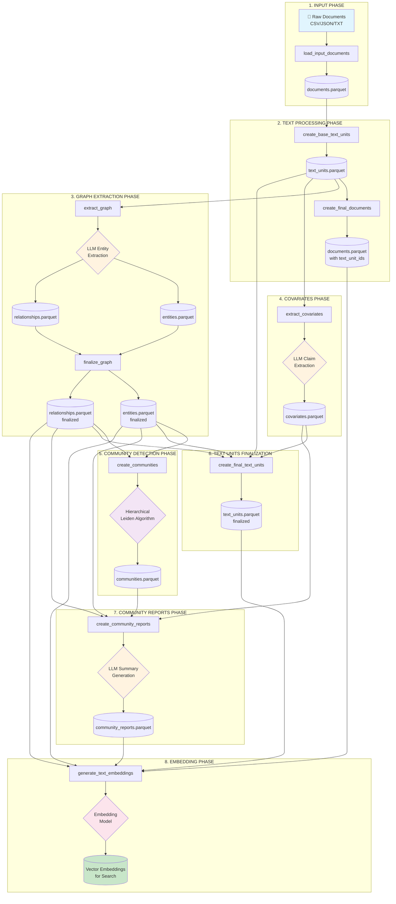

---

## 📊 Chi Tiết Từng Workflow

### Mermaid Diagram - Pipeline Workflows

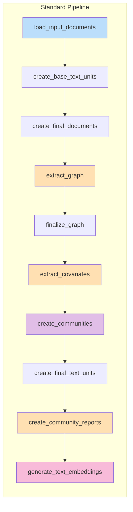

---

## 🔍 Mô Tả Chi Tiết Từng Bước

### 1️⃣ Load Input Documents

**File:** `workflows/load_input_documents.py`

**Mục đích:** Đọc và parse dữ liệu đầu vào từ các nguồn khác nhau.

**Input Factory hỗ trợ:**
- `text` - Plain text files (`.txt`)
- `csv` - CSV files with text columns
- `json` - JSON files

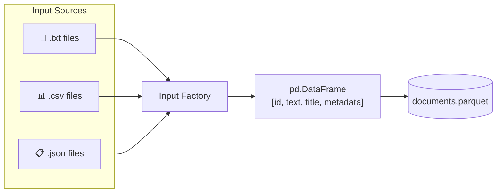

**Ví dụ cấu trúc output:**

```python
# documents DataFrame
{
    "id": "doc_001",
    "text": "Nội dung văn bản đầy đủ của tài liệu...",
    "title": "Tên tài liệu",
    "metadata": {"author": "John Doe", "date": "2024-01-01"}
}
```

---

### 2️⃣ Create Base Text Units

**File:** `workflows/create_base_text_units.py`

**Mục đích:** Chia nhỏ documents thành các text chunks (text units) để xử lý hiệu quả hơn.

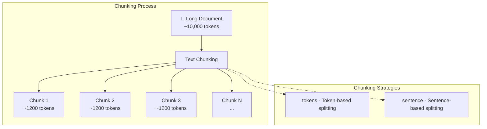

**Cấu hình chunking:**

```yaml
chunks:
  size: 1200        # Số tokens mỗi chunk
  overlap: 100      # Số tokens overlap giữa các chunks
  strategy: tokens  # tokens hoặc sentence
  encoding_model: cl100k_base
```

**Ví dụ output:**

```python
# text_units DataFrame
{
    "id": "tu_hash_001",
    "text": "Đây là nội dung của text unit đầu tiên...",
    "document_ids": ["doc_001"],
    "n_tokens": 1150
}
```

---

### 3️⃣ Create Final Documents

**File:** `workflows/create_final_documents.py`

**Mục đích:** Cập nhật documents với danh sách text_unit_ids liên quan.

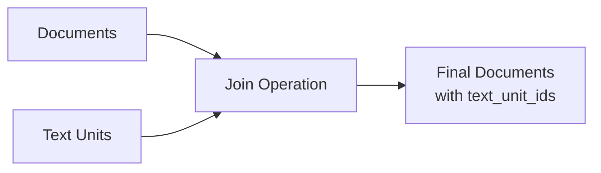

**Ví dụ output:**

```python
# documents DataFrame (updated)
{
    "id": "doc_001",
    "title": "Tên tài liệu",
    "text": "Nội dung đầy đủ...",
    "text_unit_ids": ["tu_001", "tu_002", "tu_003"],
    "metadata": {...}
}
```

---

### 4️⃣ Extract Graph (Core LLM Operation)

**File:** `workflows/extract_graph.py`

**Mục đích:** Sử dụng LLM để trích xuất entities và relationships từ text.

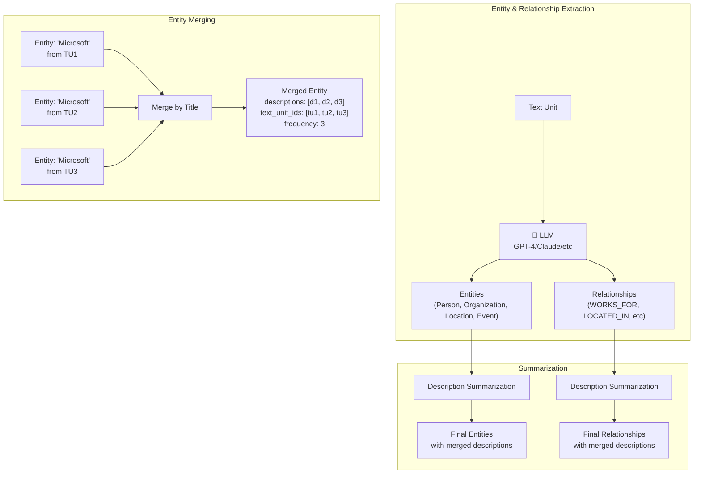

**Entity Types mặc định:**
- `organization` - Tổ chức, công ty
- `person` - Người
- `geo` - Địa điểm địa lý
- `event` - Sự kiện

**Ví dụ extraction:**

```python
# Input Text Unit
text = """
Microsoft, công ty công nghệ có trụ sở tại Redmond, Washington, 
được thành lập bởi Bill Gates và Paul Allen vào năm 1975.
"""

# Extracted Entities
entities = [
    {"title": "MICROSOFT", "type": "organization", 
     "description": "Công ty công nghệ có trụ sở tại Redmond"},
    {"title": "BILL GATES", "type": "person", 
     "description": "Đồng sáng lập Microsoft"},
    {"title": "PAUL ALLEN", "type": "person", 
     "description": "Đồng sáng lập Microsoft"},
    {"title": "REDMOND", "type": "geo", 
     "description": "Thành phố tại Washington, trụ sở Microsoft"}
]

# Extracted Relationships
relationships = [
    {"source": "MICROSOFT", "target": "REDMOND", 
     "description": "có trụ sở tại", "weight": 1.0},
    {"source": "BILL GATES", "target": "MICROSOFT", 
     "description": "đồng sáng lập", "weight": 1.0},
    {"source": "PAUL ALLEN", "target": "MICROSOFT", 
     "description": "đồng sáng lập", "weight": 1.0}
]
```

---

### 5️⃣ Finalize Graph

**File:** `workflows/finalize_graph.py`

**Mục đích:** Hoàn thiện format của entities và relationships, tính toán các metrics.

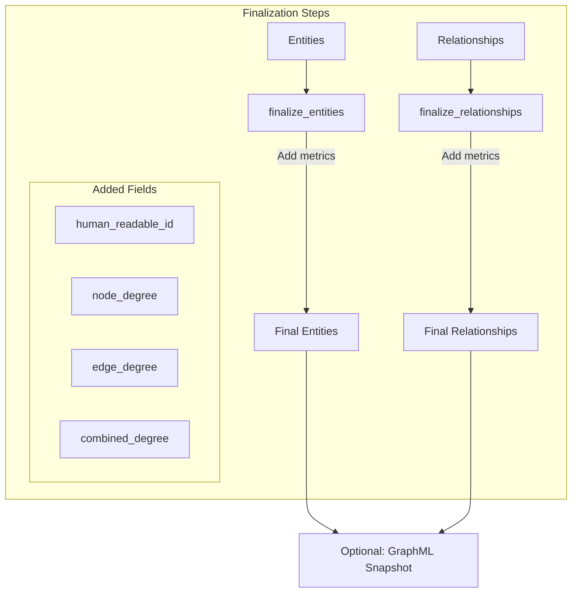

**Ví dụ output:**

```python
# entities DataFrame (finalized)
{
    "id": "ent_uuid_001",
    "title": "MICROSOFT",
    "type": "organization",
    "description": "Summarized description...",
    "human_readable_id": 0,
    "text_unit_ids": ["tu_001", "tu_002"],
    "frequency": 5,
    "degree": 12  # Số connections trong graph
}

# relationships DataFrame (finalized)
{
    "id": "rel_uuid_001",
    "source": "MICROSOFT",
    "target": "REDMOND",
    "description": "có trụ sở tại",
    "weight": 3.0,
    "human_readable_id": 0,
    "source_degree": 12,
    "target_degree": 5,
    "combined_degree": 17
}
```

---

### 6️⃣ Extract Covariates (Optional)

**File:** `workflows/extract_covariates.py`

**Mục đích:** Trích xuất claims/covariates từ text (nếu được enable).

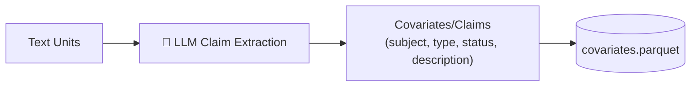

**Ví dụ claim:**

```python
{
    "id": "claim_001",
    "subject": "MICROSOFT",
    "type": "FINANCIAL_CLAIM",
    "status": "TRUE",
    "description": "Microsoft có doanh thu hàng năm trên 100 tỷ USD",
    "text_unit_id": "tu_005"
}
```

---

### 7️⃣ Create Communities

**File:** `workflows/create_communities.py`

**Mục đích:** Phát hiện cộng đồng trong graph sử dụng thuật toán Hierarchical Leiden.

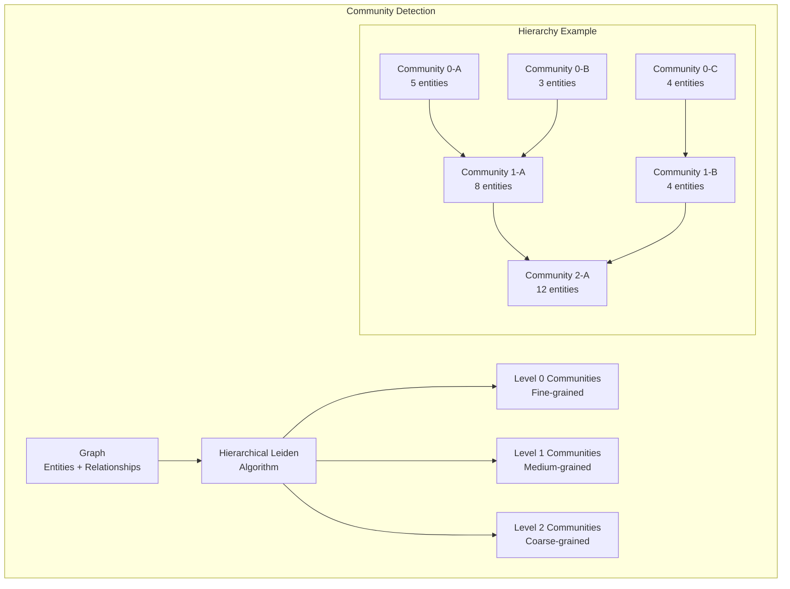

**Cấu hình:**

```yaml
cluster_graph:
  max_cluster_size: 10  # Kích thước cluster tối đa
  use_lcc: true         # Sử dụng Largest Connected Component
  seed: 0xDEADBEEF      # Random seed for reproducibility
```

**Ví dụ output:**

```python
# communities DataFrame
{
    "id": "comm_uuid_001",
    "community": 0,
    "level": 0,
    "title": "Community 0",
    "parent": -1,
    "children": [1, 2, 3],
    "entity_ids": ["ent_001", "ent_002", "ent_003"],
    "relationship_ids": ["rel_001", "rel_002"],
    "text_unit_ids": ["tu_001", "tu_002"],
    "size": 3
}
```

---

### 8️⃣ Create Final Text Units

**File:** `workflows/create_final_text_units.py`

**Mục đích:** Cập nhật text units với references đến entities, relationships, và covariates.

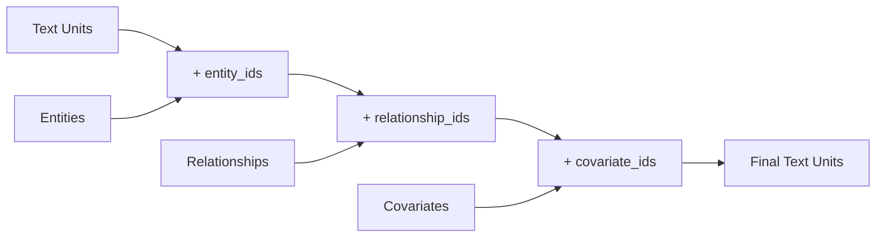

**Ví dụ output:**

```python
# text_units DataFrame (finalized)
{
    "id": "tu_001",
    "text": "Nội dung text unit...",
    "document_ids": ["doc_001"],
    "n_tokens": 1150,
    "entity_ids": ["ent_001", "ent_002"],
    "relationship_ids": ["rel_001"],
    "covariate_ids": ["claim_001"]
}
```

---

### 9️⃣ Create Community Reports

**File:** `workflows/create_community_reports.py`

**Mục đích:** Sử dụng LLM để tạo báo cáo tổng hợp cho mỗi community.

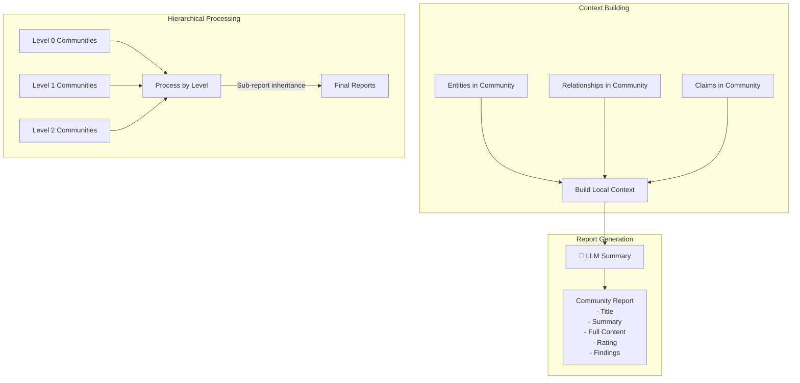

**Ví dụ output:**

```python
# community_reports DataFrame
{
    "id": "report_001",
    "community": 0,
    "level": 0,
    "title": "Microsoft Technology Ecosystem",
    "summary": "Cộng đồng này tập trung vào Microsoft và các mối quan hệ...",
    "full_content": "# Microsoft Technology Ecosystem\n\n## Overview\n...",
    "rating": 8.5,
    "rating_explanation": "High impact due to major tech company involvement",
    "findings": [
        "Microsoft là công ty công nghệ lớn có trụ sở tại Redmond",
        "Bill Gates và Paul Allen là những người sáng lập",
        ...
    ]
}
```

---

### 🔟 Generate Text Embeddings

**File:** `workflows/generate_text_embeddings.py`

**Mục đích:** Tạo vector embeddings cho tìm kiếm semantic.

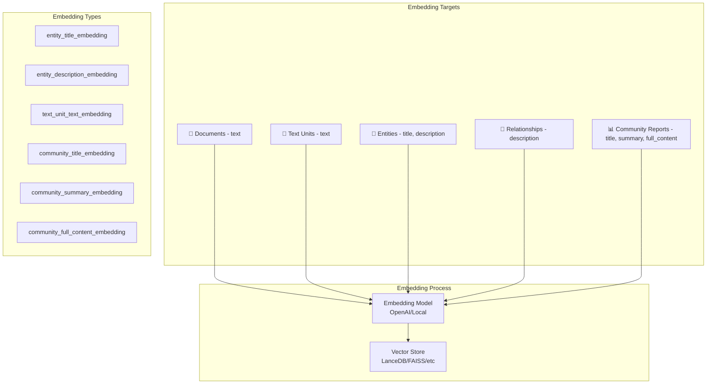

**Cấu hình embeddings:**

```yaml
embed_text:
  enabled: true
  model_id: text-embedding-ada-002
  names:
    - entity_description_embedding
    - text_unit_text_embedding
    - community_summary_embedding
```

---

## ⚡ Fast Pipeline

Fast pipeline sử dụng NLP extraction thay vì LLM, nhanh hơn nhưng kém chính xác hơn.

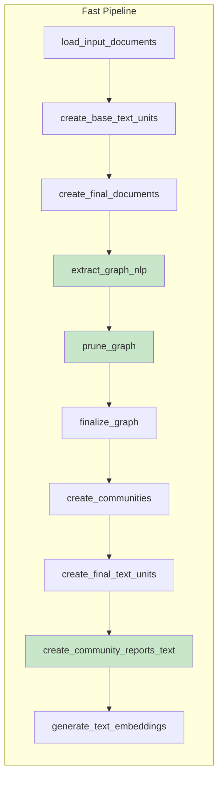

**Khác biệt với Standard:**
- `extract_graph_nlp` - Sử dụng NLP thay vì LLM
- `prune_graph` - Loại bỏ noise từ NLP extraction
- `create_community_reports_text` - Text-based reports thay vì LLM

---

## 🔄 Incremental Update Pipeline

Cho phép cập nhật index mà không cần rebuild từ đầu.

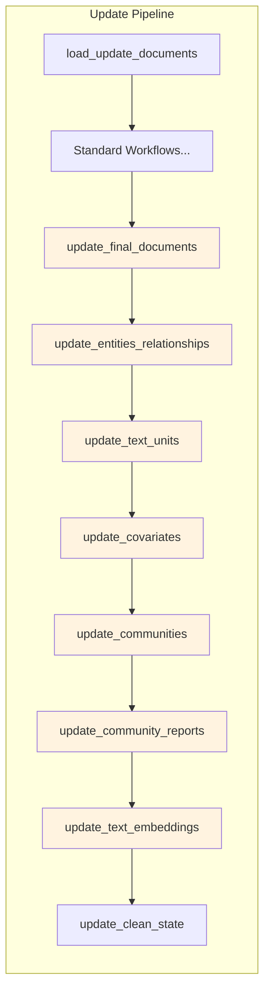

---

## 📤 Output Files

Sau khi hoàn thành indexing, các files sau được tạo:

```
output/
├── documents.parquet          # Tài liệu gốc với metadata
├── text_units.parquet         # Text chunks với references
├── entities.parquet           # Entities được trích xuất
├── relationships.parquet      # Relationships giữa entities
├── communities.parquet        # Community assignments
├── community_reports.parquet  # LLM-generated summaries
├── covariates.parquet         # Claims/Covariates (nếu enabled)
├── context.json               # Pipeline state
└── stats.json                 # Execution statistics
```

---

## 🛠️ Ví Dụ Chạy Pipeline

### Command Line

```bash
# Standard indexing
graphrag index --root ./my-project

# Fast indexing (NLP-based)
graphrag index --root ./my-project --method fast

# Incremental update
graphrag index --root ./my-project --update

# With verbose logging
graphrag index --root ./my-project --verbose
```

### Python API

```python
import asyncio
from graphrag.index import run_pipeline
from graphrag.config import GraphRagConfig
from graphrag.index.workflows import PipelineFactory

async def main():
    config = GraphRagConfig.from_file("settings.yaml")
    
    # Create pipeline
    pipeline = PipelineFactory.create_pipeline(
        config, 
        method="standard"  # or "fast", "update"
    )
    
    # Run pipeline
    async for result in run_pipeline(pipeline, config, callbacks):
        print(f"Completed: {result.workflow}")

asyncio.run(main())
```

---

## 📊 Data Flow Summary

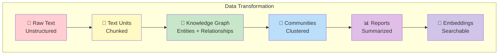

---

## 🔗 Liên Kết Giữa Các Thành Phần

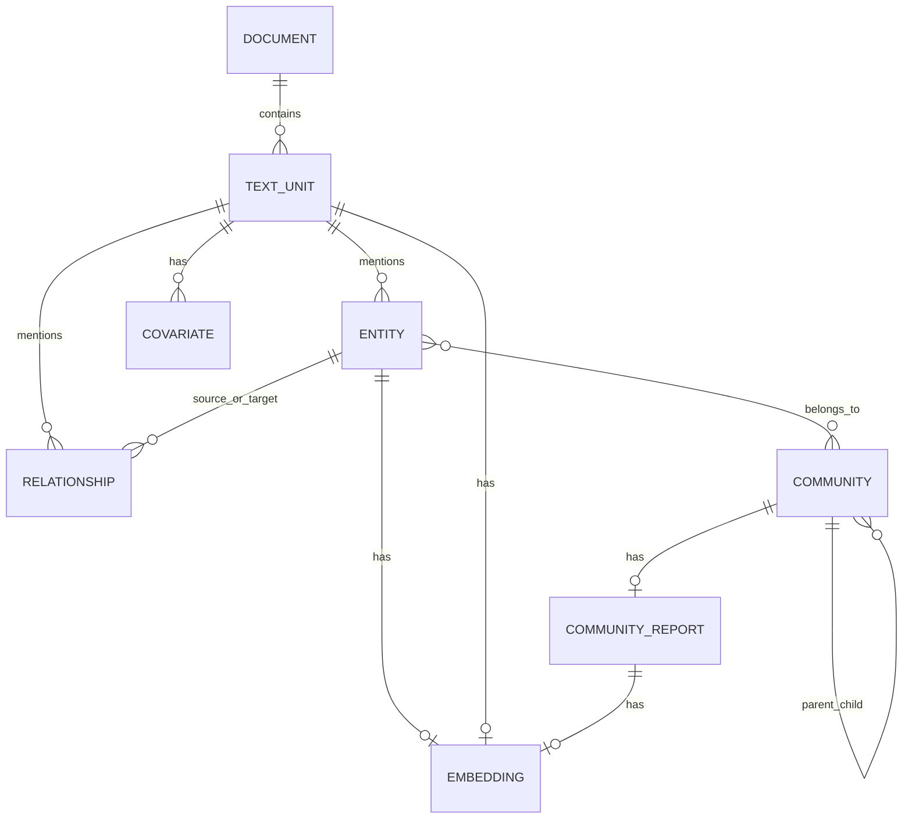

---

## 📝 Kết Luận

GraphRAG Indexing Pipeline là một hệ thống phức tạp nhưng được thiết kế module hóa cao. Mỗi workflow đảm nhận một nhiệm vụ cụ thể và có thể được tùy chỉnh hoặc thay thế. Pipeline hỗ trợ cả:

1. **Standard Mode** - Sử dụng LLM cho extraction chính xác
2. **Fast Mode** - Sử dụng NLP cho tốc độ
3. **Update Mode** - Cập nhật incremental hiệu quả

Output cuối cùng là một Knowledge Graph hoàn chỉnh với embeddings, sẵn sàng cho các phương thức query như Local Search, Global Search, và ToG Search.
